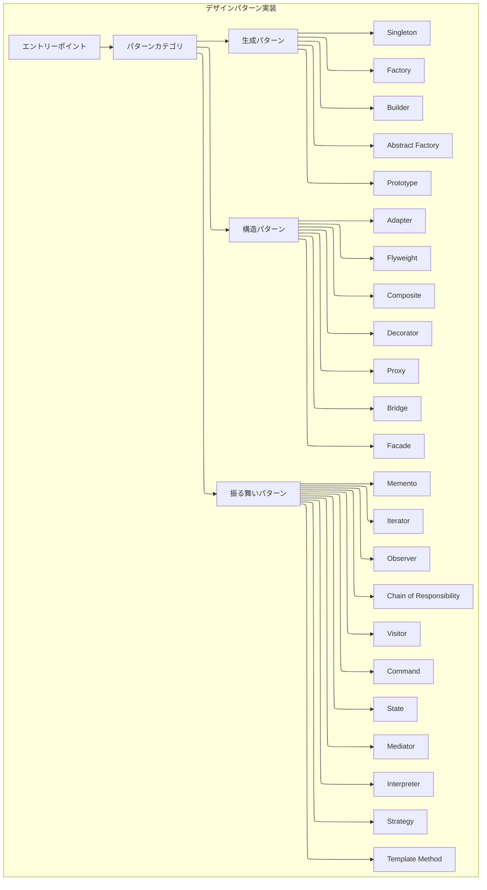
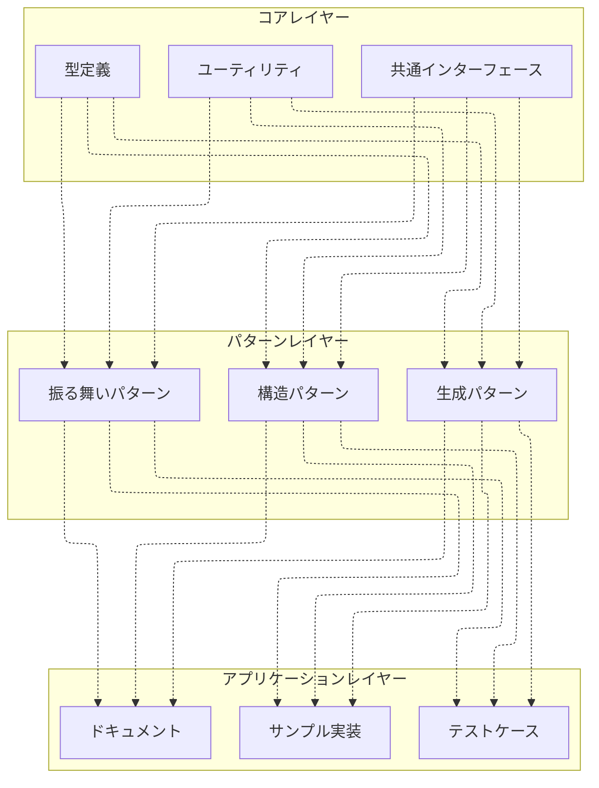
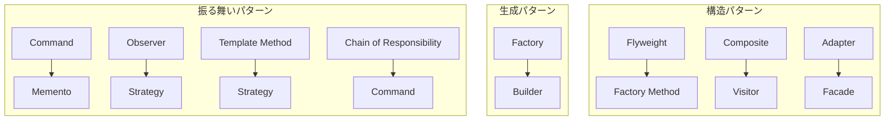

# アーキテクチャ概要

## 1. システム構成

### 1.1 全体アーキテクチャ


### 1.2 モジュール構成


## 2. 技術スタック

### 2.1 主要技術
- TypeScript 5.3以上
  - Decoratorsサポート（Stage 3標準）
  - satisfies演算子
  - const型パラメータ
  - using宣言とリソース破棄
  - template文字列型の改善
- Node.js 20.0以上
- Jest 29.7以上（テストフレームワーク）
- TypeDoc 0.25.7以上（ドキュメント生成）
- mdbook 0.4.48以上（ドキュメント管理）
- mdbook-mermaid 0.13.0以上（図表サポート）

### 2.2 開発ツール
- ESLint 8.x（静的解析）
- Prettier 3.5.x（コードフォーマット）
- ts-node 10.9.x（TypeScript直接実行）
- ts-node-dev 2.0.x（開発環境監視実行）
- rimraf 5.0.x（クロスプラットフォームrm -rf）
- serve 14.2.x（静的ファイルサーバー）

## 3. アーキテクチャの特徴

### 3.1 設計原則
1. **モジュール性**
   - 疎結合な設計
   - 高凝集なコンポーネント
   - 明確な責任分担
   - インターフェースベースの設計

2. **拡張性**
   - 新しいパターンの追加が容易
   - プラグイン可能なアーキテクチャ
   - 型安全性の確保
   - 一貫した実装スタイル

3. **保守性**
   - 一貫した命名規則
   - 適切な抽象化レベル
   - 包括的なドキュメント
   - 高いテストカバレッジ

### 3.2 パターン間の連携


## 4. ディレクトリ構造

```
GoF23_TypeScript/
├── src/                  # ソースコード
│   ├── behavioral/       # 振る舞いパターン
│   │   ├── chain-of-responsibility/
│   │   ├── command/
│   │   ├── interpreter/
│   │   ├── iterator/
│   │   ├── mediator/
│   │   ├── memento/
│   │   ├── observer/
│   │   ├── state/
│   │   ├── strategy/
│   │   ├── template-method/
│   │   └── visitor/
│   ├── structural/       # 構造パターン
│   │   ├── adapter/
│   │   ├── bridge/
│   │   ├── composite/
│   │   ├── decorator/
│   │   ├── facade/
│   │   ├── flyweight/
│   │   └── proxy/
│   ├── creational/       # 生成パターン
│   │   ├── abstract-factory/
│   │   ├── builder/
│   │   ├── factory-method/
│   │   ├── prototype/
│   │   └── singleton/
│   └── common/           # 共通機能
├── tests/                # テストファイル
│   ├── behavioral/       # 振る舞いパターンのテスト
│   │   ├── chain-of-responsibility/
│   │   ├── command/
│   │   ├── interpreter/
│   │   ├── iterator/
│   │   ├── mediator/
│   │   ├── memento/
│   │   ├── observer/
│   │   ├── state/
│   │   ├── strategy/
│   │   ├── template-method/
│   │   └── visitor/
│   ├── structural/       # 構造パターンのテスト
│   │   ├── adapter/
│   │   ├── bridge/
│   │   ├── composite/
│   │   ├── decorator/
│   │   ├── facade/
│   │   ├── flyweight/
│   │   └── proxy/
│   └── creational/       # 生成パターンのテスト
│       ├── abstract-factory/
│       ├── builder/
│       ├── factory-method/
│       ├── prototype/
│       └── singleton/
├── docs/                 # ドキュメント
│   ├── api/              # API文書（TypeDoc生成）
│   ├── System-design/    # 設計図と詳細解説
│   │   ├── behavioral/   # 振る舞いパターン解説
│   │   ├── structural/   # 構造パターン解説
│   │   ├── creational/   # 生成パターン解説
│   │   └── architecture/ # アーキテクチャ文書
│   ├── book/             # ビルド済みドキュメント
│   ├── book.toml         # mdbook設定ファイル
│   ├── mermaid-init.js   # mermaid初期化スクリプト
│   ├── mermaid.min.js    # mermaidライブラリ
│   ├── CodeViz/          # コード可視化
│   └── SUMMARY.md        # ドキュメント目次
├── examples/             # 使用例
│   ├── behavioral/       # 振る舞いパターンの使用例
│   │   ├── chain-of-responsibility/
│   │   ├── command/
│   │   ├── interpreter/
│   │   ├── iterator/
│   │   ├── mediator/
│   │   ├── memento/
│   │   ├── observer/
│   │   ├── state/
│   │   ├── strategy/
│   │   ├── template-method/
│   │   └── visitor/
│   ├── structural/       # 構造パターンの使用例
│   │   ├── adapter/
│   │   ├── bridge/
│   │   ├── composite/
│   │   ├── decorator/
│   │   ├── facade/
│   │   ├── flyweight/
│   │   └── proxy/
│   └── creational/       # 生成パターンの使用例
│       ├── abstract-factory/
│       ├── builder/
│       ├── factory-method/
│       ├── prototype/
│       └── singleton/
├── scripts/              # ユーティリティスクリプト
│   ├── mdbook/           # mdbook関連ファイル
│   │   ├── mdbook.exe
│   │   └── mdbook-mermaid.exe
│   ├── generate-summary.js # 目次自動生成
│   └── coverage-viewer.js  # カバレッジビューワー
├── coverage/             # テストカバレッジレポート
├── logs/                 # ログファイル
├── package.json          # プロジェクト定義
├── package-lock.json     # 依存関係ロック
├── tsconfig.json         # TypeScript設定
├── jest.config.js        # Jestテスト設定
├── jest.setup.js         # Jestセットアップ
├── .eslintrc.json        # ESLint設定
├── .eslintrc.js          # ESLint追加設定
├── .prettierrc           # Prettier設定
├── .gitignore            # Git除外設定
├── LICENSE               # ライセンス
├── README.md             # プロジェクト概要
├── test-results.json     # テスト結果ファイル
└── typedoc.json          # TypeDoc設定
```

## 5. 実装アプローチ

### 5.1 TypeScriptの特長活用
- **型安全性**: 厳格な型チェックによるバグの早期発見
- **インターフェース**: 明確な契約による堅牢な設計
- **ジェネリクス**: 型パラメータによる柔軟な実装
- **デコレータ**: メタプログラミングによる宣言的な機能拡張
- **非同期処理**: async/awaitによる読みやすく保守しやすいコード
- **型推論**: 冗長なコードを減らし可読性を向上
- **型ガード**: 実行時の型安全性を確保

### 5.2 現代的な実装アプローチ
- 関数型プログラミングの活用
- イミュータブルデータ構造
- Null安全な設計（Optional型の活用）
- 副作用の最小化
- 効率的なエラーハンドリング（Result型パターン）
- 非同期処理の適切な管理（Promise, async/await）
- メモリ効率とパフォーマンスの最適化
- Tree-shakingを考慮したモジュール設計

### 5.3 実務を想定した実装
各パターンは単なる教科書的な例ではなく、以下の点を考慮した実践的な実装を目指しています：

- 実際のビジネスシナリオに基づくユースケース
- スケーラブルな設計
- エラー耐性と例外処理
- 監視可能性とデバッグ容易性
- パフォーマンス最適化
- セキュリティ考慮
- 保守性と拡張性
- 適切なコメントとドキュメント