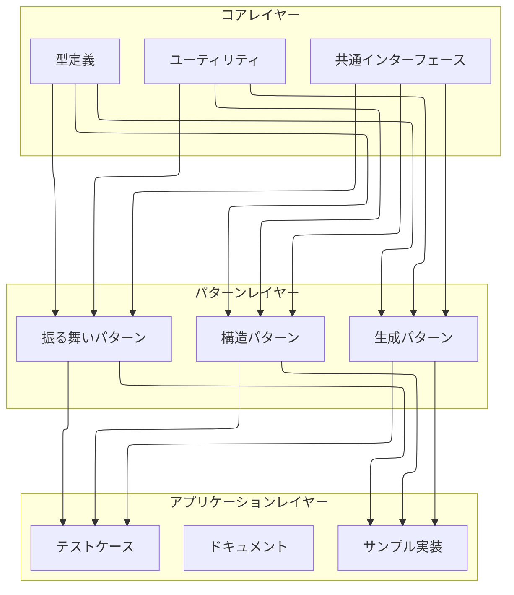
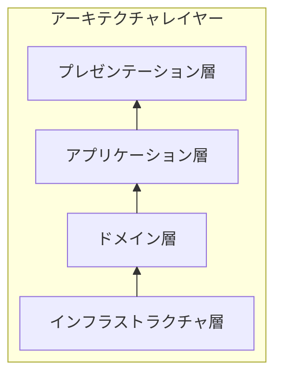
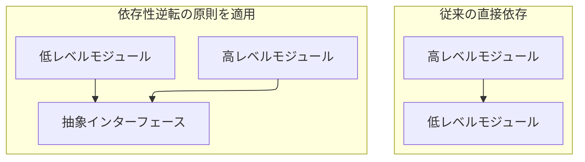

# 依存関係管理

## 1. 概要

### 1.1 目的
このドキュメントでは、プロジェクトにおける依存関係の管理方針、構造、およびベストプラクティスについて説明します。適切な依存関係管理はシステムの保守性、スケーラビリティ、および品質を確保するために不可欠です。

### 1.2 スコープ
- モジュール間の依存関係
- 外部パッケージの依存関係
- ビルドとデプロイメントの依存関係
- テストの依存関係
- バージョン管理と互換性

## 2. 依存関係の構造

### 2.1 モジュール依存関係


### 2.2 パッケージ依存関係

最新のパッケージ構成を反映した `package.json`:

```json
{
  "name": "gof23-typescript",
  "version": "1.0.0",
  "description": "TypeScriptで実装するGoF23デザインパターン",
  "main": "index.js",
  "scripts": {
    "build": "npx tsc",
    "dev": "ts-node-dev --respawn --transpile-only src/index.ts",
    "start": "npm run start:dev",
    "test": "jest",
    "test:runInBand": "jest --runInBand",
    "test:watch": "jest --watch",
    "test:coverage": "jest --coverage",
    "test:parallel": "jest --maxWorkers=50%",
    "test:debug": "DEBUG=true jest --verbose",
    "test:ci": "jest --ci --runInBand --detectOpenHandles --forceExit",
    "test:clear": "jest --clearCache && jest",
    "test:coverage:view:win": "node -e \"const { exec } = require('child_process'); const { existsSync } = require('fs'); const path = 'coverage/lcov-report/index.html'; if (!existsSync(path)) { console.error('Error: ' + path + ' does not exist. Please run tests first.'); process.exit(1); } const url = 'file://' + require('path').resolve(path); exec('start ' + url, (err) => { if (err) { console.error('ブラウザでの表示に失敗しました:', err); process.exit(1); } console.log('カバレッジレポートを開きました'); });\"",
    "test:coverage:view:wsl": "node -e \"const { exec } = require('child_process'); const { existsSync } = require('fs'); const path = 'coverage/lcov-report/index.html'; if (!existsSync(path)) { console.error('Error: ' + path + ' does not exist. Please run tests first.'); process.exit(1); } const url = 'file://' + require('path').resolve(path); exec('wslview ' + url, (err) => { if (err) { console.error('ブラウザでの表示に失敗しました:', err); process.exit(1); } console.log('カバレッジレポートを開きました'); });\"",
    "test:coverage:view": "node -e \"const { exec } = require('child_process'); const { existsSync } = require('fs'); const path = 'coverage/lcov-report/index.html'; if (!existsSync(path)) { console.error('Error: ' + path + ' does not exist. Please run tests first.'); process.exit(1); } const url = 'file://' + require('path').resolve(path); const openCommand = process.platform === 'win32' ? 'start' : (process.platform === 'darwin' ? 'open' : 'xdg-open'); exec(`${openCommand} ${url}`, (err) => { if (err) { console.error('ブラウザでの表示に失敗しました:', err); process.exit(1); } console.log('カバレッジレポートを開きました'); });\"",
    "test:view": "npm run test && npm run test:coverage:view",
    "test:view:win": "npm run test && npm run test:coverage:view:win",
    "test:view:wsl": "npm run test && npm run test:coverage:view:wsl",
    "test:clean": "rimraf dist coverage",
    "lint": "eslint .",
    "lint:fix": "eslint --fix .",
    "format": "prettier --write \"src/**/*.ts\" \"tests/**/*.ts\"",
    "docs:api": "typedoc --entryPointStrategy expand --out docs/api src/**/*.ts --exclude \"**/*.test.ts\"",
    "book:create-summary": "node scripts/generate-summary.js",
    "book:build:win": "powershell -Command \"cd docs; mdbook build; cd ..\"",
    "book:build:wsl": "cd docs/ && mdbook build && cd ..",
    "book:serve": "powershell -Command \"cd docs; mdbook serve --open\"",
    "book:stop:wsl": "pkill -f 'serve docs/book' || true",
    "book:clean": "rimraf docs/book",
    "book:preview:win": "node -e \"const { exec } = require('child_process'); const { existsSync } = require('fs'); const path = 'docs/book/index.html'; if (!existsSync(path)) { console.error('Error: ' + path + ' does not exist. Please run book:build first.'); process.exit(1); } exec('start ' + path, (error) => { if (error) { console.error('Error opening file:', error); process.exit(1); } });\"",
    "book:preview:wsl": "node -e \"const { platform } = require('os'); const { exec } = require('child_process'); const { existsSync } = require('fs'); const path = 'docs/book/index.html'; if (!existsSync(path)) { console.error('Error: ' + path + ' does not exist. Please run book:build first.'); process.exit(1); } const commands = { win32: 'start', darwin: 'open', linux: 'xdg-open' }; const cmd = commands[platform()] || 'xdg-open'; exec(cmd + ' ' + path, (error) => { if (error) { console.error('Error opening file:', error); process.exit(1); } });\"",
    "book:all:win": "npm run docs:api && npm run book:create-summary && npm run book:build:win && npm run book:preview:win",
    "book:all:wsl": "npm run docs:api && npm run book:create-summary && npm run book:build:wsl && npm run book:preview:wsl",
    "reference:all:win": "npm run test:view:win && npm run book:all:win",
    "reference:all:wsl": "npm run test:view:wsl && npm run book:all:wsl",
    "viz:setup": "npm install --save-dev dependency-cruiser",
    "viz:dependencies:dot": "depcruise --no-config --output-type dot \"src/**/*.ts\" > docs/CodeViz/dependencies.dot",
    "viz:dependencies:matrix": "depcruise --no-config --output-type html \"src/**/*.ts\" > docs/CodeViz/dependencies-matrix.html && start docs/CodeViz/dependencies-matrix.html",
    "viz:dependencies:noconfig:dot": "depcruise --no-config --output-type dot \"src/**/*.ts\" > docs/CodeViz/dependencies-noconfig-dot.html && start docs/CodeViz/dependencies-noconfig-dot.html",
    "viz:dependencies:noconfig:ddot": "depcruise --no-config --output-type ddot \"src/**/*.ts\" > docs/CodeViz/dependencies-noconfig-ddot.html && start docs/CodeViz/dependencies-noconfig-ddot.html",
    "viz:dependencies:stream:dot": "depcruise --config .dependency-cruiser.js --output-type dot \"src/**/*.ts\" > docs/CodeViz/dependencies-dot-stream.html",
    "viz:dependencies:stream:ddot": "depcruise --config .dependency-cruiser.js --output-type ddot \"src/**/*.ts\" > docs/CodeViz/dependencies-ddot-stream.html",
    "viz:dependencies:wrap_html:dot": "npm run viz:dependencies:stream:dot && node scripts/wrap-html.js docs/CodeViz/dependencies-dot-stream.html docs/CodeViz/dependencies-dot-wrapped.html",
    "viz:all": "npm run viz:dependencies:dot && npm run viz:dependencies:matrix && npm run viz:dependencies:noconfig:dot && npm run viz:dependencies:noconfig:ddot && npm run viz:dependencies:stream:dot && npm run viz:dependencies:stream:ddot && npm run viz:dependencies:wrap_html:dot",
    "docs:all:win": "npm run reference:all:win && npm run viz:all",
    "docs:all:wsl": "npm run reference:all:wsl && npm run viz:all"
  },
  "keywords": [
    "typescript",
    "design-patterns",
    "gof"
  ],
  "author": "2f0833e717",
  "license": "MIT",
  "devDependencies": {
    "@kazuph/mcp-fetch": "^1.1.3",
    "@modelcontextprotocol/inspector": "^0.8.0",
    "@modelcontextprotocol/sdk": "^1.8.0",
    "@modelcontextprotocol/server-filesystem": "^2025.3.28",
    "@modelcontextprotocol/server-github": "^2025.3.28",
    "@modelcontextprotocol/server-memory": "^0.6.2",
    "@modelcontextprotocol/server-sequential-thinking": "^0.6.2",
    "@types/jest": "^29.5.12",
    "@types/node": "^20.17.19",
    "@typescript-eslint/eslint-plugin": "^8.24.1",
    "@typescript-eslint/parser": "^8.24.1",
    "@viz-js/viz": "^3.12.0",
    "dependency-cruiser": "^16.10.1",
    "eslint-config-prettier": "^10.0.1",
    "eslint-plugin-prettier": "^5.2.3",
    "express": "^5.1.0",
    "graphviz-cli": "^2.0.0",
    "jest": "^29.7.0",
    "prettier": "^3.5.1",
    "puppeteer": "^24.7.1",
    "rimraf": "^5.0.10",
    "serve": "^14.2.4",
    "ts-jest": "^29.1.2",
    "ts-node": "^10.9.2",
    "ts-node-dev": "^2.0.0",
    "typedoc": "^0.25.7",
    "typedoc-plugin-markdown": "^3.17.1",
    "viz.js": "^2.1.2"
  },
  "dependencies": {
    "tsc": "^2.0.4"
  },
  "directories": {
    "doc": "docs",
    "example": "examples",
    "test": "tests"
  }
}
```

## 3. 依存関係の管理方針

### 3.1 バージョン管理

TypeScriptプロジェクトにおけるバージョン指定の様々な方法と意味：

```json
{
  "dependencies": {
    // 固定バージョン - このバージョンだけをインストール
    "typescript": "5.2.2",
    
    // メジャーバージョン内の最新 - 5.x.x の最新をインストール
    "jest": "^29.7.0",
    
    // マイナーバージョン内の最新 - 8.49.x の最新をインストール
    "eslint": "~8.49.0",
    
    // 範囲指定 - 5.2.0以上、6.0.0未満をインストール
    "tslib": ">=5.2.0 <6.0.0",
    
    // OR指定 - 1.x.x または 2.x.x の最新をインストール
    "somelib": "1.x.x || 2.x.x"
  }
}
```

### 3.2 依存関係の更新

定期的な依存関係の更新とセキュリティチェックを行うコマンド：

```bash
# 依存関係の更新確認
npm outdated

# セキュリティ脆弱性のチェック
npm audit

# マイナーバージョンとパッチバージョンの更新
npm update

# メジャーバージョンアップデート
npm install package@latest

# 非推奨・危険な依存関係のチェック
npx depcheck

# npm-check-updates を使った全パッケージの最新化チェック
npx npm-check-updates
```

### 3.3 更新ポリシー

| パッケージ種別 | 更新頻度 | 更新方針 | リスク対応 |
|-------------|---------|----------|----------|
| コア依存関係 | 低 | 互換性を確認し慎重に更新 | テスト網羅率確保と手動検証 |
| 開発ツール | 中 | 定期的に最新版へ更新 | CI環境での検証 |
| 型定義 | 高 | 実装と同期して更新 | 型チェック自動化 |
| UI関連 | 中 | デザインへの影響を確認 | ビジュアルリグレッションテスト |
| セキュリティパッチ | 即時 | セキュリティ更新は優先対応 | セキュリティスキャン自動化 |

## 4. モジュール間の依存関係

### 4.1 レイヤー構造


### 4.2 依存性注入

TypeScriptで依存性注入を実装する例：

```typescript
/**
 * ロガーインターフェース
 */
interface Logger {
    debug(message: string): void;
    info(message: string): void;
    warn(message: string): void;
    error(message: string, error?: Error): void;
}

/**
 * コンソールロガーの実装
 */
class ConsoleLogger implements Logger {
    debug(message: string): void {
        console.debug(`[DEBUG] ${message}`);
    }
    
    info(message: string): void {
        console.info(`[INFO] ${message}`);
    }
    
    warn(message: string): void {
        console.warn(`[WARN] ${message}`);
    }
    
    error(message: string, error?: Error): void {
        console.error(`[ERROR] ${message}`, error);
    }
}

/**
 * ファイルロガーの実装
 */
class FileLogger implements Logger {
    constructor(private filePath: string) {}
    
    debug(message: string): void {
        this.writeToFile('DEBUG', message);
    }
    
    info(message: string): void {
        this.writeToFile('INFO', message);
    }
    
    warn(message: string): void {
        this.writeToFile('WARN', message);
    }
    
    error(message: string, error?: Error): void {
        this.writeToFile('ERROR', message + (error ? `: ${error.message}` : ''));
    }
    
    private writeToFile(level: string, message: string): void {
        // ファイル書き込み処理
        const logEntry = `[${new Date().toISOString()}] [${level}] ${message}\n`;
        // ファイルに追記する処理（実装省略）
    }
}

/**
 * サービスクラス
 */
class UserService {
    constructor(private logger: Logger) {}
    
    createUser(username: string, email: string): boolean {
        try {
            this.logger.info(`ユーザー作成開始: ${username}`);
            // ユーザー作成ロジック
            this.logger.info(`ユーザー作成成功: ${username}`);
            return true;
        } catch (error) {
            this.logger.error(`ユーザー作成失敗: ${username}`, error as Error);
            return false;
        }
    }
}

/**
 * アプリケーションの初期化例
 */
function initializeApp(isDevelopment: boolean): UserService {
    // 環境に応じてロガーを切り替え
    const logger: Logger = isDevelopment 
        ? new ConsoleLogger() 
        : new FileLogger('/var/log/app.log');
    
    // サービスにロガーを注入
    return new UserService(logger);
}

// 使用例
const userService = initializeApp(process.env.NODE_ENV === 'development');
userService.createUser('testuser', 'test@example.com');
```

### 4.3 インターフェースを使用した依存性逆転



## 5. 循環依存の防止

### 5.1 検出方法

依存関係の循環を検出するためのツール設定例：

```javascript
// .dependency-cruiser.js
module.exports = {
  forbidden: [
    {
      name: 'no-circular',
      severity: 'error',
      comment: '循環依存関係は保守性の低下を招きます',
      from: {},
      to: {
        circular: true
      }
    },
    {
      name: 'no-cross-layer-dependencies',
      severity: 'error',
      comment: 'レイヤー間の依存関係は一方向のみ許可します',
      from: {
        path: '^src/presentation/'
      },
      to: {
        path: '^src/(domain|infrastructure)/'
      }
    },
    {
      name: 'enforce-domain-independence',
      severity: 'error',
      comment: 'ドメイン層は他のレイヤーに依存してはいけません',
      from: {
        path: '^src/domain/'
      },
      to: {
        path: '^src/(presentation|application|infrastructure)/'
      }
    }
  ]
};
```

### 5.2 解決策

循環依存を解決するためのリファクタリング例：

```typescript
// 問題のある構造: 相互依存
class User {
    constructor(private cart: ShoppingCart) {}
    
    addToCart(product: Product): void {
        this.cart.addItem(product, this);
    }
}

class ShoppingCart {
    private items: Array<{product: Product, user: User}> = [];
    
    addItem(product: Product, user: User): void {
        this.items.push({ product, user });
    }
}

// 改善後の構造: インターフェースによる依存性逆転
interface CartOwner {
    getId(): string;
    getName(): string;
}

class User implements CartOwner {
    private id: string;
    private name: string;
    
    constructor(private cart: ShoppingCart) {
        this.id = Math.random().toString(36).substr(2, 9);
        this.name = 'User' + this.id;
    }
    
    getId(): string {
        return this.id;
    }
    
    getName(): string {
        return this.name;
    }
    
    addToCart(product: Product): void {
        this.cart.addItem(product, this);
    }
}

class ShoppingCart {
    private items: Array<{product: Product, owner: CartOwner}> = [];
    
    addItem(product: Product, owner: CartOwner): void {
        this.items.push({ product, owner });
    }
}
```

### 5.3 イベントベースの結合緩和

```typescript
/**
 * イベントバスインターフェース
 */
interface EventBus {
    publish<T>(eventName: string, payload: T): void;
    subscribe<T>(eventName: string, handler: (payload: T) => void): () => void;
}

/**
 * 簡易イベントバス実装
 */
class SimpleEventBus implements EventBus {
    private subscribers: Record<string, Array<(payload: any) => void>> = {};
    
    publish<T>(eventName: string, payload: T): void {
        if (!this.subscribers[eventName]) return;
        
        for (const handler of this.subscribers[eventName]) {
            handler(payload);
        }
    }
    
    subscribe<T>(eventName: string, handler: (payload: T) => void): () => void {
        if (!this.subscribers[eventName]) {
            this.subscribers[eventName] = [];
        }
        
        this.subscribers[eventName].push(handler);
        
        // 購読解除関数を返す
        return () => {
            this.subscribers[eventName] = this.subscribers[eventName]
                .filter(h => h !== handler);
        };
    }
}

// イベントバスの共有インスタンス
const eventBus = new SimpleEventBus();

/**
 * 注文サービス
 */
class OrderService {
    createOrder(userId: string, products: Product[]): Order {
        const order = new Order(userId, products);
        // 注文作成ロジック
        
        // 注文作成イベントを発行
        eventBus.publish('order:created', order);
        
        return order;
    }
}

/**
 * 在庫管理サービス
 */
class InventoryService {
    constructor() {
        // 注文作成イベントを購読
        eventBus.subscribe<Order>('order:created', this.handleOrderCreated.bind(this));
    }
    
    private handleOrderCreated(order: Order): void {
        // 注文された商品の在庫を減らす
        for (const item of order.items) {
            this.reduceStock(item.productId, item.quantity);
        }
    }
    
    private reduceStock(productId: string, quantity: number): void {
        // 在庫減少ロジック
        console.log(`商品 ${productId} の在庫を ${quantity} 減少させました`);
    }
}

/**
 * 通知サービス
 */
class NotificationService {
    constructor() {
        // 注文作成イベントを購読
        eventBus.subscribe<Order>('order:created', this.handleOrderCreated.bind(this));
    }
    
    private handleOrderCreated(order: Order): void {
        // 注文確認メールを送信
        this.sendOrderConfirmation(order);
    }
    
    private sendOrderConfirmation(order: Order): void {
        // メール送信ロジック
        console.log(`ユーザー ${order.userId} に注文確認メールを送信しました`);
    }
}

// 使用例
const orderService = new OrderService();
const inventoryService = new InventoryService();
const notificationService = new NotificationService();

// サービス間の直接依存なしに連携が可能
const order = orderService.createOrder('user123', [
    { id: 'product1', name: 'Product 1', price: 100 }
]);
```

## 6. テストの依存関係

### 6.1 モック化

Jestを使ったモックの作成と利用例：

```typescript
// ユーザーリポジトリ
interface UserRepository {
    findById(id: string): Promise<User | null>;
    save(user: User): Promise<void>;
}

// ユーザーサービス
class UserService {
    constructor(private userRepo: UserRepository) {}
    
    async updateUsername(userId: string, newUsername: string): Promise<boolean> {
        const user = await this.userRepo.findById(userId);
        if (!user) return false;
        
        user.username = newUsername;
        await this.userRepo.save(user);
        return true;
    }
}

// テストコード
describe('UserService', () => {
    let userService: UserService;
    let mockUserRepo: jest.Mocked<UserRepository>;
    
    beforeEach(() => {
        // モックの作成
        mockUserRepo = {
            findById: jest.fn(),
            save: jest.fn()
        };
        
        // モックを注入してサービスをインスタンス化
        userService = new UserService(mockUserRepo);
    });
    
    test('存在するユーザーのユーザー名を更新できる', async () => {
        // モックの動作設定
        const mockUser = { id: 'user1', username: 'oldName' };
        mockUserRepo.findById.mockResolvedValue(mockUser);
        mockUserRepo.save.mockResolvedValue();
        
        // テスト対象メソッドの実行
        const result = await userService.updateUsername('user1', 'newName');
        
        // 検証
        expect(result).toBe(true);
        expect(mockUserRepo.findById).toHaveBeenCalledWith('user1');
        expect(mockUser.username).toBe('newName');
        expect(mockUserRepo.save).toHaveBeenCalledWith(mockUser);
    });
    
    test('存在しないユーザーの場合は更新に失敗する', async () => {
        // ユーザーが見つからない場合の設定
        mockUserRepo.findById.mockResolvedValue(null);
        
        // テスト対象メソッドの実行
        const result = await userService.updateUsername('unknown', 'newName');
        
        // 検証
        expect(result).toBe(false);
        expect(mockUserRepo.findById).toHaveBeenCalledWith('unknown');
        expect(mockUserRepo.save).not.toHaveBeenCalled();
    });
});
```

### 6.2 テストデータ

テストデータの管理と再利用例：

```typescript
// test/fixtures/users.ts
export const userFixtures = {
    validUser: {
        id: 'user1',
        username: 'testuser',
        email: 'test@example.com',
        isActive: true,
        roles: ['user']
    },
    adminUser: {
        id: 'admin1',
        username: 'admin',
        email: 'admin@example.com',
        isActive: true,
        roles: ['user', 'admin']
    },
    inactiveUser: {
        id: 'inactive1',
        username: 'inactive',
        email: 'inactive@example.com',
        isActive: false,
        roles: ['user']
    }
};

// test/fixtures/products.ts
export const productFixtures = {
    validProduct: {
        id: 'prod1',
        name: 'Test Product',
        price: 99.99,
        inStock: true,
        categories: ['electronics']
    },
    outOfStockProduct: {
        id: 'prod2',
        name: 'Out of Stock Product',
        price: 199.99,
        inStock: false,
        categories: ['electronics']
    }
};

// テストヘルパー
// test/helpers/fixtures.ts
import { userFixtures } from '../fixtures/users';
import { productFixtures } from '../fixtures/products';

export class TestFixtures {
    static getUser(type: 'valid' | 'admin' | 'inactive', overrides = {}): any {
        const base = type === 'valid' 
            ? userFixtures.validUser
            : type === 'admin' 
                ? userFixtures.adminUser 
                : userFixtures.inactiveUser;
        
        return { ...base, ...overrides };
    }
    
    static getProduct(type: 'valid' | 'outOfStock', overrides = {}): any {
        const base = type === 'valid'
            ? productFixtures.validProduct
            : productFixtures.outOfStockProduct;
        
        return { ...base, ...overrides };
    }
}

// テストでの使用例
import { TestFixtures } from '../helpers/fixtures';

describe('OrderService', () => {
    test('在庫があれば注文できる', () => {
        const user = TestFixtures.getUser('valid');
        const product = TestFixtures.getProduct('valid');
        
        const orderService = new OrderService();
        const result = orderService.createOrder(user, [product]);
        
        expect(result.success).toBe(true);
    });
    
    test('在庫がなければ注文できない', () => {
        const user = TestFixtures.getUser('valid');
        const product = TestFixtures.getProduct('outOfStock');
        
        const orderService = new OrderService();
        const result = orderService.createOrder(user, [product]);
        
        expect(result.success).toBe(false);
        expect(result.error).toContain('out of stock');
    });
});
```

## 7. ビルドとデプロイメント

### 7.1 ビルド依存関係

効率的なビルド構成の例：

```json
{
  "scripts": {
    "clean": "rimraf dist coverage",
    "lint": "eslint .",
    "typecheck": "tsc --noEmit",
    "test": "jest",
    "prebuild": "npm run clean && npm run lint && npm run typecheck",
    "build": "npx tsc -p tsconfig.build.json",
    "postbuild": "npm run copy-assets",
    "copy-assets": "copyfiles -u 1 src/**/*.{html,css,json} dist/",
    "docs:api": "typedoc --entryPointStrategy expand --out docs/api src/**/*.ts --exclude \"**/*.test.ts\"",
    "viz:dependencies:dot": "depcruise --no-config --output-type dot \"src/**/*.ts\" \"tests/**/*.ts\" \"examples/**/*.ts\" > docs/CodeViz/dependencies.dot",
    "viz:dependencies:wrap_html:dot": "npm run viz:dependencies:stream:dot && node scripts/wrap-html.js docs/CodeViz/dependencies-dot-stream.html docs/CodeViz/dependencies-dot-wrapped.html && start docs/CodeViz/dependencies-dot-wrapped.html",
    "predeploy": "npm run build && npm run test",
    "deploy": "node scripts/deploy.js"
  }
}
```

### 7.2 デプロイメント依存関係

GitHub Actionsを使用したCI/CDパイプライン例：

```yaml
# .github/workflows/ci-cd.yml
name: CI/CD Pipeline

on:
  push:
    branches: [main]
  pull_request:
    branches: [main]

jobs:
  build-and-test:
    runs-on: ubuntu-latest
    
    strategy:
      matrix:
        node-version: [18.x, 20.x]
    
    steps:
    - uses: actions/checkout@v3
    
    - name: Use Node.js ${{ matrix.node-version }}
      uses: actions/setup-node@v3
      with:
        node-version: ${{ matrix.node-version }}
        cache: 'npm'
    
    - name: Install dependencies
      run: npm ci
    
    - name: Lint
      run: npm run lint
    
    - name: Type check
      run: npm run typecheck
    
    - name: Test
      run: npm test
    
    - name: Build
      run: npm run build
    
    - name: Generate documentation
      run: npm run docs
    
    - name: Upload build artifacts
      uses: actions/upload-artifact@v3
      with:
        name: build-output
        path: |
          dist/
          docs/
  
  deploy:
    needs: build-and-test
    if: github.event_name == 'push' && github.ref == 'refs/heads/main'
    runs-on: ubuntu-latest
    
    steps:
    - uses: actions/checkout@v3
    
    - name: Download build artifacts
      uses: actions/download-artifact@v3
      with:
        name: build-output
    
    - name: Set up Node.js
      uses: actions/setup-node@v3
      with:
        node-version: '20.x'
    
    - name: Deploy to production
      run: |
        # デプロイスクリプト実行
        echo "Deploying to production..."
        # 実際のデプロイコマンド
      env:
        DEPLOY_TOKEN: ${{ secrets.DEPLOY_TOKEN }}
```

## 8. パフォーマンス最適化

### 8.1 依存関係の分析

バンドルサイズ分析と最適化：

```bash
# 依存関係のサイズ分析
npm install -g webpack-bundle-analyzer
npx webpack --profile --json > stats.json
npx webpack-bundle-analyzer stats.json

# 未使用の依存関係の検出
npm install -g depcheck
depcheck

# インポートの分析
npx madge --circular --extensions ts,tsx src/
```

### 8.2 最適化戦略

コード分割とレイジーロードの実装例：

```typescript
/**
 * 動的インポート
 */
async function loadModule(): Promise<typeof import('./heavy-module')> {
    // 必要になった時点でモジュールを読み込む
    const module = await import('./heavy-module');
    return module;
}

/**
 * 条件付きインポート
 */
function conditionalImport(feature: string): void {
    if (feature === 'analytics') {
        import('./analytics').then(module => {
            module.initializeAnalytics();
        });
    } else if (feature === 'reporting') {
        import('./reporting').then(module => {
            module.generateReport();
        });
    }
}

/**
 * コンポーネントの遅延ロード（React例）
 */
import React, { lazy, Suspense } from 'react';

// 遅延ロードするコンポーネント
const HeavyComponent = lazy(() => import('./HeavyComponent'));

function App() {
    return (
        <div>
            <h1>アプリケーション</h1>
            <Suspense fallback={<div>Loading...</div>}>
                <HeavyComponent />
            </Suspense>
        </div>
    );
}
```

## 9. セキュリティ

### 9.1 脆弱性管理

セキュリティ監査の自動化例：

```bash
# 基本的なセキュリティ監査
npm audit

# 詳細なセキュリティレポート（JSON形式）
npm audit --json > security-report.json

# 自動修正（互換性のある更新のみ）
npm audit fix

# すべての脆弱性を修正（互換性を破る可能性あり）
npm audit fix --force

# 特定のパッケージのセキュリティ情報
npm audit --package=lodash
```

### 9.2 依存関係のポリシー

セキュリティを考慮した依存関係管理設定：

```json
{
  "engines": {
    "node": ">=20.0.0",
    "npm": ">=10.0.0"
  },
  "resolutions": {
    "vulnerable-package": "^2.0.0",
    "lodash": "^4.17.21"
  },
  "scripts": {
    "preinstall": "npx npm-force-resolutions",
    "security-check": "npm audit && snyk test"
  },
  "overrides": {
    "package-with-vulnerability": "safe-version"
  }
}
```

### 9.3 安全な依存関係の構築

ロックファイルを使用した依存関係の固定：

```bash
# package-lock.jsonを生成・更新してバージョンを固定
npm install

# ロックファイルに従って厳密にインストール
npm ci

# インテグリティチェックを含むインストール
npm install --lock=true
```

### 9.4 サードパーティコードのレビュー

- 新しい依存関係の追加前に以下をチェック：
  - アクティブなメンテナンス
  - コミュニティの評判
  - ライセンスの互換性
  - バンドルサイズへの影響
  - セキュリティ履歴
  - コードベースの品質

## 10. 依存関係管理のベストプラクティス

1. **明示的なバージョン管理**
   - 依存関係のバージョンを明示的に指定
   - ロックファイルを使用して一貫性を確保
   - 定期的な更新スケジュールの設定

2. **最小限の依存関係**
   - 必要最小限の外部依存関係を使用
   - 類似機能を持つ複数のライブラリの重複を避ける
   - 自作すべきか外部ライブラリを使うべきかを慎重に判断

3. **モジュール分割**
   - 責任の明確な分離
   - 高凝集・低結合の原則に従う
   - 独立して進化できるコンポーネント設計

4. **循環依存の防止**
   - 循環依存検出ツールの導入
   - インターフェースによる抽象化
   - イベント駆動アーキテクチャの活用

5. **準備された移行戦略**
   - 依存パッケージの変更に備えたアダプターレイヤーの導入
   - プラグイン可能なアーキテクチャ
   - 定期的な依存関係の評価と整理

## 可視化ツールの活用

依存関係の可視化は複雑なコードベースの理解とリファクタリングに役立ちます。このプロジェクトでは以下の可視化ツールを利用できます：

### dependency-cruiserによる可視化

```bash
# 基本的な依存関係図の生成
npm run viz:dependencies:dot

# インタラクティブなグラフ生成
npm run viz:dependencies:noconfig:dot
npm run viz:dependencies:noconfig:ddot

# 高度なストリーム形式の生成
npm run viz:dependencies:stream:dot
npm run viz:dependencies:stream:ddot

# HTMLラップされた見やすいグラフ
npm run viz:dependencies:wrap_html:dot
npm run viz:dependencies:wrap_html:ddot
```

詳細な可視化については [依存関係の可視化ガイド](./dependency-visualization.md) を参照してください。

## 開発環境のセットアップ

### 必要要件
- Node.js 20.0以上
- npm 10.0以上
- TypeScript 5.0以上
- Git

### セットアップ手順
1. リポジトリのクローン
   ```bash
   git clone [repository-url]
   cd GoF23_TypeScript
   ```

2. 依存パッケージのインストール
   ```bash
   npm install
   ```

### 開発用スクリプト

プロジェクトで利用可能な主要なnpmスクリプト：

#### ビルドと実行
- `npm run build`: TypeScriptのコンパイル
- `npm run dev`: 開発モードでの実行（ホットリロード対応）
- `npm run start`: コンパイル済みコードの実行

#### テスト関連
- `npm run test`: すべてのテストを実行
- `npm run test:watch`: 変更を監視しながらテストを実行
- `npm run test:coverage`: テストカバレッジレポートを生成

#### コード品質
- `npm run lint`: ESLintによる静的解析
- `npm run lint:fix`: ESLintによる自動修正
- `npm run format`: Prettierによるコードフォーマット

#### ドキュメント
- `npm run docs:api`: TypeDocによるAPI文書生成
- `npm run book:build`: mdbookによるドキュメントビルド
- `npm run book:serve`: ドキュメントのローカルサーバー起動