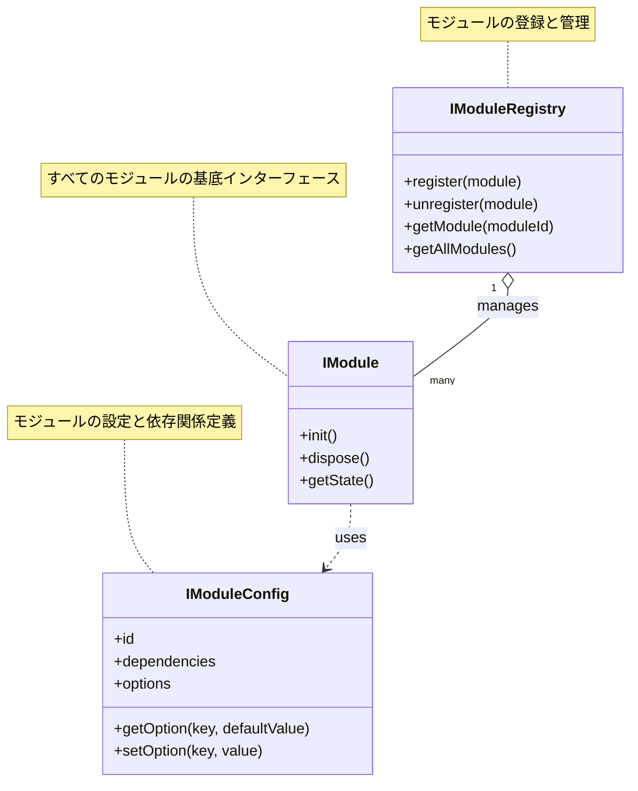

# モジュール構成

## 1. コアモジュール

### 1.1 共通インターフェース


### 1.2 ユーティリティ
共通ユーティリティモジュールは、プロジェクト全体で再利用可能な機能を提供します。

```typescript
// ファイル操作
export namespace FileUtils {
    export function readJsonFile<T>(path: string): Promise<T>;
    export function writeJsonFile<T>(path: string, data: T): Promise<void>;
    export function exists(path: string): Promise<boolean>;
}

// 文字列処理
export namespace StringUtils {
    export function toCamelCase(value: string): string;
    export function toSnakeCase(value: string): string;
    export function toKebabCase(value: string): string;
    export function formatTemplate(template: string, params: Record<string, string>): string;
}

// 日付処理
export namespace DateUtils {
    export function format(date: Date, format: string): string;
    export function parse(dateString: string, format: string): Date;
    export function addDays(date: Date, days: number): Date;
}

// 型変換
export namespace ConversionUtils {
    export function toNumber(value: unknown): number;
    export function toBoolean(value: unknown): boolean;
    export function toArray<T>(value: T | T[]): T[];
}

// バリデーション
export namespace ValidationUtils {
    export function isEmail(value: string): boolean;
    export function isNumeric(value: string): boolean;
    export function isAlphanumeric(value: string): boolean;
    export function hasMinLength(value: string, minLength: number): boolean;
}
```

### 1.3 型定義
```typescript
// 基本結果型
export type Result<T, E = Error> = {
    success: boolean;
    data?: T;
    error?: E;
};

// Optional型
export type Optional<T> = T | null | undefined;

// イベント型定義
export type EventType = 'create' | 'update' | 'delete' | 'load' | 'error';

// イベントリスナー
export interface EventListener<T = any> {
    (data: T): void | Promise<void>;
}

// イベントエミッタ
export interface EventEmitter {
    on<T>(event: EventType, listener: EventListener<T>): void;
    off<T>(event: EventType, listener: EventListener<T>): void;
    emit<T>(event: EventType, data: T): void;
}

// 設定型定義
export interface Config {
    debug: boolean;
    logLevel: 'info' | 'warn' | 'error' | 'debug';
    maxRetries: number;
    timeout: number;
}

// 識別子付きエンティティインターフェース
export interface Entity<T = string> {
    id: T;
}
```

## 2. パターンモジュール

### 2.1 生成パターン

#### Factory Method パターン


#### Factory Method パターン


#### Abstract Factory パターン


#### Abstract Factory パターン


#### Builder パターン


#### Builder パターン


#### Singleton パターン


#### Prototype パターン


### 2.2 構造パターン


### 2.3 振る舞いパターン


## 3. テストモジュール

### 3.1 テスト構成


### 3.2 テストユーティリティ
```typescript
/**
 * テスト用ヘルパークラス
 * テスト実行に必要な各種ユーティリティを提供
 */
export class TestHelper {
    /**
     * モックオブジェクトの生成
     * @param baseObj ベースとなるオブジェクト
     * @param overrides 上書きするプロパティ
     * @returns モックオブジェクト
     */
    static createMock<T extends object>(baseObj: T, overrides: Partial<T> = {}): jest.Mocked<T> {
        return {
            ...baseObj,
            ...overrides
        } as jest.Mocked<T>;
    }
    
    /**
     * テスト環境のセットアップ
     * @param options セットアップオプション
     */
    static setupTestEnvironment(options: TestSetupOptions = {}): void {
        // データベース初期化
        if (options.resetDatabase) {
            // テスト用データベースの初期化処理
        }
        
        // キャッシュのクリア
        if (options.clearCache) {
            // キャッシュのクリア処理
        }
        
        // テスト用データの作成
        if (options.seedTestData) {
            // テストデータの投入
        }
    }
    
    /**
     * テスト後のクリーンアップ
     */
    static cleanupTestData(): void {
        // テストで使用したリソースの解放
        // 一時ファイルの削除
        // モックのリセット
    }
    
    /**
     * 非同期操作の待機
     * @param ms 待機時間（ミリ秒）
     */
    static async wait(ms: number): Promise<void> {
        return new Promise(resolve => setTimeout(resolve, ms));
    }
    
    /**
     * 非同期エラーの検証
     * @param fn テスト対象の非同期関数
     * @param errorType 期待するエラーの型
     */
    static async expectAsyncError(fn: () => Promise<any>, errorType?: any): Promise<void> {
        try {
            await fn();
            throw new Error('エラーが発生しませんでした');
        } catch (error) {
            if (errorType) {
                expect(error).toBeInstanceOf(errorType);
            }
        }
    }
}

/**
 * テストセットアップのオプション
 */
interface TestSetupOptions {
    resetDatabase?: boolean;
    clearCache?: boolean;
    seedTestData?: boolean;
    mockExternalServices?: boolean;
    isolateTests?: boolean;
}
```

## 4. ドキュメントモジュール

### 4.1 API文書
TypeDocによって生成されるAPI文書は、以下の情報を含みます：

- 各クラス・インターフェースの説明
- メソッドとプロパティの一覧と詳細
- 型情報と継承関係
- 使用例とコードサンプル

```typescript
/**
 * 訪問者パターンを実装するためのインターフェース
 * ファイルシステム要素を操作するための各種訪問者を定義
 * 
 * @template T - 操作の結果の型
 * @example
 * ```typescript
 * class FileSearcher implements FileSystemVisitor<File[]> {
 *   private results: File[] = [];
 *   
 *   visitFile(file: File): void {
 *     if (this.matchesCriteria(file)) {
 *       this.results.push(file);
 *     }
 *   }
 *   
 *   getResults(): File[] {
 *     return this.results;
 *   }
 * }
 * ```
 */
export interface FileSystemVisitor<T = void> {
    /**
     * ファイルを訪問する
     * @param file 訪問するファイル
     */
    visitFile(file: File): void;
    
    /**
     * ディレクトリを訪問する
     * @param directory 訪問するディレクトリ
     */
    visitDirectory(directory: Directory): void;
    
    /**
     * 結果を取得する
     * @returns 操作の結果
     */
    getResults?(): T;
}
```

### 4.2 設計文書


## 5. 例示モジュール

### 5.1 サンプルコード
```typescript
/**
 * Visitor パターンの使用例 (振る舞いパターン)
 * ファイルシステム内のファイル検索を実装
 */

// ファイルシステムコンポーネント
class FileSystem {
    private root: Directory;
    
    constructor() {
        this.root = new Directory('root');
    }
    
    public getRoot(): Directory {
        return this.root;
    }
    
    public accept(visitor: FileSystemVisitor): void {
        this.root.accept(visitor);
    }
    
    // ファイルシステムの構築（サンプル用）
    public initialize(): void {
        const docs = new Directory('docs');
        const src = new Directory('src');
        
        const readme = new File('README.md', 2048);
        const config = new File('config.json', 1024);
        
        const mainTs = new File('main.ts', 4096);
        const appTs = new File('app.ts', 8192);
        
        this.root.addEntry(docs);
        this.root.addEntry(src);
        this.root.addEntry(readme);
        this.root.addEntry(config);
        
        src.addEntry(mainTs);
        src.addEntry(appTs);
    }
}

// 訪問者インターフェース
interface FileSystemVisitor {
    visitFile(file: File): void;
    visitDirectory(directory: Directory): void;
}

// ファイル検索の訪問者実装
class FileSearcher implements FileSystemVisitor {
    private pattern: RegExp;
    private results: File[] = [];
    
    constructor(searchPattern: string) {
        this.pattern = new RegExp(searchPattern);
    }
    
    public visitFile(file: File): void {
        if (this.pattern.test(file.getName())) {
            this.results.push(file);
        }
    }
    
    public visitDirectory(directory: Directory): void {
        // ディレクトリそのものには何もしない
        // 子要素の訪問は Directory.accept によって行われる
    }
    
    public getResults(): File[] {
        return this.results;
    }
}

// 使用例
function searchExample(): void {
    const fileSystem = new FileSystem();
    fileSystem.initialize();
    
    // .ts ファイルを検索
    const tsFileSearcher = new FileSearcher('\\.ts$');
    fileSystem.accept(tsFileSearcher);
    
    console.log('TypeScript ファイル検索結果:');
    tsFileSearcher.getResults().forEach(file => {
        console.log(`- ${file.getPath()}: ${file.getSize()} bytes`);
    });
}
```

### 5.2 デモアプリケーション


## 6. モジュール間の依存関係

### 6.1 依存グラフ


### 6.2 循環依存の防止
循環依存を防止するための主要な戦略：

1. **インターフェースを活用した依存方向の制御**
   ```typescript
   // 良い例：インターフェースを使用して依存方向を制御
   interface Logger {
       log(message: string): void;
   }
   
   class ConsoleLogger implements Logger {
       log(message: string): void {
           console.log(message);
       }
   }
   
   class UserService {
       constructor(private logger: Logger) {}
       
       createUser(userData: UserData): User {
           this.logger.log(`新しいユーザーを作成: ${userData.name}`);
           // ユーザー作成ロジック
           return new User(userData);
       }
   }
   ```

2. **依存性の注入**
   ```typescript
   // 良い例：依存性の注入
   class Application {
       constructor(
           private userService: UserService,
           private authService: AuthService,
           private configService: ConfigService
       ) {}
       
       initialize(): void {
           this.configService.load();
           this.authService.initialize();
           // アプリケーションの初期化
       }
   }
   
   // 依存関係の組み立て
   const logger = new ConsoleLogger();
   const configService = new ConfigService();
   const authService = new AuthService(logger, configService);
   const userService = new UserService(logger);
   const app = new Application(userService, authService, configService);
   ```

3. **イベントベースの通信**
   ```typescript
   // 良い例：イベントを使用した疎結合な通信
   class EventBus {
       private listeners: Map<string, Function[]> = new Map();
       
       subscribe(event: string, callback: Function): void {
           if (!this.listeners.has(event)) {
               this.listeners.set(event, []);
           }
           this.listeners.get(event)!.push(callback);
       }
       
       publish(event: string, data?: any): void {
           if (this.listeners.has(event)) {
               for (const callback of this.listeners.get(event)!) {
                   callback(data);
               }
           }
       }
   }
   
   // 使用例
   const eventBus = new EventBus();
   
   class UserManager {
       constructor(private eventBus: EventBus) {
           this.eventBus.subscribe('user:created', this.handleUserCreated.bind(this));
       }
       
       private handleUserCreated(user: User): void {
           console.log(`ユーザーが作成されました: ${user.name}`);
       }
   }
   
   class AuthService {
       constructor(private eventBus: EventBus) {}
       
       createUser(userData: UserData): User {
           const user = new User(userData);
           // ユーザー作成ロジック
           this.eventBus.publish('user:created', user);
           return user;
       }
   }
   ```

## 7. モジュールの品質管理

### 7.1 品質メトリクス
| メトリクス名 | 説明 | 目標値 | 測定ツール |
|------------|------|--------|----------|
| コード行数 | モジュールあたりの物理行数 | < 500行 | TSLint/ESLint |
| 循環的複雑度 | 関数内の分岐の複雑さ | < 10 | ESLint complexity |
| 依存関係の数 | モジュールの外部依存数 | < 10 | dependency-cruiser |
| テストカバレッジ | コードの実行カバレッジ | > 85% | Jest coverage |
| 重複コード率 | コードベース内の重複率 | < 3% | jscpd |
| 静的解析警告 | コード品質警告の数 | 0 | ESLint |
| ドキュメント率 | ドキュメント付き要素の割合 | > 80% | TypeDoc |

### 7.2 品質保証プロセス


## 8. モジュールの拡張性

### 8.1 拡張ポイント
1. **プラグインシステム**
   - プラグインインターフェース
   - プラグイン読み込みメカニズム
   - プラグイン設定と初期化

2. **イベントハンドラ**
   - イベント発行/購読システム
   - フックポイント
   - 非同期イベント処理

3. **カスタムビジター**
   - 標準ビジターの拡張
   - 複合ビジターの構築
   - 結果集約メカニズム

4. **フィルターチェーン**
   - 前処理/後処理フィルター
   - 条件付きフィルター
   - 優先度ベースのフィルター

### 8.2 拡張手順


## 9. モジュールのバージョン管理

### 9.1 バージョニング規則
セマンティックバージョニングに基づく：

- **メジャーバージョン**（x.0.0）： 互換性のない変更
- **マイナーバージョン**（0.x.0）： 後方互換性のある機能追加
- **パッチバージョン**（0.0.x）： バグ修正と軽微な変更

### 9.2 変更管理

