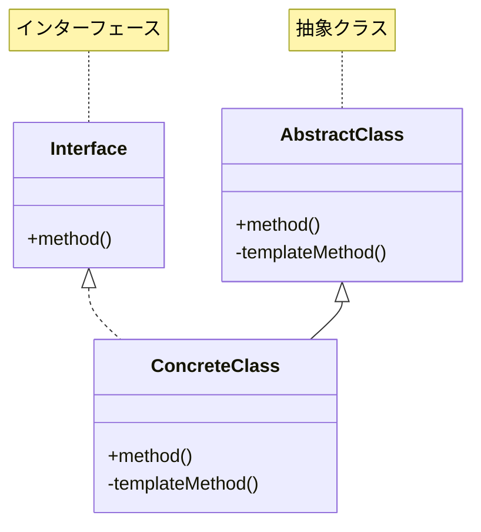
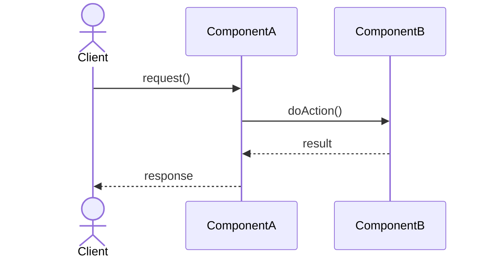
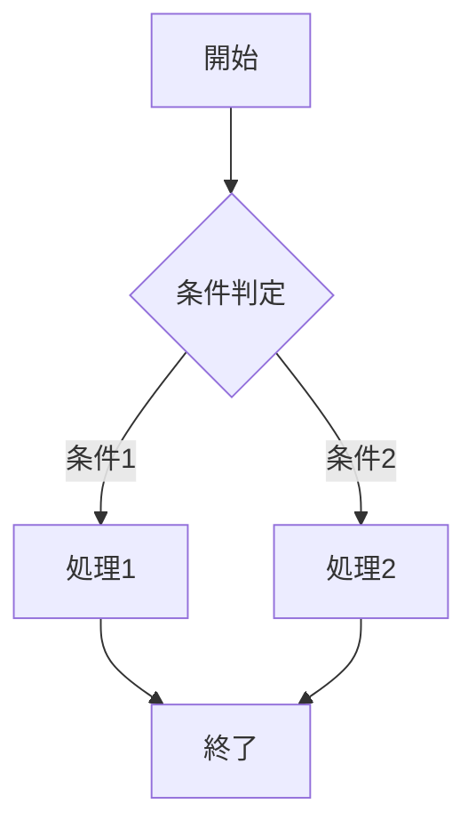

# 【パターン名】パターン - 【実装システム名】実装

## 1. 概要

### 1.1 パターンの定義
【このデザインパターンの簡潔かつ明確な定義】

### 1.2 目的・解決する問題
【このパターンが解決する問題、達成する目的を箇条書きで】
- 目的1
- 目的2
- 目的3

### 1.3 コンテキスト・適用場面
【このパターンが効果的に適用できる状況や前提条件】
- 適用場面1
- 適用場面2
- 適用場面3

## 2. クラス構造

### 2.1 クラス図



### 2.2 主要コンポーネント
【主要なクラス・インターフェースとその役割の詳細説明】

| コンポーネント | 種類 | 責務 | 関連 |
|-------------|------|------|------|
| 【クラス名】 | 【抽象クラス/具象クラス/インターフェース】 | 【このコンポーネントの役割と責任】 | 【他のコンポーネントとの関係】 |
| 【クラス名】 | 【抽象クラス/具象クラス/インターフェース】 | 【このコンポーネントの役割と責任】 | 【他のコンポーネントとの関係】 |

### 2.3 相互作用
【クラス間の相互作用の詳細説明】

## 3. 振る舞い

### 3.1 シーケンス図



### 3.2 プロセスフロー



### 3.3 重要なシナリオ
【代表的なユースケースのステップバイステップ説明】

#### シナリオ1: 【シナリオ名】
1. ステップ1
2. ステップ2
3. ステップ3

#### シナリオ2: 【シナリオ名】
1. ステップ1
2. ステップ2
3. ステップ3

## 4. 実装詳細

### 4.1 主要インターフェース・抽象クラス

```typescript
/**
 * 【インターフェース/抽象クラスの説明】
 */
export interface ExampleInterface {
    /**
     * 【メソッドの説明】
     * @param paramName パラメータの説明
     * @returns 返り値の説明
     */
    methodName(paramName: string): string;
}
```

### 4.2 具象クラス実装例

```typescript
/**
 * 【具象クラスの説明】
 */
export class ConcreteClass implements ExampleInterface {
    /**
     * 【フィールドの説明】
     */
    private field: string;
    
    /**
     * 【コンストラクタの説明】
     */
    constructor(param: string) {
        this.field = param;
    }
    
    /**
     * 【メソッドの説明】
     */
    public methodName(paramName: string): string {
        return `${this.field}: ${paramName}`;
    }
}
```

### 4.3 実装のバリエーション
【このパターンの異なる実装方法や拡張方法】

### 4.4 注意すべき実装ポイント
【実装時の注意点、潜在的な問題、解決策】

## 5. 使用例

### 5.1 基本的な使用例

```typescript
// 使用例コード
const instance = new ConcreteClass("テスト");
const result = instance.methodName("パラメータ");
console.log(result); // 出力: テスト: パラメータ
```

### 5.2 高度な使用例

```typescript
// より複雑なシナリオでの使用例
const instances = [
    new ConcreteClass("例1"),
    new ConcreteClass("例2")
];

const results = instances.map(instance => 
    instance.methodName("処理")
);

console.log(results); // 出力: ["例1: 処理", "例2: 処理"]
```

## 6. テスト戦略

### 6.1 ユニットテスト要件
【テストすべき重要なシナリオとエッジケース】

### 6.2 テスト実装例

```typescript
describe('パターンのテスト', () => {
    test('基本機能の検証', () => {
        // テスト実装
        const instance = new ConcreteClass("テスト");
        const result = instance.methodName("値");
        expect(result).toBe("テスト: 値");
    });
    
    // その他のテスト...
});
```

## 7. 評価

### 7.1 メリット
- メリット1
- メリット2
- メリット3

### 7.2 デメリット・制約
- デメリット1
- デメリット2
- デメリット3

### 7.3 代替パターン・関連パターン
【関連するパターンとその関係、選択基準】

## 8. 参考資料

### 8.1 内部リンク
- [ソースコード](../../src/パターン分類/パターン名)
- [テストコード](../../tests/パターン分類/パターン名)

### 8.2 外部リンク
- [リファクタリング・グル](https://refactoring.guru/ja/design-patterns/パターン名)
- [MDN Web ドキュメント](https://developer.mozilla.org/ja/) 