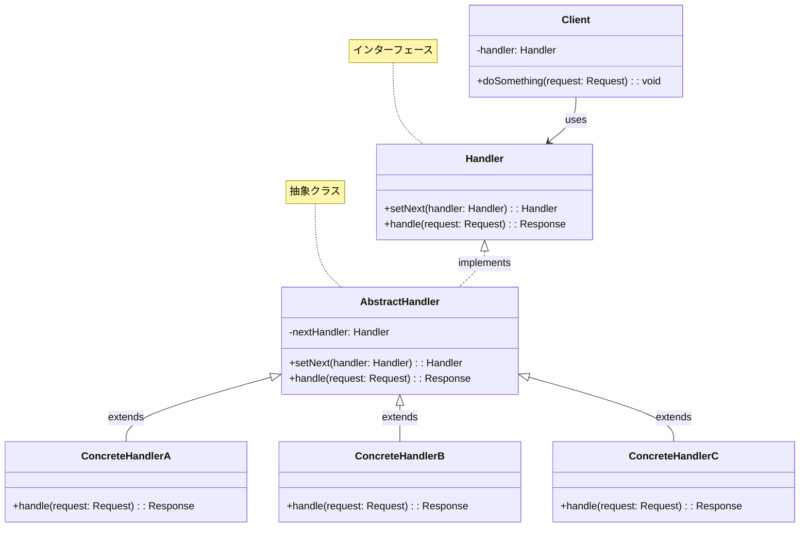
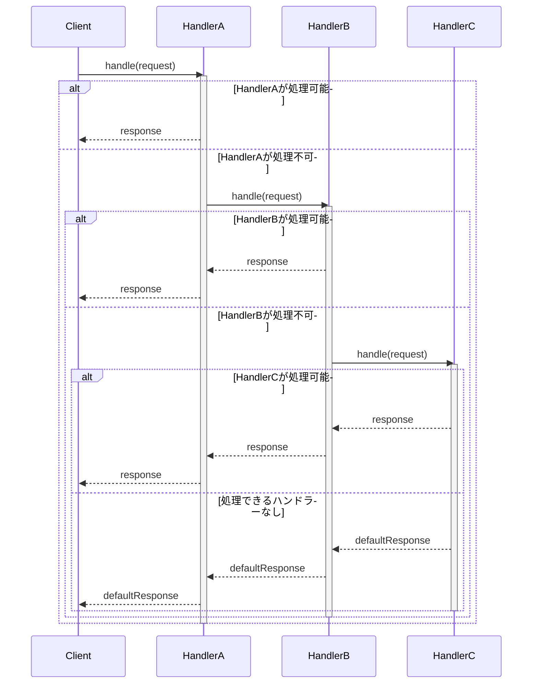
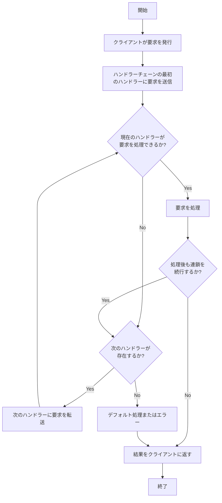

# Chain of Responsibilityパターン - 処理委譲連鎖実装

## 1. 概要

### 1.1 パターンの定義
Chain of Responsibilityパターンは、要求を処理できる複数のオブジェクトを連鎖（チェーン）として繋ぎ、要求を連鎖に沿って順次伝播させることで、要求の送信者と受信者を分離する行動パターンです。各ハンドラーは要求を処理するか、チェーン内の次のハンドラーに要求を渡します。

### 1.2 目的・解決する問題
- 要求の送信者と受信者の結合度を低減する
- 複数のオブジェクト間で処理の責任を分散する
- 処理順序の動的な変更や実行時の処理ルート変更を可能にする
- 単一責任の原則に従った設計を促進する
- 条件分岐の複雑さを軽減する
- ハンドラーの追加・削除を容易にする

### 1.3 コンテキスト・適用場面
- 複数のオブジェクトが要求を処理できる可能性がある場合
- 要求を処理すべき具体的なハンドラーが事前にわからない場合
- 要求処理のセットが動的に変更される可能性がある場合
- イベント処理システム、ミドルウェア、フィルターチェーンの実装
- ログ処理、認証・認可処理、入力検証などの段階的な処理
- エラーハンドリングや例外処理の階層化

## 2. クラス構造

### 2.1 クラス図


### 2.2 主要コンポーネント

| コンポーネント | 種類 | 責務 | 関連 |
|-------------|------|------|------|
| Handler | インターフェース | 要求処理の共通インターフェースを定義 | AbstractHandlerに実装される |
| AbstractHandler | 抽象クラス | 次のハンドラーへの参照を保持し、基本的な連鎖機能を実装 | Handlerを実装し、具象ハンドラーのベースクラスとなる |
| ConcreteHandler | 具象クラス | 特定の種類の要求を処理する具体的な実装 | AbstractHandlerを継承する |
| Client | クラス | 連鎖の先頭ハンドラーに要求を送信 | Handlerを使用する |

### 2.3 相互作用
- Clientは要求をHandlerのインターフェースを通じて送信する
- AbstractHandlerは次のハンドラーへの参照を管理し、要求の転送メカニズムを提供する
- 各ConcreteHandlerは自身が処理できる要求を処理し、それ以外は次のハンドラーに転送する
- 連鎖の最後まで要求が処理されない場合、デフォルトの動作が実行されるか、要求は無視される
- ハンドラーが要求を処理した後も、任意で連鎖を続行するかを決定できる

## 3. 振る舞い

### 3.1 シーケンス図


### 3.2 プロセスフロー


### 3.3 重要なシナリオ

#### シナリオ1: ログレベルに基づく処理
1. クライアントが特定のレベル（info、warn、error）でログメッセージを記録
2. メッセージは最初のハンドラー（InfoLogHandler）に送信される
3. 各ハンドラーは自身が担当するログレベルのメッセージのみを処理
4. 他のレベルのメッセージは次のハンドラーに転送
5. 例えば、errorメッセージはInfoLogHandlerとWarnLogHandlerを通過し、最終的にErrorLogHandlerが処理

#### シナリオ2: 認証・認可フロー
1. ユーザーがリソースへのアクセスをリクエスト
2. リクエストは認証ハンドラーに送信され、有効な認証情報を確認
3. 認証成功後、リクエストは認可ハンドラーに転送され、アクセス権を確認
4. 認可成功後、リクエストはレート制限ハンドラーに転送され、アクセス頻度を確認
5. すべてのチェックが通過した場合のみ、リクエストは実際のリソースハンドラーに到達

## 4. 実装詳細

### 4.1 主要インターフェース・基本クラス

```typescript
/**
 * ハンドラーインターフェース
 * チェーン内のすべてのハンドラーが実装する基本インターフェース
 */
interface Handler<T> {
    /**
     * 次のハンドラーを設定
     * @param handler 次のハンドラー
     * @returns 次のハンドラー（メソッドチェーン用）
     */
    setNext(handler: Handler<T>): Handler<T>;
    
    /**
     * 要求を処理
     * @param request 処理する要求
     * @returns 処理結果またはnull
     */
    handle(request: T): T | null;
}

/**
 * 基本ハンドラー
 * チェーン管理の共通機能を実装する抽象クラス
 */
abstract class AbstractHandler<T> implements Handler<T> {
    /**
     * 次のハンドラー
     */
    private nextHandler: Handler<T> | null = null;
    
    /**
     * 次のハンドラーを設定
     * @param handler 次のハンドラー
     * @returns 次のハンドラー（メソッドチェーン用）
     */
    setNext(handler: Handler<T>): Handler<T> {
        this.nextHandler = handler;
        return handler;
    }
    
    /**
     * 要求を処理
     * @param request 処理する要求
     * @returns 処理結果またはnull
     */
    handle(request: T): T | null {
        // 自身が処理できない場合は次のハンドラーに転送
        if (this.nextHandler) {
            return this.nextHandler.handle(request);
        }
        
        // チェーンの最後に到達し、処理できない場合はnullを返す
        return null;
    }
}
```

### 4.2 ログハンドラー実装例

```typescript
/**
 * ログレベル定義
 */
enum LogLevel {
    INFO = 'info',
    WARN = 'warn',
    ERROR = 'error'
}

/**
 * ログメッセージ定義
 */
interface LogMessage {
    level: LogLevel;
    message: string;
    timestamp: Date;
}

/**
 * 情報ログハンドラー
 */
class InfoLogHandler extends AbstractHandler<LogMessage> {
    /**
     * 情報ログを処理
     * @param request ログメッセージ
     * @returns 処理したログメッセージまたは次のハンドラーの結果
     */
    handle(request: LogMessage): LogMessage | null {
        if (request.level === LogLevel.INFO) {
            console.log(this.formatMessage(request));
            return request;
        }
        
        // 情報ログでない場合は次のハンドラーに転送
        return super.handle(request);
    }
    
    /**
     * ログメッセージをフォーマット
     * @param log ログメッセージ
     * @returns フォーマット済みメッセージ
     */
    private formatMessage(log: LogMessage): string {
        return `[${log.timestamp.toISOString()}] ${log.level.toUpperCase()}: ${log.message}`;
    }
}

/**
 * 警告ログハンドラー
 */
class WarnLogHandler extends AbstractHandler<LogMessage> {
    /**
     * 警告ログを処理
     * @param request ログメッセージ
     * @returns 処理したログメッセージまたは次のハンドラーの結果
     */
    handle(request: LogMessage): LogMessage | null {
        if (request.level === LogLevel.WARN) {
            console.warn(this.formatMessage(request));
            return request;
        }
        
        // 警告ログでない場合は次のハンドラーに転送
        return super.handle(request);
    }
    
    /**
     * ログメッセージをフォーマット
     * @param log ログメッセージ
     * @returns フォーマット済みメッセージ
     */
    private formatMessage(log: LogMessage): string {
        return `[${log.timestamp.toISOString()}] ${log.level.toUpperCase()}: ${log.message}`;
    }
}

/**
 * エラーログハンドラー
 */
class ErrorLogHandler extends AbstractHandler<LogMessage> {
    /**
     * エラーログを処理
     * @param request ログメッセージ
     * @returns 処理したログメッセージまたは次のハンドラーの結果
     */
    handle(request: LogMessage): LogMessage | null {
        if (request.level === LogLevel.ERROR) {
            console.error(this.formatMessage(request));
            this.notifyAdmin(request);
            return request;
        }
        
        // エラーログでない場合は次のハンドラーに転送
        return super.handle(request);
    }
    
    /**
     * ログメッセージをフォーマット
     * @param log ログメッセージ
     * @returns フォーマット済みメッセージ
     */
    private formatMessage(log: LogMessage): string {
        return `[${log.timestamp.toISOString()}] ${log.level.toUpperCase()}: ${log.message}`;
    }
    
    /**
     * 管理者に通知
     * @param log エラーログメッセージ
     */
    private notifyAdmin(log: LogMessage): void {
        // 実際の実装ではメール送信やアラート発信などを行う
        console.log(`管理者に通知: ${log.message}`);
    }
}
```

### 4.3 実装のバリエーション

1. **単一ハンドラー処理型**
   - 各要求は一つのハンドラーのみが処理し、処理後に連鎖は停止する
   - 最初に条件を満たすハンドラーが要求を処理する

2. **複数ハンドラー処理型**
   - 複数のハンドラーが同じ要求を順次処理できる
   - 要求は常に連鎖の最後まで伝播する（ミドルウェアパターンに類似）

3. **双方向連鎖型**
   - 要求が連鎖を上り下りする（処理後に逆方向にも伝播する）
   - リクエスト/レスポンスの前処理と後処理を実装できる

4. **動的連鎖型**
   - 実行時に連鎖の構成を変更できる
   - 状態やコンテキストに基づいて異なる連鎖パスを構築する

### 4.4 注意すべき実装ポイント

- 循環参照を避け、連鎖に循環が生じないようにする
- 連鎖が長すぎる場合、パフォーマンスに影響する可能性があるため、適切な長さに保つ
- 要求が処理されない場合のデフォルト動作を明確に定義する
- 各ハンドラーは単一責任の原則に従い、明確に定義された責務を持つべき
- ハンドラーの順序に依存しないよう注意する（または順序の依存関係を明確にドキュメント化する）
- 連鎖の構築を簡単にするためのファクトリやビルダーパターンの使用を検討する
- デバッグしやすくするために、要求の処理状況を追跡するロギングを実装する

## 5. 使用例

### 5.1 基本的な使用例

```typescript
/**
 * ロガークラス
 * ログチェーンを構築し、使いやすいインターフェースを提供
 */
class Logger {
    /**
     * ハンドラーチェーンの先頭
     */
    private handler: Handler<LogMessage>;
    
    /**
     * コンストラクタ
     * ハンドラーチェーンを構築
     */
    constructor() {
        // ハンドラーの作成
        const infoHandler = new InfoLogHandler();
        const warnHandler = new WarnLogHandler();
        const errorHandler = new ErrorLogHandler();
        
        // チェーンの構築
        infoHandler.setNext(warnHandler).setNext(errorHandler);
        
        // チェーンの先頭を保持
        this.handler = infoHandler;
    }
    
    /**
     * 情報ログの記録
     * @param message ログメッセージ
     */
    info(message: string): void {
        this.handler.handle({
            level: LogLevel.INFO,
            message,
            timestamp: new Date()
        });
    }
    
    /**
     * 警告ログの記録
     * @param message ログメッセージ
     */
    warn(message: string): void {
        this.handler.handle({
            level: LogLevel.WARN,
            message,
            timestamp: new Date()
        });
    }
    
    /**
     * エラーログの記録
     * @param message ログメッセージ
     */
    error(message: string): void {
        this.handler.handle({
            level: LogLevel.ERROR,
            message,
            timestamp: new Date()
        });
    }
}

// 使用例
const logger = new Logger();

logger.info('アプリケーションを開始しました');
logger.warn('メモリ使用量が高くなっています');
logger.error('データベース接続に失敗しました');

// 出力例:
// [2023-04-01T10:30:00.000Z] INFO: アプリケーションを開始しました
// [2023-04-01T10:30:01.000Z] WARN: メモリ使用量が高くなっています
// [2023-04-01T10:30:02.000Z] ERROR: データベース接続に失敗しました
// 管理者に通知: データベース接続に失敗しました
```

### 5.2 高度な使用例

```typescript
/**
 * リクエスト型定義
 */
interface Request {
    url: string;
    method: string;
    headers: Record<string, string>;
    body?: any;
    user?: {
        id: string;
        roles: string[];
    };
}

/**
 * レスポンス型定義
 */
interface Response {
    status: number;
    body?: any;
    headers: Record<string, string>;
}

/**
 * HTTPハンドラーインターフェース
 */
interface HttpHandler {
    setNext(handler: HttpHandler): HttpHandler;
    handle(request: Request, response: Response): Response;
}

/**
 * HTTP基本ハンドラー
 */
abstract class AbstractHttpHandler implements HttpHandler {
    private nextHandler: HttpHandler | null = null;
    
    setNext(handler: HttpHandler): HttpHandler {
        this.nextHandler = handler;
        return handler;
    }
    
    handle(request: Request, response: Response): Response {
        if (this.nextHandler) {
            return this.nextHandler.handle(request, response);
        }
        return response;
    }
}

/**
 * 認証ハンドラー
 */
class AuthenticationHandler extends AbstractHttpHandler {
    handle(request: Request, response: Response): Response {
        console.log('認証チェック中...');
        
        // Authorization ヘッダーの確認
        const authHeader = request.headers['Authorization'];
        if (!authHeader) {
            response.status = 401;
            response.body = { error: '認証が必要です' };
            return response;
        }
        
        // 実際のシステムでは、ここでトークン検証などを行う
        request.user = {
            id: 'user-123',
            roles: ['user']
        };
        
        console.log('認証成功');
        return super.handle(request, response);
    }
}

/**
 * 認可ハンドラー
 */
class AuthorizationHandler extends AbstractHttpHandler {
    handle(request: Request, response: Response): Response {
        console.log('認可チェック中...');
        
        // ユーザーが存在しない場合
        if (!request.user) {
            response.status = 401;
            response.body = { error: 'ユーザー情報がありません' };
            return response;
        }
        
        // 管理者権限が必要なURLの場合
        if (request.url.startsWith('/admin') && !request.user.roles.includes('admin')) {
            response.status = 403;
            response.body = { error: 'アクセス権限がありません' };
            return response;
        }
        
        console.log('認可成功');
        return super.handle(request, response);
    }
}

/**
 * レート制限ハンドラー
 */
class RateLimitHandler extends AbstractHttpHandler {
    private rateLimits: Map<string, { count: number, lastReset: number }> = new Map();
    private readonly LIMIT = 10; // 10リクエスト/分
    
    handle(request: Request, response: Response): Response {
        console.log('レート制限チェック中...');
        
        const userId = request.user?.id || request.headers['X-Client-IP'] || 'anonymous';
        const now = Date.now();
        const minuteMs = 60 * 1000;
        
        // ユーザーのレート情報を取得または初期化
        let rateInfo = this.rateLimits.get(userId);
        if (!rateInfo || (now - rateInfo.lastReset > minuteMs)) {
            rateInfo = { count: 0, lastReset: now };
        }
        
        // カウント増加
        rateInfo.count++;
        this.rateLimits.set(userId, rateInfo);
        
        // 制限チェック
        if (rateInfo.count > this.LIMIT) {
            response.status = 429;
            response.body = { error: 'リクエスト数制限を超えました' };
            response.headers['Retry-After'] = '60';
            return response;
        }
        
        console.log('レート制限内');
        return super.handle(request, response);
    }
}

/**
 * コンテンツハンドラー
 */
class ContentHandler extends AbstractHttpHandler {
    handle(request: Request, response: Response): Response {
        console.log(`リクエスト処理: ${request.method} ${request.url}`);
        
        // 実際のコンテンツ処理
        response.status = 200;
        response.body = { message: '処理に成功しました', user: request.user };
        
        return super.handle(request, response);
    }
}

/**
 * ロギングハンドラー
 */
class LoggingHandler extends AbstractHttpHandler {
    handle(request: Request, response: Response): Response {
        // リクエストを記録
        console.log(`${new Date().toISOString()} - ${request.method} ${request.url}`);
        
        // 次のハンドラーに転送
        const result = super.handle(request, response);
        
        // レスポンスを記録
        console.log(`${new Date().toISOString()} - レスポンス: ${response.status}`);
        
        return result;
    }
}

/**
 * ハンドラーチェーンの構築と使用例
 */
// ハンドラーの作成
const loggingHandler = new LoggingHandler();
const authenticationHandler = new AuthenticationHandler();
const authorizationHandler = new AuthorizationHandler();
const rateLimitHandler = new RateLimitHandler();
const contentHandler = new ContentHandler();

// チェーンの構築
loggingHandler
    .setNext(authenticationHandler)
    .setNext(authorizationHandler)
    .setNext(rateLimitHandler)
    .setNext(contentHandler);

// リクエスト処理
const request: Request = {
    url: '/admin/dashboard',
    method: 'GET',
    headers: {
        'Authorization': 'Bearer token123',
        'Content-Type': 'application/json'
    }
};

const response: Response = {
    status: 100, // 継続
    headers: {}
};

// チェーンを実行
const result = loggingHandler.handle(request, response);
console.log('最終レスポンス:', result);
```

## 6. テスト戦略

### 6.1 ユニットテスト要件
- 各ハンドラーが自身の責務を正しく果たすことを検証
- 各ハンドラーが適切に要求を次のハンドラーに転送することを確認
- 連鎖の最後に達した場合の動作を検証
- エラー処理の正確性を検証

### 6.2 テスト実装例

```typescript
describe('Chain of Responsibility Pattern', () => {
describe('LogHandler', () => {
    let infoHandler: InfoLogHandler;
    let warnHandler: WarnLogHandler;
    let errorHandler: ErrorLogHandler;
        let consoleSpy: jest.SpyInstance;
    
    beforeEach(() => {
            // ハンドラーの作成
        infoHandler = new InfoLogHandler();
        warnHandler = new WarnLogHandler();
        errorHandler = new ErrorLogHandler();
        
            // チェーンの構築
            infoHandler.setNext(warnHandler).setNext(errorHandler);
            
            // コンソール出力のモック
            consoleSpy = jest.spyOn(console, 'log').mockImplementation();
            jest.spyOn(console, 'warn').mockImplementation();
            jest.spyOn(console, 'error').mockImplementation();
        });
        
        afterEach(() => {
            jest.restoreAllMocks();
        });
        
        test('should handle INFO level logs in InfoLogHandler', () => {
            const logMessage: LogMessage = {
                level: LogLevel.INFO,
                message: 'テスト情報',
                timestamp: new Date()
            };
            
            infoHandler.handle(logMessage);
            
            expect(console.log).toHaveBeenCalledWith(expect.stringContaining('INFO: テスト情報'));
            expect(console.warn).not.toHaveBeenCalled();
            expect(console.error).not.toHaveBeenCalled();
        });
        
        test('should pass WARN level logs to WarnLogHandler', () => {
            const logMessage: LogMessage = {
                level: LogLevel.WARN,
                message: 'テスト警告',
                timestamp: new Date()
            };
            
            infoHandler.handle(logMessage);
            
            expect(console.log).not.toHaveBeenCalled();
            expect(console.warn).toHaveBeenCalledWith(expect.stringContaining('WARN: テスト警告'));
            expect(console.error).not.toHaveBeenCalled();
        });
        
        test('should pass ERROR level logs to ErrorLogHandler', () => {
            const logMessage: LogMessage = {
                level: LogLevel.ERROR,
                message: 'テストエラー',
                timestamp: new Date()
            };
            
            infoHandler.handle(logMessage);
            
            expect(console.log).toHaveBeenCalledWith(expect.stringContaining('管理者に通知'));
            expect(console.warn).not.toHaveBeenCalled();
            expect(console.error).toHaveBeenCalledWith(expect.stringContaining('ERROR: テストエラー'));
        });
        
        test('should return null when no handler can process the request', () => {
            const invalidLogMessage = {
                level: 'debug' as any,
                message: 'デバッグメッセージ',
                timestamp: new Date()
            };
            
            const result = infoHandler.handle(invalidLogMessage);
            
            expect(result).toBeNull();
            expect(console.log).not.toHaveBeenCalled();
            expect(console.warn).not.toHaveBeenCalled();
            expect(console.error).not.toHaveBeenCalled();
        });
    });
    
    describe('HTTPHandler', () => {
        let loggingHandler: LoggingHandler;
        let authHandler: AuthenticationHandler;
        let authzHandler: AuthorizationHandler;
        let rateHandler: RateLimitHandler;
        let contentHandler: ContentHandler;
    
    beforeEach(() => {
            // ハンドラーの作成
            loggingHandler = new LoggingHandler();
            authHandler = new AuthenticationHandler();
            authzHandler = new AuthorizationHandler();
            rateHandler = new RateLimitHandler();
            contentHandler = new ContentHandler();
            
            // チェーンの構築
            loggingHandler
                .setNext(authHandler)
                .setNext(authzHandler)
                .setNext(rateHandler)
                .setNext(contentHandler);
            
            jest.spyOn(console, 'log').mockImplementation();
        });
        
        afterEach(() => {
            jest.restoreAllMocks();
        });
        
        test('should return 401 when authentication fails', () => {
            const request: Request = {
                url: '/dashboard',
                method: 'GET',
                headers: {}
            };
            
            const response: Response = {
                status: 100,
                headers: {}
            };
            
            const result = loggingHandler.handle(request, response);
            
            expect(result.status).toBe(401);
            expect(result.body).toHaveProperty('error');
        });
        
        test('should return 403 when authorization fails', () => {
            const request: Request = {
                url: '/admin/dashboard',
                method: 'GET',
                headers: {
                    'Authorization': 'Bearer token123'
                },
                user: {
                    id: 'user-123',
                    roles: ['user']
                }
            };
            
            const response: Response = {
                status: 100,
                headers: {}
            };
            
            const result = loggingHandler.handle(request, response);
            
            expect(result.status).toBe(403);
            expect(result.body).toHaveProperty('error');
        });
        
        test('should process request successfully when all checks pass', () => {
            const request: Request = {
                url: '/dashboard',
                method: 'GET',
                headers: {
                    'Authorization': 'Bearer token123'
                },
                user: {
                    id: 'user-123',
                    roles: ['user']
                }
            };
            
            const response: Response = {
                status: 100,
                headers: {}
            };
            
            const result = loggingHandler.handle(request, response);
            
            expect(result.status).toBe(200);
            expect(result.body).toHaveProperty('message');
        });
    });
});
```

## 7. 評価

### 7.1 メリット
- 要求の送信者と受信者を分離し、結合度を低減する
- 処理の責任を分散し、単一責任の原則を促進する
- 連鎖の構成を動的に変更でき、柔軟性が高い
- 新しいハンドラーの追加が容易（開放/閉鎖原則に準拠）
- 大きな条件分岐を避け、コードの可読性と保守性を向上させる
- 処理の順序を明示的に制御できる

### 7.2 デメリット・制約
- 要求が必ず処理される保証がない（すべてのハンドラーが要求を拒否する可能性）
- デバッグが複雑になる可能性がある（要求の流れを追跡するのが難しい）
- 長い連鎖はパフォーマンスに影響を与える可能性がある
- 連鎖の設計が不適切な場合、責任の所在が不明確になることがある
- 実装によっては、ハンドラー間の順序依存関係が生じることがある

### 7.3 代替パターン・関連パターン
- **Command パターン**: 要求をオブジェクトとしてカプセル化するが、Chain of Responsibilityは要求の処理者を動的に決定する
- **Composite パターン**: ツリー構造のオブジェクトを扱い、Chain of Responsibilityと組み合わせて階層的な処理チェーンを構築できる
- **Decorator パターン**: オブジェクトに新しい振る舞いを追加するが、Chain of Responsibilityは処理の責任を分散する
- **Observer パターン**: イベント通知の仕組みを提供するが、Chain of Responsibilityは要求の処理フローを定義する
- **Middleware パターン**: Web フレームワークなどで使用される、Chain of Responsibilityの応用パターン

## 8. 参考資料

### 8.1 内部リンク
- [ソースコード](../../src/behavioral/chain-of-responsibility)
- [テストコード](../../tests/behavioral/chain-of-responsibility)

### 8.2 外部リンク
- [リファクタリング・グル - Chain of Responsibility パターン](https://refactoring.guru/ja/design-patterns/chain-of-responsibility)
- [Design Patterns: Elements of Reusable Object-Oriented Software](https://www.amazon.co.jp/Design-Patterns-Elements-Reusable-Object-Oriented/dp/0201633612) 