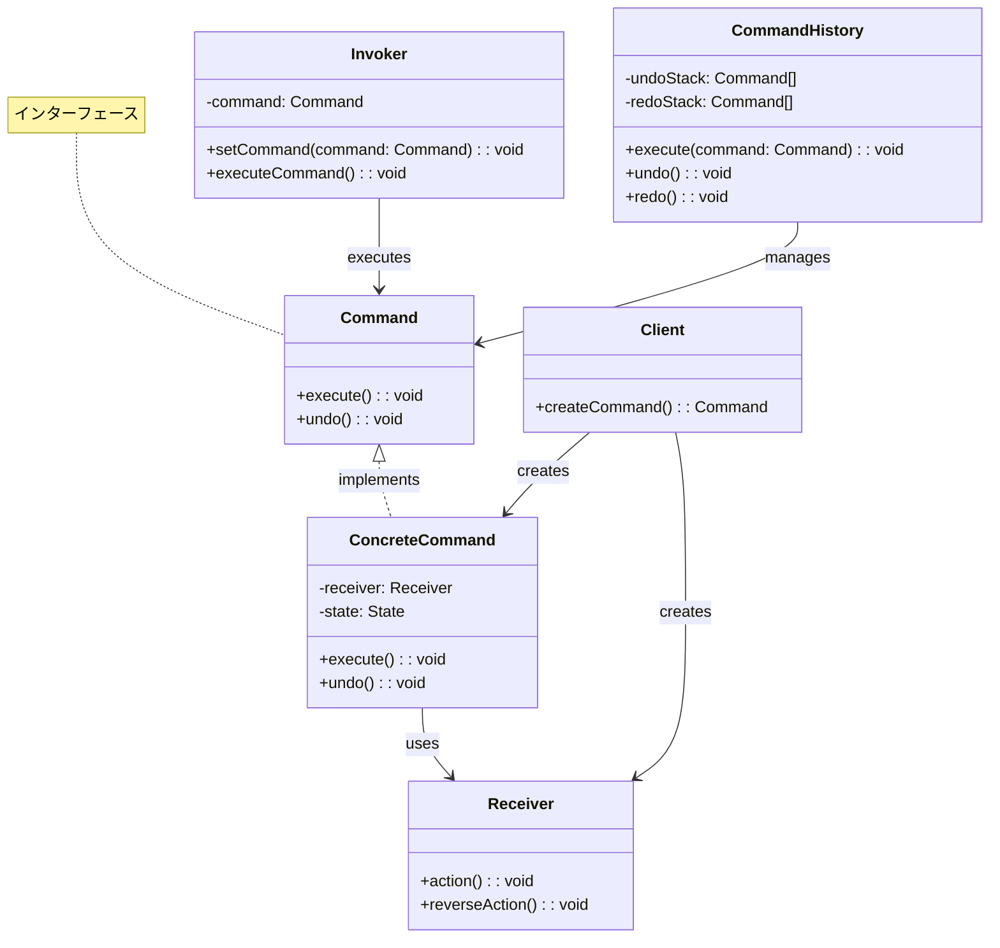
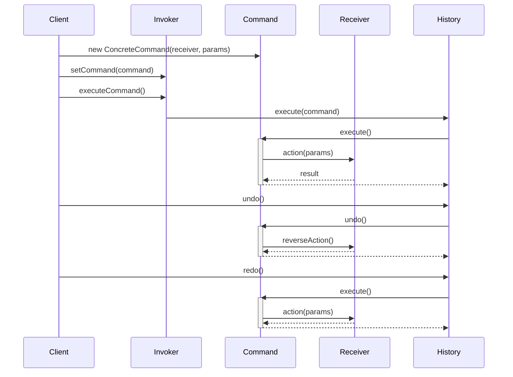
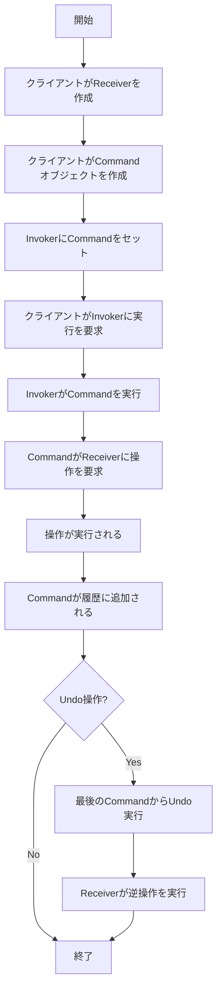

# Commandパターン - 操作オブジェクト化実装

## 1. 概要

### 1.1 パターンの定義
Commandパターンは、リクエストやアクションをオブジェクトとしてカプセル化する行動パターンです。これにより、リクエストの発行者（Invoker）とその実装者（Receiver）を分離し、パラメータ化されたアクション、キューイング、ログ記録、取り消し操作などを可能にします。

### 1.2 目的・解決する問題
- リクエスト送信者と処理者の分離
- 操作を一級オブジェクトとして扱い、パラメータ化を可能にする
- 操作の履歴管理とトラッキング
- 操作の取り消し（Undo）と再実行（Redo）機能の実装
- リクエストのキューイングと遅延実行
- トランザクション的な操作の実装

### 1.3 コンテキスト・適用場面
- ユーザーインターフェイスでのアクション（ボタンクリック、メニュー選択など）
- マルチレベルの取り消し/再実行機能が必要なアプリケーション
- バッチ処理や非同期タスク処理
- 履歴が必要な操作のログ記録
- トランザクション処理とロールバック
- 柔軟なコールバック機構が必要な場合

## 2. クラス構造

### 2.1 クラス図


### 2.2 主要コンポーネント

| コンポーネント | 種類 | 責務 | 関連 |
|-------------|------|------|------|
| Command | インターフェース | コマンドの共通インターフェースを定義 | ConcreteCommandに実装される |
| ConcreteCommand | クラス | 特定の操作と状態をカプセル化 | Commandを実装、Receiverを使用 |
| Receiver | クラス | 実際の操作を実行するオブジェクト | ConcreteCommandに使用される |
| Invoker | クラス | コマンドを実行するクライアント | Commandを使用 |
| CommandHistory | クラス | コマンドの履歴を管理し、Undo/Redoを実現 | Commandを管理 |
| Client | クラス | コマンドを作成し、Invokerに設定 | ConcreteCommandとReceiverを作成 |

### 2.3 相互作用
- Clientは特定の操作に対応するConcreteCommandを作成し、適切なReceiverと関連付ける
- InvokerはCommandオブジェクトを保持し、必要なタイミングでexecuteメソッドを呼び出す
- ConcreteCommandはReceiverに対して適切なアクションを要求する
- CommandHistoryは実行されたコマンドを記録し、Undo/Redo操作を管理する
- 各ConcreteCommandは自身の実行に必要な状態を保持し、Undo操作を可能にする

## 3. 振る舞い

### 3.1 シーケンス図


### 3.2 プロセスフロー


### 3.3 重要なシナリオ

#### シナリオ1: テキストエディタの編集操作
1. ユーザーがテキスト入力
2. テキスト挿入コマンドが作成され、実行される
3. テキストがエディタに挿入される
4. コマンドが履歴に追加される
5. ユーザーが「元に戻す」操作を実行
6. 前回のコマンドのundo()メソッドが呼び出される
7. テキスト挿入が取り消される

#### シナリオ2: バッチコマンド処理
1. 複数のコマンドがキューに追加される
2. システムが順番にコマンドを処理
3. 各コマンドが実行され、結果が記録される
4. エラーが発生した場合、実行済みコマンドのundoが呼び出される
5. システムが一貫した状態に戻る

## 4. 実装詳細

### 4.1 主要インターフェース・クラス

```typescript
/**
 * コマンドインターフェース
 * すべてのコマンドクラスが実装する基本インターフェース
 */
interface Command {
    /**
     * コマンドを実行
     */
    execute(): void;
    
    /**
     * コマンドを元に戻す
     */
    undo(): void;
}

/**
 * テキストエディタクラス
 * コマンド操作の対象となるReceiver
 */
class TextEditor {
    /**
     * エディタの内容
     */
    private content: string = '';
    
    /**
     * カーソル位置
     */
    private cursorPosition: number = 0;
    
    /**
     * 文字列を挿入
     * @param text 挿入するテキスト
     * @param position 挿入位置
     */
    insertText(text: string, position: number): void {
        this.content = 
            this.content.slice(0, position) +
            text +
            this.content.slice(position);
    }
    
    /**
     * 文字列を削除
     * @param position 削除開始位置
     * @param length 削除する長さ
     * @returns 削除したテキスト（undo用）
     */
    deleteText(position: number, length: number): string {
        const deletedText = this.content.slice(position, position + length);
        this.content = 
            this.content.slice(0, position) +
            this.content.slice(position + length);
        return deletedText;
    }
    
    /**
     * カーソル位置を設定
     * @param position 新しいカーソル位置
     */
    setCursorPosition(position: number): void {
        this.cursorPosition = Math.min(
            Math.max(0, position),
            this.content.length
        );
    }
    
    /**
     * カーソル位置を取得
     * @returns 現在のカーソル位置
     */
    getCursorPosition(): number {
        return this.cursorPosition;
    }
    
    /**
     * テキスト内容を取得
     * @returns エディタの内容
     */
    getContent(): string {
        return this.content;
    }
}

/**
 * テキスト挿入コマンド
 */
class InsertTextCommand implements Command {
    /**
     * 挿入位置
     */
    private position: number;
    
    /**
     * コンストラクタ
     * @param editor テキストエディタ
     * @param text 挿入するテキスト
     * @param position 挿入位置
     */
    constructor(
        private editor: TextEditor,
        private text: string,
        position: number
    ) {
        this.position = position;
    }
    
    /**
     * コマンドを実行
     */
    execute(): void {
        this.editor.insertText(this.text, this.position);
    }
    
    /**
     * コマンドを元に戻す
     */
    undo(): void {
        this.editor.deleteText(this.position, this.text.length);
    }
}

/**
 * テキスト削除コマンド
 */
class DeleteTextCommand implements Command {
    /**
     * 削除したテキスト（undo用）
     */
    private deletedText: string = '';
    
    /**
     * コンストラクタ
     * @param editor テキストエディタ
     * @param position 削除開始位置
     * @param length 削除する長さ
     */
    constructor(
        private editor: TextEditor,
        private position: number,
        private length: number
    ) {}
    
    /**
     * コマンドを実行
     */
    execute(): void {
        this.deletedText = this.editor.deleteText(this.position, this.length);
    }
    
    /**
     * コマンドを元に戻す
     */
    undo(): void {
        this.editor.insertText(this.deletedText, this.position);
    }
}

/**
 * コマンド履歴
 * コマンドの実行履歴を管理し、Undo/Redoを実現
 */
class CommandHistory {
    /**
     * 元に戻す用のスタック
     */
    private undoStack: Command[] = [];
    
    /**
     * やり直し用のスタック
     */
    private redoStack: Command[] = [];
    
    /**
     * コマンドを実行
     * @param command 実行するコマンド
     */
    execute(command: Command): void {
        command.execute();
        this.undoStack.push(command);
        this.redoStack = []; // Redoスタックをクリア
    }
    
    /**
     * 直前のコマンドを元に戻す
     */
    undo(): void {
        const command = this.undoStack.pop();
        if (command) {
            command.undo();
            this.redoStack.push(command);
        }
    }
    
    /**
     * 元に戻したコマンドをやり直す
     */
    redo(): void {
        const command = this.redoStack.pop();
        if (command) {
            command.execute();
            this.undoStack.push(command);
        }
    }
    
    /**
     * Undo可能かどうか
     * @returns Undo可能な場合true
     */
    canUndo(): boolean {
        return this.undoStack.length > 0;
    }
    
    /**
     * Redo可能かどうか
     * @returns Redo可能な場合true
     */
    canRedo(): boolean {
        return this.redoStack.length > 0;
    }
    
    /**
     * 履歴をクリア
     */
    clear(): void {
        this.undoStack = [];
        this.redoStack = [];
    }
}
```

### 4.2 複合コマンド実装

```typescript
/**
 * 複合コマンド
 * 複数のコマンドをグループ化して一つのコマンドとして扱う
 */
class CompositeCommand implements Command {
    /**
     * 内部コマンドのリスト
     */
    private commands: Command[] = [];
    
    /**
     * コマンドを追加
     * @param command 追加するコマンド
     */
    add(command: Command): void {
        this.commands.push(command);
    }
    
    /**
     * すべてのコマンドを実行
     */
    execute(): void {
        this.commands.forEach(command => command.execute());
    }
    
    /**
     * すべてのコマンドを逆順で元に戻す
     */
    undo(): void {
        // 逆順で取り消し（最後に実行したコマンドから）
        for (let i = this.commands.length - 1; i >= 0; i--) {
            this.commands[i].undo();
        }
    }
    
    /**
     * コマンドの数を取得
     * @returns コマンド数
     */
    size(): number {
        return this.commands.length;
    }
}
```

### 4.3 実装のバリエーション

1. **基本コマンド**
   - 単一の操作を実行するシンプルなコマンド
   - execute()とundo()メソッドを持つ

2. **複合コマンド**
   - 複数のコマンドをまとめて一つの操作として扱う
   - マクロ記録やトランザクションに適している

3. **非可逆コマンド**
   - undo()を実装しないか、例外をスローする
   - 取り消しができない操作（例：印刷、メール送信）に使用

4. **遅延実行コマンド**
   - 実行をスケジューリングし、後で実行する
   - バッチ処理やキュー処理に適している

### 4.4 注意すべき実装ポイント

- コマンドは自己完結型にすべき（実行に必要な情報をすべて保持）
- 複雑な操作をコマンドに分割する際は、一貫性と原子性を考慮する
- Undo操作の実装は慎重に行い、副作用を考慮する
- コマンドオブジェクトのライフサイクル管理（メモリ使用量の制御）
- コマンドの状態保存方法（スナップショットか差分か）を適切に選択
- 非同期コマンドを実装する場合は、実行完了の通知メカニズムを検討する
- コマンドの実行順序依存性に注意し、依存関係がある場合は明示的に管理する

## 5. 使用例

### 5.1 基本的な使用例

```typescript
// エディタとコマンド履歴の作成
const editor = new TextEditor();
const history = new CommandHistory();

// テキスト挿入
const insertHello = new InsertTextCommand(editor, 'Hello', 0);
history.execute(insertHello);
console.log(editor.getContent()); // "Hello"

// さらにテキスト挿入
const insertWorld = new InsertTextCommand(editor, ' World', 5);
history.execute(insertWorld);
console.log(editor.getContent()); // "Hello World"

// 元に戻す
history.undo();
console.log(editor.getContent()); // "Hello"

// やり直し
history.redo();
console.log(editor.getContent()); // "Hello World"

// テキスト削除
const deleteText = new DeleteTextCommand(editor, 0, 5);
history.execute(deleteText);
console.log(editor.getContent()); // " World"

// 元に戻す
history.undo();
console.log(editor.getContent()); // "Hello World"
```

### 5.2 高度な使用例

```typescript
/**
 * エディタアプリケーション
 * コマンドパターンを使用したテキストエディタ
 */
class TextEditorApp {
    private editor: TextEditor;
    private history: CommandHistory;
    
    constructor() {
        this.editor = new TextEditor();
        this.history = new CommandHistory();
    }
    
    /**
     * テキストを挿入
     * @param text 挿入するテキスト
     */
    insertText(text: string): void {
        const position = this.editor.getCursorPosition();
        const command = new InsertTextCommand(this.editor, text, position);
        this.history.execute(command);
        
        // カーソル位置を更新
        this.editor.setCursorPosition(position + text.length);
    }
    
    /**
     * テキストを削除（バックスペース）
     */
    backspace(): void {
        const position = this.editor.getCursorPosition();
        if (position > 0) {
            const command = new DeleteTextCommand(this.editor, position - 1, 1);
            this.history.execute(command);
            this.editor.setCursorPosition(position - 1);
        }
    }
    
    /**
     * 単語を挿入（複合コマンド）
     * @param word 挿入する単語
     */
    insertFormattedWord(word: string): void {
        const position = this.editor.getCursorPosition();
        const composite = new CompositeCommand();
        
        // 単語を太字で囲む
        composite.add(new InsertTextCommand(this.editor, '**', position));
        composite.add(new InsertTextCommand(this.editor, word, position + 2));
        composite.add(new InsertTextCommand(this.editor, '**', position + 2 + word.length));
        
        this.history.execute(composite);
        this.editor.setCursorPosition(position + 4 + word.length);
    }
    
    /**
     * 元に戻す
     */
    undo(): void {
        if (this.history.canUndo()) {
            this.history.undo();
            // カーソル位置の更新などの追加処理が必要かもしれない
        }
    }
    
    /**
     * やり直し
     */
    redo(): void {
        if (this.history.canRedo()) {
            this.history.redo();
            // カーソル位置の更新などの追加処理が必要かもしれない
        }
    }
    
    /**
     * 現在のテキスト内容を取得
     * @returns テキスト内容
     */
    getContent(): string {
        return this.editor.getContent();
    }
}

// アプリケーションの使用例
const app = new TextEditorApp();

app.insertText('Hello');
console.log(app.getContent()); // "Hello"

app.insertFormattedWord('World');
console.log(app.getContent()); // "Hello**World**"

app.undo();
console.log(app.getContent()); // "Hello"

app.redo();
console.log(app.getContent()); // "Hello**World**"

app.backspace();
console.log(app.getContent()); // "Hello**World*"
```

## 6. テスト戦略

### 6.1 ユニットテスト要件
- 各コマンドがexecute()メソッドで期待通りの操作を行うことを検証
- 各コマンドがundo()メソッドで正確に状態を元に戻すことを確認
- CommandHistoryがundo/redoスタックを適切に管理することを検証
- 複合コマンドが含まれるすべてのコマンドを正しい順序で実行・取り消すことを確認

### 6.2 テスト実装例

```typescript
describe('Command Pattern', () => {
    describe('TextEditor', () => {
        let editor: TextEditor;
        
        beforeEach(() => {
            editor = new TextEditor();
        });
        
        test('should insert text at specified position', () => {
            editor.insertText('Hello', 0);
            expect(editor.getContent()).toBe('Hello');
            
            editor.insertText(' World', 5);
            expect(editor.getContent()).toBe('Hello World');
            
            editor.insertText('!', 11);
            expect(editor.getContent()).toBe('Hello World!');
        });
        
        test('should delete text at specified position', () => {
            editor.insertText('Hello World', 0);
            
            const deleted = editor.deleteText(5, 6);
            expect(deleted).toBe(' World');
            expect(editor.getContent()).toBe('Hello');
        });
        
        test('should manage cursor position correctly', () => {
            editor.setCursorPosition(0);
            expect(editor.getCursorPosition()).toBe(0);
            
            editor.insertText('Hello', 0);
            editor.setCursorPosition(5);
            expect(editor.getCursorPosition()).toBe(5);
            
            // 範囲外の位置は制限される
            editor.setCursorPosition(-1);
            expect(editor.getCursorPosition()).toBe(0);
            
            editor.setCursorPosition(100);
            expect(editor.getCursorPosition()).toBe(5);
        });
    });
    
    describe('Commands', () => {
        let editor: TextEditor;
        
        beforeEach(() => {
            editor = new TextEditor();
        });
        
        test('InsertTextCommand should insert text and undo correctly', () => {
            const command = new InsertTextCommand(editor, 'Hello', 0);
            
            command.execute();
            expect(editor.getContent()).toBe('Hello');
            
            command.undo();
            expect(editor.getContent()).toBe('');
        });
        
        test('DeleteTextCommand should delete text and undo correctly', () => {
            editor.insertText('Hello World', 0);
            
            const command = new DeleteTextCommand(editor, 5, 6);
            command.execute();
            expect(editor.getContent()).toBe('Hello');
            
            command.undo();
            expect(editor.getContent()).toBe('Hello World');
        });
        
        test('CompositeCommand should execute and undo all commands', () => {
            const composite = new CompositeCommand();
            
            composite.add(new InsertTextCommand(editor, 'Hello', 0));
            composite.add(new InsertTextCommand(editor, ' ', 5));
            composite.add(new InsertTextCommand(editor, 'World', 6));
            
            expect(composite.size()).toBe(3);
            
            composite.execute();
            expect(editor.getContent()).toBe('Hello World');
            
            composite.undo();
            expect(editor.getContent()).toBe('');
        });
    });
    
    describe('CommandHistory', () => {
        let editor: TextEditor;
        let history: CommandHistory;
        
        beforeEach(() => {
            editor = new TextEditor();
            history = new CommandHistory();
        });
        
        test('should execute commands and track history', () => {
            const command1 = new InsertTextCommand(editor, 'Hello', 0);
            const command2 = new InsertTextCommand(editor, ' World', 5);
            
            history.execute(command1);
            expect(editor.getContent()).toBe('Hello');
            expect(history.canUndo()).toBe(true);
            expect(history.canRedo()).toBe(false);
            
            history.execute(command2);
            expect(editor.getContent()).toBe('Hello World');
            expect(history.canUndo()).toBe(true);
            expect(history.canRedo()).toBe(false);
        });
        
        test('should handle undo and redo operations', () => {
            const command1 = new InsertTextCommand(editor, 'Hello', 0);
            const command2 = new InsertTextCommand(editor, ' World', 5);
            
            history.execute(command1);
            history.execute(command2);
            expect(editor.getContent()).toBe('Hello World');
            
            history.undo();
            expect(editor.getContent()).toBe('Hello');
            expect(history.canUndo()).toBe(true);
            expect(history.canRedo()).toBe(true);
            
            history.undo();
            expect(editor.getContent()).toBe('');
            expect(history.canUndo()).toBe(false);
            expect(history.canRedo()).toBe(true);
            
            history.redo();
            expect(editor.getContent()).toBe('Hello');
            
            history.redo();
            expect(editor.getContent()).toBe('Hello World');
            expect(history.canRedo()).toBe(false);
        });
        
        test('should clear redo stack after new command', () => {
            const command1 = new InsertTextCommand(editor, 'Hello', 0);
            const command2 = new InsertTextCommand(editor, ' World', 5);
            const command3 = new InsertTextCommand(editor, '!', 11);
            
            history.execute(command1);
            history.execute(command2);
            
            history.undo(); // Back to 'Hello'
            expect(history.canRedo()).toBe(true);
            
            history.execute(command3); // Add '!' → 'Hello!'
            expect(editor.getContent()).toBe('Hello!');
            expect(history.canRedo()).toBe(false); // Redo stack should be cleared
        });
        
        test('should clear history', () => {
            const command = new InsertTextCommand(editor, 'Hello', 0);
            
            history.execute(command);
            expect(history.canUndo()).toBe(true);
            
            history.clear();
            expect(history.canUndo()).toBe(false);
            expect(history.canRedo()).toBe(false);
        });
    });
});
```

## 7. 評価

### 7.1 メリット
- 送信者と受信者の分離によって結合度が低減する
- コマンドのカプセル化により、拡張性と柔軟性が向上する
- 操作履歴の管理と取り消し機能の実装が容易
- コマンドオブジェクトの保存による操作の永続化が可能
- 複合コマンドによる高レベルな操作の構築が可能
- キューイングや遅延実行などの高度な機能を実装できる

### 7.2 デメリット・制約
- 単純な操作に対してもクラス数が増加する
- コマンドオブジェクトの状態管理が複雑になる可能性がある
- 大量のコマンドオブジェクトによるメモリ消費の増加
- コマンド間の依存関係がある場合、管理が難しくなる
- 複雑なUndoロジックの実装が必要な場合がある
- 大規模なアプリケーションでは多数のコマンドクラスが必要になる

### 7.3 代替パターン・関連パターン
- **Memento パターン**: 状態の保存と復元に使用され、Commandパターンと組み合わせてUndoを実装することができる
- **Strategy パターン**: アルゴリズムをカプセル化するが、履歴管理や取り消し機能はない
- **Chain of Responsibility パターン**: コマンド処理の連鎖を構築できる
- **Observer パターン**: コマンド実行の通知に使用できる
- **Composite パターン**: 複合コマンドの実装に使用される

## 8. 参考資料

### 8.1 内部リンク
- [ソースコード](../../src/behavioral/command)
- [テストコード](../../tests/behavioral/command)

### 8.2 外部リンク
- [リファクタリング・グル - Command パターン](https://refactoring.guru/ja/design-patterns/command)
- [Design Patterns: Elements of Reusable Object-Oriented Software](https://www.amazon.co.jp/Design-Patterns-Elements-Reusable-Object-Oriented/dp/0201633612) 