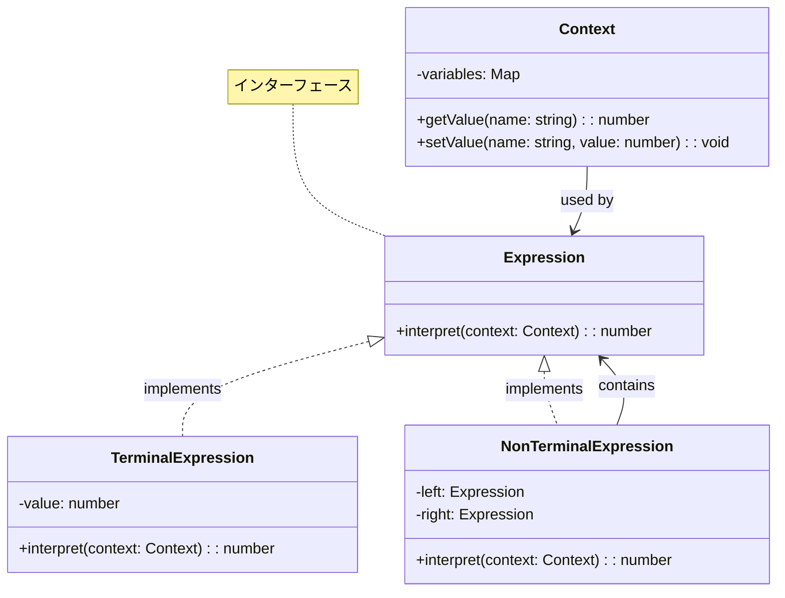
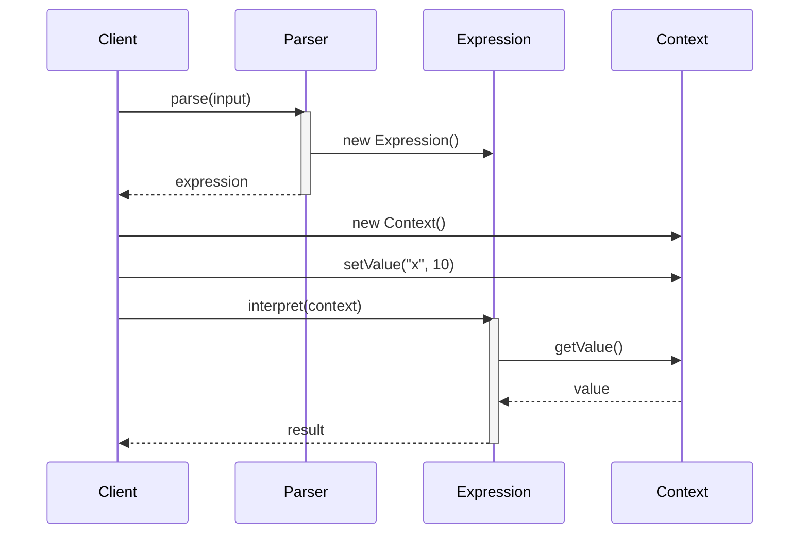
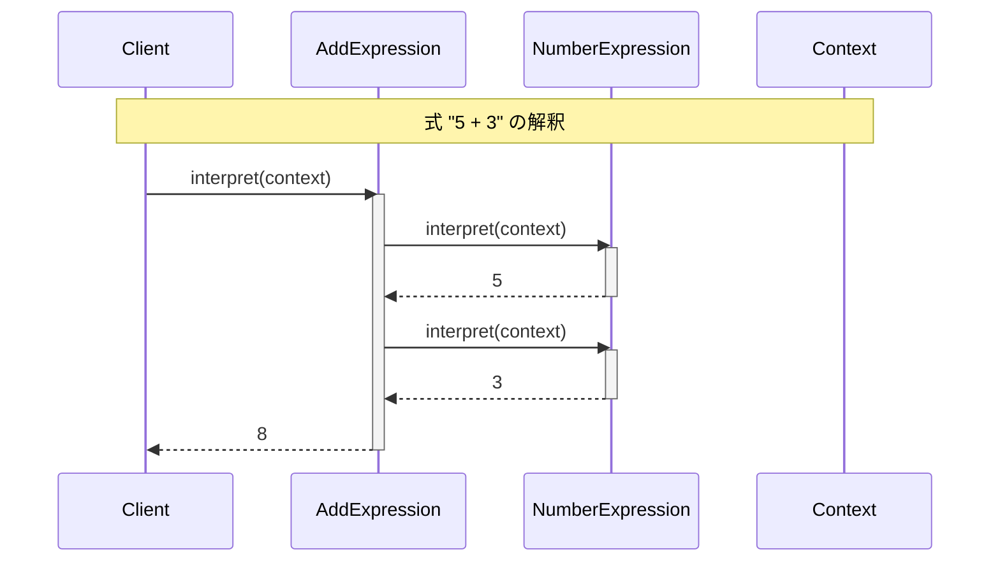
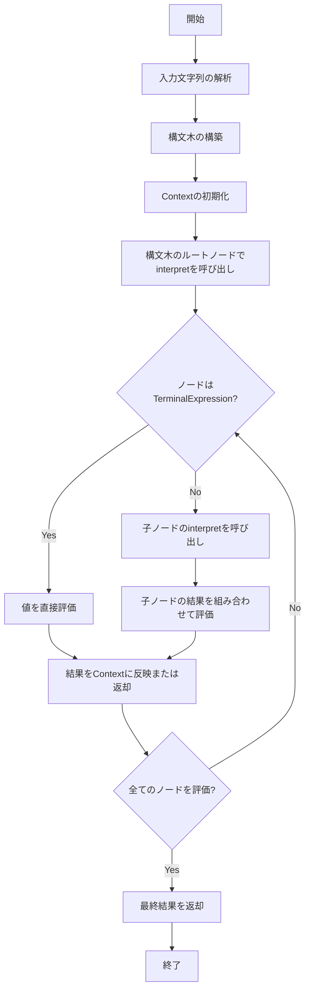

# Interpreterパターン - ドメイン固有言語実装

## 1. パターン定義と目的

### 1.1 定義
Interpreterパターンは、特定の言語の文法を定義し、その言語で書かれた文を解釈するための行動パターンです。このパターンは、各文法規則をクラスとして表現し、それらを組み合わせて文を解釈するメカニズムを提供します。

### 1.2 解決する問題
- 特定のドメイン向けの簡易言語や文法の実装
- 複雑な規則や表現を構造化された方法で評価
- 繰り返し発生するパターンを文法として定式化
- テキストの解析と意味的な処理を分離
- 構文木の構築と評価の体系化

### 1.3 パターンの適用コンテキスト
- ドメイン固有言語（DSL）の実装
- 数式や論理式の評価
- SQL風のクエリ言語の実装
- 設定ファイルの解析と評価
- テキストベースのゲームコマンド処理
- 正規表現エンジンの実装

## 2. クラス構造

### 2.1 基本構成


### 2.2 主要コンポーネント

| コンポーネント | 種類 | 責務 | 関連 |
|-------------|------|------|------|
| Expression | インターフェース | 全ての式の共通インターフェースを定義する | TerminalExpressionとNonTerminalExpressionに実装される |
| TerminalExpression | クラス | 文法の終端記号を表現し、直接解釈を行う | Expressionを実装 |
| NonTerminalExpression | クラス | 複数のExpressionを組み合わせた式を表現する | Expressionを実装、複数のExpressionを含む |
| Context | クラス | 解釈に必要な状態や情報を保持する | Expressionによって使用される |

### 2.3 相互作用
- クライアントは言語構文を解析し、Expression型のオブジェクト構造（構文木）を構築する
- クライアントはContextオブジェクトを作成し、変数や状態情報を設定する
- クライアントはルート式に対してinterpretメソッドを呼び出し、Contextを渡す
- 各Expressionはinterpretメソッドを実装し、自身の式の評価と部分式の評価を行う
- 評価結果は必要に応じてContextを更新し、最終的に計算結果を返す

## 3. 振る舞い

### 3.1 基本フロー


### 3.2 数式の解釈例


### 3.3 プロセスフロー


## 4. 実装詳細

### 4.1 演算子の実装
```typescript
class AddExpression implements Expression {
    constructor(
        private left: Expression,
        private right: Expression
    ) {}
    
    interpret(context: Context): number {
        return this.left.interpret(context) + 
               this.right.interpret(context);
    }
}

class SubtractExpression implements Expression {
    constructor(
        private left: Expression,
        private right: Expression
    ) {}
    
    interpret(context: Context): number {
        return this.left.interpret(context) - 
               this.right.interpret(context);
    }
}

class MultiplyExpression implements Expression {
    constructor(
        private left: Expression,
        private right: Expression
    ) {}
    
    interpret(context: Context): number {
        return this.left.interpret(context) * 
               this.right.interpret(context);
    }
}

class DivideExpression implements Expression {
    constructor(
        private left: Expression,
        private right: Expression
    ) {}
    
    interpret(context: Context): number {
        const rightValue = this.right.interpret(context);
        if (rightValue === 0) {
            throw new Error('0による除算はできません');
        }
        return this.left.interpret(context) / rightValue;
    }
}
```

### 4.2 構文解析器
```typescript
class Parser {
    private tokens: string[];
    private position: number = 0;
    
    constructor(input: string) {
        this.tokens = input.split(' ');
    }
    
    parse(): Expression {
        return this.parseExpression();
    }
    
    private parseExpression(): Expression {
        const left = this.parseNumber();
        
        if (this.position < this.tokens.length) {
            const operator = this.tokens[this.position];
            this.position++;
            
            const right = this.parseNumber();
            
            switch (operator) {
                case '+':
                    return new AddExpression(left, right);
                case '-':
                    return new SubtractExpression(left, right);
                case '*':
                    return new MultiplyExpression(left, right);
                case '/':
                    return new DivideExpression(left, right);
                default:
                    throw new Error(`不明な演算子: ${operator}`);
            }
        }
        
        return left;
    }
    
    private parseNumber(): Expression {
        const token = this.tokens[this.position];
        this.position++;
        
        if (token.match(/^[0-9]+$/)) {
            return new NumberExpression(parseInt(token));
        } else {
            return new VariableExpression(token);
        }
    }
}
```

## 5. 使用例

### 5.1 数式の評価
```typescript
// コンテキストの作成
const context = new Context();
context.setValue('x', 10);
context.setValue('y', 5);

// 式のパースと評価
const parser = new Parser('x + y * 2');
const expression = parser.parse();
const result = expression.interpret(context);
console.log(result); // 出力: 20

// 別の式の評価
const parser2 = new Parser('100 / y');
const expression2 = parser2.parse();
const result2 = expression2.interpret(context);
console.log(result2); // 出力: 20
```

### 5.2 複雑な式の評価
```typescript
class Calculator {
    private context: Context = new Context();
    
    setVariable(name: string, value: number): void {
        this.context.setValue(name, value);
    }
    
    evaluate(expression: string): number {
        const parser = new Parser(expression);
        const ast = parser.parse();
        return ast.interpret(this.context);
    }
}

// 使用例
const calculator = new Calculator();
calculator.setVariable('x', 10);
calculator.setVariable('y', 5);

console.log(calculator.evaluate('x + y')); // 15
console.log(calculator.evaluate('x * y')); // 50
console.log(calculator.evaluate('x / y')); // 2
```

## 6. テスト戦略

### 6.1 単体テスト
```typescript
describe('Expression Interpreter', () => {
    let context: Context;
    
    beforeEach(() => {
        context = new Context();
        context.setValue('x', 10);
        context.setValue('y', 5);
    });
    
    it('should evaluate number expressions', () => {
        const expression = new NumberExpression(42);
        expect(expression.interpret(context)).toBe(42);
    });
    
    it('should evaluate variable expressions', () => {
        const expression = new VariableExpression('x');
        expect(expression.interpret(context)).toBe(10);
    });
    
    it('should evaluate arithmetic expressions', () => {
        const add = new AddExpression(
            new NumberExpression(5),
            new NumberExpression(3)
        );
        expect(add.interpret(context)).toBe(8);
        
        const multiply = new MultiplyExpression(
            new VariableExpression('x'),
            new VariableExpression('y')
        );
        expect(multiply.interpret(context)).toBe(50);
    });
});
```

### 6.2 統合テスト
```typescript
describe('Calculator Integration', () => {
    let calculator: Calculator;
    
    beforeEach(() => {
        calculator = new Calculator();
        calculator.setVariable('x', 10);
        calculator.setVariable('y', 5);
    });
    
    it('should evaluate complex expressions', () => {
        expect(calculator.evaluate('x + y * 2')).toBe(20);
        expect(calculator.evaluate('(x + y) * 2')).toBe(30);
        expect(calculator.evaluate('x / y + 1')).toBe(3);
    });
    
    it('should handle errors', () => {
        expect(() => {
            calculator.evaluate('x / 0');
        }).toThrow('0による除算はできません');
        
        expect(() => {
            calculator.evaluate('x @ y');
        }).toThrow('不明な演算子: @');
    });
});
```

## 7. 評価

### 7.1 メリット
- 文法規則の柔軟な拡張
- 式の評価の分離
- ドメイン固有言語の実装に適している
- 各文法ルールをカプセル化することで保守性が向上
- 解釈器の機能を段階的に追加できる
- クライアントコードとインタープリタの分離

### 7.2 デメリット・制約
- 複雑な文法での実装の困難さ
- パフォーマンスの問題（再帰的な解釈に伴うオーバーヘッド）
- メンテナンスの複雑さ
- クラス数の増加
- デバッグの難しさ
- 大規模な言語処理には不向き

### 7.3 代替パターン・関連パターン
- **Compositeパターン**: 構文木の構造を表現するために使用
- **Visitorパターン**: 構文木を操作する異なる処理を追加する場合に使用
- **Flyweightパターン**: 終端記号の共有に使用
- **Iteratorパターン**: 構文木の走査に使用

## 8. 参考資料

### 8.1 内部リンク
- [ソースコード](../../src/behavioral/interpreter)
- [テストコード](../../tests/behavioral/interpreter)

### 8.2 外部リンク
- [リファクタリング・グル - Interpreterパターン](https://refactoring.guru/ja/design-patterns/interpreter)
- [Design Patterns: Elements of Reusable Object-Oriented Software](https://www.amazon.co.jp/Design-Patterns-Elements-Reusable-Object-Oriented/dp/0201633612)
