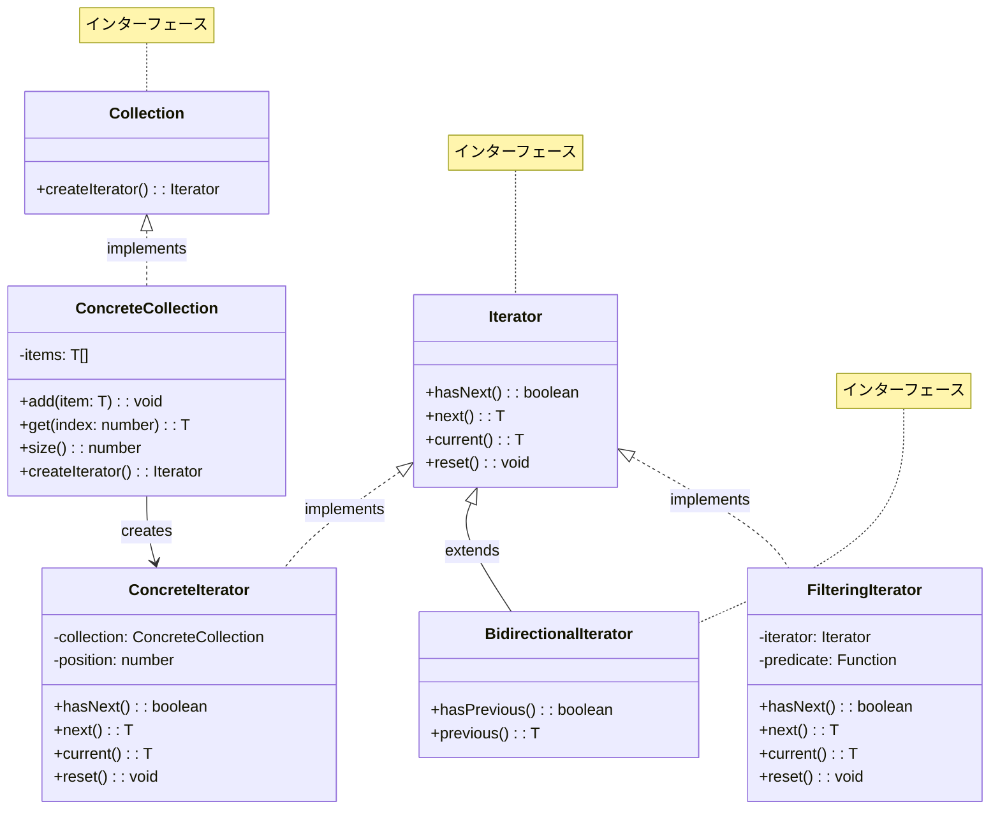
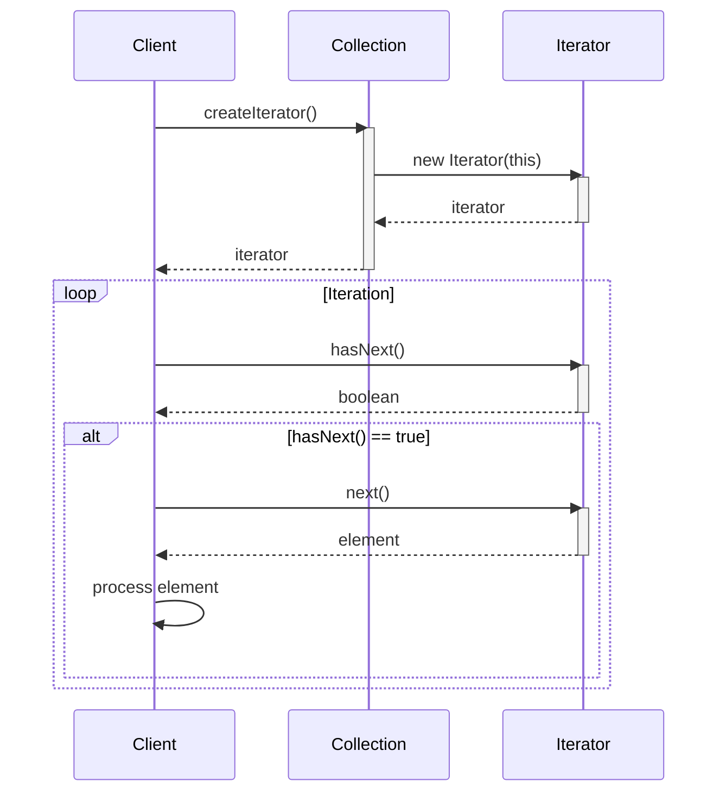
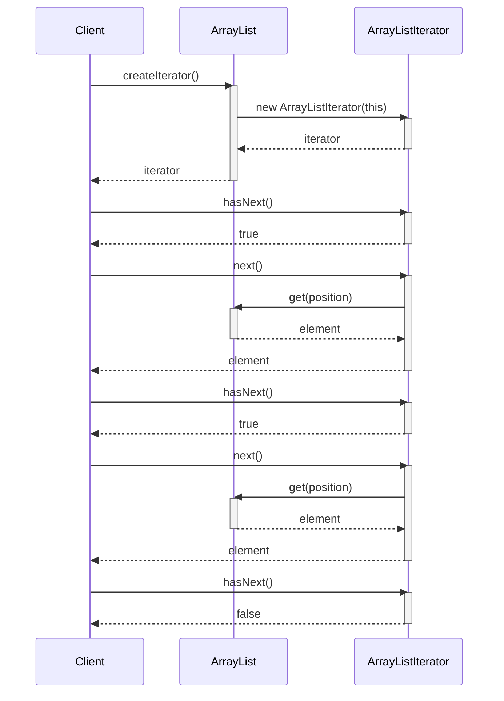
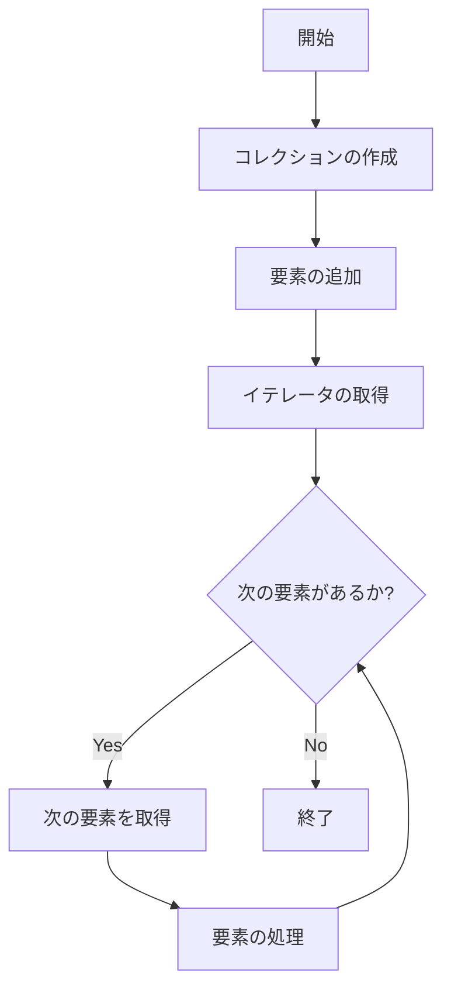

# Iteratorパターン - コレクション走査実装

## 1. 概要

### 1.1 パターンの定義
Iteratorパターンは、コレクションの内部構造を公開せずに、その要素に順次アクセスする方法を提供する行動パターンです。これにより、コレクションの実装詳細から独立して、異なるコレクション構造に対して統一的なアクセス方法を実現できます。

### 1.2 目的・解決する問題
- コレクションの内部構造を隠蔽する
- 複数の走査アルゴリズムを提供する
- コレクションのインターフェースをシンプルに保つ
- 走査ロジックとコレクション要素の管理を分離する
- 複数のトラバーサルを同時に行う
- 反復処理のための統一的なインターフェースを提供する
- クライアントからコレクションの実装詳細を隠蔽する

### 1.3 コンテキスト・適用場面
- 複雑なデータ構造を走査する必要がある場合
- コレクションの内部実装を隠蔽したい場合
- 走査と集約操作を分離したい場合
- 同一コレクションに対して複数の走査方法を提供する場合
- 異なる種類のコレクションに対して統一的なアクセス方法が必要な場合
- データ構造のトラバーサルを抽象化したい場合
- 複数のコレクションを同じインターフェースで処理したい場合

## 2. クラス構造

### 2.1 クラス図


### 2.2 主要コンポーネント

| コンポーネント | 種類 | 責務 | 関連 |
|-------------|------|------|------|
| Iterator | インターフェース | コレクション要素へのアクセス方法を定義 | ConcreteIterator に実装される |
| Collection | インターフェース | イテレータの生成メソッドを定義 | ConcreteCollection に実装される |
| ConcreteIterator | クラス | 特定のコレクションに対する走査ロジックを実装 | Iterator を実装、ConcreteCollection を参照 |
| ConcreteCollection | クラス | 要素の格納と独自のイテレータ生成を担当 | Collection を実装、ConcreteIterator を生成 |
| BidirectionalIterator | インターフェース | 双方向走査機能を追加 | Iterator を拡張 |
| FilteringIterator | クラス | 条件に合致する要素のみを提供 | Iterator を実装、他の Iterator を参照 |

### 2.3 相互作用
- クライアントはCollectionのcreateIterator()メソッドを呼び出してイテレータを取得する
- クライアントはIteratorインターフェースを通じてコレクションの要素にアクセスする
- ConcreteIteratorはConcreteCollectionの内部構造を知っており、適切な走査を行う
- イテレータは現在の位置を追跡し、次の要素へのアクセスを提供する
- 特殊なイテレータ（BidirectionalIterator、FilteringIteratorなど）は基本機能を拡張する

## 3. シーケンス

### 3.1 基本フロー


### 3.2 リスト走査の例


### 3.3 プロセスフロー


### 3.4 重要なシナリオ

#### シナリオ1: 基本的なコレクション走査
1. クライアントがコレクションを作成し、要素を追加
2. コレクションからイテレータを取得
3. イテレータを使って要素を順番に取得し処理
4. すべての要素を処理したらループ終了

#### シナリオ2: フィルタリング走査
1. 基本イテレータをラップするフィルタリングイテレータを作成
2. フィルタリング条件を指定
3. イテレータを使って条件に合致する要素のみを取得
4. 取得した要素を処理

## 4. 実装詳細

### 4.1 主要インターフェース・クラス

```typescript
/**
 * イテレータインターフェース
 * コレクション内の要素を走査するための共通インターフェース
 */
interface Iterator<T> {
    /**
     * 次の要素が存在するかどうかを確認
     * @returns 次の要素が存在する場合はtrue
     */
    hasNext(): boolean;
    
    /**
     * 次の要素を取得し、ポインタを進める
     * @returns 次の要素
     * @throws 次の要素が存在しない場合はエラー
     */
    next(): T;
    
    /**
     * 現在の要素を取得
     * @returns 現在の要素
     * @throws 現在の要素が存在しない場合はエラー
     */
    current(): T;
    
    /**
     * イテレータをリセットして最初から走査できるようにする
     */
    reset(): void;
}

/**
 * コレクションインターフェース
 * イテレータを生成するためのインターフェース
 */
interface Aggregate<T> {
    /**
     * このコレクション用のイテレータを生成する
     * @returns 新しいイテレータ
     */
    createIterator(): Iterator<T>;
}

/**
 * 配列リストの実装
 * 可変長の配列を管理するコレクション
 */
class ArrayList<T> implements Aggregate<T> {
    /**
     * 内部データ格納用の配列
     */
    private items: T[] = [];
    
    /**
     * 要素を追加する
     * @param item 追加する要素
     */
    add(item: T): void {
        this.items.push(item);
    }
    
    /**
     * 指定したインデックスの要素を取得する
     * @param index 取得する要素のインデックス
     * @returns 指定したインデックスの要素
     */
    get(index: number): T {
        return this.items[index];
    }
    
    /**
     * コレクションのサイズを取得する
     * @returns コレクション内の要素数
     */
    size(): number {
        return this.items.length;
    }
    
    /**
     * このコレクション用のイテレータを生成する
     * @returns 新しいArrayListIterator
     */
    createIterator(): Iterator<T> {
        return new ArrayListIterator<T>(this);
    }
}

/**
 * ArrayListのイテレータ実装
 */
class ArrayListIterator<T> implements Iterator<T> {
    /**
     * 現在の走査位置
     */
    private position: number = 0;
    
    /**
     * コンストラクタ
     * @param list 走査対象のArrayList
     */
    constructor(private list: ArrayList<T>) {}
    
    /**
     * 次の要素が存在するかどうかを確認
     * @returns 次の要素が存在する場合はtrue
     */
    hasNext(): boolean {
        return this.position < this.list.size();
    }
    
    /**
     * 次の要素を取得し、ポインタを進める
     * @returns 次の要素
     * @throws 次の要素が存在しない場合はエラー
     */
    next(): T {
        if (this.hasNext()) {
            const item = this.list.get(this.position);
            this.position++;
            return item;
        }
        throw new Error('No more elements');
    }
    
    /**
     * 現在の要素を取得
     * @returns 現在の要素
     * @throws 現在の要素が存在しない場合はエラー
     */
    current(): T {
        if (this.position > 0 && this.position <= this.list.size()) {
            return this.list.get(this.position - 1);
        }
        throw new Error('No current element');
    }
    
    /**
     * イテレータをリセットして最初から走査できるようにする
     */
    reset(): void {
        this.position = 0;
    }
}
```

### 4.2 双方向イテレータの実装

```typescript
/**
 * 双方向イテレータインターフェース
 * 前後両方向への走査を可能にする拡張イテレータ
 */
interface BidirectionalIterator<T> extends Iterator<T> {
    /**
     * 前の要素が存在するかどうかを確認
     * @returns 前の要素が存在する場合はtrue
     */
    hasPrevious(): boolean;
    
    /**
     * 前の要素を取得し、ポインタを戻す
     * @returns 前の要素
     * @throws 前の要素が存在しない場合はエラー
     */
    previous(): T;
}

/**
 * ArrayList用の双方向イテレータ実装
 */
class BidirectionalArrayListIterator<T> implements BidirectionalIterator<T> {
    /**
     * 現在の走査位置
     */
    private position: number = 0;
    
    /**
     * コンストラクタ
     * @param list 走査対象のArrayList
     */
    constructor(private list: ArrayList<T>) {}
    
    /**
     * 次の要素が存在するかどうかを確認
     * @returns 次の要素が存在する場合はtrue
     */
    hasNext(): boolean {
        return this.position < this.list.size();
    }
    
    /**
     * 前の要素が存在するかどうかを確認
     * @returns 前の要素が存在する場合はtrue
     */
    hasPrevious(): boolean {
        return this.position > 0;
    }
    
    /**
     * 次の要素を取得し、ポインタを進める
     * @returns 次の要素
     * @throws 次の要素が存在しない場合はエラー
     */
    next(): T {
        if (this.hasNext()) {
            const item = this.list.get(this.position);
            this.position++;
            return item;
        }
        throw new Error('No more elements');
    }
    
    /**
     * 前の要素を取得し、ポインタを戻す
     * @returns 前の要素
     * @throws 前の要素が存在しない場合はエラー
     */
    previous(): T {
        if (this.hasPrevious()) {
            this.position--;
            return this.list.get(this.position);
        }
        throw new Error('No previous elements');
    }
    
    /**
     * 現在の要素を取得
     * @returns 現在の要素
     * @throws 現在の要素が存在しない場合はエラー
     */
    current(): T {
        if (this.position > 0 && this.position <= this.list.size()) {
            return this.list.get(this.position - 1);
        }
        throw new Error('No current element');
    }
    
    /**
     * イテレータをリセットして最初から走査できるようにする
     */
    reset(): void {
        this.position = 0;
    }
}
```

### 4.3 フィルタリングイテレータの実装

```typescript
/**
 * フィルタリングイテレータ
 * 条件に合致する要素のみを返すイテレータ
 */
class FilteringIterator<T> implements Iterator<T> {
    /**
     * 内部イテレータ
     */
    private iterator: Iterator<T>;
    
    /**
     * フィルタリング条件
     */
    private predicate: (item: T) => boolean;
    
    /**
     * コンストラクタ
     * @param iterator 基となるイテレータ
     * @param predicate フィルタリング条件
     */
    constructor(iterator: Iterator<T>, predicate: (item: T) => boolean) {
        this.iterator = iterator;
        this.predicate = predicate;
        this.moveToNextValid();
    }
    
    /**
     * 次の条件に合致する要素が存在するかどうかを確認
     * @returns 次の条件に合致する要素が存在する場合はtrue
     */
    hasNext(): boolean {
        return this.iterator.hasNext();
    }
    
    /**
     * 次の条件に合致する要素を取得
     * @returns 次の条件に合致する要素
     * @throws 次の条件に合致する要素が存在しない場合はエラー
     */
    next(): T {
        if (!this.hasNext()) {
            throw new Error('No more elements');
        }
        
        const item = this.iterator.next();
        this.moveToNextValid();
        return item;
    }
    
    /**
     * 現在の要素を取得
     * @returns 現在の要素
     */
    current(): T {
        return this.iterator.current();
    }
    
    /**
     * イテレータをリセットして最初から走査できるようにする
     */
    reset(): void {
        this.iterator.reset();
        this.moveToNextValid();
    }
    
    /**
     * 次の条件に合致する要素まで移動
     */
    private moveToNextValid(): void {
        while (this.iterator.hasNext()) {
            const nextItem = this.iterator.current();
            if (this.predicate(nextItem)) {
                return;
            }
            this.iterator.next();
        }
    }
}
```

### 4.4 実装のバリエーション

1. **基本イテレータ**
   - コレクション内の要素を順方向に走査
   - hasNext()とnext()のみを提供

2. **双方向イテレータ**
   - 前後両方向への走査が可能
   - hasPrevious()とprevious()を追加

3. **ランダムアクセスイテレータ**
   - 任意の位置への直接アクセスが可能
   - index指定で要素にアクセス

4. **フィルタリングイテレータ**
   - 条件に合致する要素のみを返す
   - デコレータパターンを利用

### 4.5 注意すべき実装ポイント

- イテレーションの状態管理（現在位置）を適切に行う
- hasNext()とnext()の一貫性を保持する
- next()の呼び出し前にhasNext()で確認する習慣をつける
- コレクション変更中のイテレーション（Concurrent Modification）に注意
- エラーハンドリングを適切に実装する
- イテレータの再利用（reset）時の状態リセットを確実に行う
- パフォーマンスを考慮した実装を心がける（特に大きなコレクションの場合）

## 5. 使用例

### 5.1 基本的な使用例

```typescript
// リストの作成と要素の追加
const list = new ArrayList<number>();
for (let i = 0; i < 5; i++) {
    list.add(i);
}

// イテレータの使用
const iterator = list.createIterator();
console.log('通常のイテレーション:');
while (iterator.hasNext()) {
    console.log(iterator.next());
}
// 出力:
// 0
// 1
// 2
// 3
// 4

// イテレータのリセットと再利用
iterator.reset();
console.log('リセット後の再イテレーション:');
while (iterator.hasNext()) {
    console.log(iterator.next());
}

// 双方向イテレータの使用
const biIterator = new BidirectionalArrayListIterator(list);
console.log('双方向イテレータの前進:');
while (biIterator.hasNext()) {
    console.log(biIterator.next());
}

console.log('双方向イテレータの後退:');
while (biIterator.hasPrevious()) {
    console.log(biIterator.previous());
}
// 出力:
// 4
// 3
// 2
// 1
// 0
```

### 5.2 高度な使用例

```typescript
/**
 * 数値リスト特化クラス
 * 数値専用のフィルタリングイテレータを提供
 */
class NumberList extends ArrayList<number> {
    /**
     * 偶数のみを返すイテレータを取得
     * @returns 偶数フィルタリングイテレータ
     */
    getEvenNumberIterator(): Iterator<number> {
        return new FilteringIterator(
            this.createIterator(),
            num => num % 2 === 0
        );
    }
    
    /**
     * 指定した値より大きい数値のみを返すイテレータを取得
     * @param threshold しきい値
     * @returns しきい値フィルタリングイテレータ
     */
    getNumbersGreaterThan(threshold: number): Iterator<number> {
        return new FilteringIterator(
            this.createIterator(),
            num => num > threshold
        );
    }
}

/**
 * 複数のコレクションを連結して走査するイテレータ
 */
class ConcatenatingIterator<T> implements Iterator<T> {
    private iterators: Iterator<T>[];
    private currentIteratorIndex: number = 0;
    
    /**
     * コンストラクタ
     * @param iterators 連結するイテレータの配列
     */
    constructor(iterators: Iterator<T>[]) {
        this.iterators = [...iterators];
    }
    
    /**
     * 次の要素が存在するかどうかを確認
     * @returns 次の要素が存在する場合はtrue
     */
    hasNext(): boolean {
        // 現在のイテレータに次の要素がある場合
        if (this.currentIteratorIndex < this.iterators.length && 
            this.iterators[this.currentIteratorIndex].hasNext()) {
            return true;
        }
        
        // 次のイテレータを探す
        for (let i = this.currentIteratorIndex + 1; i < this.iterators.length; i++) {
            if (this.iterators[i].hasNext()) {
                return true;
            }
        }
        
        return false;
    }
    
    /**
     * 次の要素を取得
     * @returns 次の要素
     * @throws 次の要素が存在しない場合はエラー
     */
    next(): T {
        if (!this.hasNext()) {
            throw new Error('No more elements');
        }
        
        // 現在のイテレータに次の要素がなければ次のイテレータに移動
        while (this.currentIteratorIndex < this.iterators.length && 
               !this.iterators[this.currentIteratorIndex].hasNext()) {
            this.currentIteratorIndex++;
        }
        
        // 現在のイテレータから次の要素を取得
        return this.iterators[this.currentIteratorIndex].next();
    }
    
    /**
     * 現在の要素を取得
     * @returns 現在の要素
     * @throws 現在の要素が存在しない場合はエラー
     */
    current(): T {
        if (this.currentIteratorIndex < this.iterators.length) {
            return this.iterators[this.currentIteratorIndex].current();
        }
        throw new Error('No current element');
    }
    
    /**
     * イテレータをリセット
     */
    reset(): void {
        this.iterators.forEach(iterator => iterator.reset());
        this.currentIteratorIndex = 0;
    }
}

// 使用例
const numbers = new NumberList();
for (let i = 0; i < 10; i++) {
    numbers.add(i);
}

// 偶数のみを走査
console.log('偶数のみのイテレーション:');
const evenIterator = numbers.getEvenNumberIterator();
while (evenIterator.hasNext()) {
    console.log(evenIterator.next());
}
// 出力:
// 0
// 2
// 4
// 6
// 8

// 5より大きい数値のみを走査
console.log('5より大きい数値のイテレーション:');
const greaterThanFiveIterator = numbers.getNumbersGreaterThan(5);
while (greaterThanFiveIterator.hasNext()) {
    console.log(greaterThanFiveIterator.next());
}
// 出力:
// 6
// 7
// 8
// 9

// 複数リストの連結走査
const list1 = new ArrayList<string>();
list1.add('a');
list1.add('b');

const list2 = new ArrayList<string>();
list2.add('c');
list2.add('d');

const concatenatingIterator = new ConcatenatingIterator([
    list1.createIterator(),
    list2.createIterator()
]);

console.log('連結イテレーション:');
while (concatenatingIterator.hasNext()) {
    console.log(concatenatingIterator.next());
}
// 出力:
// a
// b
// c
// d
```

## 6. テスト戦略

### 6.1 ユニットテスト要件
- 基本イテレータの機能テスト（hasNext, next, current, reset）
- 空のコレクションでのイテレータの挙動テスト
- 走査完了後の挙動テスト（next()呼び出し時のエラー）
- 双方向イテレータの前後走査機能テスト
- フィルタリングイテレータのフィルタリング機能テスト
- イテレータのリセット機能テスト
- エラーケース（要素なし、範囲外アクセスなど）のテスト

### 6.2 テスト実装例

```typescript
describe('Iterator Pattern Tests', () => {
describe('ArrayList Iterator', () => {
    let list: ArrayList<number>;
    let iterator: Iterator<number>;
    
    beforeEach(() => {
        list = new ArrayList<number>();
        for (let i = 0; i < 3; i++) {
            list.add(i);
        }
        iterator = list.createIterator();
    });
    
        test('should iterate through all elements', () => {
        const results: number[] = [];
        while (iterator.hasNext()) {
            results.push(iterator.next());
        }
        expect(results).toEqual([0, 1, 2]);
    });
    
        test('should reset iterator', () => {
            iterator.next(); // 0
            iterator.next(); // 1
        iterator.reset();
        expect(iterator.next()).toBe(0);
    });
    
        test('should throw error when no more elements', () => {
            iterator.next(); // 0
            iterator.next(); // 1
            iterator.next(); // 2
        expect(() => iterator.next()).toThrow('No more elements');
    });
        
        test('should get current element', () => {
            iterator.next(); // 0
            expect(iterator.current()).toBe(0);
            iterator.next(); // 1
            expect(iterator.current()).toBe(1);
        });
        
        test('should throw error when getting current before first element', () => {
            expect(() => iterator.current()).toThrow('No current element');
        });
        
        test('should handle empty collection', () => {
            const emptyList = new ArrayList<number>();
            const emptyIterator = emptyList.createIterator();
            expect(emptyIterator.hasNext()).toBe(false);
            expect(() => emptyIterator.next()).toThrow('No more elements');
        });
    });
    
    describe('BidirectionalIterator', () => {
        let list: ArrayList<number>;
        let iterator: BidirectionalIterator<number>;
        
        beforeEach(() => {
            list = new ArrayList<number>();
            for (let i = 0; i < 3; i++) {
                list.add(i);
            }
            iterator = new BidirectionalArrayListIterator<number>(list);
        });
        
        test('should iterate forward through all elements', () => {
            const results: number[] = [];
            while (iterator.hasNext()) {
                results.push(iterator.next());
            }
            expect(results).toEqual([0, 1, 2]);
        });
        
        test('should iterate backward through all elements', () => {
            // まず最後まで進める
            while (iterator.hasNext()) {
                iterator.next();
            }
            
            // 後ろから走査
            const results: number[] = [];
            while (iterator.hasPrevious()) {
                results.push(iterator.previous());
            }
            expect(results).toEqual([2, 1, 0]);
        });
        
        test('should handle interleaved forward/backward iteration', () => {
            expect(iterator.next()).toBe(0);
            expect(iterator.next()).toBe(1);
            expect(iterator.previous()).toBe(1);
            expect(iterator.previous()).toBe(0);
            expect(iterator.next()).toBe(0);
            expect(iterator.next()).toBe(1);
            expect(iterator.next()).toBe(2);
        });
        
        test('should throw error when no previous elements', () => {
            expect(() => iterator.previous()).toThrow('No previous elements');
        });
    });
    
    describe('FilteringIterator', () => {
        let list: ArrayList<number>;
        let evenIterator: Iterator<number>;
        
        beforeEach(() => {
            list = new ArrayList<number>();
            for (let i = 0; i < 5; i++) {
                list.add(i);
            }
            evenIterator = new FilteringIterator<number>(
                list.createIterator(),
                num => num % 2 === 0
            );
        });
        
        test('should filter elements correctly', () => {
            const results: number[] = [];
            while (evenIterator.hasNext()) {
                results.push(evenIterator.next());
            }
            expect(results).toEqual([0, 2, 4]);
        });
        
        test('should reset filtered iterator', () => {
            evenIterator.next(); // 0
            evenIterator.next(); // 2
            evenIterator.reset();
            expect(evenIterator.next()).toBe(0);
        });
        
        test('should handle no matching elements', () => {
            const noMatchIterator = new FilteringIterator<number>(
                list.createIterator(),
                num => num > 10
            );
            expect(noMatchIterator.hasNext()).toBe(false);
            expect(() => noMatchIterator.next()).toThrow('No more elements');
        });
    });
    
    describe('NumberList', () => {
        let numberList: NumberList;
        
        beforeEach(() => {
            numberList = new NumberList();
            for (let i = 0; i < 10; i++) {
                numberList.add(i);
            }
        });
        
        test('should iterate through even numbers only', () => {
            const evenIterator = numberList.getEvenNumberIterator();
            const results: number[] = [];
            
            while (evenIterator.hasNext()) {
                results.push(evenIterator.next());
            }
            
            expect(results).toEqual([0, 2, 4, 6, 8]);
        });
        
        test('should iterate through numbers greater than threshold', () => {
            const greaterThanFiveIterator = numberList.getNumbersGreaterThan(5);
            const results: number[] = [];
            
            while (greaterThanFiveIterator.hasNext()) {
                results.push(greaterThanFiveIterator.next());
            }
            
            expect(results).toEqual([6, 7, 8, 9]);
        });
    });
});
```

## 7. 評価

### 7.1 メリット
- コレクションの内部構造を隠蔽し、クライアントコードを単純化する
- コレクションの走査ロジックをカプセル化し、コレクションクラスを軽量に保つ
- 異なるコレクションクラスに対して統一的なアクセス方法を提供する
- 複数の走査を同時に行うことができる
- コレクションのインターフェースをシンプルに保つことができる
- 走査アルゴリズムを追加・変更することが容易
- 単一責任の原則に従い、コレクションと走査の責務を分離

### 7.2 デメリット・制約
- 単純なコレクションでは過剰な設計になる可能性がある
- クラス数の増加によりコードベースが複雑化する
- イテレータの状態管理に注意が必要（特に並行処理環境では）
- コレクション変更中のイテレーション（Concurrent Modification）を防ぐ機構が必要
- 言語組み込みのイテレーション機能と比較して冗長になる場合がある
- パフォーマンス面でのオーバーヘッドが生じる可能性がある

### 7.3 代替パターン・関連パターン
- **Compositeパターン**: 複合オブジェクトの走査にIteratorを使用
- **Visitorパターン**: コレクション要素を処理するロジックをカプセル化する際にIteratorと組み合わせる
- **Factoryパターン**: Iterator生成に使用することがある
- **Mementoパターン**: イテレーションの状態を保存・復元するために使用
- **Generatorパターン**: 遅延評価のイテレーション実装に利用

## 8. 参考資料

### 8.1 内部リンク
- [ソースコード](../../src/behavioral/iterator)
- [テストコード](../../tests/behavioral/iterator)

### 8.2 外部リンク
- [リファクタリング・グル - Iterator パターン](https://refactoring.guru/ja/design-patterns/iterator)
- [Design Patterns: Elements of Reusable Object-Oriented Software](https://www.amazon.co.jp/Design-Patterns-Elements-Reusable-Object-Oriented/dp/0201633612) 
- [TypeScript の組み込みイテレータとイテレーブル](https://www.typescriptlang.org/docs/handbook/iterators-and-generators.html) 