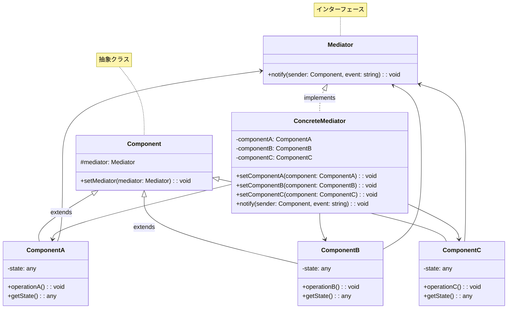
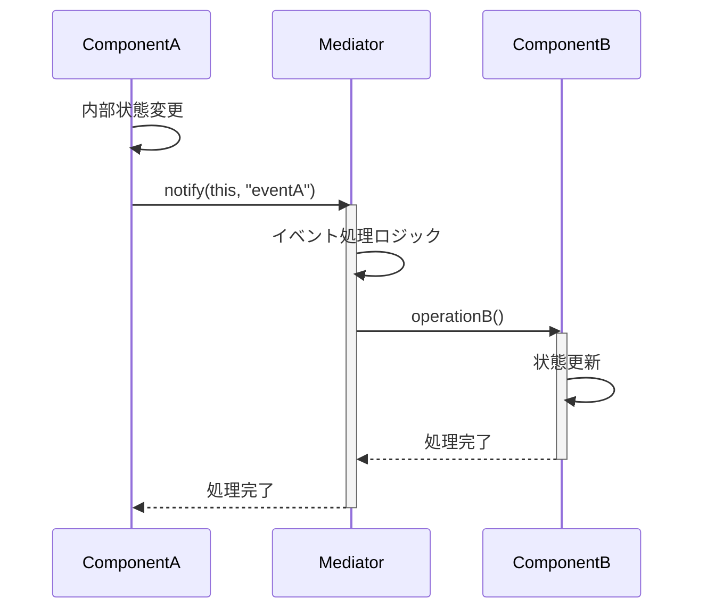
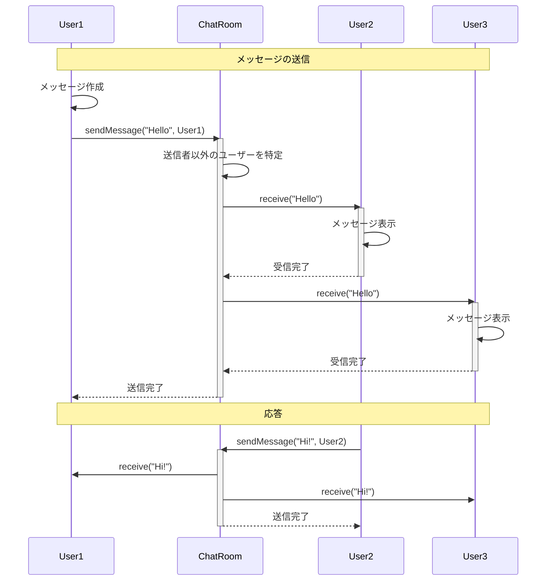
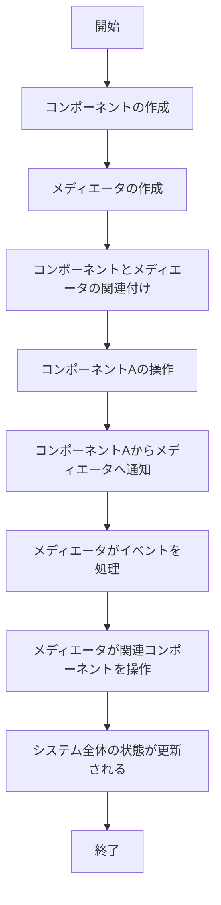

# Mediatorパターン - オブジェクト間通信集約実装

## 1. 概要

### 1.1 パターンの定義
Mediatorパターンは、オブジェクト間の通信をカプセル化するデザインパターンで、オブジェクト間の直接的な参照を減らし、それらの相互作用を中央のメディエーターオブジェクトを通じて行うようにします。これにより、システムのコンポーネント間の結合度を低減し、コンポーネントの再利用性を高めます。

### 1.2 目的・解決する問題
- オブジェクト間の密結合を解消する
- 多対多の通信を一対多の通信に変換する
- コンポーネント間の相互作用を一元管理する
- システムコンポーネントの再利用性を向上させる
- 通信の複雑性を削減する
- コードの保守性と拡張性を向上させる
- 相互依存関係のスパゲッティコードを防止する

### 1.3 コンテキスト・適用場面
- 多数のオブジェクトが複雑に相互作用する場合
- オブジェクト間の依存関係が密になりすぎている場合
- コンポーネントを独立して再利用したい場合
- ユーザーインターフェースコンポーネント間の調整が必要な場合
- 分散システムでのメッセージ交換
- 複雑なイベント処理システム
- MVC/MVVMアーキテクチャのコントローラー/ビューモデルの実装

## 2. クラス構造

### 2.1 クラス図


### 2.2 主要コンポーネント

| コンポーネント | 種類 | 責務 | 関連 |
|-------------|------|------|------|
| Mediator | インターフェース | コンポーネント間の通信を仲介するためのインターフェースを定義 | ConcreteMediator が実装 |
| ConcreteMediator | クラス | コンポーネント間の具体的な連携ロジックを実装 | Component を参照、Mediator を実装 |
| Component | 抽象クラス | メディエータと連携する共通メソッドを定義 | ConcreteComponent の親クラス、Mediator を参照 |
| ConcreteComponent | クラス | 特定の機能を持ち、状態変更時にメディエータに通知 | Component を継承 |

### 2.3 相互作用
- コンポーネントは状態変更や重要なイベントが発生した際にメディエータに通知する
- メディエータはイベントの送信元と種類に基づいて、適切なコンポーネントに処理を委譲する
- コンポーネントは他のコンポーネントを直接参照せず、すべての相互作用はメディエータを介して行う
- メディエータはシステム全体の協調動作を管理し、コンポーネント間の通信ルールを定義する
- 各コンポーネントはメディエータへの参照を持ち、自身の状態変更を通知する

## 3. シーケンス

### 3.1 基本フロー


### 3.2 チャットルームの例


### 3.3 プロセスフロー


### 3.4 重要なシナリオ

#### シナリオ1: チャットアプリケーション
1. ユーザーがメッセージを作成
2. ユーザーがメッセージを送信
3. チャットルーム（メディエータ）がメッセージを受け取る
4. チャットルームが送信者以外の全ユーザーにメッセージを配信
5. 各ユーザーがメッセージを受信・表示

#### シナリオ2: UIフォーム検証
1. ユーザーがフォームフィールドに入力
2. フォームフィールドが値の変更をメディエータに通知
3. メディエータが全フィールドの値を収集・検証
4. バリデーション結果に基づいて送信ボタンの有効/無効を切り替え
5. ユーザーが送信ボタンをクリック
6. メディエータがフォーム送信処理を実行

## 4. 実装詳細

### 4.1 主要インターフェース・クラス

```typescript
/**
 * メディエータインターフェース
 * コンポーネント間の通信を仲介する
 */
interface ChatMediator {
    /**
     * メッセージを送信する
     * @param message 送信するメッセージ
     * @param sender 送信者
     */
    sendMessage(message: string, sender: ChatUser): void;
    
    /**
     * ユーザーを追加する
     * @param user 追加するユーザー
     */
    addUser(user: ChatUser): void;
}

/**
 * チャットユーザークラス
 * メッセージの送受信を行う
 */
class ChatUser {
    /**
     * コンストラクタ
     * @param name ユーザー名
     * @param mediator メディエータ
     */
    constructor(
        private name: string,
        private mediator: ChatMediator
    ) {}
    
    /**
     * メッセージを送信する
     * @param message 送信するメッセージ
     */
    send(message: string): void {
        console.log(`${this.name} sends: ${message}`);
        this.mediator.sendMessage(message, this);
    }
    
    /**
     * メッセージを受信する
     * @param message 受信したメッセージ
     */
    receive(message: string): void {
        console.log(`${this.name} receives: ${message}`);
    }
    
    /**
     * ユーザー名を取得する
     * @returns ユーザー名
     */
    getName(): string {
        return this.name;
    }
}

/**
 * チャットルームクラス（コンクリートメディエータ）
 * ユーザー間のメッセージ交換を管理する
 */
class ChatRoom implements ChatMediator {
    /**
     * チャットルームに参加しているユーザーのリスト
     */
    private users: ChatUser[] = [];
    
    /**
     * ユーザーをチャットルームに追加する
     * @param user 追加するユーザー
     */
    addUser(user: ChatUser): void {
        this.users.push(user);
        console.log(`${user.getName()} has joined the chat room`);
    }
    
    /**
     * メッセージを送信する（送信者以外の全ユーザーに配信）
     * @param message 送信するメッセージ
     * @param sender 送信者
     */
    sendMessage(message: string, sender: ChatUser): void {
        // 送信者以外の全ユーザーにメッセージを配信
        this.users.forEach(user => {
            if (user !== sender) {
                user.receive(message);
            }
        });
    }
}
```

### 4.2 UIメディエータの実装

```typescript
/**
 * UIメディエータインターフェース
 * UI要素間の通信を仲介する
 */
interface UIMediator {
    /**
     * コンポーネントからの通知を処理する
     * @param sender 通知の送信元コンポーネント
     * @param event イベント名
     */
    notify(sender: UIComponent, event: string): void;
    
    /**
     * コンポーネントを登録する
     * @param component 登録するコンポーネント
     */
    registerComponent(component: UIComponent): void;
}

/**
 * UI コンポーネント抽象クラス
 * すべてのUI要素の基底クラス
 */
abstract class UIComponent {
    /**
     * このコンポーネントが関連付けられているメディエータ
     */
    protected mediator: UIMediator;
    
    /**
     * メディエータを設定する
     * @param mediator 設定するメディエータ
     */
    setMediator(mediator: UIMediator): void {
        this.mediator = mediator;
        mediator.registerComponent(this);
    }
    
    /**
     * コンポーネント名を取得する
     * @returns コンポーネント名
     */
    abstract getName(): string;
}

/**
 * ボタンコンポーネント
 */
class Button extends UIComponent {
    /**
     * コンストラクタ
     * @param name ボタン名
     */
    constructor(private name: string) {
        super();
    }
    
    /**
     * ボタンクリックイベントをシミュレート
     */
    click(): void {
        console.log(`Button ${this.name} clicked`);
        this.mediator.notify(this, 'click');
    }
    
    /**
     * ボタン名を取得する
     * @returns ボタン名
     */
    getName(): string {
        return this.name;
    }
}

/**
 * テキストボックスコンポーネント
 */
class TextBox extends UIComponent {
    /**
     * テキストボックスの内容
     */
    private text: string = '';
    
    /**
     * コンストラクタ
     * @param name テキストボックス名
     */
    constructor(private name: string) {
        super();
    }
    
    /**
     * テキストを設定する
     * @param text 設定するテキスト
     */
    setText(text: string): void {
        this.text = text;
        console.log(`TextBox ${this.name} text changed to: ${text}`);
        this.mediator.notify(this, 'textChanged');
    }
    
    /**
     * テキストを取得する
     * @returns 現在のテキスト
     */
    getText(): string {
        return this.text;
    }
    
    /**
     * テキストボックス名を取得する
     * @returns テキストボックス名
     */
    getName(): string {
        return this.name;
    }
}

/**
 * ログインフォームメディエータ
 * ログインフォームのUI要素間の連携を管理する
 */
class LoginFormMediator implements UIMediator {
    /**
     * 登録されたコンポーネントのマップ
     */
    private components: Map<string, UIComponent> = new Map();
    
    /**
     * コンポーネントを登録する
     * @param component 登録するコンポーネント
     */
    registerComponent(component: UIComponent): void {
        this.components.set(component.getName(), component);
    }
    
    /**
     * コンポーネントからの通知を処理する
     * @param sender 通知の送信元コンポーネント
     * @param event イベント名
     */
    notify(sender: UIComponent, event: string): void {
        // ボタンクリックイベントの処理
        if (sender instanceof Button && event === 'click') {
            this.handleLogin();
        }
        
        // テキスト変更イベントの処理
        if (sender instanceof TextBox && event === 'textChanged') {
            this.validateForm();
        }
    }
    
    /**
     * ログイン処理を実行する
     */
    private handleLogin(): void {
        const username = (this.components.get('username') as TextBox).getText();
        const password = (this.components.get('password') as TextBox).getText();
        
        if (username && password) {
            console.log('Logging in...');
        } else {
            console.log('Please fill in all fields');
        }
    }
    
    /**
     * フォームのバリデーションを実行する
     */
    private validateForm(): void {
        const username = (this.components.get('username') as TextBox).getText();
        const password = (this.components.get('password') as TextBox).getText();
        
        // ボタンの有効/無効を切り替え
        if (username && password) {
            console.log('Form is valid');
        } else {
            console.log('Form is invalid');
        }
    }
}
```

### 4.3 実装のバリエーション

1. **イベント駆動型メディエータ**
   - イベントリスナー/エミッターパターンを利用
   - コンポーネントはイベントを発行し、メディエータがサブスクライブする

2. **コマンドベースメディエータ**
   - コマンドオブジェクトを通じてコンポーネント間の通信を行う
   - メディエータがコマンドの仲介役となる

3. **オブザーバーと組み合わせ**
   - メディエータがオブザーバーパターンと連携
   - コンポーネントはObservableとして振舞い、メディエータがObserverとなる

4. **状態管理メディエータ**
   - システム全体の状態を管理し、状態変更に基づいてコンポーネントを更新
   - Reduxのようなグローバルストアとアクション処理の実装

### 4.4 注意すべき実装ポイント

- メディエータが肥大化しすぎないよう、責務を明確に定義する
- メディエータのテスト容易性を確保するため、適切な粒度で分割する
- コンポーネントはメディエータの実装詳細に依存しないよう設計する
- メディエータのコンポーネント参照方法を統一する（名前、ID、直接参照など）
- 複数のメディエータが存在する場合は責務の境界を明確にする
- パフォーマンスを考慮し、不要な通知を最小限に抑える
- 循環参照や無限ループに注意する

## 5. 使用例

### 5.1 基本的な使用例

```typescript
// チャットアプリケーションの基本的な使用例

// チャットルーム（メディエータ）の作成
const chatRoom = new ChatRoom();

// ユーザー（コンポーネント）の作成と登録
const john = new ChatUser('John', chatRoom);
const alice = new ChatUser('Alice', chatRoom);
const bob = new ChatUser('Bob', chatRoom);

chatRoom.addUser(john);
chatRoom.addUser(alice);
chatRoom.addUser(bob);

// メッセージの送信
john.send('Hello everyone!');
alice.send('Hi John!');
bob.send('Hey there!');

// 出力例:
// John has joined the chat room
// Alice has joined the chat room
// Bob has joined the chat room
// John sends: Hello everyone!
// Alice receives: Hello everyone!
// Bob receives: Hello everyone!
// Alice sends: Hi John!
// John receives: Hi John!
// Bob receives: Hi John!
// Bob sends: Hey there!
// John receives: Hey there!
// Alice receives: Hey there!
```

### 5.2 高度な使用例

```typescript
// UIコンポーネント連携の高度な使用例

// メディエータの作成
const loginFormMediator = new LoginFormMediator();

// UIコンポーネントの作成
const usernameInput = new TextBox('username');
const passwordInput = new TextBox('password');
const loginButton = new Button('loginButton');
const rememberMeCheckbox = new Checkbox('rememberMe');
const errorLabel = new Label('errorLabel');

// すべてのコンポーネントとメディエータを関連付け
usernameInput.setMediator(loginFormMediator);
passwordInput.setMediator(loginFormMediator);
loginButton.setMediator(loginFormMediator);
rememberMeCheckbox.setMediator(loginFormMediator);
errorLabel.setMediator(loginFormMediator);

// フォームの操作シミュレーション
console.log('--- フォーム入力シミュレーション ---');
usernameInput.setText('user@example.com');
// バリデーションが実行され、エラーラベルが更新される

passwordInput.setText('weak');
// パスワード強度チェックが実行され、エラーラベルが更新される

passwordInput.setText('StrongP@ssw0rd');
// バリデーションが成功し、ログインボタンが有効になる

rememberMeCheckbox.setChecked(true);
// 設定が更新される

loginButton.click();
// ログイン処理が実行される

// 出力例:
// --- フォーム入力シミュレーション ---
// TextBox username text changed to: user@example.com
// Validating form...
// Form is incomplete. Login button disabled.
// Error label updated: Please enter your password
// TextBox password text changed to: weak
// Validating form...
// Form has errors. Login button disabled.
// Error label updated: Password is too weak
// TextBox password text changed to: StrongP@ssw0rd
// Validating form...
// Form is valid. Login button enabled.
// Error label cleared
// Checkbox rememberMe checked: true
// Remember me preference updated
// Button loginButton clicked
// Logging in with credentials:
// Username: user@example.com
// Password: StrongP@ssw0rd
// Remember Me: true
```

## 6. テスト戦略

### 6.1 ユニットテスト要件
- 各コンポーネントが適切にメディエータに通知することを確認
- メディエータが適切なコンポーネントに処理を委譲することを確認
- メディエータのイベント処理ロジックが期待通りに動作することを確認
- コンポーネントとメディエータの連携が正しいことを検証
- エラー処理や境界条件の検証

### 6.2 テスト実装例

```typescript
describe('Mediator Pattern Tests', () => {
    describe('ChatRoom Mediator', () => {
        let chatRoom: ChatRoom;
        let user1: ChatUser;
        let user2: ChatUser;
        let user3: ChatUser;
        
        beforeEach(() => {
            // テスト前の初期化
            chatRoom = new ChatRoom();
            user1 = new ChatUser('User1', chatRoom);
            user2 = new ChatUser('User2', chatRoom);
            user3 = new ChatUser('User3', chatRoom);
            
            chatRoom.addUser(user1);
            chatRoom.addUser(user2);
            chatRoom.addUser(user3);
        });
        
        test('should deliver messages to all users except sender', () => {
            // メッセージ受信のモック
            const spy1 = jest.spyOn(user1, 'receive');
            const spy2 = jest.spyOn(user2, 'receive');
            const spy3 = jest.spyOn(user3, 'receive');
            
            // user1 がメッセージを送信
            user1.send('Hello');
            
            // 検証: 送信者以外がメッセージを受信
            expect(spy1).not.toHaveBeenCalled();
            expect(spy2).toHaveBeenCalledWith('Hello');
            expect(spy3).toHaveBeenCalledWith('Hello');
            
            // スパイをリセット
            jest.clearAllMocks();
            
            // user2 がメッセージを送信
            user2.send('Hi there');
            
            // 検証: 送信者以外がメッセージを受信
            expect(spy1).toHaveBeenCalledWith('Hi there');
            expect(spy2).not.toHaveBeenCalled();
            expect(spy3).toHaveBeenCalledWith('Hi there');
        });
        
        test('should handle empty message', () => {
            const spy = jest.spyOn(user2, 'receive');
            
            user1.send('');
            
            expect(spy).toHaveBeenCalledWith('');
        });
        
        test('should handle user removal', () => {
            // ユーザー削除のメソッドを追加
            chatRoom['removeUser'] = function(user: ChatUser): void {
                this.users = this.users.filter(u => u !== user);
            };
            
            // メッセージ受信のモック
            const spy2 = jest.spyOn(user2, 'receive');
            const spy3 = jest.spyOn(user3, 'receive');
            
            // user2 を削除
            chatRoom['removeUser'](user2);
            
            // user1 がメッセージを送信
            user1.send('After removal');
            
            // 検証: 削除されたユーザーはメッセージを受信しない
            expect(spy2).not.toHaveBeenCalled();
            expect(spy3).toHaveBeenCalledWith('After removal');
        });
    });
    
    describe('LoginForm Mediator', () => {
        let mediator: LoginFormMediator;
        let usernameInput: TextBox;
        let passwordInput: TextBox;
        let loginButton: Button;
        
        beforeEach(() => {
            // テスト前の初期化
            mediator = new LoginFormMediator();
            usernameInput = new TextBox('username');
            passwordInput = new TextBox('password');
            loginButton = new Button('loginButton');
            
            usernameInput.setMediator(mediator);
            passwordInput.setMediator(mediator);
            loginButton.setMediator(mediator);
        });
        
        test('should validate form when text changes', () => {
            // validateForm メソッドのスパイ
            const validateSpy = jest.spyOn(mediator as any, 'validateForm');
            
            // テキスト変更
            usernameInput.setText('test@example.com');
            
            // 検証: validateForm が呼ばれた
            expect(validateSpy).toHaveBeenCalled();
        });
        
        test('should handle login when button clicked', () => {
            // handleLogin メソッドのスパイ
            const loginSpy = jest.spyOn(mediator as any, 'handleLogin');
            
            // ボタンクリック
            loginButton.click();
            
            // 検証: handleLogin が呼ばれた
            expect(loginSpy).toHaveBeenCalled();
        });
        
        test('should show error when form is incomplete', () => {
            // コンソール出力のスパイ
            const consoleSpy = jest.spyOn(console, 'log');
            
            // ユーザー名のみ設定
            usernameInput.setText('test@example.com');
            loginButton.click();
            
            // 検証: エラーメッセージが出力された
            expect(consoleSpy).toHaveBeenCalledWith('Please fill in all fields');
        });
        
        test('should proceed with login when form is complete', () => {
            // コンソール出力のスパイ
            const consoleSpy = jest.spyOn(console, 'log');
            
            // 両方のフィールドを設定
            usernameInput.setText('test@example.com');
            passwordInput.setText('password123');
            loginButton.click();
            
            // 検証: ログイン処理が実行された
            expect(consoleSpy).toHaveBeenCalledWith('Logging in...');
        });
    });
});
```

## 7. 評価

### 7.1 メリット
- オブジェクト間の疎結合が実現され、各コンポーネントの独立性が高まる
- オブジェクト間の相互作用が中央で管理され、複雑な通信ロジックが整理される
- コンポーネントの再利用性が向上し、別のシステムでも使いやすくなる
- コンポーネントの修正・追加が容易になり、システムの拡張性が向上する
- コンポーネント間の依存関係がシンプルになり、保守性が向上する
- 各コンポーネントのテストが容易になる（メディエータをモック化可能）

### 7.2 デメリット・制約
- メディエータが複雑化しやすく、「神オブジェクト」になるリスクがある
- システムの単一障害点になる可能性がある
- メディエータの設計・実装が難しく、設計ミスが全体に影響する
- コンポーネント数が少ない場合、オーバーエンジニアリングになる可能性がある
- パフォーマンスに影響を与える可能性がある（すべての通信がメディエータを経由）
- メディエータのテストが複雑になりやすい

### 7.3 代替パターン・関連パターン
- **Observer（オブザーバー）パターン**: メディエータと組み合わせて使用することが多い
- **Façade（ファサード）パターン**: サブシステムを簡素化する点では似ているが、通信の制御は行わない
- **Command（コマンド）パターン**: メディエータ内でコマンドパターンを使用することが多い
- **Publish-Subscribe（発行-購読）パターン**: イベント駆動型のメディエータ実装に似ている
- **MVC/MVVM アーキテクチャ**: コントローラー/ビューモデルはメディエータの一種と考えられる

## 8. 参考資料

### 8.1 内部リンク
- [ソースコード](../../src/behavioral/mediator)
- [テストコード](../../tests/behavioral/mediator)

### 8.2 外部リンク
- [リファクタリング・グル - Mediator パターン](https://refactoring.guru/ja/design-patterns/mediator)
- [Design Patterns: Elements of Reusable Object-Oriented Software](https://www.amazon.co.jp/Design-Patterns-Elements-Reusable-Object-Oriented/dp/0201633612)
- [メディエータパターンの実践的ガイド](https://www.patterns.dev/posts/mediator-pattern) 