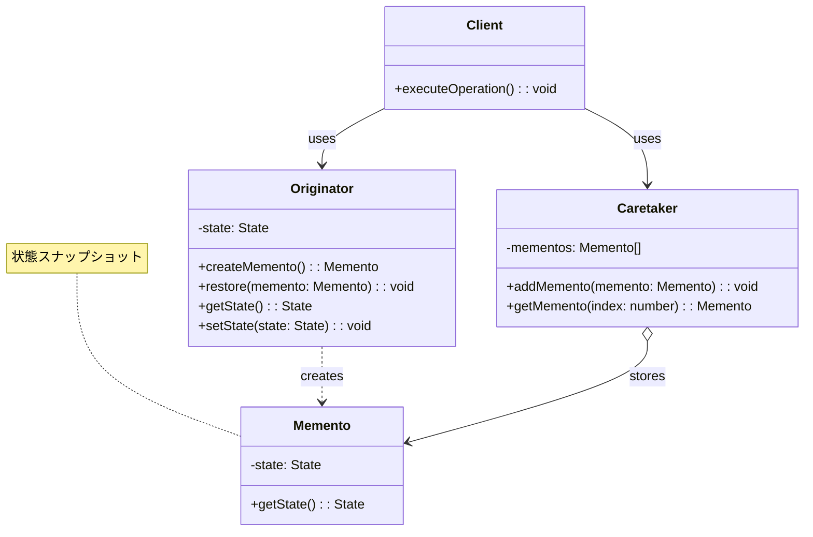
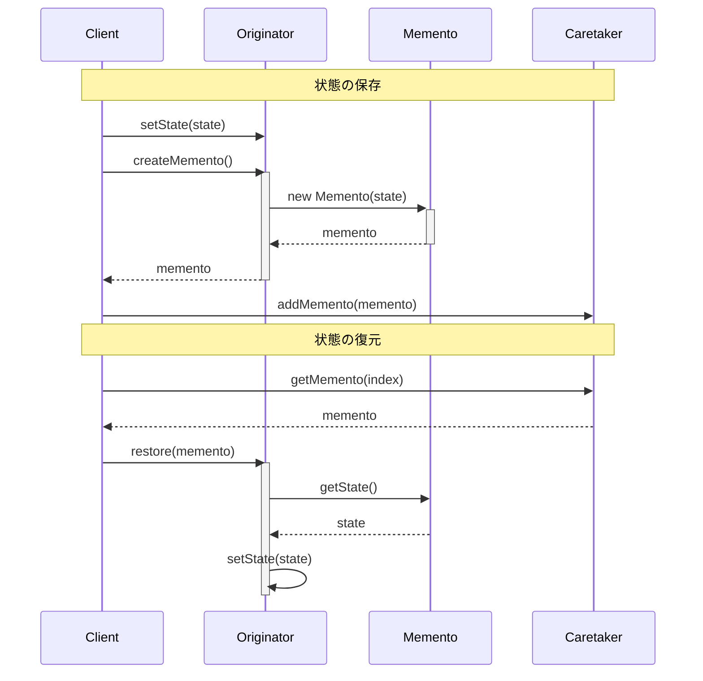
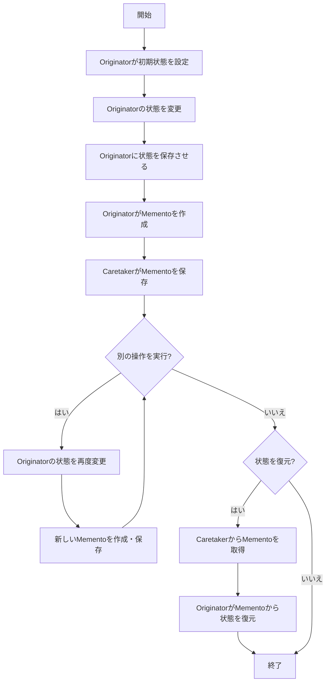

# Mementoパターン - オブジェクト状態のスナップショットと復元

## 1. パターン定義と目的

### 1.1 定義
Mementoパターンは、オブジェクトの内部状態をカプセル化した「スナップショット」を取得し、後でその状態に復元できるようにするための行動パターンです。このパターンにより、オブジェクトのカプセル化を破ることなく状態を保存・復元する仕組みを提供します。

### 1.2 解決する問題
- オブジェクトの内部状態を外部に公開せずに保存する必要がある
- 元に戻す操作（Undo）ややり直し（Redo）機能を実装したい
- チェックポイントやセーブポイントの機能が必要
- オブジェクトの状態の履歴を管理する必要がある
- 操作の失敗時に安全に元の状態に戻す必要がある

### 1.3 パターンの適用コンテキスト
- テキストエディタやグラフィックエディタなどの編集操作を取り消す機能
- ゲームの状態保存（セーブ）機能
- データ入力フォームの途中保存と復元
- トランザクション処理のロールバック機能
- 計算過程の途中状態の保存とバックトラッキング

## 2. クラス構造

### 2.1 クラス図


### 2.2 主要コンポーネント

| コンポーネント | 種類 | 責務 | 関連 |
|-------------|------|------|------|
| Originator | クラス | 状態を持ち、Mementoを作成・復元する | Mementoを作成する |
| Memento | クラス | Originatorの状態のスナップショットを保持 | Originatorにより作成される |
| Caretaker | クラス | Mementoオブジェクトを管理し、復元時に提供する | Mementoを保存する |
| Client | クラス | OriginatorとCaretakerを使用して操作を実行 | OriginatorとCaretakerを使用 |

### 2.3 相互作用
- Originatorは自身の状態を保存するためのMementoを作成する
- Mementoはカプセル化された状態情報を持ち、Originator以外からのアクセスを制限する
- Caretakerは複数のMementoを管理するが、その内容を検査・変更しない
- Clientは必要に応じてOriginatorに状態の保存と復元を指示する
- 復元時にCaretakerは指定されたMementoをOriginatorに提供する
- Originatorは提供されたMementoから自身の状態を復元する

## 3. 振る舞い

### 3.1 シーケンス図


### 3.2 プロセスフロー


### 3.3 重要なシナリオ

#### シナリオ1: テキストエディタのUndo/Redo機能
1. ユーザーがテキストエディタ（Originator）でテキストを入力
2. 入力操作ごとにエディタが状態のスナップショット（Memento）を作成
3. 履歴管理システム（Caretaker）がMementoをスタックに保存
4. ユーザーがUndo操作を実行
5. 履歴管理システムが直前のMementoを取得
6. エディタがMementoから状態を復元し、テキストが以前の状態に戻る
7. Redo操作を実行すると、取り消された操作が再適用される

#### シナリオ2: ゲームのセーブ/ロードシステム
1. プレイヤーがゲーム内で進行（キャラクター位置、スコア、インベントリなど）
2. プレイヤーがセーブを実行
3. ゲームエンジン（Originator）が現在の状態からMementoを作成
4. セーブシステム（Caretaker）がMementoをファイルに保存
5. 後日、プレイヤーがロードを実行
6. セーブシステムがファイルからMementoを読み込む
7. ゲームエンジンがMementoから状態を復元し、ゲームが保存時の状態に戻る

## 4. 実装詳細

### 4.1 主要クラス実装例

```typescript
/**
 * Originator: 状態を持ち、Mementoを作成・復元する
 * テキストエディタの例
 */
export class TextEditor {
    /**
     * エディタのテキスト内容
     */
    private content: string = '';
    
    /**
     * カーソル位置
     */
    private cursorPosition: number = 0;
    
    /**
     * 選択範囲の開始位置
     */
    private selectionStart: number = -1;
    
    /**
     * 選択範囲の終了位置
     */
    private selectionEnd: number = -1;
    
    /**
     * 現在のテキスト内容を取得
     * @returns エディタのテキスト内容
     */
    getContent(): string {
        return this.content;
    }
    
    /**
     * テキスト内容を設定
     * @param content 新しいテキスト内容
     */
    setContent(content: string): void {
        this.content = content;
    }
    
    /**
     * カーソル位置を設定
     * @param position 新しいカーソル位置
     */
    setCursor(position: number): void {
        this.cursorPosition = position;
    }
    
    /**
     * テキスト選択範囲を設定
     * @param start 選択開始位置
     * @param end 選択終了位置
     */
    setSelection(start: number, end: number): void {
        this.selectionStart = start;
        this.selectionEnd = end;
    }
    
    /**
     * 現在の状態のMementoを作成
     * @returns エディタ状態のスナップショット
     */
    createMemento(): EditorMemento {
        return new EditorMemento(
            this.content,
            this.cursorPosition,
            this.selectionStart,
            this.selectionEnd
        );
    }
    
    /**
     * Mementoから状態を復元
     * @param memento 復元元となるメメント
     */
    restore(memento: EditorMemento): void {
        this.content = memento.getContent();
        this.cursorPosition = memento.getCursorPosition();
        this.selectionStart = memento.getSelectionStart();
        this.selectionEnd = memento.getSelectionEnd();
    }
    
    /**
     * テキストを追加する操作
     * @param text 追加するテキスト
     */
    type(text: string): void {
        // 選択範囲がある場合、選択テキストを置換
        if (this.selectionStart >= 0) {
            this.content = 
                this.content.substring(0, this.selectionStart) +
                text +
                this.content.substring(this.selectionEnd);
            this.cursorPosition = this.selectionStart + text.length;
            this.selectionStart = -1;
            this.selectionEnd = -1;
        } else {
            // 選択範囲がない場合、カーソル位置に挿入
            this.content = 
                this.content.substring(0, this.cursorPosition) +
                text +
                this.content.substring(this.cursorPosition);
            this.cursorPosition += text.length;
        }
    }
    
    /**
     * 現在の状態を文字列で取得
     * @returns エディタの状態表現
     */
    toString(): string {
        return `Content: "${this.content}", Cursor: ${this.cursorPosition}, Selection: ${this.selectionStart}:${this.selectionEnd}`;
    }
}

/**
 * Memento: Originatorの状態のスナップショットを保持
 */
export class EditorMemento {
    /**
     * コンストラクタ
     * @param content エディタのテキスト内容
     * @param cursorPosition カーソル位置
     * @param selectionStart 選択開始位置
     * @param selectionEnd 選択終了位置
     */
    constructor(
        private readonly content: string,
        private readonly cursorPosition: number,
        private readonly selectionStart: number,
        private readonly selectionEnd: number
    ) {}
    
    /**
     * テキスト内容を取得（Originatorのみアクセス可能）
     * @returns エディタのテキスト内容
     */
    getContent(): string {
        return this.content;
    }
    
    /**
     * カーソル位置を取得（Originatorのみアクセス可能）
     * @returns カーソル位置
     */
    getCursorPosition(): number {
        return this.cursorPosition;
    }
    
    /**
     * 選択開始位置を取得（Originatorのみアクセス可能）
     * @returns 選択開始位置
     */
    getSelectionStart(): number {
        return this.selectionStart;
    }
    
    /**
     * 選択終了位置を取得（Originatorのみアクセス可能）
     * @returns 選択終了位置
     */
    getSelectionEnd(): number {
        return this.selectionEnd;
    }
}

/**
 * Caretaker: Mementoオブジェクトを管理
 * エディタの履歴管理
 */
export class EditorHistory {
    /**
     * 元に戻す操作用のスタック
     */
    private undoStack: EditorMemento[] = [];
    
    /**
     * やり直し操作用のスタック
     */
    private redoStack: EditorMemento[] = [];
    
    /**
     * 状態を保存
     * @param memento 保存する状態
     */
    push(memento: EditorMemento): void {
        this.undoStack.push(memento);
        this.redoStack = []; // Redoスタックをクリア
    }
    
    /**
     * 元に戻す操作
     * @returns 元に戻した状態、戻せない場合はnull
     */
    undo(): EditorMemento | null {
        if (!this.canUndo()) {
            return null;
        }
        
        const currentMemento = this.undoStack.pop()!;
        this.redoStack.push(currentMemento);
        
        return this.undoStack[this.undoStack.length - 1] || null;
    }
    
    /**
     * やり直し操作
     * @returns やり直した状態、できない場合はnull
     */
    redo(): EditorMemento | null {
        const memento = this.redoStack.pop();
        if (memento) {
            this.undoStack.push(memento);
            return memento;
        }
        return null;
    }
    
    /**
     * 元に戻せるかどうか
     * @returns 元に戻す操作が可能ならtrue
     */
    canUndo(): boolean {
        return this.undoStack.length > 1;
    }
    
    /**
     * やり直しできるかどうか
     * @returns やり直し操作が可能ならtrue
     */
    canRedo(): boolean {
        return this.redoStack.length > 0;
    }
    
    /**
     * 履歴内容を取得
     * @returns 履歴内容の文字列表現
     */
    getHistory(): string {
        return `Undo stack: ${this.undoStack.length}, Redo stack: ${this.redoStack.length}`;
    }
}
```

### 4.2 実装のバリエーション

1. **状態のスナップショットをシリアル化する方式**
   - オブジェクトの状態を文字列やバイナリデータとして保存
   - ディスクへの永続化が容易
   - JSONやXMLなどの標準フォーマットを利用可能

2. **部分的な状態保存**
   - 変更された部分のみを保存し、メモリ使用量を削減
   - 差分方式で状態を記録する
   - 大きなオブジェクトや頻繁に変更される状態に有効

3. **イミュータブルスナップショット**
   - Mementoを不変（イミュータブル）オブジェクトとして実装
   - スレッドセーフであり、状態が誤って変更されることを防止
   - 関数型プログラミングスタイルと親和性が高い

4. **コマンドパターンとの組み合わせ**
   - コマンドパターンと連携して元に戻す操作を実装
   - 各コマンドがその操作前の状態のMementoを作成
   - きめ細かな操作の取り消しと再実行が可能

### 4.3 注意すべき実装ポイント

- Mementoの内容へのアクセスはOriginatorのみに限定すべき
- 大きな状態を持つオブジェクトの場合、メモリ消費を考慮してスナップショット戦略を検討する
- 復元後の状態の一貫性と整合性を確保するためのバリデーションを検討する
- スレッド安全性を考慮し、並行アクセスからMementoを保護する
- 保存する状態の粒度（操作ごと、特定のチェックポイントのみなど）を適切に決定する
- 長期実行アプリケーションでは、Mementoの数を制限するメカニズムを検討する

## 5. 使用例

### 5.1 基本的な使用例

```typescript
// テキストエディタとその履歴の使用例
const editor = new TextEditor();
const history = new EditorHistory();

// 初期状態を保存
history.push(editor.createMemento());

// テキスト編集操作
editor.type("Hello");
console.log(editor.toString()); // "Content: "Hello", Cursor: 5, Selection: -1:-1"

// 状態を保存
history.push(editor.createMemento());

// さらに編集
editor.type(" World");
console.log(editor.toString()); // "Content: "Hello World", Cursor: 11, Selection: -1:-1"

// 状態を保存
history.push(editor.createMemento());

// 元に戻す操作
const previousState = history.undo();
if (previousState) {
    editor.restore(previousState);
    console.log("Undo: " + editor.toString()); // "Content: "Hello", Cursor: 5, Selection: -1:-1"
}

// やり直し操作
const redoState = history.redo();
if (redoState) {
    editor.restore(redoState);
    console.log("Redo: " + editor.toString()); // "Content: "Hello World", Cursor: 11, Selection: -1:-1"
}
```

### 5.2 高度な使用例

```typescript
/**
 * 拡張されたテキストエディタ
 * 履歴管理を内蔵
 */
class EnhancedTextEditor extends TextEditor {
    private history: EditorHistory = new EditorHistory();
    private autoSave: boolean = true;
    
    /**
     * テキストを追加し、必要に応じて状態を保存
     * @param text 追加するテキスト
     */
    override type(text: string): void {
        if (this.autoSave) {
            this.saveState();
        }
        super.type(text);
    }
    
    /**
     * 現在の状態を保存
     */
    saveState(): void {
        this.history.push(this.createMemento());
    }
    
    /**
     * 元に戻す操作
     * @returns 成功したかどうか
     */
    undo(): boolean {
        const memento = this.history.undo();
        if (memento) {
            this.restore(memento);
            return true;
        }
        return false;
    }
    
    /**
     * やり直し操作
     * @returns 成功したかどうか
     */
    redo(): boolean {
        const memento = this.history.redo();
        if (memento) {
            this.restore(memento);
            return true;
        }
        return false;
    }
    
    /**
     * 自動保存の有効/無効を切り替え
     * @param enable 有効にする場合はtrue
     */
    setAutoSave(enable: boolean): void {
        this.autoSave = enable;
    }
    
    /**
     * 複数の操作をグループ化して実行
     * @param operations 実行する関数
     */
    batch(operations: () => void): void {
        this.setAutoSave(false);
        this.saveState(); // 操作前の状態を保存
        
        try {
            operations();
        } finally {
            this.setAutoSave(true);
            this.saveState(); // 一連の操作後の状態を保存
        }
    }
    
    /**
     * 履歴情報を取得
     * @returns 履歴の文字列表現
     */
    getHistoryInfo(): string {
        return this.history.getHistory();
    }
}

// 拡張エディタの使用例
const editor = new EnhancedTextEditor();

// 単一操作
editor.type("Hello");
console.log(editor.getContent()); // "Hello"

// バッチ操作（複数の編集をグループ化）
editor.batch(() => {
    editor.type(" ");
    editor.type("World");
    editor.type("!");
});
console.log(editor.getContent()); // "Hello World!"

// 履歴操作
editor.undo();
console.log(editor.getContent()); // "Hello"

editor.redo();
console.log(editor.getContent()); // "Hello World!"

console.log(editor.getHistoryInfo()); // "Undo stack: 2, Redo stack: 0"
```

## 6. テスト戦略

### 6.1 ユニットテスト要件
- Originatorが正しく状態を保存・復元できることを検証
- Mementoが状態を正確に保持していることを確認
- Caretakerが複数のMementoを適切に管理できることを検証
- 元に戻す操作とやり直し操作が期待通りに動作することを確認
- 状態復元後のオブジェクトの整合性を検証する

### 6.2 テスト実装例

```typescript
describe('Memento Pattern Tests', () => {
    describe('TextEditor', () => {
        let editor: TextEditor;
        
        beforeEach(() => {
            editor = new TextEditor();
        });
        
        test('should create memento with current state', () => {
            editor.setContent('Test Content');
            editor.setCursor(5);
            editor.setSelection(2, 4);
            
            const memento = editor.createMemento();
            
            expect(memento.getContent()).toBe('Test Content');
            expect(memento.getCursorPosition()).toBe(5);
            expect(memento.getSelectionStart()).toBe(2);
            expect(memento.getSelectionEnd()).toBe(4);
        });
        
        test('should restore state from memento', () => {
            const memento = new EditorMemento('Restored Content', 3, 1, 2);
            editor.restore(memento);
            
            expect(editor.getContent()).toBe('Restored Content');
            expect(editor.toString()).toContain('Cursor: 3');
            expect(editor.toString()).toContain('Selection: 1:2');
        });
        
        test('should type text correctly', () => {
            editor.type('Hello');
            expect(editor.getContent()).toBe('Hello');
            expect(editor.toString()).toContain('Cursor: 5');
            
            editor.setSelection(0, 5);
            editor.type('World');
            expect(editor.getContent()).toBe('World');
        });
    });
    
    describe('EditorHistory', () => {
        let editor: TextEditor;
        let history: EditorHistory;
        
        beforeEach(() => {
            editor = new TextEditor();
            history = new EditorHistory();
            
            // 初期状態を保存
            history.push(editor.createMemento());
        });
        
        test('should track changes and allow undo', () => {
            editor.type('First');
            history.push(editor.createMemento());
            
            editor.type(' Second');
            history.push(editor.createMemento());
            
            expect(editor.getContent()).toBe('First Second');
            
            const previousState = history.undo();
            editor.restore(previousState!);
            expect(editor.getContent()).toBe('First');
        });
        
        test('should allow redo after undo', () => {
            editor.type('Step 1');
            history.push(editor.createMemento());
            
            editor.type(' Step 2');
            history.push(editor.createMemento());
            
            // Undo to Step 1
            let previousState = history.undo();
            editor.restore(previousState!);
            expect(editor.getContent()).toBe('Step 1');
            
            // Redo to Step 2
            const redoState = history.redo();
            editor.restore(redoState!);
            expect(editor.getContent()).toBe('Step 1 Step 2');
        });
        
        test('should clear redo stack when new state is pushed', () => {
            editor.type('A');
            history.push(editor.createMemento());
            
            editor.type('B');
            history.push(editor.createMemento());
            
            // Undo
            history.undo();
            expect(history.canRedo()).toBe(true);
            
            // New change
            editor.type('C');
            history.push(editor.createMemento());
            
            // Redo should be cleared
            expect(history.canRedo()).toBe(false);
        });
        
        test('should handle undo limit properly', () => {
            expect(history.canUndo()).toBe(false); // Initial state, nothing to undo
            
            editor.type('Text');
            history.push(editor.createMemento());
            expect(history.canUndo()).toBe(true); // Now we can undo
            
            history.undo();
            expect(history.canUndo()).toBe(false); // Back to initial state
        });
    });
    
    describe('EnhancedTextEditor', () => {
        let editor: EnhancedTextEditor;
        
        beforeEach(() => {
            editor = new EnhancedTextEditor();
        });
        
        test('should automatically save state when typing', () => {
            editor.type('Hello');
            expect(editor.getContent()).toBe('Hello');
            
            editor.type(' World');
            expect(editor.getContent()).toBe('Hello World');
            
            // Undo should work
            editor.undo();
            expect(editor.getContent()).toBe('Hello');
        });
        
        test('should batch operations correctly', () => {
            editor.batch(() => {
                editor.type('One');
                editor.type(' Two');
                editor.type(' Three');
            });
            
            expect(editor.getContent()).toBe('One Two Three');
            
            // Only one undo needed to remove all batched operations
            editor.undo();
            expect(editor.getContent()).toBe('');
        });
    });
});
```

## 7. 評価

### 7.1 メリット
- カプセル化を破ることなくオブジェクトの状態を保存・復元できる
- オブジェクトの内部実装の詳細を外部に漏らさずに状態管理が可能
- 責任の分離が明確（Originator、Memento、Caretaker）
- 取り消し機能（Undo/Redo）の実装が容易になる
- オブジェクトの状態履歴を管理できる

### 7.2 デメリット・制約
- 状態のサイズが大きい場合、メモリ消費が増大する可能性がある
- 頻繁に状態を保存すると、パフォーマンスに影響する場合がある
- Originatorの内部構造が変更されると、Mementoの実装も変更が必要
- 大量のMementoの管理が複雑になる場合がある
- 循環参照が発生すると、メモリリークの原因となる可能性がある

### 7.3 代替パターン・関連パターン
- **Command パターン**: 操作自体を記録することで、元に戻す機能を提供する別のアプローチ
- **Prototype パターン**: オブジェクトのコピーを作成することで、状態の複製を可能にする
- **State パターン**: オブジェクトの状態を別クラスに分離するが、以前の状態への復元ではなく状態遷移に焦点
- **Builder パターン**: Mementoの作成に使用されることがある
- **Composite パターン**: 複合オブジェクトの状態を階層的に保存する場合に組み合わせて使用される

## 8. 参考資料

### 8.1 内部リンク
- [ソースコード](../../src/behavioral/memento)
- [テストコード](../../tests/behavioral/memento)

### 8.2 外部リンク
- [リファクタリング・グル - Mementoパターン](https://refactoring.guru/ja/design-patterns/memento)
- [Design Patterns: Elements of Reusable Object-Oriented Software](https://www.amazon.co.jp/Design-Patterns-Elements-Reusable-Object-Oriented/dp/0201633612)
