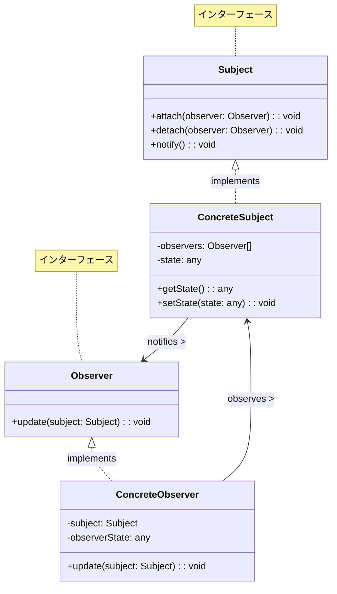
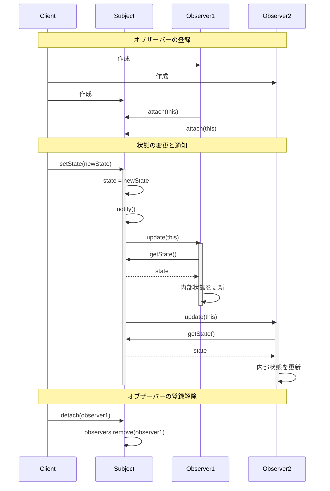
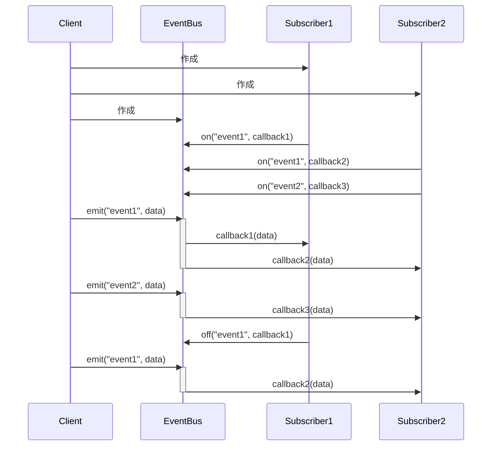
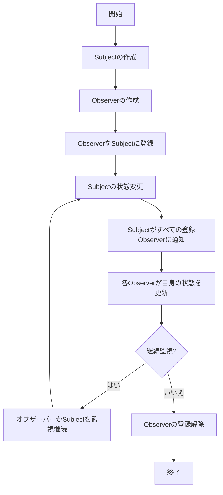

# Observerパターン - オブジェクト状態変更通知実装

## 1. 概要

### 1.1 パターンの定義
Observerパターンは、オブジェクト間の1対多の依存関係を定義し、あるオブジェクト（Subject）の状態が変化した時に、それに依存するすべてのオブジェクト（Observer）に自動的に通知し更新を行うためのデザインパターンです。このパターンは「発行-購読モデル」とも呼ばれます。

### 1.2 目的・解決する問題
- オブジェクト間の疎結合な通知メカニズムの実現
- 状態変更の自動的な伝播と同期
- イベント駆動型のシステム設計
- 分散システムでのイベント通知
- コンポーネント間の依存性の低減
- 動的なオブジェクト間関係の構築
- UI更新の効率化
- プッシュベースの情報配信

### 1.3 コンテキスト・適用場面
- GUIアプリケーションでの表示更新
- イベント処理システム
- メッセージング・通知システム
- リアルタイムデータ監視
- MVC/MVVMアーキテクチャのモデル-ビュー間通信
- 分散システムでのデータ同期
- サブスクリプションベースのサービス
- ロギングや監査システム

## 2. クラス構造

### 2.1 クラス図


### 2.2 主要コンポーネント

| コンポーネント | 種類 | 責務 | 関連 |
|-------------|------|------|------|
| Subject | インターフェース | オブザーバーの登録・削除・通知を行うインターフェースを定義 | Observer の参照を保持 |
| ConcreteSubject | クラス | Subjectを実装し、状態を保持、変更時にオブザーバーに通知 | Subject を実装、Observer を通知 |
| Observer | インターフェース | 通知を受け取るためのインターフェースを定義 | Subject から通知を受け取る |
| ConcreteObserver | クラス | Observerを実装し、Subjectの変更に対する具体的な処理を実装 | Observer を実装、Subject を監視 |

### 2.3 相互作用
- Subjectは複数のObserverへの参照を保持し、状態変更時にそれらに通知する
- Observerは通知を受け取り、必要に応じてSubjectの状態を取得して自身を更新する
- ObserverはSubjectに明示的に登録（購読）する必要がある
- Subjectは通知時に自身の参照を渡すことが多く、複数のSubjectを監視するObserverはどのSubjectからの通知かを識別できる
- 通知は一方向であり、Subjectはオブザーバーの具体的な実装に依存しない（疎結合）
- ObserverはSubjectから登録解除（購読解除）することで通知を受け取らなくすることができる

## 3. シーケンス

### 3.1 基本フロー


### 3.2 イベント処理フロー


### 3.3 プロセスフロー


### 3.4 重要なシナリオ

#### シナリオ1: ニュース配信システム
1. ニュースエージェンシー（Subject）が作成される
2. 複数のニュースチャンネル（Observer）が作成される
3. 各チャンネルがニュースエージェンシーに購読登録する
4. ニュースエージェンシーが新しいニュース記事を受信する
5. ニュースエージェンシーが登録されたすべてのチャンネルに記事を通知する
6. 各チャンネルが記事を受け取り、視聴者に表示する

#### シナリオ2: UIコンポーネントの同期
1. データモデル（Subject）が作成される
2. 複数のUIコンポーネント（Observer）が作成される
3. 各UIコンポーネントがデータモデルに登録する
4. ユーザーがUIを操作し、データモデルが更新される
5. データモデルが変更を検出し、登録されたすべてのUIコンポーネントに通知する
6. 各UIコンポーネントがデータモデルから最新の状態を取得し、表示を更新する

## 4. 実装詳細

### 4.1 主要インターフェース・クラス

```typescript
/**
 * Subject（主体）インターフェース
 * オブザーバーの管理と通知を行う
 */
interface Subject<T> {
    /**
     * オブザーバーを登録する
     * @param observer 登録するオブザーバー
     */
    attach(observer: Observer<T>): void;
    
    /**
     * オブザーバーの登録を解除する
     * @param observer 登録解除するオブザーバー
     */
    detach(observer: Observer<T>): void;
    
    /**
     * 登録されているすべてのオブザーバーに通知する
     */
    notify(): void;
}

/**
 * Observer（観察者）インターフェース
 * 通知を受け取り、処理する
 */
interface Observer<T> {
    /**
     * 状態が更新された時に呼び出される
     * @param state 更新された状態
     */
    update(state: T): void;
}

/**
 * 具体的なSubject実装
 * 状態を保持し、変更時にオブザーバーに通知する
 */
class ConcreteSubject<T> implements Subject<T> {
    /**
     * 登録されたオブザーバーのコレクション
     */
    private observers: Set<Observer<T>> = new Set();
    
    /**
     * 現在の状態
     */
    private state: T;
    
    /**
     * 状態を取得する
     * @returns 現在の状態
     */
    getState(): T {
        return this.state;
    }
    
    /**
     * 状態を設定し、オブザーバーに通知する
     * @param state 新しい状態
     */
    setState(state: T): void {
        this.state = state;
        this.notify();
    }
    
    /**
     * オブザーバーを登録する
     * @param observer 登録するオブザーバー
     */
    attach(observer: Observer<T>): void {
        this.observers.add(observer);
        console.log('Observer added');
    }
    
    /**
     * オブザーバーの登録を解除する
     * @param observer 登録解除するオブザーバー
     */
    detach(observer: Observer<T>): void {
        this.observers.delete(observer);
        console.log('Observer removed');
    }
    
    /**
     * 登録されているすべてのオブザーバーに通知する
     */
    notify(): void {
        console.log('Notifying observers...');
        this.observers.forEach(observer => {
            observer.update(this.state);
        });
    }
}

/**
 * 具体的なObserver実装
 * 通知を受け取り、特定の処理を行う
 */
class ConcreteObserver<T> implements Observer<T> {
    /**
     * オブザーバーの名前（識別用）
     */
    private name: string;
    
    /**
     * コンストラクタ
     * @param name オブザーバーの名前
     */
    constructor(name: string) {
        this.name = name;
    }
    
    /**
     * 状態が更新された時に呼び出される
     * @param state 更新された状態
     */
    update(state: T): void {
        console.log(`${this.name} received update with state:`, state);
        // 状態に応じた具体的な処理を実装
    }
}
```

### 4.2 イベントエミッターの実装

```typescript
/**
 * イベントエミッターインターフェース
 * イベントベースのオブザーバーパターン実装
 */
interface EventEmitter {
    /**
     * イベントリスナーを登録する
     * @param event イベント名
     * @param listener コールバック関数
     */
    on(event: string, listener: Function): void;
    
    /**
     * イベントリスナーを解除する
     * @param event イベント名
     * @param listener 解除するコールバック関数
     */
    off(event: string, listener: Function): void;
    
    /**
     * イベントを発行する
     * @param event イベント名
     * @param data イベントデータ
     */
    emit(event: string, data?: any): void;
}

/**
 * イベントバスクラス
 * 複数のイベントとリスナーを管理する
 */
class EventBus implements EventEmitter {
    /**
     * イベントとリスナーのマップ
     */
    private eventMap: Map<string, Set<Function>> = new Map();
    
    /**
     * イベントリスナーを登録する
     * @param event イベント名
     * @param callback コールバック関数
     */
    on(event: string, callback: Function): void {
        if (!this.eventMap.has(event)) {
            this.eventMap.set(event, new Set());
        }
        this.eventMap.get(event)!.add(callback);
        console.log(`Listener added for event: ${event}`);
    }
    
    /**
     * イベントリスナーを解除する
     * @param event イベント名
     * @param callback 解除するコールバック関数
     */
    off(event: string, callback: Function): void {
        if (this.eventMap.has(event)) {
            this.eventMap.get(event)!.delete(callback);
            console.log(`Listener removed for event: ${event}`);
        }
    }
    
    /**
     * イベントを発行する
     * @param event イベント名
     * @param data イベントデータ
     */
    emit(event: string, data?: any): void {
        console.log(`Emitting event: ${event}`);
        if (this.eventMap.has(event)) {
            this.eventMap.get(event)!.forEach(callback => {
                try {
                    callback(data);
                } catch (error) {
                    console.error(`Error in event listener for ${event}:`, error);
                }
            });
        }
    }
    
    /**
     * 特定のイベントのリスナー数を取得する
     * @param event イベント名
     * @returns リスナー数
     */
    listenerCount(event: string): number {
        return this.eventMap.has(event) ? this.eventMap.get(event)!.size : 0;
    }
    
    /**
     * すべてのリスナーを解除する
     * @param event 特定のイベント名（省略時はすべてのイベント）
     */
    removeAllListeners(event?: string): void {
        if (event) {
            this.eventMap.delete(event);
        } else {
            this.eventMap.clear();
        }
    }
}
```

### 4.3 実装のバリエーション

1. **プッシュモデル vs プルモデル**
   - プッシュモデル: Subject が通知時に状態データを Observer に直接送信
   - プルモデル: Subject が通知時に自身の参照のみを送り、Observer が必要に応じて状態を取得

2. **変更検知メカニズム**
   - 手動通知: `setState` 時に明示的に `notify` を呼び出す
   - 自動通知: プロパティのセッター内で自動的に通知
   - プロキシベース: JavaScript の Proxy を使用して変更を検知

3. **イベントフィルタリング**
   - 特定の条件を満たす変更のみを通知
   - 各 Observer がイベントフィルターを提供

4. **優先度付きオブザーバー**
   - Observer に優先度を設定し、通知順序を制御
   - 重要度に基づいて通知をフィルタリング

### 4.4 注意すべき実装ポイント

- 循環参照の防止（A が B を監視し、B が A を監視するような状況）
- 死んだ参照（弱参照の使用やリスナー解除の徹底）
- 非同期通知と同期通知の選択と影響
- 通知の頻度と負荷（バッチ処理や防弾の考慮）
- 例外処理（一つのオブザーバーの例外が他に影響しないようにする）
- メモリリークの防止（特にイベントリスナー）
- コールバック関数内の `this` コンテキスト

## 5. 使用例

### 5.1 ニュース配信システム

```typescript
/**
 * ニュース記事の型定義
 */
interface NewsArticle {
    id: string;
    title: string;
    content: string;
    category: string;
    timestamp: Date;
}

/**
 * ニュースエージェンシー（Subject）
 */
class NewsAgency extends ConcreteSubject<NewsArticle> {
    /**
     * ニュースを発行する
     * @param article 発行するニュース記事
     */
    publishNews(article: NewsArticle): void {
        console.log(`Publishing news: ${article.title} [${article.category}]`);
        this.setState(article);
    }
}

/**
 * ニュースチャンネル（Observer）
 */
class NewsChannel implements Observer<NewsArticle> {
    /**
     * チャンネル名
     */
    private name: string;
    
    /**
     * 購読カテゴリ（フィルタリング用）
     */
    private categories: Set<string>;
    
    /**
     * コンストラクタ
     * @param name チャンネル名
     * @param categories 購読するカテゴリ
     */
    constructor(name: string, categories: string[] = []) {
        this.name = name;
        this.categories = new Set(categories);
    }
    
    /**
     * ニュース記事の更新を受け取る
     * @param article 更新されたニュース記事
     */
    update(article: NewsArticle): void {
        // カテゴリフィルタリングがある場合は適用
        if (this.categories.size === 0 || this.categories.has(article.category)) {
            console.log(`${this.name} broadcasting: ${article.title}`);
            // 実際の放送処理...
        }
    }
}

/**
 * ニュースウェブサイト（Observer）
 */
class NewsWebsite implements Observer<NewsArticle> {
    /**
     * ウェブサイト名
     */
    private name: string;
    
    /**
     * 最新記事リスト
     */
    private latestArticles: NewsArticle[] = [];
    
    /**
     * コンストラクタ
     * @param name ウェブサイト名
     */
    constructor(name: string) {
        this.name = name;
    }
    
    /**
     * ニュース記事の更新を受け取る
     * @param article 更新されたニュース記事
     */
    update(article: NewsArticle): void {
        console.log(`${this.name} received: ${article.title}`);
        this.latestArticles.unshift(article);
        this.latestArticles = this.latestArticles.slice(0, 10); // 最新10件のみ保持
        this.updateWebsite();
    }
    
    /**
     * ウェブサイトを更新する
     */
    private updateWebsite(): void {
        console.log(`${this.name} updated with latest news`);
        // 実際のウェブサイト更新処理...
    }
}
```

### 5.2 UIデータバインディング

```typescript
/**
 * データモデル（Subject）
 */
class UserModel extends ConcreteSubject<{name: string, email: string, age: number}> {
    constructor() {
        super();
        this.setState({
            name: '',
            email: '',
            age: 0
        });
    }
    
    setName(name: string): void {
        const currentState = this.getState();
        this.setState({...currentState, name});
    }
    
    setEmail(email: string): void {
        const currentState = this.getState();
        this.setState({...currentState, email});
    }
    
    setAge(age: number): void {
        const currentState = this.getState();
        this.setState({...currentState, age});
    }
}

/**
 * UI要素（Observer）
 */
class UserFormView implements Observer<{name: string, email: string, age: number}> {
    private nameElement: HTMLInputElement;
    private emailElement: HTMLInputElement;
    private ageElement: HTMLInputElement;
    private model: UserModel;
    
    constructor(model: UserModel) {
        this.model = model;
        
        // DOM要素の作成（実際のアプリではすでに存在する要素を取得）
        this.nameElement = document.createElement('input');
        this.emailElement = document.createElement('input');
        this.ageElement = document.createElement('input');
        
        // イベントリスナーの設定
        this.nameElement.addEventListener('input', () => {
            this.model.setName(this.nameElement.value);
        });
        
        this.emailElement.addEventListener('input', () => {
            this.model.setEmail(this.emailElement.value);
        });
        
        this.ageElement.addEventListener('input', () => {
            this.model.setAge(parseInt(this.ageElement.value) || 0);
        });
        
        // モデルに登録
        model.attach(this);
    }
    
    update(data: {name: string, email: string, age: number}): void {
        // UIを更新（モデルからの変更）
        this.nameElement.value = data.name;
        this.emailElement.value = data.email;
        this.ageElement.value = data.age.toString();
    }
    
    render(): void {
        // DOMに要素を追加する処理
        const container = document.createElement('div');
        container.appendChild(this.createField('Name:', this.nameElement));
        container.appendChild(this.createField('Email:', this.emailElement));
        container.appendChild(this.createField('Age:', this.ageElement));
        document.body.appendChild(container);
    }
    
    private createField(label: string, input: HTMLInputElement): HTMLDivElement {
        const div = document.createElement('div');
        const labelElement = document.createElement('label');
        labelElement.textContent = label;
        div.appendChild(labelElement);
        div.appendChild(input);
        return div;
    }
}

/**
 * ユーザープレビュー（Observer）
 */
class UserPreview implements Observer<{name: string, email: string, age: number}> {
    private element: HTMLDivElement;
    
    constructor() {
        this.element = document.createElement('div');
        document.body.appendChild(this.element);
    }
    
    update(data: {name: string, email: string, age: number}): void {
        this.element.innerHTML = `
            <h2>User Preview</h2>
            <p><strong>Name:</strong> ${data.name}</p>
            <p><strong>Email:</strong> ${data.email}</p>
            <p><strong>Age:</strong> ${data.age}</p>
        `;
    }
}
```

## 6. テスト戦略

### 6.1 ユニットテスト要件
- 主体（Subject）のオブザーバー管理機能のテスト
- 変更通知メカニズムのテスト
- オブザーバーの登録と解除のテスト
- 複数オブザーバーへの通知順序テスト
- エッジケース（0オブザーバー、通知中のオブザーバー追加/削除など）

### 6.2 テスト実装例

```typescript
describe('Observer Pattern Tests', () => {
    describe('ConcreteSubject', () => {
        let subject: ConcreteSubject<string>;
    
    beforeEach(() => {
            subject = new ConcreteSubject<string>();
    });
    
        test('should notify observers when state changes', () => {
        // モックオブザーバーの作成
            const observer1 = { update: jest.fn() };
            const observer2 = { update: jest.fn() };
            
            // オブザーバーの登録
            subject.attach(observer1);
            subject.attach(observer2);
            
            // 状態変更
            subject.setState('new state');
            
            // 検証
            expect(observer1.update).toHaveBeenCalledWith('new state');
            expect(observer2.update).toHaveBeenCalledWith('new state');
        });
        
        test('should not notify detached observers', () => {
            const observer = { update: jest.fn() };
            
            subject.attach(observer);
            subject.detach(observer);
            
            subject.setState('new state');
            
            expect(observer.update).not.toHaveBeenCalled();
        });
        
        test('should handle attaching the same observer multiple times', () => {
            const observer = { update: jest.fn() };
            
            subject.attach(observer);
            subject.attach(observer); // 重複登録
            
            subject.setState('new state');
            
            // Set を使用しているので、通知は1回だけ
            expect(observer.update).toHaveBeenCalledTimes(1);
        });
        
        test('should handle detaching an observer that is not attached', () => {
            const observer = { update: jest.fn() };
            
            // 未登録のオブザーバーを削除
            subject.detach(observer);
            
            // エラーが発生しないことを確認
            expect(() => subject.detach(observer)).not.toThrow();
        });
    });
    
    describe('EventBus', () => {
        let eventBus: EventBus;
        
        beforeEach(() => {
            eventBus = new EventBus();
        });
        
        test('should notify listeners when event is emitted', () => {
            const listener1 = jest.fn();
            const listener2 = jest.fn();
            
            eventBus.on('event1', listener1);
            eventBus.on('event1', listener2);
            eventBus.on('event2', listener2);
            
            eventBus.emit('event1', 'data1');
            
            expect(listener1).toHaveBeenCalledWith('data1');
            expect(listener2).toHaveBeenCalledWith('data1');
            
            eventBus.emit('event2', 'data2');
            
            expect(listener1).not.toHaveBeenCalledWith('data2');
            expect(listener2).toHaveBeenCalledWith('data2');
        });
        
        test('should remove listener when off is called', () => {
            const listener = jest.fn();
            
            eventBus.on('event1', listener);
            eventBus.off('event1', listener);
            
            eventBus.emit('event1', 'data');
            
            expect(listener).not.toHaveBeenCalled();
        });
        
        test('should handle errors in listeners', () => {
            const errorListener = jest.fn().mockImplementation(() => {
                throw new Error('Listener error');
            });
            const normalListener = jest.fn();
            
            // コンソールエラーをモック
            const originalConsoleError = console.error;
            console.error = jest.fn();
            
            eventBus.on('event', errorListener);
            eventBus.on('event', normalListener);
            
            // エラーが発生しても処理は続行
            eventBus.emit('event', 'data');
            
            expect(errorListener).toHaveBeenCalled();
            expect(normalListener).toHaveBeenCalled();
            expect(console.error).toHaveBeenCalled();
            
            // 元に戻す
            console.error = originalConsoleError;
        });
        
        test('should return correct listener count', () => {
            const listener1 = jest.fn();
            const listener2 = jest.fn();
            
            expect(eventBus.listenerCount('event')).toBe(0);
            
            eventBus.on('event', listener1);
            expect(eventBus.listenerCount('event')).toBe(1);
            
            eventBus.on('event', listener2);
            expect(eventBus.listenerCount('event')).toBe(2);
            
            eventBus.off('event', listener1);
            expect(eventBus.listenerCount('event')).toBe(1);
        });
        
        test('should remove all listeners when removeAllListeners is called', () => {
            const listener1 = jest.fn();
            const listener2 = jest.fn();
            
            eventBus.on('event1', listener1);
            eventBus.on('event2', listener2);
            
            eventBus.removeAllListeners('event1');
            
            eventBus.emit('event1', 'data1');
            eventBus.emit('event2', 'data2');
            
            expect(listener1).not.toHaveBeenCalled();
            expect(listener2).toHaveBeenCalled();
            
            eventBus.removeAllListeners();
            
            eventBus.emit('event2', 'data3');
            
            expect(listener2).toHaveBeenCalledTimes(1); // 前回の呼び出しのみ
        });
    });
    
    describe('NewsAgency Integration', () => {
        let newsAgency: NewsAgency;
        let sportsChannel: NewsChannel;
        let newsWebsite: NewsWebsite;
        
        beforeEach(() => {
            newsAgency = new NewsAgency();
            sportsChannel = new NewsChannel('Sports Channel', ['sports']);
            newsWebsite = new NewsWebsite('News Portal');
            
            // スパイを設定
            jest.spyOn(sportsChannel, 'update');
            jest.spyOn(newsWebsite, 'update');
            
            newsAgency.attach(sportsChannel);
            newsAgency.attach(newsWebsite);
        });
        
        test('should deliver news to all observers', () => {
            const article: NewsArticle = {
            id: '1',
            title: 'Breaking News',
            content: 'Important content',
                category: 'politics',
            timestamp: new Date()
        };
        
        newsAgency.publishNews(article);
        
            // カテゴリフィルタリングのあるチャンネルは更新されるが表示しない
            expect(sportsChannel.update).toHaveBeenCalledWith(article);
            expect(newsWebsite.update).toHaveBeenCalledWith(article);
        });
        
        test('should deliver sports news to sports channel', () => {
            const article: NewsArticle = {
                id: '2',
                title: 'Sports Event',
                content: 'Sports content',
                category: 'sports',
                timestamp: new Date()
            };
            
            // コンソールログをモック
            const consoleSpy = jest.spyOn(console, 'log');
            
            newsAgency.publishNews(article);
            
            expect(sportsChannel.update).toHaveBeenCalledWith(article);
            expect(consoleSpy).toHaveBeenCalledWith(expect.stringContaining('Sports Channel broadcasting'));
        });
    });
});
```

## 7. 評価

### 7.1 メリット
- 疎結合な設計: Subjectの実装とObserverの実装が独立して変更可能
- オープン・クローズドの原則: 既存のコードを変更せずに新しいObserverを追加可能
- 動的な関係: 実行時にSubjectとObserverの関係を確立・変更可能
- 再利用性: 同じObserverを異なるSubjectで使用可能
- イベント処理: 非同期イベント処理に適している
- 一方向のデータフロー: 状態変更の伝播方向が明確
- 分散更新: 関連するすべてのコンポーネントに自動的に更新を伝播

### 7.2 デメリット・制約
- 予測不能な更新: オブザーバーへの通知順序が定義されていない場合がある
- メモリリーク: オブザーバーの登録解除が適切に行われないとリソースが解放されない
- デバッグの難しさ: 非同期通知の場合、デバッグが複雑になる
- パフォーマンス: 多数のオブザーバーがある場合、通知処理がボトルネックになる可能性
- 循環参照: 相互に監視する場合、無限ループのリスク
- オーバーヘッド: 単純な状況では過剰な設計になる可能性

### 7.3 代替パターン・関連パターン
- **Mediator（メディエーター）パターン**: 多対多の通信を一元管理。複雑な通知ロジックがある場合に適している
- **Publish-Subscribe（発行-購読）パターン**: Observerの拡張。イベントチャネルを介して通信するため、さらに疎結合
- **Command（コマンド）パターン**: 状態変更操作をカプセル化。undo/redoなどの機能が必要な場合に組み合わせる
- **MVC/MVVM アーキテクチャ**: モデルの変更をビューに通知するためにObserverパターンを使用
- **Reactive Programming**: オブザーブルストリームとオペレータを使用した宣言的アプローチ

## 8. 参考資料

### 8.1 内部リンク
- [ソースコード](../../src/behavioral/observer)
- [テストコード](../../tests/behavioral/observer)

### 8.2 外部リンク
- [リファクタリング・グル - Observer パターン](https://refactoring.guru/ja/design-patterns/observer)
- [Design Patterns: Elements of Reusable Object-Oriented Software](https://www.amazon.co.jp/Design-Patterns-Elements-Reusable-Object-Oriented/dp/0201633612)
- [ReactiveX - Observer pattern](http://reactivex.io/documentation/observable.html)
- [JavaScript イベントループと非同期プログラミング](https://developer.mozilla.org/ja/docs/Web/JavaScript/EventLoop) 