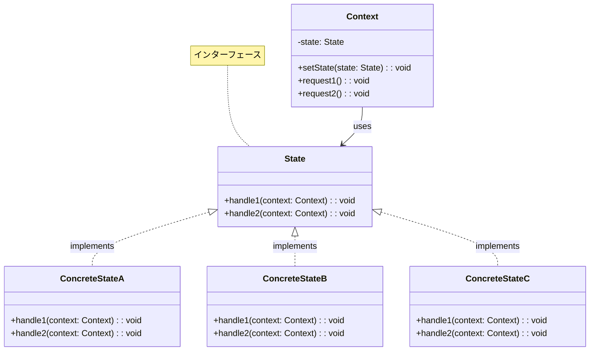
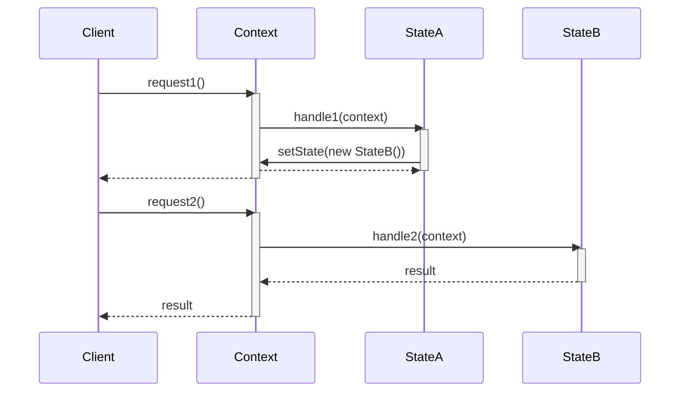
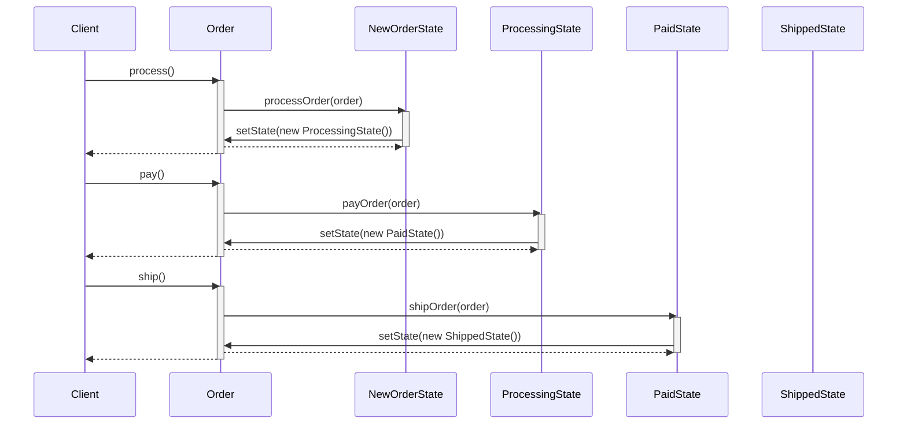
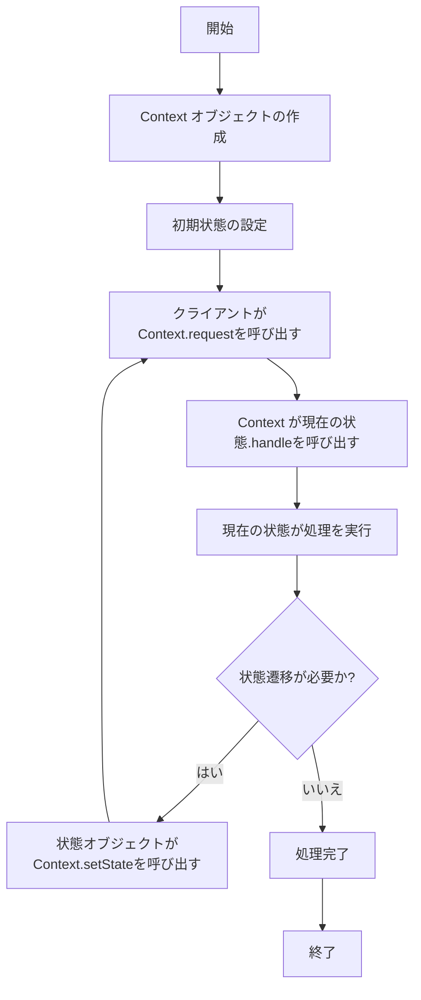

# Stateパターン - オブジェクト状態依存振る舞い実装

## 1. 概要

### 1.1 パターンの定義
Stateパターンは、オブジェクトの内部状態が変化したときにその振る舞いを変更できるようにするデザインパターンです。状態遷移ロジックを別々のクラスにカプセル化することで、あたかもオブジェクトがクラスを変更したかのように振る舞います。

### 1.2 目的・解決する問題
- 状態依存の振る舞いの管理と分離
- 複雑な条件分岐（if-else、switch文）の削減
- コードの可読性と保守性の向上
- 状態遷移の明確化と制御
- 単一責任の原則の実現
- 新しい状態の追加を容易にする
- 状態固有のロジックを局所化する

### 1.3 コンテキスト・適用場面
- オブジェクトの振る舞いが現在の状態に依存する場合
- 大量の条件分岐がある場合
- 同じ条件チェックが複数のメソッドで繰り返される場合
- ビジネスプロセスの状態管理（注文、予約、タスク管理など）
- ワークフローシステム
- ゲームのキャラクター状態管理
- UIコンポーネントの状態制御

## 2. クラス構造

### 2.1 クラス図


### 2.2 主要コンポーネント

| コンポーネント | 種類 | 責務 | 関連 |
|-------------|------|------|------|
| Context | クラス | 状態オブジェクトの現在のインスタンスを保持し、クライアントからの要求を現在の状態に委譲 | State を参照 |
| State | インターフェース | Context の状態依存の振る舞いを定義するメソッドを宣言 | - |
| ConcreteState | クラス | State インターフェースを実装し、特定の状態に関連する振る舞いを提供 | State を実装 |

### 2.3 相互作用
- Context は現在の State オブジェクトへの参照を保持
- クライアントからの要求は Context によって現在の State に委譲される
- Context は State に自身の参照を渡し、State が必要に応じて Context の状態を変更できるようにする
- State は Context の状態を変更するために Context の setState メソッドを呼び出す
- Context は ConcreteState インスタンスを作成せず、外部から注入されることが多い

## 3. シーケンス

### 3.1 基本フロー


### 3.2 注文処理の例


### 3.3 プロセスフロー


### 3.4 重要なシナリオ

#### シナリオ1: 注文処理ワークフロー
1. 新規注文が作成され、初期状態は「新規注文」
2. 注文処理が開始され、状態が「処理中」に変わる
3. 支払いが完了すると、状態が「支払済み」に変わる
4. 商品が発送されると、状態が「発送済み」に変わる
5. 各状態で許可される操作と禁止される操作が異なる

#### シナリオ2: 有限状態マシン（FSM）の実装
1. システムは特定の入力イベントに応じて状態間を遷移する
2. 各状態は特定の入力に対して異なる反応を示す
3. 次の状態は現在の状態と入力イベントの組み合わせによって決まる
4. 特定の状態では特定の出力アクションが実行される

## 4. 実装詳細

### 4.1 主要インターフェース・クラス

```typescript
/**
 * 注文状態インターフェース
 * 各状態が実装すべきメソッドを定義
 */
interface OrderState {
    /**
     * 注文を処理する
     * @param order 処理する注文
     */
    processOrder(order: Order): void;
    
    /**
     * 注文をキャンセルする
     * @param order キャンセルする注文
     */
    cancelOrder(order: Order): void;
    
    /**
     * 注文の支払いを行う
     * @param order 支払いを行う注文
     */
    payOrder(order: Order): void;
    
    /**
     * 注文を発送する
     * @param order 発送する注文
     */
    shipOrder(order: Order): void;
    
    /**
     * 状態の名前を取得する
     * @returns 状態の名前
     */
    getName(): string;
}

/**
 * 注文クラス（Context）
 * 現在の状態を管理し、操作を適切な状態に委譲する
 */
class Order {
    /**
     * 現在の注文状態
     */
    private state: OrderState;
    
    /**
     * 注文ID
     */
    private readonly id: string;
    
    /**
     * 注文アイテムのリスト
     */
    private items: string[];
    
    /**
     * 注文の履歴
     */
    private history: string[] = [];
    
    /**
     * コンストラクタ
     * @param id 注文ID
     */
    constructor(id: string) {
        this.id = id;
        this.items = [];
        this.state = new NewOrderState();
        this.logStateChange('初期化', this.state.getName());
    }
    
    /**
     * 注文状態を設定する
     * @param state 設定する状態
     */
    setState(state: OrderState): void {
        const oldState = this.state.getName();
        this.state = state;
        this.logStateChange(oldState, state.getName());
    }
    
    /**
     * 注文を処理する
     */
    process(): void {
        this.state.processOrder(this);
    }
    
    /**
     * 注文をキャンセルする
     */
    cancel(): void {
        this.state.cancelOrder(this);
    }
    
    /**
     * 注文の支払いを行う
     */
    pay(): void {
        this.state.payOrder(this);
    }
    
    /**
     * 注文を発送する
     */
    ship(): void {
        this.state.shipOrder(this);
    }
    
    /**
     * 注文に商品を追加する
     * @param item 追加する商品
     */
    addItem(item: string): void {
        this.items.push(item);
        console.log(`Item '${item}' added to order ${this.id}`);
    }
    
    /**
     * 注文の商品リストを取得する
     * @returns 商品リストのコピー
     */
    getItems(): string[] {
        return [...this.items];
    }
    
    /**
     * 注文IDを取得する
     * @returns 注文ID
     */
    getId(): string {
        return this.id;
    }
    
    /**
     * 状態変更を記録する
     * @param fromState 元の状態
     * @param toState 変更後の状態
     */
    private logStateChange(fromState: string, toState: string): void {
        const message = `状態変更: ${fromState} → ${toState}`;
        console.log(`Order ${this.id}: ${message}`);
        this.history.push(`${new Date().toISOString()} - ${message}`);
    }
    
    /**
     * 注文履歴を取得する
     * @returns 注文履歴のコピー
     */
    getHistory(): string[] {
        return [...this.history];
    }
}
```

### 4.2 状態クラスの実装

```typescript
/**
 * 新規注文状態
 * 初期状態として使用される
 */
class NewOrderState implements OrderState {
    /**
     * 注文を処理する
     * @param order 処理する注文
     */
    processOrder(order: Order): void {
        console.log(`Processing order ${order.getId()}`);
        order.setState(new ProcessingState());
    }
    
    /**
     * 注文をキャンセルする
     * @param order キャンセルする注文
     */
    cancelOrder(order: Order): void {
        console.log(`Cancelling new order ${order.getId()}`);
        order.setState(new CancelledState());
    }
    
    /**
     * 注文の支払いを行う
     * @param order 支払いを行う注文
     */
    payOrder(order: Order): void {
        throw new Error('Cannot pay for order that has not been processed');
    }
    
    /**
     * 注文を発送する
     * @param order 発送する注文
     */
    shipOrder(order: Order): void {
        throw new Error('Cannot ship order that has not been processed');
    }
    
    /**
     * 状態の名前を取得する
     * @returns 状態の名前
     */
    getName(): string {
        return '新規注文';
    }
}

/**
 * 処理中状態
 * 注文が処理中であることを表す
 */
class ProcessingState implements OrderState {
    /**
     * 注文を処理する
     * @param order 処理する注文
     */
    processOrder(order: Order): void {
        throw new Error('Order is already being processed');
    }
    
    /**
     * 注文をキャンセルする
     * @param order キャンセルする注文
     */
    cancelOrder(order: Order): void {
        console.log(`Cancelling processing order ${order.getId()}`);
        order.setState(new CancelledState());
    }
    
    /**
     * 注文の支払いを行う
     * @param order 支払いを行う注文
     */
    payOrder(order: Order): void {
        console.log(`Processing payment for order ${order.getId()}`);
        order.setState(new PaidState());
    }
    
    /**
     * 注文を発送する
     * @param order 発送する注文
     */
    shipOrder(order: Order): void {
        throw new Error('Cannot ship order that has not been paid');
    }
    
    /**
     * 状態の名前を取得する
     * @returns 状態の名前
     */
    getName(): string {
        return '処理中';
    }
}

/**
 * 支払い済み状態
 * 注文が支払い済みであることを表す
 */
class PaidState implements OrderState {
    /**
     * 注文を処理する
     * @param order 処理する注文
     */
    processOrder(order: Order): void {
        throw new Error('Order is already processed and paid');
    }
    
    /**
     * 注文をキャンセルする
     * @param order キャンセルする注文
     */
    cancelOrder(order: Order): void {
        console.log(`Refunding order ${order.getId()}`);
        order.setState(new RefundedState());
    }
    
    /**
     * 注文の支払いを行う
     * @param order 支払いを行う注文
     */
    payOrder(order: Order): void {
        throw new Error('Order is already paid');
    }
    
    /**
     * 注文を発送する
     * @param order 発送する注文
     */
    shipOrder(order: Order): void {
        console.log(`Shipping order ${order.getId()}`);
        order.setState(new ShippedState());
    }
    
    /**
     * 状態の名前を取得する
     * @returns 状態の名前
     */
    getName(): string {
        return '支払い済み';
    }
}

/**
 * 発送済み状態
 * 注文が発送済みであることを表す
 */
class ShippedState implements OrderState {
    /**
     * 注文を処理する
     * @param order 処理する注文
     */
    processOrder(order: Order): void {
        throw new Error('Cannot process shipped order');
    }
    
    /**
     * 注文をキャンセルする
     * @param order キャンセルする注文
     */
    cancelOrder(order: Order): void {
        throw new Error('Cannot cancel shipped order');
    }
    
    /**
     * 注文の支払いを行う
     * @param order 支払いを行う注文
     */
    payOrder(order: Order): void {
        throw new Error('Order is already paid');
    }
    
    /**
     * 注文を発送する
     * @param order 発送する注文
     */
    shipOrder(order: Order): void {
        throw new Error('Order is already shipped');
    }
    
    /**
     * 状態の名前を取得する
     * @returns 状態の名前
     */
    getName(): string {
        return '発送済み';
    }
}

/**
 * キャンセル状態
 * 注文がキャンセルされたことを表す
 */
class CancelledState implements OrderState {
    /**
     * 注文を処理する
     * @param order 処理する注文
     */
    processOrder(order: Order): void {
        throw new Error('Cannot process cancelled order');
    }
    
    /**
     * 注文をキャンセルする
     * @param order キャンセルする注文
     */
    cancelOrder(order: Order): void {
        throw new Error('Order is already cancelled');
    }
    
    /**
     * 注文の支払いを行う
     * @param order 支払いを行う注文
     */
    payOrder(order: Order): void {
        throw new Error('Cannot pay for cancelled order');
    }
    
    /**
     * 注文を発送する
     * @param order 発送する注文
     */
    shipOrder(order: Order): void {
        throw new Error('Cannot ship cancelled order');
    }
    
    /**
     * 状態の名前を取得する
     * @returns 状態の名前
     */
    getName(): string {
        return 'キャンセル済み';
    }
}

/**
 * 返金済み状態
 * 支払い済みの注文がキャンセルされ、返金されたことを表す
 */
class RefundedState implements OrderState {
    /**
     * 注文を処理する
     * @param order 処理する注文
     */
    processOrder(order: Order): void {
        throw new Error('Cannot process refunded order');
    }
    
    /**
     * 注文をキャンセルする
     * @param order キャンセルする注文
     */
    cancelOrder(order: Order): void {
        throw new Error('Order is already cancelled and refunded');
    }
    
    /**
     * 注文の支払いを行う
     * @param order 支払いを行う注文
     */
    payOrder(order: Order): void {
        throw new Error('Cannot pay for refunded order');
    }
    
    /**
     * 注文を発送する
     * @param order 発送する注文
     */
    shipOrder(order: Order): void {
        throw new Error('Cannot ship refunded order');
    }
    
    /**
     * 状態の名前を取得する
     * @returns 状態の名前
     */
    getName(): string {
        return '返金済み';
    }
}
```

### 4.3 実装のバリエーション

1. **状態マシン定義型**
   - 状態遷移テーブルを使用して状態遷移を定義
   - 各状態と動作のマッピングを中央で管理

2. **階層型状態パターン**
   - 状態の継承階層を使用して共通動作を共有
   - 特殊なケースのみ子クラスでオーバーライド

3. **フライウェイト状態パターン**
   - 状態オブジェクトを共有して生成コストを削減
   - 複数のコンテキストで同じ状態インスタンスを再利用

4. **イベント駆動型状態パターン**
   - イベントに基づいて状態遷移を行う
   - イベントとハンドラのマッピングを各状態で定義

### 4.4 注意すべき実装ポイント

- 状態クラスは無状態（ステートレス）であることが望ましく、複数のコンテキストで共有できるようにする
- コンテキストが持つべきデータと状態クラスが持つべきデータを明確に分ける
- 無効な操作や状態遷移に対して適切な例外処理を行う
- 状態遷移の履歴を記録するメカニズムを考慮する
- 状態遷移に条件を設ける場合は、その条件を状態クラス内に明確に定義する
- 状態間の依存関係を最小限に抑える
- 状態遷移のテストを容易にするため、状態の作成と注入を明示的に行う

## 5. 使用例

### 5.1 基本的な使用例

```typescript
// 注文の作成と処理
const order = new Order('ORD-001');
order.addItem('製品A');
order.addItem('製品B');

console.log('--- 通常の注文処理フロー ---');
try {
    // 注文のライフサイクル
    order.process(); // NewOrderState -> ProcessingState
    order.pay();     // ProcessingState -> PaidState
    order.ship();    // PaidState -> ShippedState
    
    console.log('最終状態:', order.getState().getName());
    console.log('注文履歴:', order.getHistory());
} catch (error) {
    console.error('注文処理でエラーが発生しました:', error.message);
}

// 出力例:
// Item '製品A' added to order ORD-001
// Item '製品B' added to order ORD-001
// --- 通常の注文処理フロー ---
// Processing order ORD-001
// Order ORD-001: 状態変更: 新規注文 → 処理中
// Processing payment for order ORD-001
// Order ORD-001: 状態変更: 処理中 → 支払い済み
// Shipping order ORD-001
// Order ORD-001: 状態変更: 支払い済み → 発送済み
// 最終状態: 発送済み
// 注文履歴: [
//   "2023-09-01T10:15:23.456Z - 状態変更: 初期化 → 新規注文",
//   "2023-09-01T10:15:24.123Z - 状態変更: 新規注文 → 処理中",
//   "2023-09-01T10:15:25.789Z - 状態変更: 処理中 → 支払い済み",
//   "2023-09-01T10:15:26.456Z - 状態変更: 支払い済み → 発送済み"
// ]
```

### 5.2 エラー処理と例外ケース

```typescript
console.log('--- エラー処理のデモ ---');

// 注文1: 処理前に支払いしようとする
const order1 = new Order('ORD-ERR-1');
try {
    order1.pay();
} catch (error) {
    console.error(`注文 ${order1.getId()} エラー:`, error.message);
}

// 注文2: キャンセル後に発送しようとする
const order2 = new Order('ORD-ERR-2');
try {
    order2.process();
    order2.cancel();
    order2.ship();
} catch (error) {
    console.error(`注文 ${order2.getId()} エラー:`, error.message);
}

// 注文3: 発送後にキャンセルしようとする
const order3 = new Order('ORD-ERR-3');
try {
    order3.process();
    order3.pay();
    order3.ship();
    order3.cancel();
} catch (error) {
    console.error(`注文 ${order3.getId()} エラー:`, error.message);
}

// 出力例:
// --- エラー処理のデモ ---
// 注文 ORD-ERR-1 エラー: Cannot pay for order that has not been processed
// Processing order ORD-ERR-2
// Order ORD-ERR-2: 状態変更: 新規注文 → 処理中
// Cancelling processing order ORD-ERR-2
// Order ORD-ERR-2: 状態変更: 処理中 → キャンセル済み
// 注文 ORD-ERR-2 エラー: Cannot ship cancelled order
// Processing order ORD-ERR-3
// Order ORD-ERR-3: 状態変更: 新規注文 → 処理中
// Processing payment for order ORD-ERR-3
// Order ORD-ERR-3: 状態変更: 処理中 → 支払い済み
// Shipping order ORD-ERR-3
// Order ORD-ERR-3: 状態変更: 支払い済み → 発送済み
// 注文 ORD-ERR-3 エラー: Cannot cancel shipped order
```

### 5.3 状態遷移の視覚化

```typescript
/**
 * 状態遷移を視覚化するクラス
 */
class OrderStateDiagram {
    /**
     * 状態遷移図を生成する
     * @param order 注文オブジェクト
     * @returns 状態遷移の視覚的表現
     */
    static generateDiagram(order: Order): string {
        const history = order.getHistory();
        const states = history.map(entry => {
            const match = entry.match(/状態変更: (.+) → (.+)$/);
            return match ? match[2] : null;
        }).filter(Boolean);
        
        let diagram = '状態遷移図:\n';
        diagram += '-------------\n';
        
        states.forEach((state, index) => {
            diagram += `[${state}]`;
            if (index < states.length - 1) {
                diagram += ' → ';
                if ((index + 1) % 3 === 0) {
                    diagram += '\n';
                }
            }
        });
        
        return diagram;
    }
}

// 使用例
const order4 = new Order('ORD-DIAG');
order4.process();
order4.pay();
order4.ship();

console.log(OrderStateDiagram.generateDiagram(order4));

// 出力例:
// 状態遷移図:
// -------------
// [新規注文] → [処理中] → [支払い済み] → [発送済み]
```

## 6. テスト戦略

### 6.1 ユニットテスト要件
- 各状態クラスのメソッドが正しく動作することを確認
- 状態遷移が正しく行われることを確認
- 無効な操作に対して適切な例外がスローされることを確認
- 状態履歴が正しく記録されることを確認
- 境界条件や特殊ケースのテスト

### 6.2 テスト実装例

```typescript
describe('Order State Pattern Tests', () => {
    describe('Order State Transitions', () => {
        let order: Order;
        
        beforeEach(() => {
            order = new Order('TEST-001');
        });
        
        test('初期状態は新規注文である', () => {
            expect(order['state'].getName()).toBe('新規注文');
        });
        
        test('正常な状態遷移シーケンスが機能する', () => {
            // 新規注文 → 処理中
            order.process();
            expect(order['state'].getName()).toBe('処理中');
            
            // 処理中 → 支払い済み
            order.pay();
            expect(order['state'].getName()).toBe('支払い済み');
            
            // 支払い済み → 発送済み
            order.ship();
            expect(order['state'].getName()).toBe('発送済み');
        });
        
        test('処理中の注文はキャンセルできる', () => {
            order.process();
            order.cancel();
            expect(order['state'].getName()).toBe('キャンセル済み');
        });
        
        test('支払い済みの注文をキャンセルすると返金状態になる', () => {
            order.process();
            order.pay();
            order.cancel();
            expect(order['state'].getName()).toBe('返金済み');
        });
        
        test('新規注文は支払いできない', () => {
            expect(() => order.pay()).toThrow('Cannot pay for order that has not been processed');
        });
        
        test('新規注文は発送できない', () => {
            expect(() => order.ship()).toThrow('Cannot ship order that has not been processed');
        });
        
        test('処理中の注文は発送できない', () => {
            order.process();
            expect(() => order.ship()).toThrow('Cannot ship order that has not been paid');
        });
        
        test('発送済みの注文はキャンセルできない', () => {
            order.process();
            order.pay();
            order.ship();
            expect(() => order.cancel()).toThrow('Cannot cancel shipped order');
        });
        
        test('キャンセル済みの注文は処理できない', () => {
            order.cancel();
            expect(() => order.process()).toThrow('Cannot process cancelled order');
        });
    });
    
    describe('Order History and Metadata', () => {
        test('注文の履歴が正しく記録される', () => {
            const order = new Order('HIST-001');
            order.process();
            order.pay();
            
            const history = order.getHistory();
            expect(history.length).toBe(3); // 初期化、処理、支払い
            expect(history[0]).toContain('初期化 → 新規注文');
            expect(history[1]).toContain('新規注文 → 処理中');
            expect(history[2]).toContain('処理中 → 支払い済み');
        });
        
        test('注文アイテムが正しく管理される', () => {
            const order = new Order('ITEMS-001');
            order.addItem('アイテム1');
            order.addItem('アイテム2');
            
            const items = order.getItems();
            expect(items).toEqual(['アイテム1', 'アイテム2']);
            expect(items).not.toBe(order.getItems()); // 配列のコピーが返される
        });
    });
    
    describe('State Classes', () => {
        test('各状態クラスがOrderStateインターフェースを実装している', () => {
            const states = [
                new NewOrderState(),
                new ProcessingState(),
                new PaidState(),
                new ShippedState(),
                new CancelledState(),
                new RefundedState()
            ];
            
            states.forEach(state => {
                expect(typeof state.processOrder).toBe('function');
                expect(typeof state.cancelOrder).toBe('function');
                expect(typeof state.payOrder).toBe('function');
                expect(typeof state.shipOrder).toBe('function');
                expect(typeof state.getName).toBe('function');
            });
        });
    });
});
```

## 7. 評価

### 7.1 メリット
- 複雑な条件分岐を削減し、コードの可読性を向上させる
- 状態固有のロジックが局所化され、責務が明確になる
- 新しい状態の追加が既存のコードに影響を与えにくい（Open-Closed原則）
- 状態遷移ロジックが明示的で追跡しやすい
- コンテキストクラスがシンプルになり、状態関連のバグが減少する
- 状態遷移の可視化や監査が容易になる
- テストがしやすくなる（各状態を個別にテスト可能）

### 7.2 デメリット・制約
- クラス数が増加し、コードベースが大きくなる
- 状態が少ない単純なケースではオーバーエンジニアリングになる可能性がある
- 状態間で共有される機能の重複が発生する可能性がある
- 状態間の遷移ロジックが複雑になると管理が難しくなる
- 状態オブジェクトの生成と破棄にオーバーヘッドがかかる
- すべての状態クラスがコンテキストの実装詳細を知る必要がある場合がある

### 7.3 代替パターン・関連パターン
- **State Machine（状態機械）**: 状態遷移テーブルを使用して、より形式的に状態を管理
- **Strategy（ストラテジー）パターン**: 似た構造だが、状態の自動遷移よりも異なるアルゴリズムの切り替えに焦点
- **Command（コマンド）パターン**: 操作をオブジェクトにカプセル化するため、状態遷移を表現するのに使用できる
- **Memento（メメント）パターン**: 状態の保存と復元が必要な場合に組み合わせて使用
- **Singleton（シングルトン）パターン**: 状態オブジェクトが無状態の場合、シングルトンとして実装できる

## 8. 参考資料

### 8.1 内部リンク
- [ソースコード](../../src/behavioral/state)
- [テストコード](../../tests/behavioral/state)

### 8.2 外部リンク
- [リファクタリング・グル - State パターン](https://refactoring.guru/ja/design-patterns/state)
- [Design Patterns: Elements of Reusable Object-Oriented Software](https://www.amazon.co.jp/Design-Patterns-Elements-Reusable-Object-Oriented/dp/0201633612)
- [ステートパターンと有限状態機械の実装](https://en.wikipedia.org/wiki/Finite-state_machine)
- [TypeScriptでのデザインパターン実装](https://www.patterns.dev/posts/state-pattern) 