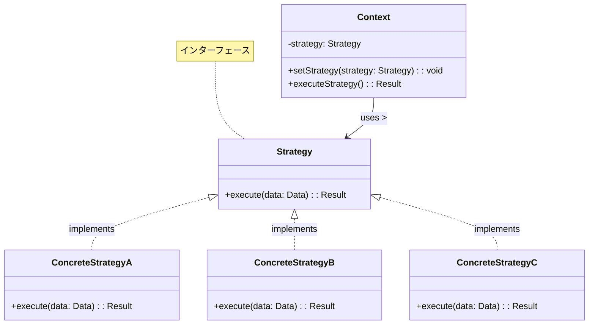
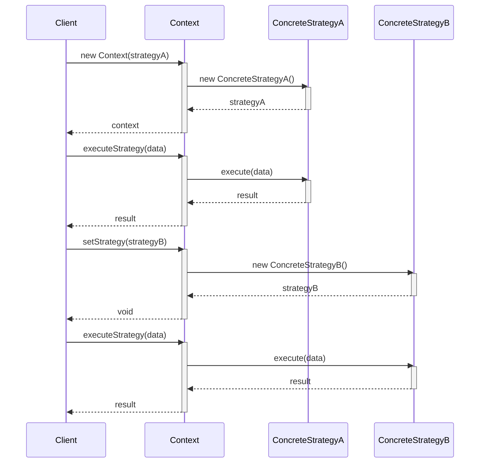
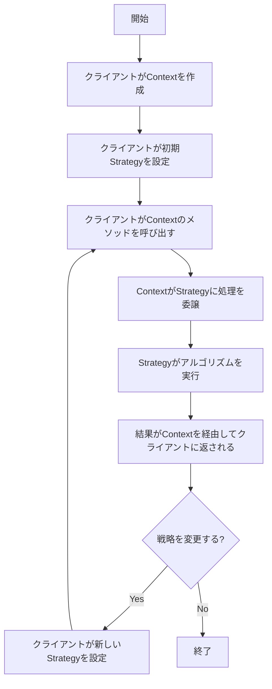

# Strategyパターン - アルゴリズム切替実装

## 1. 概要

### 1.1 パターンの定義
Strategyパターンは、アルゴリズムのファミリーをカプセル化し、それらを交換可能にする行動パターンです。アルゴリズムをクラスとして定義し、実行時に動的に切り替えることを可能にします。これにより、クライアントコードから具体的なアルゴリズムの実装を分離します。

### 1.2 目的・解決する問題
- アルゴリズムの動的な切り替えを可能にする
- 条件分岐の複雑化を防止する
- アルゴリズムの独立した進化と再利用を促進する
- オブジェクト間の結合度を低減する
- 同じ問題に対する異なる解決策を提供する
- 実行時にクライアントの振る舞いを変更できるようにする

### 1.3 コンテキスト・適用場面
- 異なるバリエーションのアルゴリズムが必要な場合
- 実行時にアルゴリズムを選択する必要がある場合
- 条件分岐が複雑化しているコードのリファクタリング
- コンポーネントに複数の振る舞いが存在し、それらを動的に変更したい場合
- パフォーマンス最適化のために異なるアルゴリズムを使用したい場合
- ビジネスルールや環境によって処理方法が変化する場合

## 2. クラス構造

### 2.1 クラス図


### 2.2 主要コンポーネント

| コンポーネント | 種類 | 責務 | 関連 |
|-------------|------|------|------|
| Strategy | インターフェース | アルゴリズムの共通インターフェースを定義 | ConcreteStrategyで実装される |
| ConcreteStrategy | クラス | Strategy インターフェースの具体的実装を提供 | Strategy を実装 |
| Context | クラス | Strategy オブジェクトを保持し、必要に応じて切り替える | Strategy を使用 |

### 2.3 相互作用
- Contextはアルゴリズムの実行をStrategyオブジェクトに委譲する
- クライアントはContextに特定のConcreteStrategyを設定する
- Contextは具体的な実装の詳細を知らずにStrategyを使用する
- ConcreteStrategyはアルゴリズムの特定の実装を提供する
- 異なるConcreteStrategyは同じインターフェースを共有するため交換可能である

## 3. 振る舞い

### 3.1 シーケンス図


### 3.2 プロセスフロー


### 3.3 重要なシナリオ

#### シナリオ1: ソートアルゴリズムの切り替え
1. クライアントがデータサイズに基づいて適切なソートアルゴリズムを選択
2. 小さいデータセットにはクイックソートを使用
3. 大きいデータセットにはマージソートを使用
4. メモリ制約のある環境ではヒープソートを使用

#### シナリオ2: 支払い方法の切り替え
1. ECサイトで注文処理を行う
2. ユーザーが支払い方法を選択（クレジットカード、PayPal、銀行振込など）
3. 選択に応じて適切な支払い処理戦略が設定される
4. 注文確定時に選択された支払い方法で処理が実行される

## 4. 実装詳細

### 4.1 主要インターフェース・クラス

```typescript
/**
 * 戦略インターフェース
 * すべてのソートアルゴリズムが実装する共通インターフェース
 */
interface SortStrategy<T> {
    /**
     * データをソートする
     * @param data ソート対象のデータ配列
     * @returns ソート済みの配列
     */
    sort(data: T[]): T[];
    
    /**
     * 戦略の名前を取得する
     * @returns 戦略の名前
     */
    getName(): string;
}

/**
 * クイックソート戦略
 */
class QuickSort<T> implements SortStrategy<T> {
    /**
     * クイックソートアルゴリズムを使用してデータをソートする
     * @param data ソート対象のデータ配列
     * @returns ソート済みの配列
     */
    sort(data: T[]): T[] {
        // 元の配列を変更しないようにコピーを作成
        const arr = [...data];
        return this.quickSort(arr);
    }
    
    /**
     * クイックソートの再帰的実装
     * @param arr ソート対象の配列
     * @returns ソート済みの配列
     */
    private quickSort(arr: T[]): T[] {
        if (arr.length <= 1) return arr;
        
        const pivot = arr[Math.floor(arr.length / 2)];
        const left = arr.filter(x => x < pivot);
        const middle = arr.filter(x => x === pivot);
        const right = arr.filter(x => x > pivot);
        
        return [...this.quickSort(left), ...middle, ...this.quickSort(right)];
    }
    
    /**
     * 戦略の名前を取得
     * @returns 戦略の名前
     */
    getName(): string {
        return 'クイックソート';
    }
}

/**
 * マージソート戦略
 */
class MergeSort<T> implements SortStrategy<T> {
    /**
     * マージソートアルゴリズムを使用してデータをソートする
     * @param data ソート対象のデータ配列
     * @returns ソート済みの配列
     */
    sort(data: T[]): T[] {
        // 元の配列を変更しないようにコピーを作成
        const arr = [...data];
        return this.mergeSort(arr);
    }
    
    /**
     * マージソートの再帰的実装
     * @param arr ソート対象の配列
     * @returns ソート済みの配列
     */
    private mergeSort(arr: T[]): T[] {
        if (arr.length <= 1) return arr;
        
        const mid = Math.floor(arr.length / 2);
        const left = arr.slice(0, mid);
        const right = arr.slice(mid);
        
        return this.merge(
            this.mergeSort(left),
            this.mergeSort(right)
        );
    }
    
    /**
     * 2つのソート済み配列をマージする
     * @param left 左側のソート済み配列
     * @param right 右側のソート済み配列
     * @returns マージされたソート済み配列
     */
    private merge(left: T[], right: T[]): T[] {
        const result: T[] = [];
        let leftIndex = 0;
        let rightIndex = 0;
        
        while (leftIndex < left.length && rightIndex < right.length) {
            if (left[leftIndex] < right[rightIndex]) {
                result.push(left[leftIndex++]);
            } else {
                result.push(right[rightIndex++]);
            }
        }
        
        return result
            .concat(left.slice(leftIndex))
            .concat(right.slice(rightIndex));
    }
    
    /**
     * 戦略の名前を取得
     * @returns 戦略の名前
     */
    getName(): string {
        return 'マージソート';
    }
}

/**
 * ソートコンテキスト
 * ソート戦略を使用してデータをソートする
 */
class SortContext<T> {
    /**
     * 現在の戦略
     */
    private strategy: SortStrategy<T>;
    
    /**
     * コンストラクタ
     * @param strategy 初期ソート戦略
     */
    constructor(strategy: SortStrategy<T>) {
        this.strategy = strategy;
    }
    
    /**
     * 戦略を設定する
     * @param strategy 新しいソート戦略
     */
    setStrategy(strategy: SortStrategy<T>): void {
        this.strategy = strategy;
    }
    
    /**
     * 現在の戦略を取得する
     * @returns 現在のソート戦略
     */
    getStrategy(): SortStrategy<T> {
        return this.strategy;
    }
    
    /**
     * 現在の戦略を使用してデータをソートする
     * @param data ソート対象のデータ配列
     * @returns ソート済みの配列
     */
    sort(data: T[]): T[] {
        console.log(`${this.strategy.getName()}を使用してソートします`);
        return this.strategy.sort(data);
    }
}
```

### 4.2 ストラテジー選択ロジック

```typescript
/**
 * データサイズに基づいて最適なソート戦略を選択するファクトリ
 */
class SortStrategyFactory {
    /**
     * データサイズに基づいて最適なソート戦略を選択する
     * @param dataSize データのサイズ
     * @returns 最適なソート戦略
     */
    static getOptimalStrategy<T>(dataSize: number): SortStrategy<T> {
        if (dataSize <= 10) {
            // 小さいデータセットには挿入ソートが効率的
            return new InsertionSort<T>();
        } else if (dataSize <= 1000) {
            // 中程度のデータセットにはクイックソートが効率的
            return new QuickSort<T>();
        } else {
            // 大きいデータセットにはマージソートが安定
            return new MergeSort<T>();
        }
    }
    
    /**
     * メモリ使用量に基づいて最適なソート戦略を選択する
     * @param memoryConstrained メモリ制約があるかどうか
     * @returns 最適なソート戦略
     */
    static getMemoryEfficientStrategy<T>(memoryConstrained: boolean): SortStrategy<T> {
        if (memoryConstrained) {
            // メモリ制約がある場合はヒープソートが効率的
            return new HeapSort<T>();
        } else {
            // メモリが十分ある場合はマージソートが安定
            return new MergeSort<T>();
        }
    }
}
```

### 4.3 実装のバリエーション

1. **基本戦略**
   - インターフェースを実装した単純な戦略クラス
   - 例: ソートアルゴリズム、検証アルゴリズム

2. **パラメータ化戦略**
   - 戦略の振る舞いをパラメータで調整できる実装
   - 例: ソートの昇順・降順の切り替え

3. **関数型戦略**
   - 戦略をクラスではなく関数として実装
   - 例: 関数オブジェクトを使用

4. **複合戦略**
   - 複数の戦略を組み合わせた実装
   - 例: ソートと検索のパイプライン

### 4.4 注意すべき実装ポイント

- 戦略クラスのインターフェースは単純に保ち、必要最小限のメソッドを定義する
- 戦略間で共通する処理はヘルパーメソッドとして抽出する
- コンテキストは戦略の実装詳細に依存しないようにする
- 新しい戦略の追加が容易になるように設計する
- パフォーマンスとメモリ使用量の影響を考慮する
- 戦略の切り替えコストを検討する（頻繁に変更される場合、軽量な実装が必要）
- 戦略クラスの状態管理に注意する（ステートレスが望ましい）

## 5. 使用例

### 5.1 基本的な使用例

```typescript
// クイックソート戦略を使用してコンテキストを初期化
const sorter = new SortContext<number>(new QuickSort<number>());

// 小さいデータセットをソート
const smallData = [3, 1, 4, 1, 5, 9, 2, 6, 5];
console.log('元のデータ:', smallData);
console.log('ソート結果:', sorter.sort(smallData));  // クイックソートで処理

// 大きいデータセットには別の戦略に切り替え
sorter.setStrategy(new MergeSort<number>());

// 大きいデータセットをソート
const largeData = Array.from({length: 1000}, () => Math.floor(Math.random() * 1000));
console.log('大きいデータをソート中...');
console.log('ソート結果の最初の10項目:', sorter.sort(largeData).slice(0, 10));  // マージソートで処理

// メモリ制約がある環境向けにヒープソートに切り替え
sorter.setStrategy(new HeapSort<number>());

// メモリ効率重視でソート
console.log('メモリ効率重視でソート中...');
console.log('ソート結果の最初の10項目:', sorter.sort(largeData).slice(0, 10));  // ヒープソートで処理
```

### 5.2 高度な使用例

```typescript
/**
 * データ分析アプリケーション
 * 複数のソート戦略を使用してデータを処理する
 */
class DataAnalyzer<T> {
    private sortContext: SortContext<T>;
    private data: T[];
    
    /**
     * コンストラクタ
     * @param data 分析対象のデータ
     */
    constructor(data: T[]) {
        // デフォルトの戦略を設定
        this.sortContext = new SortContext<T>(new QuickSort<T>());
        this.data = [...data];
    }
    
    /**
     * データサイズに最適な戦略を自動選択してソート
     * @returns ソート済みデータ
     */
    sortWithOptimalStrategy(): T[] {
        const dataSize = this.data.length;
        const strategy = SortStrategyFactory.getOptimalStrategy<T>(dataSize);
        
        console.log(`データサイズ: ${dataSize}、選択された戦略: ${strategy.getName()}`);
        this.sortContext.setStrategy(strategy);
        return this.sortContext.sort(this.data);
    }
    
    /**
     * 特定の環境条件に基づいてソート
     * @param memoryConstrained メモリ制約があるかどうか
     * @returns ソート済みデータ
     */
    sortWithEnvironmentConstraints(memoryConstrained: boolean): T[] {
        const strategy = SortStrategyFactory.getMemoryEfficientStrategy<T>(memoryConstrained);
        
        console.log(`メモリ制約: ${memoryConstrained ? 'あり' : 'なし'}、選択された戦略: ${strategy.getName()}`);
        this.sortContext.setStrategy(strategy);
        return this.sortContext.sort(this.data);
    }
    
    /**
     * カスタム指標に基づいてデータを分析
     * @param metrics 分析メトリクスの配列
     * @returns 分析結果
     */
    analyzeWithMetrics(metrics: Array<(data: T[]) => any>): any[] {
        // データをソート
        const sortedData = this.sortWithOptimalStrategy();
        
        // 各メトリクスを計算
        return metrics.map(metric => metric(sortedData));
    }
}

// 使用例
const randomData = Array.from({length: 5000}, () => Math.floor(Math.random() * 10000));
const analyzer = new DataAnalyzer<number>(randomData);

// 最適な戦略でソート
const sortedData = analyzer.sortWithOptimalStrategy();
console.log('ソート済みデータの最初の10項目:', sortedData.slice(0, 10));

// メモリ制約環境でソート
const memoryEfficientSort = analyzer.sortWithEnvironmentConstraints(true);
console.log('メモリ効率的なソートの最初の10項目:', memoryEfficientSort.slice(0, 10));

// カスタムメトリクスで分析
const metrics = [
    (data: number[]) => ({ min: data[0], max: data[data.length - 1] }),
    (data: number[]) => ({ avg: data.reduce((sum, val) => sum + val, 0) / data.length }),
    (data: number[]) => ({ median: data[Math.floor(data.length / 2)] })
];

const analysisResults = analyzer.analyzeWithMetrics(metrics);
console.log('分析結果:', analysisResults);
```

## 6. テスト戦略

### 6.1 ユニットテスト要件
- 各具体的な戦略が期待通りの結果を返すことをテストする
- コンテキストが正しく戦略を切り替えることをテストする
- 戦略の切り替えが実行結果に影響することをテストする
- エッジケース（空の配列、単一要素の配列など）のテスト
- パフォーマンス特性のテスト（大規模データセットでの各戦略の効率性）

### 6.2 テスト実装例

```typescript
describe('Strategy Pattern Tests', () => {
    describe('Sort Strategies', () => {
        const unsortedData = [5, 3, 1, 4, 2];
        const expectedSortedData = [1, 2, 3, 4, 5];
        
        test('QuickSort strategy should sort data correctly', () => {
            const quickSort = new QuickSort<number>();
            const result = quickSort.sort(unsortedData);
            
            expect(result).toEqual(expectedSortedData);
            // 元の配列が変更されていないことを確認
            expect(unsortedData).toEqual([5, 3, 1, 4, 2]);
        });
        
        test('MergeSort strategy should sort data correctly', () => {
            const mergeSort = new MergeSort<number>();
            const result = mergeSort.sort(unsortedData);
            
            expect(result).toEqual(expectedSortedData);
        });
        
        test('HeapSort strategy should sort data correctly', () => {
            const heapSort = new HeapSort<number>();
            const result = heapSort.sort(unsortedData);
            
            expect(result).toEqual(expectedSortedData);
        });
        
        test('InsertionSort strategy should sort data correctly', () => {
            const insertionSort = new InsertionSort<number>();
            const result = insertionSort.sort(unsortedData);
            
            expect(result).toEqual(expectedSortedData);
        });
        
        test('Edge cases: empty array', () => {
            const strategies = [
                new QuickSort<number>(),
                new MergeSort<number>(),
                new HeapSort<number>(),
                new InsertionSort<number>()
            ];
            
            strategies.forEach(strategy => {
                const result = strategy.sort([]);
                expect(result).toEqual([]);
            });
        });
        
        test('Edge cases: single element array', () => {
            const strategies = [
                new QuickSort<number>(),
                new MergeSort<number>(),
                new HeapSort<number>(),
                new InsertionSort<number>()
            ];
            
            strategies.forEach(strategy => {
                const result = strategy.sort([42]);
                expect(result).toEqual([42]);
            });
        });
    });
    
    describe('SortContext', () => {
        const unsortedData = [5, 3, 1, 4, 2];
        const expectedSortedData = [1, 2, 3, 4, 5];
        
        test('SortContext should use the provided strategy', () => {
            const mockStrategy = {
                sort: jest.fn().mockReturnValue(expectedSortedData),
                getName: jest.fn().mockReturnValue('MockStrategy')
            };
            
            const sortContext = new SortContext(mockStrategy);
            const result = sortContext.sort(unsortedData);
            
            expect(mockStrategy.sort).toHaveBeenCalledWith(unsortedData);
            expect(result).toEqual(expectedSortedData);
        });
        
        test('SortContext should allow changing strategies', () => {
            const quickSort = new QuickSort<number>();
            const mergeSort = new MergeSort<number>();
            
            const sortContext = new SortContext<number>(quickSort);
            expect(sortContext.getStrategy()).toBe(quickSort);
            
            sortContext.setStrategy(mergeSort);
            expect(sortContext.getStrategy()).toBe(mergeSort);
        });
        
        test('SortContext should use the current strategy for sorting', () => {
            const quickSort = {
                sort: jest.fn().mockReturnValue(expectedSortedData),
                getName: jest.fn().mockReturnValue('QuickSort')
            };
            
            const mergeSort = {
                sort: jest.fn().mockReturnValue(expectedSortedData),
                getName: jest.fn().mockReturnValue('MergeSort')
            };
            
            const sortContext = new SortContext(quickSort);
            sortContext.sort(unsortedData);
            
            expect(quickSort.sort).toHaveBeenCalledWith(unsortedData);
            expect(mergeSort.sort).not.toHaveBeenCalled();
            
            // 戦略を変更
            sortContext.setStrategy(mergeSort);
            sortContext.sort(unsortedData);
            
            expect(mergeSort.sort).toHaveBeenCalledWith(unsortedData);
            // quickSortが再度呼ばれていないことを確認
            expect(quickSort.sort).toHaveBeenCalledTimes(1);
        });
    });
    
    describe('SortStrategyFactory', () => {
        test('should select InsertionSort for small datasets', () => {
            const strategy = SortStrategyFactory.getOptimalStrategy<number>(5);
            expect(strategy).toBeInstanceOf(InsertionSort);
        });
        
        test('should select QuickSort for medium datasets', () => {
            const strategy = SortStrategyFactory.getOptimalStrategy<number>(500);
            expect(strategy).toBeInstanceOf(QuickSort);
        });
        
        test('should select MergeSort for large datasets', () => {
            const strategy = SortStrategyFactory.getOptimalStrategy<number>(5000);
            expect(strategy).toBeInstanceOf(MergeSort);
        });
        
        test('should select HeapSort for memory constrained environments', () => {
            const strategy = SortStrategyFactory.getMemoryEfficientStrategy<number>(true);
            expect(strategy).toBeInstanceOf(HeapSort);
        });
        
        test('should select MergeSort for non-memory constrained environments', () => {
            const strategy = SortStrategyFactory.getMemoryEfficientStrategy<number>(false);
            expect(strategy).toBeInstanceOf(MergeSort);
        });
    });
});
```

## 7. 評価

### 7.1 メリット
- アルゴリズムの動的な切り替えが可能
- 新しいアルゴリズムの追加が容易（Open/Closed原則に準拠）
- 条件分岐の複雑化を防ぎ、コードの可読性が向上
- 各アルゴリズムを独立して進化させることができる
- アルゴリズムの再利用性が高まる
- テストが容易になる（各アルゴリズムを個別にテスト可能）

### 7.2 デメリット・制約
- 小規模なアプリケーションではオーバーエンジニアリングになる可能性
- クライアントが具体的な戦略の存在を認識する必要がある
- 戦略クラスの増加によりクラス数が増える
- すべての戦略が同じインターフェースに適合する必要がある
- 引数や返り値の型が統一されるため、型の不一致が発生する可能性

### 7.3 代替パターン・関連パターン
- **Templateメソッド**: アルゴリズムの骨格を定義し、一部のステップをサブクラスで実装する
- **Command**: リクエストをオブジェクトとしてカプセル化するが、Strategyはアルゴリズムに特化
- **State**: オブジェクトの内部状態に基づいて動作を変更するが、Strategyは明示的な切り替え
- **Bridge**: 抽象と実装を分離するが、Strategyはアルゴリズムの交換に焦点
- **Decorator**: 既存のオブジェクトに機能を追加するが、Strategyは完全に置き換える

## 8. 参考資料

### 8.1 内部リンク
- [ソースコード](../../src/behavioral/strategy)
- [テストコード](../../tests/behavioral/strategy)

### 8.2 外部リンク
- [リファクタリング・グル - Strategy パターン](https://refactoring.guru/ja/design-patterns/strategy)
- [Design Patterns: Elements of Reusable Object-Oriented Software](https://www.amazon.co.jp/Design-Patterns-Elements-Reusable-Object-Oriented/dp/0201633612) 