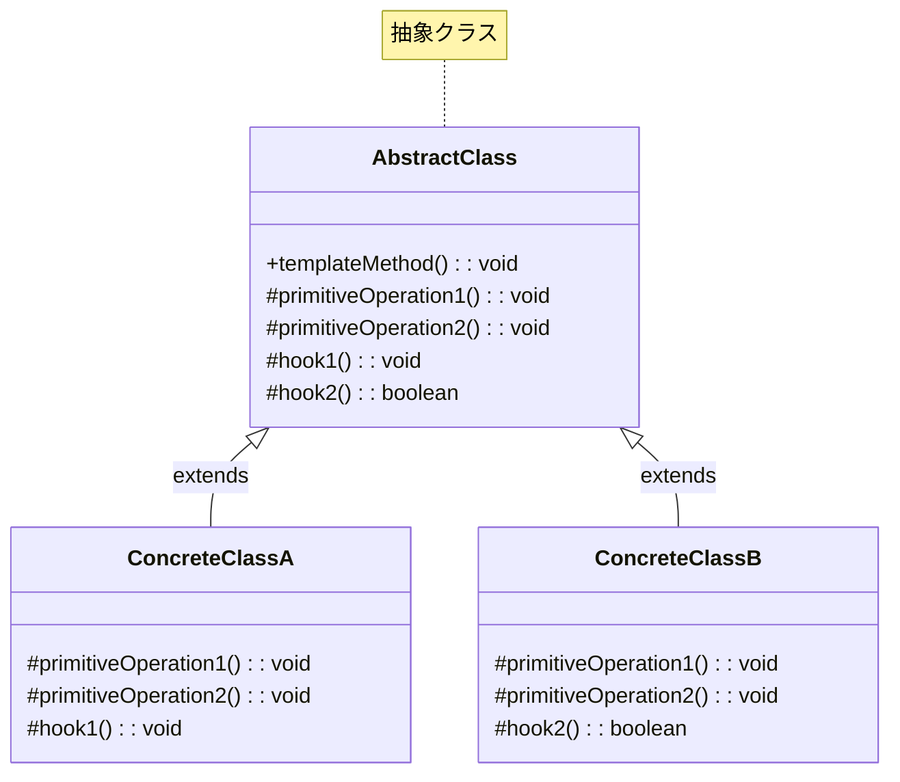
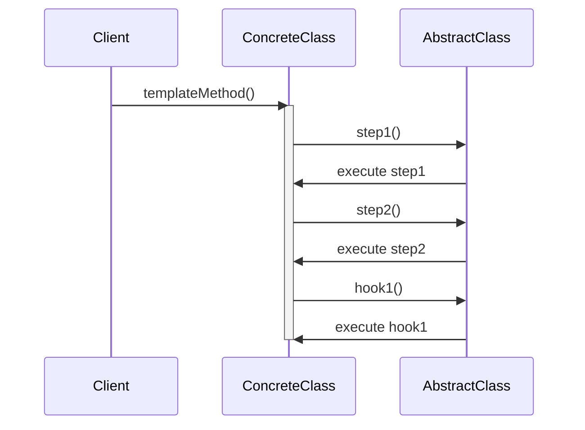
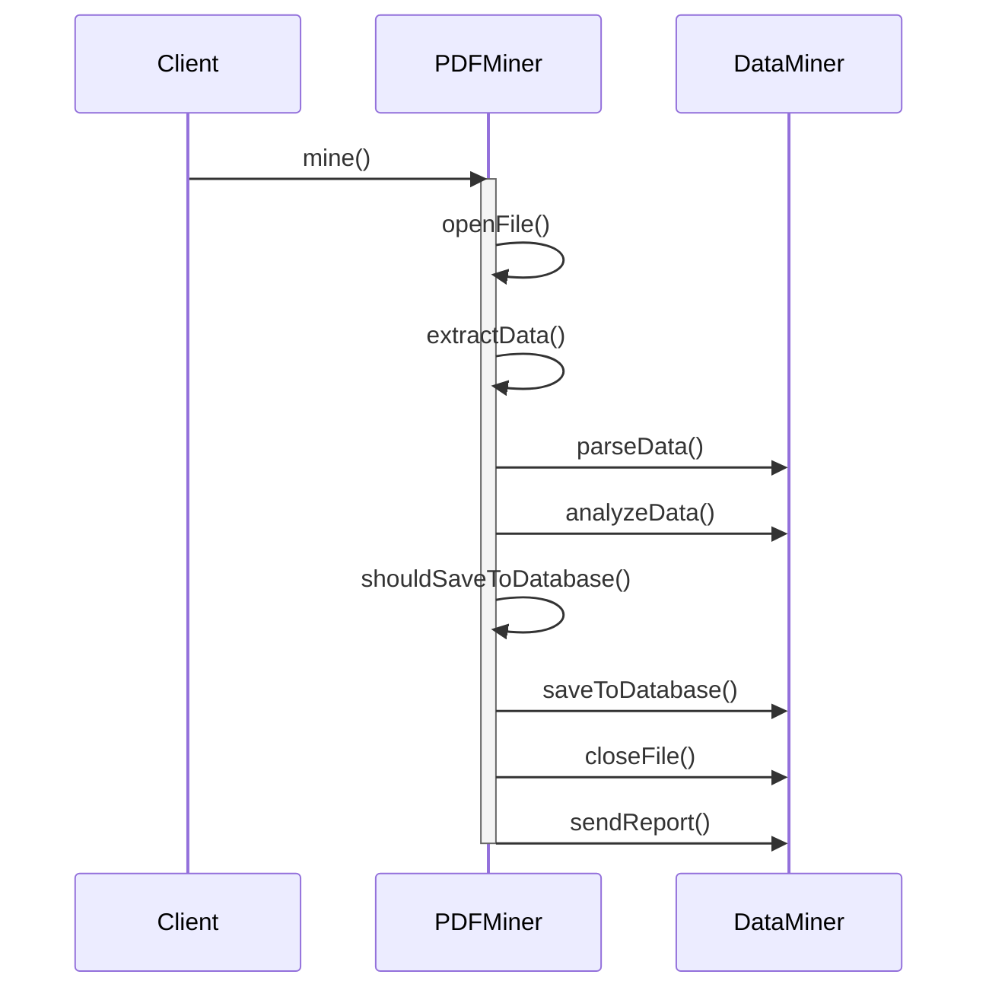

# Template Methodパターン - アルゴリズム骨格実装

## 1. 概要

### 1.1 パターンの定義
Template Methodパターンは、アルゴリズムの骨格を抽象クラスで定義し、いくつかのステップの実装をサブクラスに委ねる行動パターンです。これにより、アルゴリズムの構造を変えることなく、特定のステップをサブクラスでオーバーライドして独自の振る舞いを実装することができます。

### 1.2 目的・解決する問題
- コードの重複を削減し、共通ロジックを一箇所に集約する
- アルゴリズムの全体的な構造を維持しながら、一部の手順を変更可能にする
- サブクラスが変更可能なポイントを明確に定義する
- フレームワークにおけるデフォルト動作と拡張ポイントを提供する
- 「ハリウッドの原則」（「呼び出すな、我々が呼び出す」）を実現する
- サブクラスによる共通ロジックの変更を防止する

### 1.3 コンテキスト・適用場面
- 複数のクラスで同様のアルゴリズムを使用するが、特定のステップでのみ違いがある場合
- アルゴリズムの基本構造を固定し、一部の処理のみをカスタマイズしたい場合
- フレームワークのライフサイクルイベントを定義する場合
- 複数のコンポーネントで共通の処理フローを持ちたい場合
- データ処理パイプラインやフォーマット変換処理など、定型的な処理手順を持つ場合
- フックポイントを介して拡張性を提供したい場合

## 2. クラス構造

### 2.1 クラス図


### 2.2 主要コンポーネント

| コンポーネント | 種類 | 責務 | 関連 |
|-------------|------|------|------|
| AbstractClass | 抽象クラス | アルゴリズムの骨格を定義し、標準的な実装を提供する | ConcreteClassの親クラス |
| ConcreteClass | 具象クラス | AbstractClassで定義されたプリミティブ操作とフックをオーバーライドする | AbstractClassを継承 |
| templateMethod | メソッド | アルゴリズムの骨格を定義する、final（オーバーライド不可）メソッド | - |
| primitiveOperation | メソッド | サブクラスで必ず実装すべき抽象メソッド | - |
| hook | メソッド | サブクラスが必要に応じてオーバーライドできるオプションのメソッド | - |

### 2.3 相互作用
- AbstractClassはアルゴリズムの骨格を`templateMethod`として定義する
- `templateMethod`は`primitiveOperation`や`hook`を適切な順序で呼び出す
- ConcreteClassは必須の`primitiveOperation`をオーバーライドして実装する
- ConcreteClassは必要に応じて`hook`をオーバーライドしてカスタマイズする
- クライアントはConcreteClassのインスタンスを作成し、`templateMethod`を呼び出す

## 3. シーケンス

### 3.1 基本フロー


### 3.2 データマイニングの例


## 4. 実装詳細

### 4.1 主要インターフェース・クラス

```typescript
/**
 * データマイナー抽象クラス
 * データマイニングのアルゴリズム骨格を定義
 */
abstract class DataMiner {
    /**
     * テンプレートメソッド
     * アルゴリズムの骨格を定義し、サブクラスに特定のステップの実装を委任
     */
    public mine(): void {
        this.openFile();
        this.extractData();
        this.parseData();
        this.analyzeData();
        
        // フックメソッドを利用した条件分岐
        if (this.shouldSaveToDatabase()) {
            this.saveToDatabase();
        }
        
        this.closeFile();
        this.sendReport();
    }
    
    /**
     * ファイルを開く操作（サブクラスで実装必須）
     */
    protected abstract openFile(): void;
    
    /**
     * データを抽出する操作（サブクラスで実装必須）
     */
    protected abstract extractData(): void;
    
    /**
     * データを解析する操作（デフォルト実装あり）
     */
    protected parseData(): void {
        console.log('データを解析中...');
    }
    
    /**
     * データを分析する操作（デフォルト実装あり）
     */
    protected analyzeData(): void {
        console.log('データを分析中...');
    }
    
    /**
     * データベースに保存する操作（デフォルト実装あり）
     */
    protected saveToDatabase(): void {
        console.log('データベースに保存中...');
    }
    
    /**
     * ファイルを閉じる操作（デフォルト実装あり）
     */
    protected closeFile(): void {
        console.log('ファイルを閉じています...');
    }
    
    /**
     * レポートを送信する操作（デフォルト実装あり）
     */
    protected sendReport(): void {
        console.log('レポートを送信中...');
    }
    
    /**
     * フックメソッド
     * データベースに保存するかどうかを決定
     * @returns データベースに保存する場合はtrue
     */
    protected shouldSaveToDatabase(): boolean {
        return true;
    }
}

/**
 * PDFデータマイナー
 * PDF形式のファイルを処理する具象クラス
 */
class PDFDataMiner extends DataMiner {
    /**
     * PDFファイルを開く
     */
    protected openFile(): void {
        console.log('PDFファイルを開いています...');
    }
    
    /**
     * PDFからデータを抽出
     */
    protected extractData(): void {
        console.log('PDFからデータを抽出中...');
    }
    
    /**
     * PDF特有のデータ解析処理
     */
    protected parseData(): void {
        console.log('PDFデータを解析中...');
        // PDFに特化した解析ロジック
        super.parseData();
    }
}

/**
 * CSVデータマイナー
 * CSV形式のファイルを処理する具象クラス
 */
class CSVDataMiner extends DataMiner {
    /**
     * CSVファイルを開く
     */
    protected openFile(): void {
        console.log('CSVファイルを開いています...');
    }
    
    /**
     * CSVからデータを抽出
     */
    protected extractData(): void {
        console.log('CSVからデータを抽出中...');
    }
    
    /**
     * CSVデータをデータベースに保存しない
     * @returns 常にfalse
     */
    protected shouldSaveToDatabase(): boolean {
        return false;
    }
}
```

### 4.2 レポート生成器の実装例

```typescript
/**
 * レポート生成器の抽象クラス
 */
abstract class ReportGenerator {
    /**
     * レポート生成のテンプレートメソッド
     */
    public generate(): void {
        this.collectData();
        this.processData();
        
        if (this.shouldIncludeCharts()) {
            this.generateCharts();
        }
        
        if (this.shouldIncludeSummary()) {
            this.generateSummary();
        }
        
        this.formatReport();
        this.distribute();
    }
    
    /**
     * データ収集（サブクラスで実装必須）
     */
    protected abstract collectData(): void;
    
    /**
     * データ処理（サブクラスで実装必須）
     */
    protected abstract processData(): void;
    
    /**
     * レポートのフォーマット（サブクラスで実装必須）
     */
    protected abstract formatReport(): void;
    
    /**
     * チャートを含めるかどうかを決定するフックメソッド
     * @returns チャートを含める場合はtrue
     */
    protected shouldIncludeCharts(): boolean {
        return true;
    }
    
    /**
     * サマリーを含めるかどうかを決定するフックメソッド
     * @returns サマリーを含める場合はtrue
     */
    protected shouldIncludeSummary(): boolean {
        return true;
    }
    
    /**
     * チャート生成（デフォルト実装あり）
     */
    protected generateCharts(): void {
        console.log('チャートを生成中...');
    }
    
    /**
     * サマリー生成（デフォルト実装あり）
     */
    protected generateSummary(): void {
        console.log('サマリーを生成中...');
    }
    
    /**
     * レポート配布（デフォルト実装あり）
     */
    protected distribute(): void {
        console.log('レポートを配布中...');
    }
}

/**
 * 財務レポート生成器
 */
class FinancialReportGenerator extends ReportGenerator {
    /**
     * 財務データの収集
     */
    protected collectData(): void {
        console.log('財務データを収集中...');
    }
    
    /**
     * 財務データの処理
     */
    protected processData(): void {
        console.log('財務データを処理中...');
    }
    
    /**
     * 財務レポートのフォーマット
     */
    protected formatReport(): void {
        console.log('財務レポートをフォーマット中...');
    }
    
    /**
     * 財務レポートには常にチャートを含める
     */
    protected shouldIncludeCharts(): boolean {
        return true;
    }
}
```

### 4.3 実装のバリエーション

1. **基本的なテンプレートメソッド**
   - 抽象メソッドと具体的なメソッドの組み合わせ
   - サブクラスは抽象メソッドを実装する必要がある

2. **フックを持つテンプレートメソッド**
   - デフォルト実装を持つメソッドをサブクラスでオーバーライド可能
   - アルゴリズムのオプショナルな部分を制御

3. **ファクトリーメソッドとの組み合わせ**
   - テンプレートメソッド内でファクトリーメソッドを使用
   - オブジェクト生成をサブクラスに委任

4. **デコレータとの組み合わせ**
   - テンプレートメソッドのステップをデコレータで拡張
   - 複数の拡張ポイントを提供

### 4.4 注意すべき実装ポイント

- テンプレートメソッドはfinalにして、サブクラスでオーバーライドできないようにする
- 抽象メソッドは必要最小限にし、サブクラスの実装負担を減らす
- フックメソッドはデフォルト実装を提供し、オプショナルにする
- サブクラスの責務と拡張ポイントを明確にドキュメント化する
- テンプレートメソッドの構造変更はすべてのサブクラスに影響するため慎重に行う
- サブクラスがスーパークラスのメソッドを適切に呼び出すよう注意する（`super.method()`）
- ハリウッドの原則を遵守し、サブクラスからスーパークラスを制御しないようにする

## 5. 使用例

### 5.1 基本的な使用例

```typescript
// PDFデータマイナーの使用
const pdfMiner = new PDFDataMiner();
console.log('--- PDFデータマイニング開始 ---');
pdfMiner.mine();
console.log('--- PDFデータマイニング完了 ---');

// CSVデータマイナーの使用
const csvMiner = new CSVDataMiner();
console.log('--- CSVデータマイニング開始 ---');
csvMiner.mine();
console.log('--- CSVデータマイニング完了 ---');
```

実行結果:
```
--- PDFデータマイニング開始 ---
PDFファイルを開いています...
PDFからデータを抽出中...
PDFデータを解析中...
データを解析中...
データを分析中...
データベースに保存中...
ファイルを閉じています...
レポートを送信中...
--- PDFデータマイニング完了 ---

--- CSVデータマイニング開始 ---
CSVファイルを開いています...
CSVからデータを抽出中...
データを解析中...
データを分析中...
ファイルを閉じています...
レポートを送信中...
--- CSVデータマイニング完了 ---
```

### 5.2 高度な使用例

```typescript
/**
 * オーダー処理システム
 */
abstract class OrderProcessor {
    /**
     * オーダー処理のテンプレートメソッド
     * @param orderId 注文ID
     * @returns 処理結果
     */
    public processOrder(orderId: string): OrderResult {
        console.log(`オーダー ${orderId} の処理を開始します`);
        
        // 前処理
        this.validateOrder(orderId);
        
        // 在庫確認
        if (!this.checkInventory(orderId)) {
            return { success: false, message: '在庫不足' };
        }
        
        // 支払い処理
        const paymentResult = this.processPayment(orderId);
        if (!paymentResult.success) {
            return { success: false, message: `支払い失敗: ${paymentResult.message}` };
        }
        
        // 配送処理
        this.arrangeShipping(orderId);
        
        // 通知処理
        if (this.shouldNotifyCustomer()) {
            this.notifyCustomer(orderId);
        }
        
        // ロイヤルティポイント処理
        if (this.shouldAwardLoyaltyPoints()) {
            this.awardLoyaltyPoints(orderId);
        }
        
        // 後処理
        this.finalizeOrder(orderId);
        
        console.log(`オーダー ${orderId} の処理が完了しました`);
        return { success: true, message: '処理成功' };
    }
    
    // 抽象メソッド
    protected abstract validateOrder(orderId: string): void;
    protected abstract checkInventory(orderId: string): boolean;
    protected abstract processPayment(orderId: string): PaymentResult;
    protected abstract arrangeShipping(orderId: string): void;
    
    // フックメソッド
    protected shouldNotifyCustomer(): boolean {
        return true;
    }
    
    protected shouldAwardLoyaltyPoints(): boolean {
        return false;
    }
    
    // デフォルト実装を持つメソッド
    protected notifyCustomer(orderId: string): void {
        console.log(`顧客にオーダー ${orderId} の通知を送信します`);
    }
    
    protected awardLoyaltyPoints(orderId: string): void {
        console.log(`オーダー ${orderId} に対してロイヤルティポイントを付与します`);
    }
    
    protected finalizeOrder(orderId: string): void {
        console.log(`オーダー ${orderId} を確定します`);
    }
}

interface PaymentResult {
    success: boolean;
    message: string;
}

interface OrderResult {
    success: boolean;
    message: string;
}

/**
 * オンラインショップの注文処理
 */
class OnlineOrderProcessor extends OrderProcessor {
    protected validateOrder(orderId: string): void {
        console.log(`オンラインオーダー ${orderId} のバリデーション実行`);
    }
    
    protected checkInventory(orderId: string): boolean {
        console.log(`オンライン在庫の確認: ${orderId}`);
        return true; // 在庫あり
    }
    
    protected processPayment(orderId: string): PaymentResult {
        console.log(`オンライン決済処理: ${orderId}`);
        return { success: true, message: 'クレジットカード決済成功' };
    }
    
    protected arrangeShipping(orderId: string): void {
        console.log(`配送業者に ${orderId} の配送を依頼`);
    }
    
    protected shouldAwardLoyaltyPoints(): boolean {
        return true; // オンライン注文はポイント付与対象
    }
}

/**
 * 店頭での注文処理
 */
class InStoreOrderProcessor extends OrderProcessor {
    protected validateOrder(orderId: string): void {
        console.log(`店頭オーダー ${orderId} のバリデーション実行`);
    }
    
    protected checkInventory(orderId: string): boolean {
        console.log(`店舗在庫の確認: ${orderId}`);
        return true; // 在庫あり
    }
    
    protected processPayment(orderId: string): PaymentResult {
        console.log(`店頭決済処理: ${orderId}`);
        return { success: true, message: '現金決済成功' };
    }
    
    protected arrangeShipping(orderId: string): void {
        console.log(`顧客に ${orderId} を手渡し`);
    }
    
    protected shouldNotifyCustomer(): boolean {
        return false; // 店頭購入は通知不要
    }
}

// 使用例
const onlineProcessor = new OnlineOrderProcessor();
const inStoreProcessor = new InStoreOrderProcessor();

const onlineResult = onlineProcessor.processOrder('ON-1234');
console.log(`オンラインオーダー結果: ${onlineResult.success ? '成功' : '失敗'} - ${onlineResult.message}`);

const inStoreResult = inStoreProcessor.processOrder('ST-5678');
console.log(`店頭オーダー結果: ${inStoreResult.success ? '成功' : '失敗'} - ${inStoreResult.message}`);
```

## 6. テスト戦略

### 6.1 ユニットテスト要件
- テンプレートメソッドが正しい順序でサブメソッドを呼び出すことを確認
- 抽象メソッドの実装が正しく呼び出されることを検証
- フックメソッドの条件分岐が期待通りに動作することを確認
- サブクラスが親クラスのメソッドを適切に呼び出していることを検証
- エッジケースやエラー条件での動作を検証

### 6.2 テスト実装例

```typescript
describe('Template Method Pattern Tests', () => {
    describe('DataMiner Tests', () => {
        // モック版のDataMiner
        class MockDataMiner extends DataMiner {
            public openFileCalled = false;
            public extractDataCalled = false;
            public parseDataCalled = false;
            public analyzeDataCalled = false;
            public saveToDBCalled = false;
            public closeFileCalled = false;
            public sendReportCalled = false;
            public shouldSaveToDBResult = true;
            
            protected openFile(): void {
                this.openFileCalled = true;
            }
            
            protected extractData(): void {
                this.extractDataCalled = true;
            }
            
            protected parseData(): void {
                this.parseDataCalled = true;
                super.parseData();
            }
            
            protected analyzeData(): void {
                this.analyzeDataCalled = true;
                super.analyzeData();
            }
            
            protected saveToDatabase(): void {
                this.saveToDBCalled = true;
                super.saveToDatabase();
            }
            
            protected closeFile(): void {
                this.closeFileCalled = true;
                super.closeFile();
            }
            
            protected sendReport(): void {
                this.sendReportCalled = true;
                super.sendReport();
            }
            
            protected shouldSaveToDatabase(): boolean {
                return this.shouldSaveToDBResult;
            }
        }
        
        test('should execute steps in correct order', () => {
            const miner = new MockDataMiner();
            
            miner.mine();
            
            expect(miner.openFileCalled).toBe(true);
            expect(miner.extractDataCalled).toBe(true);
            expect(miner.parseDataCalled).toBe(true);
            expect(miner.analyzeDataCalled).toBe(true);
            expect(miner.saveToDBCalled).toBe(true);
            expect(miner.closeFileCalled).toBe(true);
            expect(miner.sendReportCalled).toBe(true);
        });
        
        test('should skip database save when hook returns false', () => {
            const miner = new MockDataMiner();
            miner.shouldSaveToDBResult = false;
            
            miner.mine();
            
            expect(miner.openFileCalled).toBe(true);
            expect(miner.extractDataCalled).toBe(true);
            expect(miner.saveToDBCalled).toBe(false);
            expect(miner.closeFileCalled).toBe(true);
        });
    });
    
    describe('OrderProcessor Tests', () => {
        test('OnlineOrderProcessor should award loyalty points', () => {
            const processor = new OnlineOrderProcessor();
            const spy = jest.spyOn(processor as any, 'awardLoyaltyPoints');
            
            processor.processOrder('TEST-1');
            
            expect(spy).toHaveBeenCalledWith('TEST-1');
        });
        
        test('InStoreOrderProcessor should not notify customer', () => {
            const processor = new InStoreOrderProcessor();
            const spy = jest.spyOn(processor as any, 'notifyCustomer');
            
            processor.processOrder('TEST-2');
            
            expect(spy).not.toHaveBeenCalled();
        });
        
        test('should handle payment failure', () => {
            class FailingPaymentProcessor extends OnlineOrderProcessor {
                protected processPayment(orderId: string): PaymentResult {
                    return { success: false, message: 'カード決済失敗' };
                }
            }
            
            const processor = new FailingPaymentProcessor();
            const result = processor.processOrder('FAIL-1');
            
            expect(result.success).toBe(false);
            expect(result.message).toContain('支払い失敗');
        });
    });
});
```

## 7. 評価

### 7.1 メリット
- コードの重複を削減し、共通ロジックを一箇所に集約できる
- アルゴリズムの骨格を保持しながら、特定のステップをカスタマイズできる
- サブクラスの役割が明確になり、拡張ポイントが特定しやすい
- 変更の影響範囲を限定できる（サブクラスの変更が他に影響しない）
- 「ハリウッドの原則」により制御の流れが明確になる
- フレームワークの設計に適している

### 7.2 デメリット・制約
- 継承を使用するため、柔軟性に制約がある
- テンプレートの変更がすべてのサブクラスに影響する
- サブクラスが親クラスの実装に依存するため、結合度が高い
- 複雑なアルゴリズムでは、テンプレートメソッドも複雑になりがち
- 多数のサブクラスが存在する場合、メンテナンスが難しくなる
- フックメソッドの使用が適切でない場合、設計が複雑になる

### 7.3 代替パターン・関連パターン
- **Strategy パターン**: アルゴリズム全体を交換可能にしたい場合に適している
- **Factory Method パターン**: Template Methodの一種であり、オブジェクト生成を専門に扱う
- **Builder パターン**: 複雑なオブジェクト構築プロセスを定義する場合に使用
- **Command パターン**: 操作をオブジェクトとしてカプセル化したい場合に適している
- **Decorator パターン**: 継承ではなく構成を使って振る舞いを拡張する場合に使用

## 8. 参考資料

### 8.1 内部リンク
- [ソースコード](../../src/behavioral/template-method)
- [テストコード](../../tests/behavioral/template-method)

### 8.2 外部リンク
- [リファクタリング・グル - Template Method パターン](https://refactoring.guru/ja/design-patterns/template-method)
- [Design Patterns: Elements of Reusable Object-Oriented Software](https://www.amazon.co.jp/Design-Patterns-Elements-Reusable-Object-Oriented/dp/0201633612)
