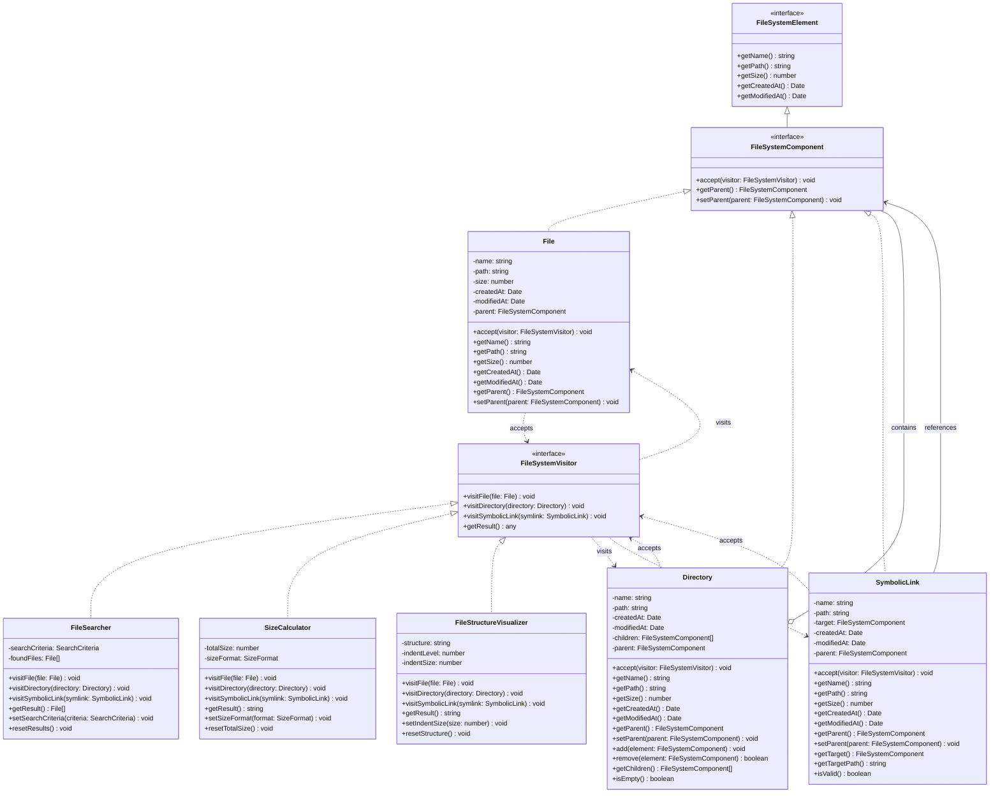
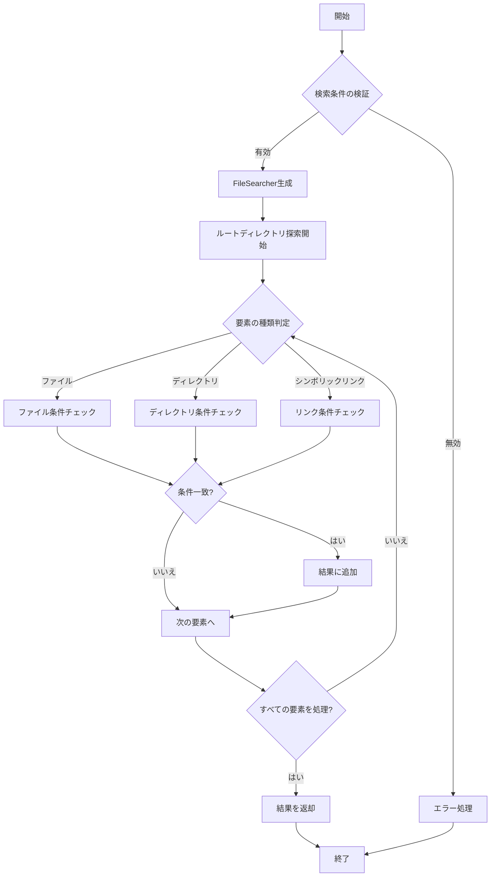
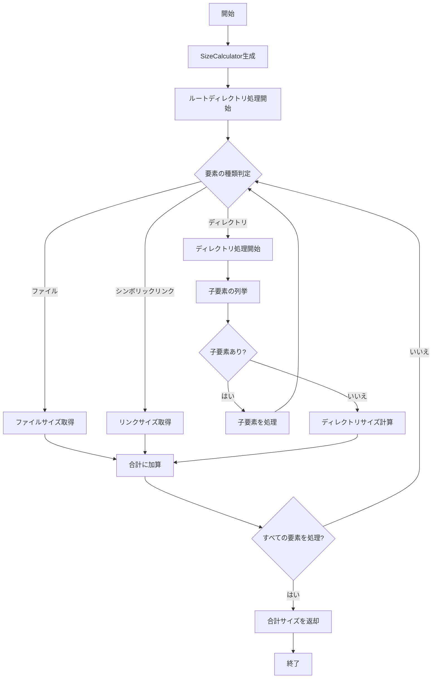
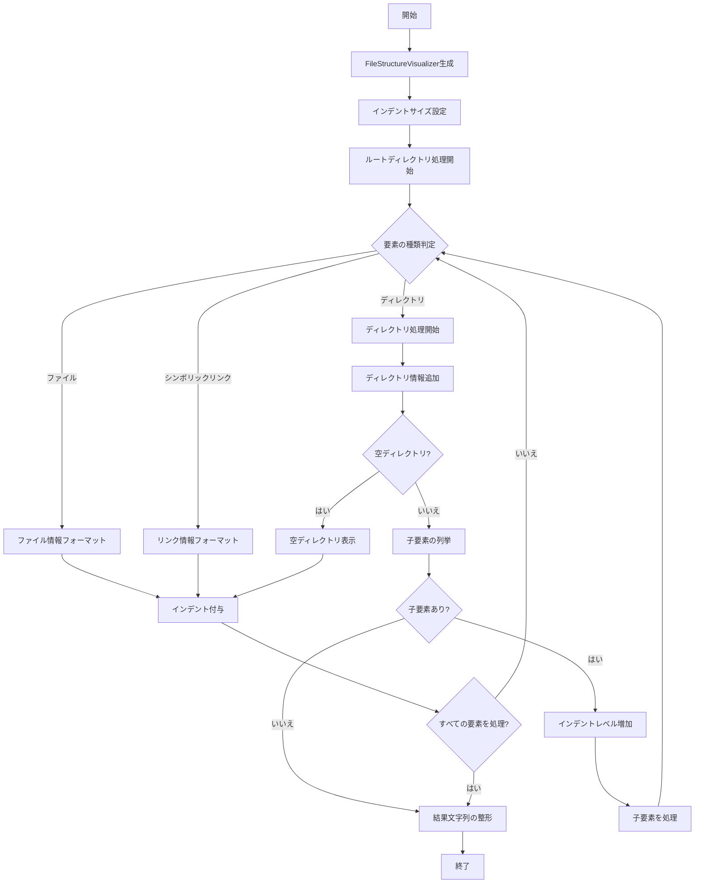
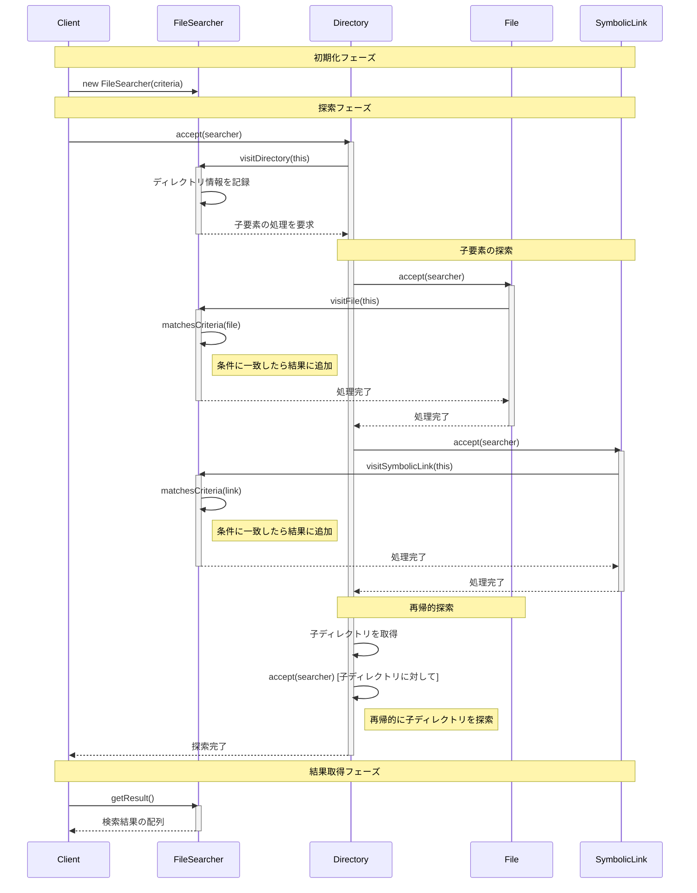
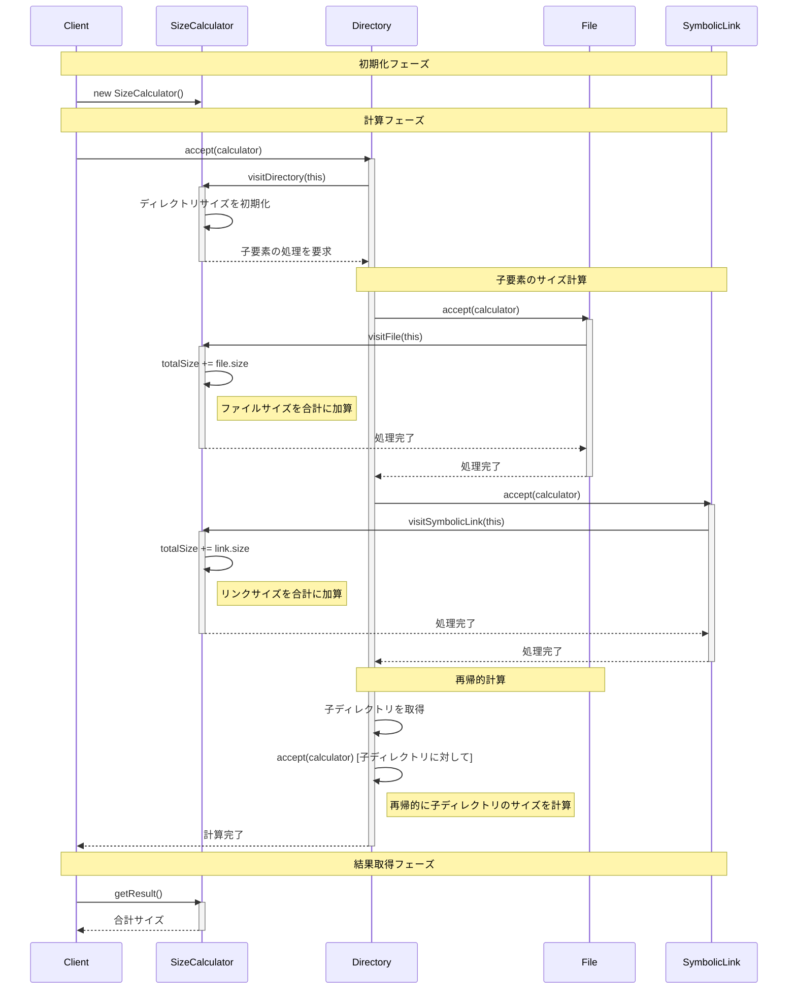
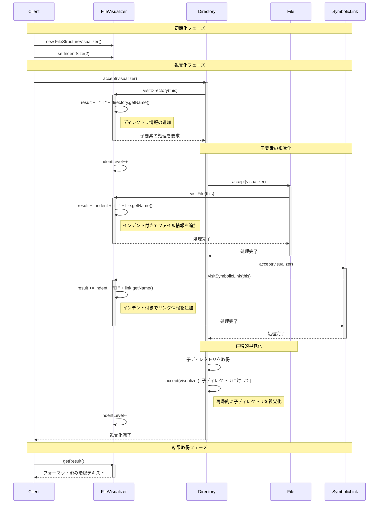

# Visitorパターン - ファイルシステム操作の実装

## 概要

Visitorパターンは、データ構造とそのデータに対する操作を分離するデザインパターンです。このプロジェクトでは、ファイルシステムの操作（検索、サイズ計算、構造視覚化）を実装しています。

このパターンの主な目的は以下の通りです：
- データ構造と操作の分離
- 新しい操作の容易な追加
- データ構造の変更を最小限に抑制

### 主な用途
- ファイルシステムの探索と操作
- 複雑なデータ構造の処理
- レポート生成
- データ解析

## システム設計

### 1. 基本構成
ファイルシステム操作のためのVisitorパターン実装は、以下のコンポーネントで構成されます：

- **FileSystemVisitor**：ファイルシステム要素を訪問するVisitorのインターフェース
- **FileSystemElement**：基本的なファイルシステム要素のインターフェース
- **FileSystemComponent**：Visitorを受け入れる機能を持つファイルシステム要素のインターフェース
- **具象要素クラス**：File、Directory、SymbolicLinkなどの具体的なファイルシステム要素
- **具象Visitorクラス**：FileSearcher、SizeCalculator、FileStructureVisualizerなどの特定の処理を行うVisitor

### 2. クラス構造
以下のクラス図は、Visitorパターンを使用したファイルシステム操作の構造を示しています：



このクラス図は以下のような関係を示しています：

1. **FileSystemElement**は基本的なファイルシステム要素のインターフェースです。
2. **FileSystemComponent**はFileSystemElementを継承し、Visitorパターンを実装するためのacceptメソッドを追加します。
3. **File**、**Directory**、**SymbolicLink**はFileSystemComponentインターフェースを実装した具象クラスです。
4. **FileSystemVisitor**はVisitorのインターフェースで、各要素タイプに対する訪問メソッドを定義します。
5. **FileSearcher**、**SizeCalculator**、**FileStructureVisualizer**はFileSystemVisitorを実装した具象クラスで、特定の操作を行います。
6. **Directory**は子要素としてFileSystemComponentのコレクションを持ちます（Compositeパターン）。
7. **SymbolicLink**は他のFileSystemComponentへの参照を持ちます。

### 3. 処理フロー

#### 3.1 ファイル検索フロー


このフロー図は、ファイル検索の処理手順を示しています：

1. **前処理フェーズ**
   - 検索条件の妥当性を検証
     - 名前パターンの有効性
     - サイズ範囲の整合性
     - 日時範囲の整合性
   - 無効な条件の場合はエラー処理

2. **初期化フェーズ**
   - FileSearcherインスタンスの生成
   - 内部状態の初期化
   - 探索準備の完了

3. **探索フェーズ**
   - 要素の種類に応じた処理分岐
     - ファイル：名前、サイズ、日時の条件チェック
     - ディレクトリ：名前と属性の条件チェック
     - シンボリックリンク：リンク名と参照先の条件チェック
   - 条件一致時の結果追加
   - 次の要素への移動

4. **終了フェーズ**
   - すべての要素の処理完了確認
   - 結果の返却
   - リソースの解放

#### 3.2 サイズ計算フロー


このフロー図は、サイズ計算の処理手順を示しています：

1. **初期化フェーズ**
   - SizeCalculatorインスタンスの生成
   - 合計サイズの初期化
   - サイズ詳細マップの準備

2. **計算フェーズ**
   - 要素の種類に応じた処理
     - ファイル：直接サイズを取得して加算
     - ディレクトリ：子要素を再帰的に処理
     - シンボリックリンク：リンク自体のサイズを加算
   - 各要素のサイズを詳細マップに記録

3. **集計フェーズ**
   - ディレクトリの場合は子要素のサイズを合算
   - 合計サイズの更新
   - パスごとのサイズ情報の管理

4. **終了フェーズ**
   - すべての要素の処理完了確認
   - 最終的な合計サイズの計算
   - 結果の返却

#### 3.3 構造視覚化フロー


このフロー図は、構造視覚化の処理手順を示しています：

1. **初期化フェーズ**
   - クライアントがFileStructureVisualizerインスタンスを生成
   - インデントサイズを設定
   - 結果文字列バッファを初期化

2. **視覚化フェーズ**
   - 要素の種類に応じた処理
     - ファイル：📄アイコンと情報を追加
     - ディレクトリ：📁アイコンと情報を追加
     - シンボリックリンク：🔗アイコンと情報を追加
   - インデントレベルの管理
   - 空ディレクトリの特別処理

3. **フォーマットフェーズ**
   - 適切なインデントの付与
   - アイコンと情報の配置
   - 改行の挿入

4. **終了フェーズ**
   - すべての要素の処理完了確認
   - 結果文字列の最終整形
   - 余分な改行の削除 

### 4. シーケンス図

#### 4.1 ファイル検索プロセス


#### 4.2 サイズ計算プロセス


#### 4.3 構造視覚化プロセス


## 実装

### 1. 基本インターフェース
```typescript
/**
 * ファイルシステム要素のインターフェース
 * 
 * ファイル、ディレクトリ、シンボリックリンクなどの共通インターフェースを定義します。
 * 基本的な属性へのアクセス機能を提供します。
 */
export interface FileSystemElement {
    /**
     * 要素の名前を取得します
     * @returns 要素の名前
     */
    getName(): string;
    
    /**
     * 要素の絶対パスを取得します
     * @returns 要素の絶対パス
     */
    getPath(): string;
    
    /**
     * 要素のサイズを取得します（バイト単位）
     * @returns サイズ（バイト）
     */
    getSize(): number;
    
    /**
     * 要素の作成日時を取得します
     * @returns 作成日時
     */
    getCreatedAt(): Date;
    
    /**
     * 要素の最終更新日時を取得します
     * @returns 最終更新日時
     */
    getModifiedAt(): Date;
}

/**
 * ファイルシステムVisitorのインターフェース
 * 
 * ファイルシステム要素を訪問し、それぞれの要素に対して特定の操作を実行します。
 * 新しい操作を追加する際は、このインターフェースを実装する新しいVisitorを作成します。
 */
export interface FileSystemVisitor {
    /**
     * ファイルを訪問します
     * @param file 訪問するファイル
     */
    visitFile(file: File): void;

    /**
     * ディレクトリを訪問します
     * @param directory 訪問するディレクトリ
     */
    visitDirectory(directory: Directory): void;

    /**
     * シンボリックリンクを訪問します
     * @param symlink 訪問するシンボリックリンク
     */
    visitSymbolicLink(symlink: SymbolicLink): void;

    /**
     * 訪問結果を取得します
     * @returns 訪問結果
     */
    getResult(): any;
}

/**
 * ファイルシステムコンポーネントのインターフェース
 * 
 * Visitorパターンと連携するための拡張インターフェースです。
 * FileSystemElementを継承し、visitorを受け入れるacceptメソッドを追加します。
 */
export interface FileSystemComponent extends FileSystemElement {
    /**
     * Visitorを受け入れます
     * @param visitor 訪問者
     */
    accept(visitor: FileSystemVisitor): void;
}
```

### 2. ファイル検索の実装
```typescript
/**
 * 検索条件を定義するインターフェース
 */
export interface SearchCriteria {
    name?: RegExp;           // ファイル名のパターン
    minSize?: number;        // 最小サイズ（バイト）
    maxSize?: number;        // 最大サイズ（バイト）
    createdAfter?: Date;     // この日時以降に作成
    createdBefore?: Date;    // この日時以前に作成
    modifiedAfter?: Date;    // この日時以降に更新
    modifiedBefore?: Date;   // この日時以前に更新
}

/**
 * ファイル検索を実行するVisitorクラス
 */
export class FileSearcher implements FileSystemVisitor {
    private results: FileSystemElement[] = [];
    private criteria: SearchCriteria;

    constructor(criteria: SearchCriteria) {
        this.criteria = criteria;
        this.reset();
    }

    visitFile(file: File): void {
        if (this.matchesCriteria(file)) {
            this.results.push(file);
        }
    }

    visitDirectory(directory: Directory): void {
        if (this.matchesCriteria(directory)) {
            this.results.push(directory);
        }
        for (const child of directory.getChildren()) {
            child.accept(this);
        }
    }

    visitSymbolicLink(symlink: SymbolicLink): void {
        if (this.matchesCriteria(symlink)) {
            this.results.push(symlink);
        }
        const target = symlink.getTarget();
        if (target) {
            target.accept(this);
        }
    }

    getResult(): FileSystemElement[] {
        return [...this.results];
    }

    private matchesCriteria(element: FileSystemElement): boolean {
        const { name, minSize, maxSize, createdAfter, createdBefore, 
                modifiedAfter, modifiedBefore } = this.criteria;

        if (name && !name.test(element.getName())) return false;
        
        const size = element.getSize();
        if (minSize !== undefined && size < minSize) return false;
        if (maxSize !== undefined && size > maxSize) return false;

        const createdAt = element.getCreatedAt();
        if (createdAfter && createdAt < createdAfter) return false;
        if (createdBefore && createdAt > createdBefore) return false;

        const modifiedAt = element.getModifiedAt();
        if (modifiedAfter && modifiedAt < modifiedAfter) return false;
        if (modifiedBefore && modifiedAt > modifiedBefore) return false;

        return true;
    }

    reset(): void {
        this.results = [];
    }
}
```

### 3. サイズ計算の実装
```typescript
/**
 * ファイルシステム要素のサイズを計算するVisitorクラス
 */
export class SizeCalculator implements FileSystemVisitor {
    private totalSize: number = 0;
    private details: Map<string, number> = new Map();

    visitFile(file: File): void {
        const size = file.getSize();
        this.totalSize += size;
        this.details.set(file.getPath(), size);
    }

    visitDirectory(directory: Directory): void {
        let dirSize = 0;
        for (const child of directory.getChildren()) {
            const prevSize = this.totalSize;
            child.accept(this);
            dirSize += this.totalSize - prevSize;
        }
        this.details.set(directory.getPath(), dirSize);
    }

    visitSymbolicLink(symlink: SymbolicLink): void {
        const size = symlink.getSize();
        this.totalSize += size;
        this.details.set(symlink.getPath(), size);
    }

    getResult(): number {
        return this.totalSize;
    }

    reset(): void {
        this.totalSize = 0;
        this.details.clear();
    }

    static formatSize(bytes: number): string {
        const units = ['B', 'KB', 'MB', 'GB', 'TB'];
        let size = bytes;
        let unitIndex = 0;

        while (size >= 1024 && unitIndex < units.length - 1) {
            size /= 1024;
            unitIndex++;
        }

        return `${size.toFixed(1)} ${units[unitIndex]}`;
    }
}
```

### 4. 構造視覚化の実装
```typescript
/**
 * ファイルシステムの階層構造を視覚化するVisitorクラス
 */
export class FileStructureVisualizer implements FileSystemVisitor {
    private result: string = '';
    private currentIndent: number = 0;
    private indentSize: number = 2;

    setIndentSize(size: number): void {
        if (size < 1) {
            throw new Error('インデントサイズは1以上の整数である必要があります');
        }
        this.indentSize = size;
    }

    visitFile(file: File): void {
        this.result += this.getIndentation();
        this.result += `📄 ${file.getName()} (${this.formatSize(file.getSize())})`;
        this.result += '\n';
    }

    visitDirectory(directory: Directory): void {
        this.result += this.getIndentation();
        this.result += `📁 ${directory.getName()} (${this.formatSize(directory.getSize())})`;
        this.result += '\n';

        if (directory.isEmpty()) {
            this.currentIndent++;
            this.result += this.getIndentation();
            this.result += '(空のディレクトリ)';
            this.result += '\n';
            this.currentIndent--;
            return;
        }

        this.currentIndent++;
        for (const child of directory.getChildren()) {
            child.accept(this);
        }
        this.currentIndent--;
    }

    visitSymbolicLink(symlink: SymbolicLink): void {
        this.result += this.getIndentation();
        this.result += `🔗 ${symlink.getName()} -> ${symlink.getTargetPath()} `;
        this.result += `(${this.formatSize(symlink.getSize())})`;
        this.result += '\n';
    }

    getResult(): string {
        return this.result.trim();
    }

    private getIndentation(): string {
        return ' '.repeat(this.currentIndent * this.indentSize);
    }

    private formatSize(bytes: number): string {
        const units = ['B', 'KB', 'MB', 'GB', 'TB'];
        let size = bytes;
        let unitIndex = 0;

        while (size >= 1024 && unitIndex < units.length - 1) {
            size /= 1024;
            unitIndex++;
        }

        return `${size.toFixed(1)} ${units[unitIndex]}`;
    }

    reset(): void {
        this.result = '';
        this.currentIndent = 0;
    }
}
```

### 5. 使用例

```typescript
// ファイルシステム構造の構築
const root = new Directory("root", "/");

// ディレクトリの作成
const home = new Directory("home", "/home");
const user = new Directory("user", "/home/user");
const documents = new Directory("documents", "/home/user/documents");
const pictures = new Directory("pictures", "/home/user/pictures");

// ファイルの作成
const resume = new File("resume.pdf", 1024 * 1024, "/home/user/documents/resume.pdf");
const report = new File("report.docx", 2.5 * 1024 * 1024, "/home/user/documents/report.docx");
const photo1 = new File("vacation.jpg", 5 * 1024 * 1024, "/home/user/pictures/vacation.jpg");
const photo2 = new File("family.jpg", 3.2 * 1024 * 1024, "/home/user/pictures/family.jpg");
const config = new File(".config", 2048, "/home/user/.config");

// シンボリックリンクの作成
const resumeLink = new SymbolicLink("resume-link", resume, "/home/user/resume-link");

// ディレクトリ構造の構築
root.add(home);
home.add(user);
user.add(documents);
user.add(pictures);
user.add(config);
documents.add(resume);
documents.add(report);
pictures.add(photo1);
pictures.add(photo2);
user.add(resumeLink);

// ファイル検索の使用例
const criteria: SearchCriteria = {
  name: /\.jpg$/,
  minSize: 1024 * 1024,
  maxSize: 10 * 1024 * 1024
};
const fileSearcher = new FileSearcher(criteria);

// ルートディレクトリから検索を開始
root.accept(fileSearcher);

// 検索結果の取得と表示
const foundFiles = fileSearcher.getResult();
console.log("JPG画像ファイル検索結果:");
foundFiles.forEach(file => {
  console.log(`- ${file.getName()}: ${file.getSize()} bytes (${file.getPath()})`);
});

// サイズ計算の使用例
const sizeCalculator = new SizeCalculator();

// picturesディレクトリのサイズを計算
pictures.accept(sizeCalculator);
console.log(`写真ディレクトリのサイズ: ${SizeCalculator.formatSize(sizeCalculator.getResult())}`);

// rootディレクトリのサイズを計算
sizeCalculator.reset();
root.accept(sizeCalculator);
console.log(`総合ディレクトリサイズ: ${SizeCalculator.formatSize(sizeCalculator.getResult())}`);

// ファイル構造の視覚化の使用例
const visualizer = new FileStructureVisualizer();
visualizer.setIndentSize(2); // インデントサイズの設定

// ルートディレクトリの構造を視覚化
root.accept(visualizer);
console.log("ファイル構造:");
console.log(visualizer.getResult());
```

出力例：
```
JPG画像ファイル検索結果:
- vacation.jpg: 5242880 bytes (/home/user/pictures/vacation.jpg)
- family.jpg: 3355443 bytes (/home/user/pictures/family.jpg)
写真ディレクトリのサイズ: 8.2 MB
総合ディレクトリサイズ: 12.1 MB
ファイル構造:
/
└─ home/
   └─ user/
      ├─ documents/
      │  ├─ resume.pdf (1.0 MB)
      │  └─ report.docx (2.5 MB)
      ├─ pictures/
      │  ├─ vacation.jpg (5.0 MB)
      │  └─ family.jpg (3.2 MB)
      ├─ .config (2.0 KB)
      └─ resume-link -> /home/user/documents/resume.pdf (1.0 MB)
```

## テスト戦略

### 1. テストの種類と目的
ファイルシステムのVisitorパターン実装をテストするために、以下のテストを実施します：

1. **単体テスト**：
   - 各Visitorクラスが個別に正しく動作することを確認
   - 各ファイルシステム要素クラスが正しく状態を管理していることを確認
   - エラーケースや境界条件のハンドリングを検証

2. **統合テスト**：
   - 複数のVisitorが同じファイルシステム構造に対して連続して動作することを確認
   - 実際のユースケースを模擬したシナリオテスト

3. **パフォーマンステスト**：
   - 大規模なファイルシステム構造に対する効率性の検証
   - メモリ使用量の監視

### 2. テストケース例

#### FileSearcherのテスト

```typescript
describe('FileSearcher', () => {
  let root: Directory;
  let documents: Directory;
  let pictures: Directory;
  let textFile1: File;
  let textFile2: File;
  let imageFile1: File;
  let imageFile2: File;
    let searcher: FileSearcher;

    beforeEach(() => {
    // テスト用のファイルシステム構造を構築
    root = new Directory('root');
    documents = new Directory('documents', '/documents');
    pictures = new Directory('pictures', '/pictures');
    
    textFile1 = new File('report.txt', 1024, '/documents/report.txt');
    textFile2 = new File('notes.txt', 512, '/documents/notes.txt');
    imageFile1 = new File('photo.jpg', 2048, '/pictures/photo.jpg');
    imageFile2 = new File('screenshot.png', 4096, '/pictures/screenshot.png');
    
    root.add(documents);
    root.add(pictures);
    documents.add(textFile1);
    documents.add(textFile2);
    pictures.add(imageFile1);
    pictures.add(imageFile2);
    
    searcher = new FileSearcher();
  });
  
  test('名前パターンによるファイル検索', () => {
    searcher.setSearchCriteria({ namePattern: /\.txt$/ });
    root.accept(searcher);
    const result = searcher.getResult();
    
    expect(result.length).toBe(2);
    expect(result).toContain(textFile1);
    expect(result).toContain(textFile2);
    expect(result).not.toContain(imageFile1);
    expect(result).not.toContain(imageFile2);
  });
  
  test('サイズ範囲によるファイル検索', () => {
    searcher.setSearchCriteria({ minSize: 1000, maxSize: 3000 });
    root.accept(searcher);
    const result = searcher.getResult();
    
    expect(result.length).toBe(2);
    expect(result).toContain(textFile1);
    expect(result).toContain(imageFile1);
    expect(result).not.toContain(textFile2); // 512バイトは範囲外
    expect(result).not.toContain(imageFile2); // 4096バイトは範囲外
  });
  
  test('複合条件によるファイル検索', () => {
    searcher.setSearchCriteria({
      namePattern: /\.(jpg|png)$/,
      minSize: 3000
    });
    root.accept(searcher);
    const result = searcher.getResult();
    
    expect(result.length).toBe(1);
    expect(result).toContain(imageFile2);
  });
  
  test('不正な検索条件の処理', () => {
    // 不正な正規表現パターン
    expect(() => {
      searcher.setSearchCriteria({ namePattern: /[/ });
    }).toThrow();
    
    // 負のサイズ値
    expect(() => {
      searcher.setSearchCriteria({ minSize: -100 });
    }).toThrow();
  });
});
```

#### SizeCalculatorのテスト

```typescript
describe('SizeCalculator', () => {
  let root: Directory;
  let file1: File;
  let file2: File;
  let emptyDir: Directory;
  let calculator: SizeCalculator;
  
  beforeEach(() => {
    root = new Directory('root', '/');
    file1 = new File('file1.txt', 1024, '/file1.txt');
    file2 = new File('file2.txt', 2048, '/file2.txt');
    emptyDir = new Directory('empty', '/empty');
    
    root.add(file1);
    root.add(file2);
    root.add(emptyDir);
    
    calculator = new SizeCalculator();
  });
  
  test('ファイルシステム全体のサイズ計算', () => {
    root.accept(calculator);
    
    // ファイル合計: 1024 + 2048 = 3072
    // ディレクトリメタデータサイズ: root: 4096, empty: 4096 = 8192
    // 合計: 11264バイト
    
    calculator.setSizeFormat('bytes');
    expect(calculator.getResult()).toBe('11264 bytes');
    
    calculator.setSizeFormat('human');
    expect(calculator.getResult()).toBe('11.0 KB');
  });
  
  test('空のディレクトリサイズ計算', () => {
    emptyDir.accept(calculator);
    
    calculator.setSizeFormat('bytes');
    expect(calculator.getResult()).toBe('4096 bytes'); // ディレクトリメタデータのみ
  });
  
  test('計算リセット機能', () => {
    root.accept(calculator);
    expect(parseInt(calculator.getResult())).toBeGreaterThan(0);
    
    calculator.resetTotalSize();
    calculator.setSizeFormat('bytes');
    expect(calculator.getResult()).toBe('0 bytes');
  });
});
```

#### FileStructureVisualizerのテスト

```typescript
describe('FileStructureVisualizer', () => {
  let root: Directory;
  let documents: Directory;
  let imageFile: File;
  let visualizer: FileStructureVisualizer;
  
  beforeEach(() => {
    root = new Directory('root', '/');
    documents = new Directory('documents', '/documents');
    imageFile = new File('photo.jpg', 1024 * 1024, '/documents/photo.jpg');
    
    root.add(documents);
    documents.add(imageFile);
    
    visualizer = new FileStructureVisualizer();
  });
  
  test('ファイル構造の視覚化', () => {
    root.accept(visualizer);
    const result = visualizer.getResult();
    
    // 結果に特定の構造が含まれていることを確認
    expect(result).toContain('/');
    expect(result).toContain('documents/');
    expect(result).toContain('photo.jpg');
    expect(result).toContain('1.0 MB'); // サイズ表示
  });
  
  test('インデントサイズの設定', () => {
    visualizer.setIndentSize(4);
    root.accept(visualizer);
    const result = visualizer.getResult();
    
    // 4スペースのインデントが使用されていることを確認
    expect(result).toContain('\n    ');
  });
  
  test('不正なインデントサイズの処理', () => {
    expect(() => {
      visualizer.setIndentSize(-1);
    }).toThrow();
    
    expect(() => {
      visualizer.setIndentSize(0);
    }).toThrow();
  });
});
```

#### 統合テスト

```typescript
describe('Visitor統合テスト', () => {
  let fileSystem: Directory;
  
  beforeEach(() => {
    // 複雑なファイルシステム構造を構築
    fileSystem = createTestFileSystem();
  });
  
  test('複数のVisitorの連続適用', () => {
    // ファイル検索
    const searcher = new FileSearcher();
    searcher.setSearchCriteria({ namePattern: /\.txt$/ });
    fileSystem.accept(searcher);
    const searchResults = searcher.getResult();
    
    // サイズ計算
    const calculator = new SizeCalculator();
    fileSystem.accept(calculator);
    const totalSize = calculator.getResult();
    
    // 構造視覚化
    const visualizer = new FileStructureVisualizer();
    fileSystem.accept(visualizer);
    const structure = visualizer.getResult();
    
    // 検証
    expect(searchResults.length).toBe(3); // .tsファイルは3つ
    expect(totalSize).toBeGreaterThan(15000); // 合計サイズは15KB以上
    expect(structure).toContain('project');
    expect(structure).toContain('src');
    expect(structure).toContain('tests');
    expect(structure).toContain('docs');
  });
});
```

### 3. カバレッジ目標

以下のカバレッジ目標を設定します：

- **ステートメントカバレッジ**: 90%以上
- **分岐カバレッジ**: 85%以上
- **関数カバレッジ**: 95%以上
- **行カバレッジ**: 90%以上

### 4. テスト実行方法

テストはJestフレームワークを使用して実行します：

```bash
# すべてのテストを実行
npm test

# 特定のテストファイルのみ実行
npm test -- FileSearcher.test.ts

# カバレッジレポートの生成
npm test -- --coverage
```

### 5. セキュリティ考慮事項

ファイルシステム操作に関連するセキュリティ考慮事項として、以下の点に注意します：

1. **無限再帰の防止**:
   - シンボリックリンクが循環参照を作成している場合の無限再帰を防止するメカニズム
   - 訪問した要素を追跡する訪問履歴の管理

   ```typescript
   class SafeFileSystemVisitor implements FileSystemVisitor {
     private visitedPaths = new Set<string>();
     
     visitDirectory(directory: Directory): void {
       const path = directory.getPath();
       if (this.visitedPaths.has(path)) {
         // 循環検出、処理をスキップ
         return;
       }
       
       this.visitedPaths.add(path);
       // 通常の処理...
     }
   }
   ```

2. **リソース消費の制限**:
   - 大きなファイルシステム構造を処理する際のメモリ使用量の制限
   - 処理時間の制限と定期的な進捗報告

```typescript
   class ResourceAwareVisitor implements FileSystemVisitor {
     private processedCount = 0;
     private readonly maxItems = 10000;
     
     visitFile(file: File): void {
       if (this.processedCount >= this.maxItems) {
         throw new Error("処理項目数の上限に達しました");
       }
       
       this.processedCount++;
       // 通常の処理...
     }
   }
   ```

3. **入力検証**:
   - ファイル名やパスに含まれる特殊文字の適切な処理
   - 検索パターンなどのユーザー入力の検証

   ```typescript
   class ValidatingFileSearcher extends FileSearcher {
     setSearchCriteria(criteria: SearchCriteria): void {
       // namePatternの検証
       if (criteria.namePattern && !(criteria.namePattern instanceof RegExp)) {
         throw new Error("namePatternは有効な正規表現である必要があります");
       }
       
       // サイズ範囲の検証
        if (criteria.minSize !== undefined && criteria.minSize < 0) {
         throw new Error("minSizeは0以上である必要があります");
       }
       
       if (criteria.maxSize !== undefined && criteria.maxSize < 0) {
         throw new Error("maxSizeは0以上である必要があります");
       }
       
       if (criteria.minSize !== undefined && 
           criteria.maxSize !== undefined && 
           criteria.minSize > criteria.maxSize) {
         throw new Error("minSizeはmaxSize以下である必要があります");
       }
       
       super.setSearchCriteria(criteria);
    }
}
```

## 実装の評価

Visitorパターンは、データ構造と操作を分離することで、新しい機能を容易に追加できるようにするための強力なデザインパターンです。このドキュメントでは、ファイルシステム操作の文脈でVisitorパターンの実装例を示しました。

### 主要なポイント

1. **分離の原則**
   - データ構造（ファイル、ディレクトリ）と操作（検索、計算、視覚化）を明確に分離
   - 新しい操作を追加する際にデータ構造を変更する必要がない

2. **拡張性**
   - 新しいビジターを追加するだけで、新機能を実装可能
   - データ構造の変更に強い設計

3. **クリーンな実装**
   - インターフェースを通じた明確な責任分担
   - 型安全なポリモーフィックな操作

4. **実践的な応用**
   - ファイルシステム
   - 抽象構文木
   - UI要素
   - データ構造

### 注意点

1. **複雑性**
   - クラス数が増加する可能性
   - 関連するインターフェースと実装の理解が必要

2. **パフォーマンス考慮**
   - 再帰処理の最適化
   - メモリ使用量の管理

3. **適用範囲**
   - 安定したデータ構造に対して最も効果的
   - 頻繁に変更されるデータ構造には不向き

Visitorパターンは、「操作」と「データ」の分離を重視する状況で特に価値を発揮します。このパターンを適切に活用することで、保守性、拡張性、そして再利用性の高いコードを実現することができます。

## 参考資料

1. Gamma, E., Helm, R., Johnson, R., & Vlissides, J. (1994). Design Patterns: Elements of Reusable Object-Oriented Software. Addison-Wesley.
2. Martin, R. C. (2017). Clean Architecture: A Craftsman's Guide to Software Structure and Design. Prentice Hall.
3. Fowler, M. (2002). Patterns of Enterprise Application Architecture. Addison-Wesley.
4. [TypeScript Documentation](https://www.typescriptlang.org/docs/)
5. [リファクタリング・グル - Visitorパターン](https://refactoring.guru/ja/design-patterns/visitor) 