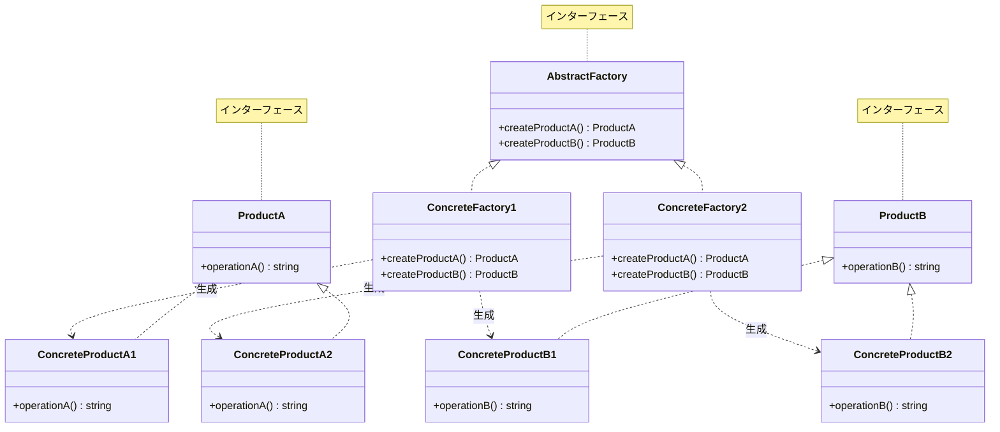
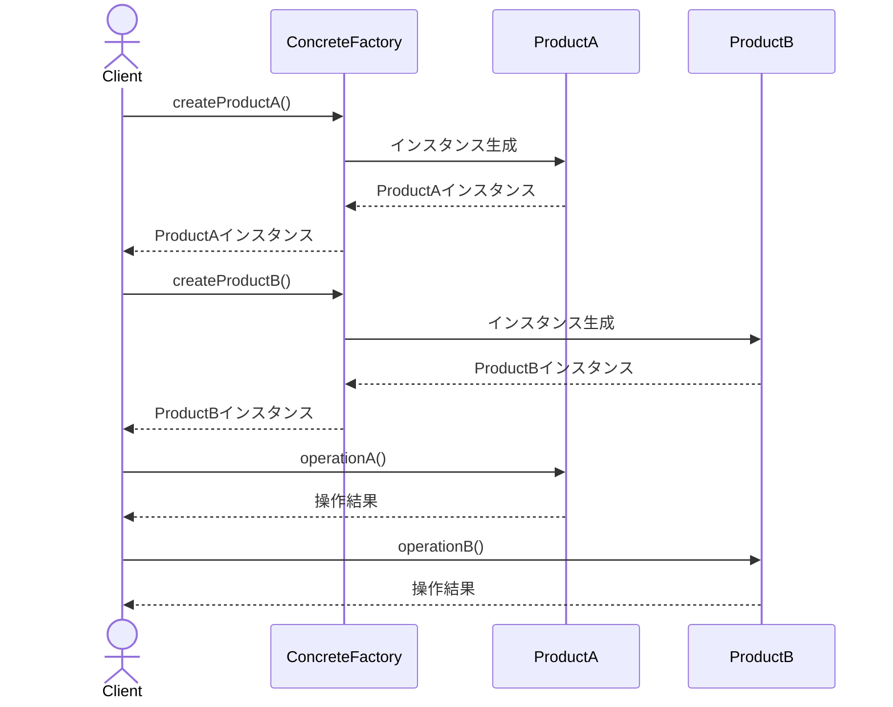
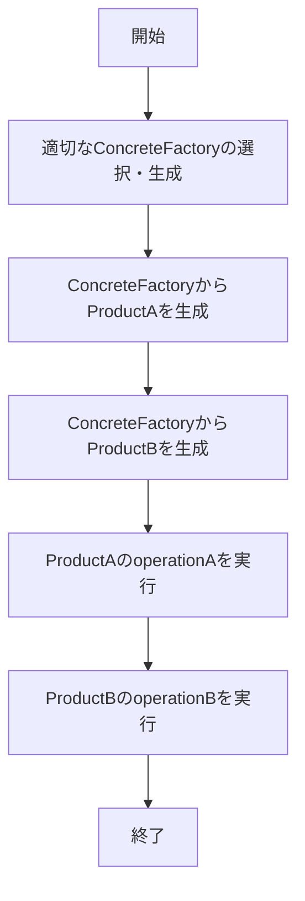

# Abstract Factoryパターン - GUI要素生成システム実装

## 1. 概要

### 1.1 パターンの定義
Abstract Factoryパターンは、関連する一連のオブジェクトファミリー（製品ファミリー）を、具象クラスを指定せずに生成するためのインターフェースを提供するデザインパターンです。クライアントはオブジェクトの生成方法を知ることなく、異なるファミリーに属する製品を一貫性を持って生成できます。

### 1.2 目的・解決する問題
- 関連する製品ファミリーの一貫性を保証する
- 製品の実装を変更せずに異なるファミリーの製品に切り替える柔軟性を提供する
- 製品の生成と利用のコードを分離する
- クロスプラットフォーム対応やマルチテーマUIなど、製品間の互換性が重要な場合に使用する
- オブジェクト生成の詳細をクライアントから隠蔽し、インターフェースを通じた操作を可能にする

### 1.3 コンテキスト・適用場面
- クロスプラットフォームGUIの実装
- データベースアクセスの抽象化（異なるDBMSへの切り替え）
- マルチテーマUIの実装
- プラグインシステムの構築
- システムが複数の製品ファミリーをサポートする必要があり、具体的な製品クラスはコンパイル時に不明な場合
- 関連する製品オブジェクト群の連携が重要で、実装の整合性を保つ必要がある場合

## 2. クラス構造

### 2.1 クラス図


### 2.2 主要コンポーネント

| コンポーネント | 種類 | 責務 | 関連 |
|-------------|------|------|------|
| AbstractFactory | インターフェース | 異なる種類の抽象製品を生成するためのインターフェースを定義 | ConcreteFactory1, ConcreteFactory2により実装される |
| ConcreteFactory1 | 具象クラス | 第1バリエーションの製品ファミリーを生成する具体的な実装 | AbstractFactoryを実装、ConcreteProductA1、ConcreteProductB1を生成 |
| ConcreteFactory2 | 具象クラス | 第2バリエーションの製品ファミリーを生成する具体的な実装 | AbstractFactoryを実装、ConcreteProductA2、ConcreteProductB2を生成 |
| ProductA | インターフェース | 製品Aのインターフェースを定義 | ConcreteProductA1, ConcreteProductA2により実装される |
| ProductB | インターフェース | 製品Bのインターフェースを定義、製品Aとのコラボレーション機能を含む | ConcreteProductB1, ConcreteProductB2により実装される |
| ConcreteProductA1 | 具象クラス | 製品Aの第1バリエーションの具体的な実装 | ProductAを実装 |
| ConcreteProductA2 | 具象クラス | 製品Aの第2バリエーションの具体的な実装 | ProductAを実装 |
| ConcreteProductB1 | 具象クラス | 製品Bの第1バリエーションの具体的な実装、ProductAとの連携が可能 | ProductBを実装 |
| ConcreteProductB2 | 具象クラス | 製品Bの第2バリエーションの具体的な実装、ProductAとの連携が可能 | ProductBを実装 |

### 2.3 相互作用
- AbstractFactoryは複数の製品生成メソッドを持ち、それぞれが対応する抽象製品インターフェースを返す
- 各ConcreteFactoryは AbstractFactoryを実装し、特定の製品ファミリーに属する製品インスタンスを返す
- 同じConcreteFactoryから生成された製品は互いに連携できるように設計されている
- クライアントはAbstractFactoryとProductインターフェースを通じて操作し、具象クラスに依存しない
- 製品間のコラボレーションは抽象インターフェースを通じて行われるため、異なるファミリーの製品でも互換性がある

## 3. 振る舞い

### 3.1 シーケンス図


### 3.2 プロセスフロー


### 3.3 重要なシナリオ

#### シナリオ1: 同一ファミリー内での製品連携
1. クライアントがConcreteFactory1のインスタンスを生成
2. クライアントがfactory.createProductA()を呼び出してProductA1を取得
3. クライアントがfactory.createProductB()を呼び出してProductB1を取得
4. クライアントがproductA.operationA()を実行して結果を取得
5. クライアントがproductB.operationB()を実行
6. 製品の連携結果がクライアントに返される

#### シナリオ2: ファミリー間での製品互換性
1. クライアントがConcreteFactory1とConcreteFactory2のインスタンスを生成
2. クライアントがfactory1.createProductA()を呼び出してProductA1を取得
3. クライアントがfactory2.createProductB()を呼び出してProductB2を取得
4. クライアントがproductB.operationB()を実行
5. 異なるファミリーに属するProductB2がクライアントに返される

## 4. 実装詳細

### 4.1 主要インターフェース・抽象クラス

```typescript
/**
 * 抽象製品A
 * 
 * 製品Aのインターフェースを宣言します。
 * すべての具象製品はこのインターフェースを実装する必要があります。
 */
export interface ProductA {
    /**
     * 製品Aの操作を実行します
     * @returns {string} 操作の結果
     */
    operationA(): string;
}

/**
 * 抽象製品B
 * 
 * 製品Bのインターフェースを宣言します。
 * すべての具象製品はこのインターフェースを実装する必要があります。
 */
export interface ProductB {
    /**
     * 製品Bの操作を実行します
     * @returns {string} 操作の結果
     */
    operationB(): string;
}

/**
 * 抽象ファクトリー
 * 
 * 異なる抽象製品を生成するためのインターフェースを宣言します。
 */
export interface AbstractFactory {
    /**
     * 製品Aを生成します
     * @returns {ProductA} 生成された製品A
     */
    createProductA(): ProductA;

    /**
     * 製品Bを生成します
     * @returns {ProductB} 生成された製品B
     */
    createProductB(): ProductB;
}
```

### 4.2 具象クラス実装例

```typescript
/**
 * 具象製品A1
 * 
 * 製品Aのバリエーション1を実装します。
 */
export class ConcreteProductA1 implements ProductA {
    /**
     * 製品A1の操作を実行します
     * @returns {string} 操作の結果
     */
    public operationA(): string {
        return 'The result of the product A1.';
    }
}

/**
 * 具象製品A2
 * 
 * 製品Aのバリエーション2を実装します。
 */
export class ConcreteProductA2 implements ProductA {
    /**
     * 製品A2の操作を実行します
     * @returns {string} 操作の結果
     */
    public operationA(): string {
        return 'The result of the product A2.';
    }
}

/**
 * 具象製品B1
 * 
 * 製品Bのバリエーション1を実装します。
 */
export class ConcreteProductB1 implements ProductB {
    /**
     * 製品B1の操作を実行します
     * @returns {string} 操作の結果
     */
    public operationB(): string {
        return 'The result of the product B1.';
    }
}

/**
 * 具象製品B2
 * 
 * 製品Bのバリエーション2を実装します。
 */
export class ConcreteProductB2 implements ProductB {
    /**
     * 製品B2の操作を実行します
     * @returns {string} 操作の結果
     */
    public operationB(): string {
        return 'The result of the product B2.';
    }
}

/**
 * 具象ファクトリー1
 * 
 * 製品の第1バリエーションファミリーを生成する具象ファクトリーです。
 */
export class ConcreteFactory1 implements AbstractFactory {
    /**
     * 製品A1を生成します
     * @returns {ProductA} 生成された製品A1
     */
    public createProductA(): ProductA {
        return new ConcreteProductA1();
    }

    /**
     * 製品B1を生成します
     * @returns {ProductB} 生成された製品B1
     */
    public createProductB(): ProductB {
        return new ConcreteProductB1();
    }
}

/**
 * 具象ファクトリー2
 * 
 * 製品の第2バリエーションファミリーを生成する具象ファクトリーです。
 */
export class ConcreteFactory2 implements AbstractFactory {
    /**
     * 製品A2を生成します
     * @returns {ProductA} 生成された製品A2
     */
    public createProductA(): ProductA {
        return new ConcreteProductA2();
    }

    /**
     * 製品B2を生成します
     * @returns {ProductB} 生成された製品B2
     */
    public createProductB(): ProductB {
        return new ConcreteProductB2();
    }
}
```

### 4.3 実装のバリエーション
1. **ファクトリーメソッドベースの実装**: 各製品の生成を個別のファクトリーメソッドに委ねる実装

```typescript
// ファクトリーメソッドベースの実装例
abstract class AbstractFactory {
    // 製品Aの生成を担当するファクトリーメソッド
    protected abstract createProductA(): ProductA;
    
    // 製品Bの生成を担当するファクトリーメソッド
    protected abstract createProductB(): ProductB;
    
    // クライアント向けのインターフェース
    public getProductA(): ProductA {
        return this.createProductA();
    }
    
    public getProductB(): ProductB {
        return this.createProductB();
    }
}
```

2. **プロトタイプベースの実装**: 新しいオブジェクトのプロトタイプをファクトリーに登録し、それをクローンして新しいインスタンスを生成する実装

3. **シングルトンの組み合わせ**: 各ファクトリーをシングルトンとして実装し、アプリケーション全体で一貫して同じファクトリーインスタンスを使用する実装

```typescript
// シングルトンファクトリーの例
export class ConcreteFactory1 implements AbstractFactory {
    private static instance: ConcreteFactory1;
    
    private constructor() { }
    
    public static getInstance(): ConcreteFactory1 {
        if (!ConcreteFactory1.instance) {
            ConcreteFactory1.instance = new ConcreteFactory1();
        }
        return ConcreteFactory1.instance;
    }
    
    // 製品生成メソッド
    // ...
}
```

### 4.4 注意すべき実装ポイント
- ファミリー内の製品は互いに協調して動作できるように設計する必要がある
- 新しい製品タイプを追加する場合、すべてのファクトリーインターフェースとクラスを修正する必要がある（インターフェース変更に注意）
- 製品ファミリーのバリエーションが多い場合、クラス階層が複雑になる可能性がある
- 抽象ファクトリーは通常、複数の製品タイプを生成するため、単一責任の原則に反する可能性がある
- 抽象製品の設計は将来の拡張に備えて十分に抽象化する必要がある

## 5. 使用例

### 5.1 基本的な使用例

```typescript
import { AbstractFactory } from './AbstractFactory';
import { ConcreteFactory1 } from './ConcreteFactories';
import { ProductA, ProductB } from './Products';

// 具象ファクトリーの生成
const factory: AbstractFactory = new ConcreteFactory1();

// ファクトリーから製品を生成
const productA: ProductA = factory.createProductA();
const productB: ProductB = factory.createProductB();

// 製品の操作
console.log(productA.operationA());
// 出力: "The result of the product A1."

console.log(productB.operationB());
// 出力: "The result of the product B1."
```

### 5.2 高度な使用例

```typescript
import { AbstractFactory } from './AbstractFactory';
import { ConcreteFactory1, ConcreteFactory2 } from './ConcreteFactories';
import { ProductA, ProductB } from './Products';

// ファクトリー選択ロジック
function getFactory(type: string): AbstractFactory {
    if (type === 'type1') {
        return new ConcreteFactory1();
    } else if (type === 'type2') {
        return new ConcreteFactory2();
    }
    throw new Error(`Unknown factory type: ${type}`);
}

// 設定またはユーザー入力に基づいてファクトリーを選択
const factoryType = 'type1'; // 実際のアプリケーションではこれは設定または入力からの値
const factory = getFactory(factoryType);

// 製品の生成
const productA = factory.createProductA();
const productB = factory.createProductB();

// 製品の操作とコラボレーション
console.log(productA.operationA());
console.log(productB.operationB());

// クロスファミリーコラボレーション
const factory2 = getFactory('type2');
const productA2 = factory2.createProductA();

// 異なるファミリーの製品間でのコラボレーション
console.log(productB.operationB());
// 出力: "The result of the product B2."
```

## 6. テスト戦略

### 6.1 ユニットテスト要件
- 各ConcreteFactoryが適切なConcreteProduct実装を返すことを確認
- 各ConcreteProductの基本操作が正しく動作することを検証
- 同一ファミリー内の製品間のコラボレーションが期待通りに動作することを確認
- 異なるファミリーに属する製品間のコラボレーションの互換性を検証

### 6.2 テスト実装例

```typescript
describe('Abstract Factory Pattern', () => {
    let factory1: AbstractFactory;
    let factory2: AbstractFactory;

    beforeEach(() => {
        factory1 = new ConcreteFactory1();
        factory2 = new ConcreteFactory2();
    });

    describe('ConcreteFactory1', () => {
        test('should create ProductA1', () => {
            const productA = factory1.createProductA();
            expect(productA.operationA()).toBe('The result of the product A1.');
        });

        test('should create ProductB1', () => {
            const productB = factory1.createProductB();
            expect(productB.operationB()).toBe('The result of the product B1.');
        });
    });

    describe('Cross-factory collaboration', () => {
        test('ProductB1 should collaborate with ProductA2', () => {
            const productA = factory2.createProductA();
            const productB = factory1.createProductB();
            expect(productB.operationB())
                .toBe('The result of the product B2.');
        });

        test('ProductB2 should collaborate with ProductA1', () => {
            const productA = factory1.createProductA();
            const productB = factory2.createProductB();
            expect(productB.operationB())
                .toBe('The result of the product B2.');
        });
    });
});
```

## 7. 評価

### 7.1 メリット
- 製品ファミリーの一貫性を保証し、兼ね合わない製品の組み合わせを防止
- 製品の具象クラスからクライアントコードを分離し、疎結合な設計を実現
- 新しい製品バリエーション（ファミリー）の追加が容易で、既存のコードへの影響が最小限
- オブジェクト生成のロジックを一元管理でき、コードの保守性が向上
- 製品ファミリー間の切り替えが容易で、実行時の柔軟性が高い

### 7.2 デメリット・制約
- 新しい製品種類の追加が困難（すべてのファクトリーインターフェースと実装クラスを変更する必要がある）
- 製品ファミリーが多い場合、多数のクラスが必要となり、システムの複雑さが増す
- 抽象ファクトリーが多くの製品生成メソッドを持つ場合、単一責任の原則に違反する可能性がある
- 製品間の関係が複雑になると、実装とテストが困難になる場合がある
- 小規模なシステムでは過剰な抽象化となる可能性がある

### 7.3 代替パターン・関連パターン
- **Factory Method**: 単一の製品クラスを扱う場合に適している。Abstract Factoryは複数の関連する製品ファミリーを作成
- **Builder**: 複雑なオブジェクトを段階的に構築するパターン。Abstract Factoryは関連するオブジェクト群を即時に生成
- **Prototype**: 既存のオブジェクトをコピーして新しいオブジェクトを作成するパターン。Abstract Factoryと組み合わせて使用可能
- **Singleton**: Abstract Factoryの実装がシングルトンとして設計されることが多い
- **Dependency Injection**: オブジェクトの生成と使用を分離する別のアプローチ

## 8. 参考資料

### 8.1 内部リンク
- [ソースコードへのリンク](../../src/creational/abstract-factory)
- [テストコードへのリンク](../../tests/creational/abstract-factory)

### 8.2 外部リンク
- [リファクタリング・グル - Abstract Factoryパターン](https://refactoring.guru/ja/design-patterns/abstract-factory)
- [Head First デザインパターン](https://www.oreilly.co.jp/books/9784873119762/)
- [Gang of Four デザインパターン - Abstract Factory](https://www.amazon.co.jp/dp/0201633612)
