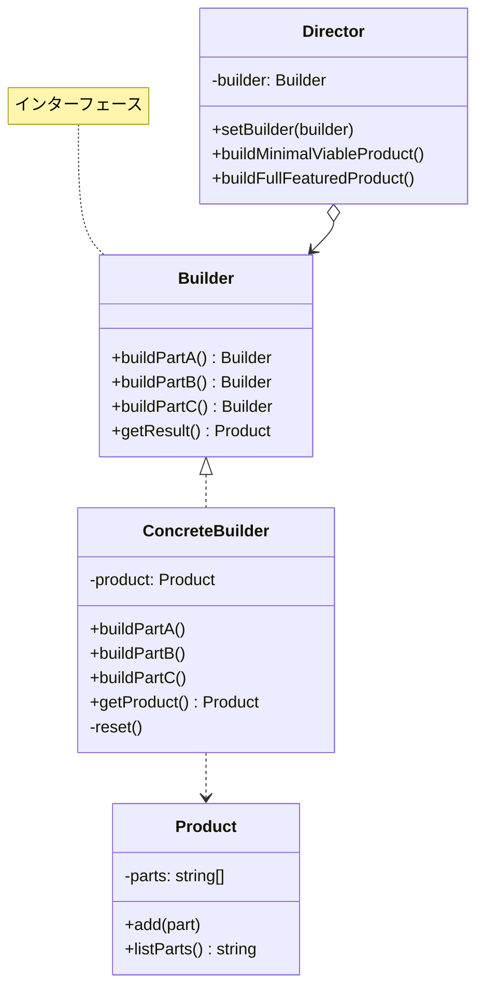
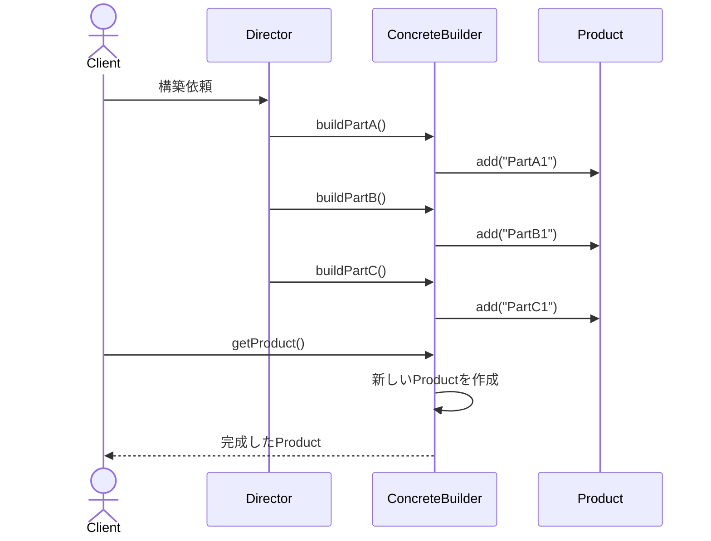
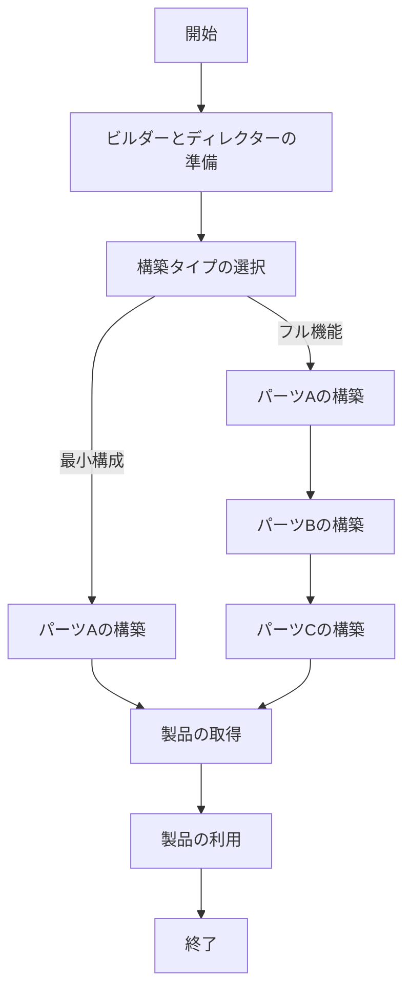

# Builderパターン - 段階的製品生成システム実装

## 1. 概要

### 1.1 パターンの定義
Builderパターンは、複雑なオブジェクトの生成過程を抽象化し、同じ生成過程で異なる表現のオブジェクトを生成できるようにするデザインパターンです。このパターンは、オブジェクト構築のプロセスをその表現から分離することで、同じ構築プロセスでさまざまな表現を作成できるようにします。

### 1.2 目的・解決する問題
- 複雑なオブジェクトの段階的な生成を可能にし、生成プロセスを明確に分離する
- オブジェクト生成コードをビジネスロジックから分離し、コードの可読性と保守性を向上させる
- 同じ構築プロセスで異なる種類や表現のオブジェクトを生成する柔軟性を提供する
- 製品オブジェクトの内部表現を隠蔽し、クライアントから分離する
- 製品の構成要素の順序や存在に関する制御を強化する

### 1.3 コンテキスト・適用場面
- 複雑な内部構造を持つオブジェクトを段階的に構築する必要がある場合
- 同じ構築プロセスで異なる表現のオブジェクトを生成する必要がある場合
- オブジェクト構築の順序や検証に制約がある場合
- オブジェクト構築プロセスを標準化したい場合
- 複雑なドキュメント生成や構成要素の多いオブジェクトの作成が必要な場合
- カスタマイズ可能な製品構築が要求される場合（例：設定可能なUIコンポーネント、複雑な構成ファイルなど）

## 2. クラス構造

### 2.1 クラス図


### 2.2 主要コンポーネント

| コンポーネント | 種類 | 責務 | 関連 |
|-------------|------|------|------|
| Builder | インターフェース | 製品の各パーツを構築するためのメソッドを宣言 | ConcreteBuilderによって実装される |
| ConcreteBuilder | 具象クラス | Builderインターフェースを実装し、製品の構築手順を定義。製品の生成と取得を担当 | Builderを実装、Productを生成 |
| Director | 具象クラス | 特定の順序で構築手順を実行する。異なる種類の製品を構築するための高レベルのインターフェースを提供 | Builderを使用 |
| Product | 具象クラス | 構築される複雑なオブジェクト。様々なパーツから構成され、ConcreteBuilderによって生成される | ConcreteBuilderによって生成 |

### 2.3 相互作用
- Directorはビルダーオブジェクトを受け取り、一連の構築ステップを定義された順序で実行
- ConcreteBuilderはBuilderインターフェースを実装し、製品の構築手順と表現を定義
- 各構築ステップの実行結果は、ConcreteBuilder内部のProductインスタンスに反映される
- クライアントはDirectorを使用するか、ConcreteBuilderを直接使用して製品を構築可能
- 製品完成後、クライアントはConcreteBuilderからProductを取得
- 構築プロセスと製品表現が分離されているため、同じDirectorでも異なるBuilderと組み合わせることで異なる製品を生成可能

## 3. 振る舞い

### 3.1 シーケンス図


### 3.2 プロセスフロー


### 3.3 重要なシナリオ

#### シナリオ1: ディレクターを使用した製品構築
1. クライアントがConcreteBuilderのインスタンスを作成
2. クライアントがDirectorインスタンスを作成し、ConcreteBuilderを渡す
3. クライアントがdirector.buildFullFeaturedProduct()を呼び出す
4. ディレクターが一連のビルド手順をConcreteBuilderに対して実行
   - builder.buildPartA()
   - builder.buildPartB()
   - builder.buildPartC()
5. クライアントがbuilder.getProduct()を呼び出して完成した製品を取得
6. ConcreteBuilderが内部状態をリセット

#### シナリオ2: ディレクターなしの手動製品構築
1. クライアントがConcreteBuilderのインスタンスを作成
2. クライアントが必要なパーツだけを選択的に構築
   - builder.buildPartA()
   - builder.buildPartC()
3. クライアントがbuilder.getProduct()を呼び出して製品を取得
4. クライアントが別の製品構築を開始（ConcreteBuilderの状態はリセット済み）
   - builder.buildPartB()
5. クライアントが2つ目の製品を取得

## 4. 実装詳細

### 4.1 主要インターフェース・抽象クラス

```typescript
/**
 * ビルダーインターフェース
 * 
 * 製品の各パーツを構築するためのメソッドを宣言します。
 */
export interface Builder {
    /**
     * パーツAを構築します
     */
    buildPartA(): void;

    /**
     * パーツBを構築します
     */
    buildPartB(): void;

    /**
     * パーツCを構築します
     */
    buildPartC(): void;
}
```

### 4.2 具象クラス実装例

```typescript
/**
 * 製品クラス
 * 
 * 複雑なオブジェクトを表現します。
 * このクラスは、様々なパーツから構成される複雑なオブジェクトを定義します。
 */
export class Product {
    private parts: string[] = [];

    /**
     * パーツを追加します
     * @param part 追加するパーツ
     */
    public add(part: string): void {
        this.parts.push(part);
    }

    /**
     * 製品の構成パーツを一覧表示します
     * @returns {string} パーツのリスト
     */
    public listParts(): string {
        return `製品のパーツ: ${this.parts.join(', ')}\n`;
    }
}

/**
 * 具象ビルダー
 * 
 * ビルダーインターフェースの具体的な実装を提供します。
 * 製品の構築手順を定義し、最終的な製品を返します。
 */
export class ConcreteBuilder implements Builder {
    private product!: Product;

    /**
     * 新しい製品の構築を開始します
     */
    constructor() {
        this.reset();
    }

    /**
     * ビルダーをリセットします
     */
    public reset(): void {
        this.product = new Product();
    }

    /**
     * パーツAを構築します
     */
    public buildPartA(): void {
        this.product.add('PartA1');
    }

    /**
     * パーツBを構築します
     */
    public buildPartB(): void {
        this.product.add('PartB1');
    }

    /**
     * パーツCを構築します
     */
    public buildPartC(): void {
        this.product.add('PartC1');
    }

    /**
     * 構築した製品を取得します
     * @returns {Product} 構築された製品
     */
    public getProduct(): Product {
        const result = this.product;
        this.reset();
        return result;
    }
}

/**
 * ディレクター
 * 
 * 特定の順序で構築手順を実行するためのクラスです。
 * 同じ構築プロセスから異なる種類の製品を生成する場合に便利です。
 */
export class Director {
    private builder: Builder;

    /**
     * コンストラクタ
     * @param builder 使用するビルダー
     */
    constructor(builder: Builder) {
        this.builder = builder;
    }

    /**
     * ビルダーを設定します
     * @param builder 設定するビルダー
     */
    public setBuilder(builder: Builder): void {
        this.builder = builder;
    }

    /**
     * 最小構成の製品を構築します
     * パーツAのみを含む製品を作成します。
     */
    public buildMinimalViableProduct(): void {
        this.builder.buildPartA();
    }

    /**
     * フル機能の製品を構築します
     * すべてのパーツを含む製品を作成します。
     */
    public buildFullFeaturedProduct(): void {
        this.builder.buildPartA();
        this.builder.buildPartB();
        this.builder.buildPartC();
    }
}
```

### 4.3 実装のバリエーション
1. **流れるようなインターフェース（Fluent Interface）**: メソッドチェーン呼び出しをサポートするように実装

```typescript
export class FluentBuilder implements Builder {
    private product: Product = new Product();

    public buildPartA(): FluentBuilder {
        this.product.add('PartA1');
        return this;
    }

    public buildPartB(): FluentBuilder {
        this.product.add('PartB1');
        return this;
    }

    public buildPartC(): FluentBuilder {
        this.product.add('PartC1');
        return this;
    }

    public build(): Product {
        const result = this.product;
        this.product = new Product();
        return result;
    }
}

// 使用例
const product = new FluentBuilder()
    .buildPartA()
    .buildPartC()
    .build();
```

2. **パラメータ化ビルダー**: パーツの構築時にパラメータを渡す実装

```typescript
export class ParameterizedBuilder implements Builder {
    private product: Product = new Product();

    public buildPartA(variant: string): void {
        this.product.add(`PartA_${variant}`);
    }

    // その他のメソッド...
}
```

3. **コンポジットビルダー**: 複数のビルダーを組み合わせて複雑な製品を構築する実装

```typescript
export class CompositeBuilder implements Builder {
    private headerBuilder: Builder;
    private bodyBuilder: Builder;
    private footerBuilder: Builder;

    constructor(
        headerBuilder: Builder,
        bodyBuilder: Builder,
        footerBuilder: Builder
    ) {
        this.headerBuilder = headerBuilder;
        this.bodyBuilder = bodyBuilder;
        this.footerBuilder = footerBuilder;
    }

    public buildFullDocument(): Product {
        // 各ビルダーを順番に呼び出して複合製品を構築
        // ...
    }
}
```

### 4.4 注意すべき実装ポイント
- ビルダーパターンは、製品が複雑で多くのパーツから構成される場合や、構築手順に順序や検証が必要な場合に適している
- getProductメソッドの後にビルダーをリセットすることで、同じビルダーを再利用しやすくなる
- 過度に複雑でないオブジェクトに対してBuilderパターンを使用すると、不必要に複雑になる可能性がある
- ビルダーとディレクターの責任を明確に分離し、単一責任の原則に従うべき
- 製品クラスのイミュータビリティ（不変性）を確保するために、製品が完成するまでクライアントが製品にアクセスできないようにする
- テスト時には、ビルダーの状態リセットが適切に行われることを確認する

## 5. 使用例

### 5.1 基本的な使用例

```typescript
// ビルダーとディレクターを使った製品構築
const builder = new ConcreteBuilder();
const director = new Director(builder);

// 最小構成の製品を構築
director.buildMinimalViableProduct();
const minimalProduct = builder.getProduct();
console.log(minimalProduct.listParts());
// 出力: "製品のパーツ: PartA1"

// フル機能の製品を構築
director.buildFullFeaturedProduct();
const fullProduct = builder.getProduct();
console.log(fullProduct.listParts());
// 出力: "製品のパーツ: PartA1, PartB1, PartC1"
```

### 5.2 高度な使用例

```typescript
// 複数のビルダーで同じディレクター使用
class HTMLBuilder implements Builder {
    private html: string = '<html>';
    
    public buildPartA(): void {
        this.html += '<header>Header</header>';
    }
    
    public buildPartB(): void {
        this.html += '<body>Content</body>';
    }
    
    public buildPartC(): void {
        this.html += '<footer>Footer</footer>';
    }
    
    public getProduct(): string {
        const result = this.html + '</html>';
        this.html = '<html>';
        return result;
    }
}

class JSONBuilder implements Builder {
    private json: any = {};
    
    public buildPartA(): void {
        this.json.header = 'Header';
    }
    
    public buildPartB(): void {
        this.json.body = 'Content';
    }
    
    public buildPartC(): void {
        this.json.footer = 'Footer';
    }
    
    public getProduct(): any {
        const result = { ...this.json };
        this.json = {};
        return result;
    }
}

// 同じディレクターで異なる表現を生成
const htmlBuilder = new HTMLBuilder();
const jsonBuilder = new JSONBuilder();
const director = new Director(htmlBuilder);

// HTML生成
director.buildFullFeaturedProduct();
const html = htmlBuilder.getProduct();
console.log(html);
// 出力: "<html><header>Header</header><body>Content</body><footer>Footer</footer></html>"

// JSON生成
director.setBuilder(jsonBuilder);
director.buildFullFeaturedProduct();
const json = jsonBuilder.getProduct();
console.log(JSON.stringify(json));
// 出力: "{"header":"Header","body":"Content","footer":"Footer"}"
```

## 6. テスト戦略

### 6.1 ユニットテスト要件
- ビルダーが各パーツを正しく構築できることを確認
- getProduct()呼び出し後にビルダーの状態がリセットされることを検証
- ディレクターが指定された順序でビルダーのメソッドを呼び出すことを確認
- 異なるビルダーでも同じディレクターが正しく動作することを検証
- 段階的な構築プロセスが途中で中断されても製品が適切に生成されることを確認

### 6.2 テスト実装例

```typescript
describe('Builder Pattern', () => {
    let builder: ConcreteBuilder;
    let director: Director;

    beforeEach(() => {
        builder = new ConcreteBuilder();
        director = new Director(builder);
    });

    describe('Builder without Director', () => {
        test('should construct product step by step', () => {
            builder.buildPartA();
            expect(builder.getProduct().listParts()).toBe('製品のパーツ: PartA1\n');

            builder.buildPartB();
            expect(builder.getProduct().listParts()).toBe('製品のパーツ: PartB1\n');

            builder.buildPartC();
            expect(builder.getProduct().listParts()).toBe('製品のパーツ: PartC1\n');
        });

        test('should reset builder state after getting product', () => {
            builder.buildPartA();
            builder.buildPartB();
            const product1 = builder.getProduct();
            const product2 = builder.getProduct();

            expect(product1.listParts()).toBe('製品のパーツ: PartA1, PartB1\n');
            expect(product2.listParts()).toBe('製品のパーツ: \n');
        });
    });

    describe('Builder with Director', () => {
        test('should build minimal viable product', () => {
            director.buildMinimalViableProduct();
            expect(builder.getProduct().listParts()).toBe('製品のパーツ: PartA1\n');
        });

        test('should build full featured product', () => {
            director.buildFullFeaturedProduct();
            expect(builder.getProduct().listParts())
                .toBe('製品のパーツ: PartA1, PartB1, PartC1\n');
        });

        test('should work with different builders', () => {
            const anotherBuilder = new ConcreteBuilder();
            director.setBuilder(anotherBuilder);
            director.buildFullFeaturedProduct();
            expect(anotherBuilder.getProduct().listParts())
                .toBe('製品のパーツ: PartA1, PartB1, PartC1\n');
        });
    });
});
```

## 7. 評価

### 7.1 メリット
- 製品の内部表現を隠蔽し、クライアントから分離できる
- 製品の構築と表現を分離することで、同じ構築プロセスで異なる表現を作成できる
- 製品構築のプロセスを段階的に制御でき、複雑な製品の構築を管理しやすくなる
- オブジェクト生成コードの再利用性が向上する
- 製品の構築に関する検証ロジックを一元管理できる
- 製品のバリエーションに対して高い柔軟性を提供する

### 7.2 デメリット・制約
- シンプルなオブジェクト生成に対して使用すると、不必要に複雑になる可能性がある
- 製品クラスごとに専用のビルダークラスが必要になり、クラス数が増加する
- ディレクターの導入により、追加の抽象化レイヤーが生じる
- パフォーマンスへの若干の影響が発生する可能性がある（特に小さなオブジェクト生成の場合）
- クライアントが正しくビルダーを使用するための理解が必要

### 7.3 代替パターン・関連パターン
- **Factory Method**: 単一の製品クラスを生成する場合に適している。Builderはより複雑な製品の段階的構築に焦点を当てる
- **Abstract Factory**: 関連する製品ファミリーを即時に生成する場合に使用。Builderは製品構築プロセスとその手順を強調
- **Prototype**: 既存のオブジェクトをコピーして新しいオブジェクトを作成する場合に有用
- **Composite**: Builderパターンは複合オブジェクトの構築によく使用される
- **Fluent Interface**: Builderパターンと組み合わせて、メソッドチェーン形式のAPIを提供することが多い

## 8. 参考資料

### 8.1 内部リンク
- [ソースコード](../../src/creational/builder)
- [テストコード](../../tests/creational/builder)

### 8.2 外部リンク
- [リファクタリング・グル - Builderパターン](https://refactoring.guru/ja/design-patterns/builder)
- [Head First デザインパターン](https://www.oreilly.co.jp/books/9784873119762/)
- [Gang of Four デザインパターン - Builder](https://www.amazon.co.jp/dp/0201633612)