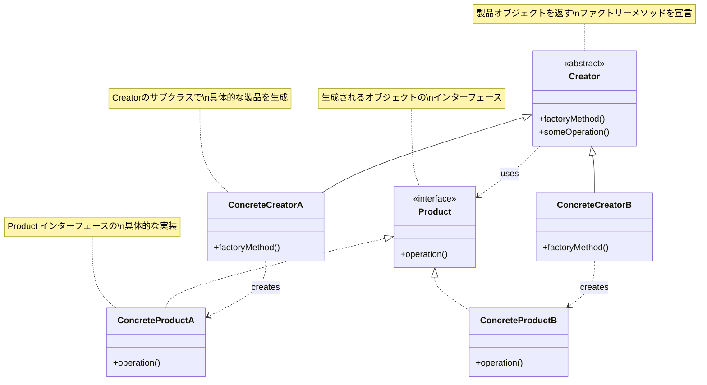
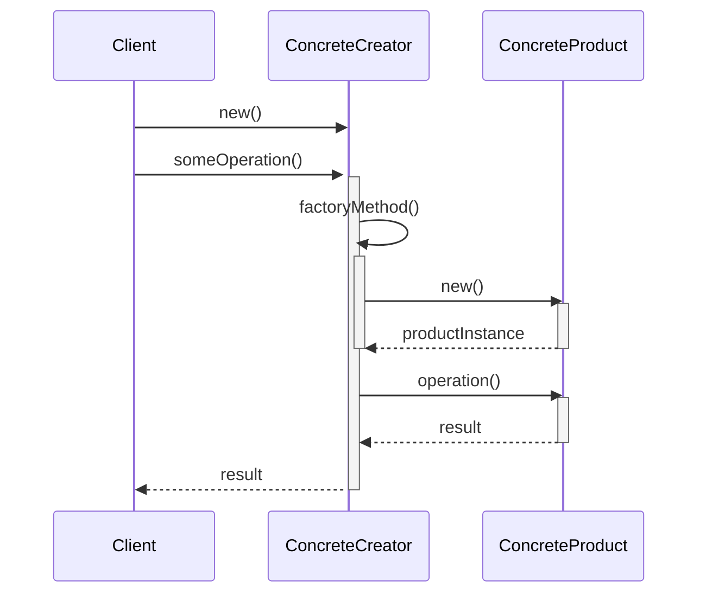
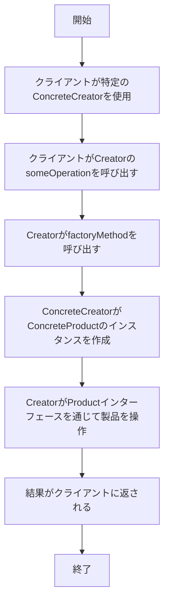

# Factory Method パターン

## 概要

Factory Method パターン（ファクトリーメソッド・パターン）は、オブジェクト生成のためのインターフェースを定義しながら、実際に生成されるオブジェクトのクラスの決定はサブクラスに委ねるデザインパターンです。

## 目的

- オブジェクト生成のロジックをクライアントコードから分離する
- クラスのインスタンス化を、クライアントコードから切り離して、サブクラスに委任する
- オブジェクト生成の抽象化によって、システムの柔軟性を向上させる

## 構造


- **Creator（作成者）**: 製品オブジェクトを返すファクトリーメソッドを宣言するインターフェースまたは抽象クラス
- **ConcreteCreator（具体的作成者）**: Creator のサブクラスで、ファクトリーメソッドを実装して具体的な製品を生成する
- **Product（製品）**: ファクトリーメソッドによって生成されるオブジェクトのインターフェース
- **ConcreteProduct（具体的製品）**: Product インターフェースの具体的な実装

## 2. クラス構造

### 2.1 クラス図



### 2.2 主要コンポーネント

| コンポーネント | 種類 | 責務 | 関連 |
|-------------|------|------|------|
| Creator | 抽象クラス | 製品オブジェクトを返すファクトリーメソッドを宣言し、製品を操作するための操作を提供 | Product を使用 |
| ConcreteCreator | クラス | Creator のサブクラスで、ファクトリーメソッドを実装して具体的な製品を生成 | Creator を継承、ConcreteProduct を生成 |
| Product | インターフェース | ファクトリーメソッドによって生成されるオブジェクトのインターフェース | - |
| ConcreteProduct | クラス | Product インターフェースの具体的な実装 | Product を実装 |

### 2.3 相互作用
- Creator は Product を直接生成せず、ファクトリーメソッドを通して生成
- ConcreteCreator がファクトリーメソッドを実装して具体的な Product を返す
- Creator はこのファクトリーメソッドを利用してさまざまな操作を行える
- クライアントは特定の ConcreteCreator と連携し、間接的に対応する ConcreteProduct を使用

## 3. 振る舞い

### 3.1 シーケンス図



### 3.2 プロセスフロー



## 4. 実装例

### TypeScript による実装

```typescript
/**
 * Product インターフェース - ファクトリーメソッドによって生成される製品の共通インターフェース
 */
interface Vehicle {
  /**
   * 乗り物の種類を返す
   */
  getType(): string;
  
  /**
   * 乗り物の説明を返す
   */
  getDescription(): string;
  
  /**
   * 乗り物を運転する
   */
  drive(): void;
}

/**
 * ConcreteProduct - 車の実装
 */
class Car implements Vehicle {
  private brand: string;
  
  /**
   * 車のブランドを指定して初期化
   * @param brand 車のブランド名
   */
  constructor(brand: string) {
    this.brand = brand;
  }
  
  /**
   * 乗り物の種類を返す
   * @returns 「車」という文字列
   */
  getType(): string {
    return '車';
  }
  
  /**
   * 車の説明を返す
   * @returns ブランド名を含む説明文
   */
  getDescription(): string {
    return `${this.brand}の車`;
  }
  
  /**
   * 車を運転するメソッド
   */
  drive(): void {
    console.log(`${this.getDescription()}を運転しています。`);
  }
}

/**
 * ConcreteProduct - バイクの実装
 */
class Motorcycle implements Vehicle {
  private model: string;
  private engineSize: number;
  
  /**
   * バイクのモデルとエンジンサイズを指定して初期化
   * @param model バイクのモデル名
   * @param engineSize エンジンサイズ（cc）
   */
  constructor(model: string, engineSize: number) {
    this.model = model;
    this.engineSize = engineSize;
  }
  
  /**
   * 乗り物の種類を返す
   * @returns 「バイク」という文字列
   */
  getType(): string {
    return 'バイク';
  }
  
  /**
   * バイクの説明を返す
   * @returns モデル名とエンジンサイズを含む説明文
   */
  getDescription(): string {
    return `${this.model} ${this.engineSize}ccのバイク`;
  }
  
  /**
   * バイクを運転するメソッド
   */
  drive(): void {
    console.log(`${this.getDescription()}を運転しています。`);
  }
}

/**
 * Creator - ファクトリーメソッドを宣言する抽象クラス
 */
abstract class VehicleFactory {
  /**
   * ファクトリーメソッド - サブクラスで実装される
   * @returns 生成された乗り物オブジェクト
   */
  abstract createVehicle(): Vehicle;
  
  /**
   * 乗り物を配送するテンプレートメソッド
   * ファクトリーメソッドを使用して乗り物を生成し、テストと配送を行う
   */
  deliverVehicle(): void {
    // ファクトリーメソッドを使用して製品を作成
    const vehicle = this.createVehicle();
    
    // 製品を使用
    console.log(`新しい${vehicle.getType()}を配送します。`);
    console.log(`説明: ${vehicle.getDescription()}`);
    console.log('テスト走行を行います...');
    vehicle.drive();
    console.log('配送完了！');
  }
}

/**
 * ConcreteCreator - 車のファクトリー
 */
class CarFactory extends VehicleFactory {
  private brand: string;
  
  /**
   * 生成する車のブランドを指定
   * @param brand 車のブランド名
   */
  constructor(brand: string) {
    super();
    this.brand = brand;
  }
  
  /**
   * ファクトリーメソッドの実装 - 車を生成
   * @returns 生成された車オブジェクト
   */
  createVehicle(): Vehicle {
    return new Car(this.brand);
  }
}

/**
 * ConcreteCreator - バイクのファクトリー
 */
class MotorcycleFactory extends VehicleFactory {
  private model: string;
  private engineSize: number;
  
  /**
   * 生成するバイクのモデルとエンジンサイズを指定
   * @param model バイクのモデル名
   * @param engineSize エンジンサイズ（cc）
   */
  constructor(model: string, engineSize: number) {
    super();
    this.model = model;
    this.engineSize = engineSize;
  }
  
  /**
   * ファクトリーメソッドの実装 - バイクを生成
   * @returns 生成されたバイクオブジェクト
   */
  createVehicle(): Vehicle {
    return new Motorcycle(this.model, this.engineSize);
  }
}
```

### 使用例

```typescript
/**
 * クライアントコード
 */
function clientCode() {
  // 車の生成と配送
  console.log('--- 車の配送 ---');
  const toyotaFactory = new CarFactory('トヨタ');
  toyotaFactory.deliverVehicle();
  
  console.log('\n');
  
  // 別の車の生成と配送
  const hondaFactory = new CarFactory('ホンダ');
  hondaFactory.deliverVehicle();
  
  console.log('\n');
  
  // バイクの生成と配送
  console.log('--- バイクの配送 ---');
  const kawasakiFactory = new MotorcycleFactory('Ninja', 1000);
  kawasakiFactory.deliverVehicle();
}

// クライアントコードを実行
clientCode();

// 出力結果:
// --- 車の配送 ---
// 新しい車を配送します。
// 説明: トヨタの車
// テスト走行を行います...
// トヨタの車を運転しています。
// 配送完了！
//
// 新しい車を配送します。
// 説明: ホンダの車
// テスト走行を行います...
// ホンダの車を運転しています。
// 配送完了！
//
// --- バイクの配送 ---
// 新しいバイクを配送します。
// 説明: Ninja 1000ccのバイク
// テスト走行を行います...
// Ninja 1000ccのバイクを運転しています。
// 配送完了！
```

## メリット

1. **オープン/クローズドの原則に準拠**: 新しい種類の製品を追加する場合、既存のコードを変更せずに新しいサブクラスを作成するだけで対応できる
2. **単一責任の原則**: 製品の生成に関するコードを一箇所に集中させることができる
3. **結合度の低減**: 生成されるオブジェクトの具体的なクラスとクライアントコードの結合度を低くできる
4. **拡張性**: 新しい製品クラスを簡単に追加できる

## デメリット

1. **コードの複雑性**: 単純な製品の場合、余分なクラスとインターフェースが必要になり、コードが複雑になる可能性がある
2. **階層の深さ**: 製品クラス階層とそれに対応するファクトリークラス階層の両方が必要になる

## 適用場面

1. オブジェクトを生成するクラスが、生成されるオブジェクトの正確なクラスを前もって知ることができない場合
2. クラスが、そのサブクラスによって生成されるべきオブジェクトを指定したい場合
3. オブジェクトの生成処理をサブクラスに委任したい場合
4. 同じインターフェースや基底クラスを持つが、具体的な実装が異なるオブジェクトを使用する場合

## 関連パターン

- **Abstract Factory**: Factory Method パターンは Abstract Factory パターンを実装するために使用される
- **Template Method**: Factory Method は Template Method の特殊なケースと見なすことができる
- **Prototype**: Factory Method を使う代わりに、Prototype パターンを使ってオブジェクトの複製による生成を行うこともある

## 参考資料

### 内部リンク
- [ソースコードへのリンク](../../src/creational/factory-method)
- [テストコードへのリンク](../../tests/creational/factory-method)

### 外部リンク
- [リファクタリング・グル - Factory Methodパターン](https://refactoring.guru/ja/design-patterns/factory-method)
- [Head First デザインパターン](https://www.oreilly.co.jp/books/9784873119762/)
- [Gang of Four デザインパターン - Factory Method](https://www.amazon.co.jp/dp/0201633612) 