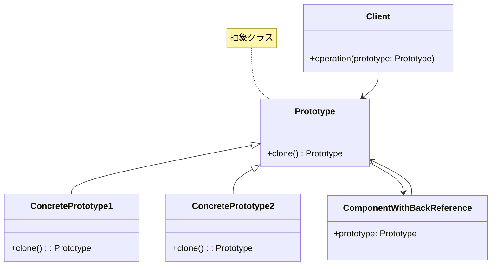
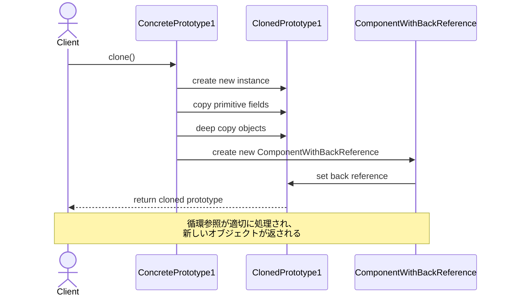
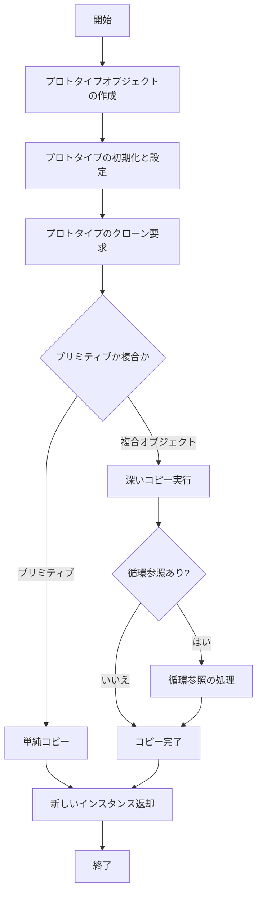

# Prototypeパターン - オブジェクト複製システム実装

## 1. 概要

### 1.1 パターンの定義
Prototypeパターンは、既存のオブジェクトをクローン（複製）することで新しいオブジェクトを生成するデザインパターンです。このパターンは、オブジェクトの生成コストが高い場合や、直接のインスタンス化が複雑な場合に、効率的にオブジェクトを生成するために使用されます。

### 1.2 目的・解決する問題
- 複雑なオブジェクトの初期化コストを削減する
- 実行時に必要なオブジェクトの種類やプロパティを決定できるようにする
- クラスの実装詳細に依存せずにオブジェクトのコピーを作成する
- コンストラクタによる生成よりも柔軟なオブジェクト生成メカニズムを提供する
- 深いネストを持つオブジェクトや循環参照を持つオブジェクトを複製する

### 1.3 コンテキスト・適用場面
- オブジェクトの初期化に時間やリソースがかかる場合（データベース接続、ファイル読み込みなど）
- オブジェクトの正確なクラス型が実行時にしか決定できない場合
- オブジェクトの生成プロセスをクライアントコードから分離したい場合
- 複雑なオブジェクト構造（例：複合オブジェクト）のコピーが必要な場合
- オブジェクトに多数の設定バリエーションが存在する場合
- ファクトリーメソッドによる生成が複雑すぎる場合

## 2. クラス構造

### 2.1 クラス図


### 2.2 主要コンポーネント

| コンポーネント | 種類 | 責務 | 関連 |
|-------------|------|------|------|
| Prototype | 抽象クラス | クローン操作を定義するインターフェース。クローンの作成方法を宣言 | ConcretePrototype 実装の基底クラス |
| ConcretePrototype1 | 具象クラス | Prototypeインターフェースを実装し、自分自身をコピーする具体的なロジックを提供 | Prototypeを継承 |
| ConcretePrototype2 | 具象クラス | 別の方法でPrototypeインターフェースを実装。異なる種類のオブジェクトに対応 | Prototypeを継承 |
| ComponentWithBackReference | 具象クラス | Prototypeへの循環参照を持つコンポーネント。深いコピーでの課題を示す | Prototypeを参照 |
| Client | 具象クラス | Prototypeを使用してオブジェクトを複製するクライアント | Prototypeを使用 |

### 2.3 相互作用
- Clientは、特定のコンクリートPrototypeのインスタンスを生成せずに、既存のオブジェクトのclone()メソッドを呼び出して新しいオブジェクトを作成
- 各ConcretePrototypeは、自身の状態を適切に複製するためのclone()メソッドを実装
- 深いコピーを実行する場合、複合オブジェクトや循環参照を適切に処理する必要がある
- プロトタイプレジストリを使用して、頻繁に使用されるプロトタイプを保存・検索することが可能

## 3. 振る舞い

### 3.1 シーケンス図


### 3.2 プロセスフロー


### 3.3 重要なシナリオ

#### シナリオ1: 基本的なオブジェクトクローン
1. クライアントが既存のConcretePrototype1インスタンスを取得
2. クライアントがprototypeのclone()メソッドを呼び出す
3. ConcretePrototype1内でclone()メソッドが実行される
4. 新しいConcretePrototype1インスタンスが作成される
5. プリミティブ値はそのままコピーされる
6. 複合オブジェクトは適切に新しいインスタンスとして複製される
7. 新しいインスタンスがクライアントに返却される

#### シナリオ2: 循環参照を持つオブジェクトのクローン
1. クライアントが循環参照を持つPrototypeインスタンスを取得
2. クライアントがprototypeのclone()メソッドを呼び出す
3. clone()メソッド内で循環参照を検出し、適切に処理する
4. 新しいComponentWithBackReferenceインスタンスが作成され、新しいPrototypeを参照するように設定
5. 循環参照を持つ完全に独立したオブジェクトがクライアントに返却される

## 4. 実装詳細

### 4.1 主要インターフェース・抽象クラス

```typescript
/**
 * プロトタイプ
 * 
 * クローン機能を持つオブジェクトの基底クラスです。
 * このクラスは、プロトタイプパターンの中心となるインターフェースを定義します。
 */
export abstract class Prototype {
    public primitive: any;
    public component!: object;
    public circularReference!: ComponentWithBackReference;

    /**
     * クローンメソッド
     * 
     * オブジェクトの複製を作成します。
     * @returns {Prototype} クローンされたオブジェクト
     */
    public abstract clone(): Prototype;
}

/**
 * プロトタイプコンポーネント
 * 
 * プロトタイプへの参照を持つコンポーネントクラスです。
 */
export class ComponentWithBackReference {
    public prototype;

    /**
     * コンストラクタ
     * @param prototype プロトタイプへの参照
     */
    constructor(prototype: Prototype) {
        this.prototype = prototype;
    }
}
```

### 4.2 具象クラス実装例

```typescript
/**
 * 具象プロトタイプ1
 * 
 * プロトタイプの具象実装を提供します。
 * クローンメソッドを実装し、オブジェクトの完全な複製を作成します。
 */
export class ConcretePrototype1 extends Prototype {
    /**
     * コンストラクタ
     */
    constructor() {
        super();
        this.primitive = 245;
        this.component = new Date();
        this.circularReference = new ComponentWithBackReference(this);
    }

    /**
     * クローンメソッド
     * 
     * オブジェクトの深いコピーを作成します。
     * プリミティブフィールドは値をコピーし、オブジェクトは新しいインスタンスを作成します。
     * @returns {Prototype} クローンされたオブジェクト
     */
    public clone(): Prototype {
        const clone = new ConcretePrototype1();
        clone.primitive = this.primitive;
        // Dateオブジェクトの正しい複製を作成
        clone.component = new Date((this.component as Date).getTime());
        // 循環参照を持つオブジェクトを複製
        clone.circularReference = new ComponentWithBackReference(clone);
        return clone;
    }
}

/**
 * 具象プロトタイプ2
 * 
 * プロトタイプの別の具象実装を提供します。
 */
export class ConcretePrototype2 extends Prototype {
    /**
     * コンストラクタ
     */
    constructor() {
        super();
        this.primitive = 'test';
        this.component = new Map<string, string>();
        this.circularReference = new ComponentWithBackReference(this);
    }

    /**
     * クローンメソッド
     * 
     * オブジェクトの深いコピーを作成します。
     * @returns {Prototype} クローンされたオブジェクト
     */
    public clone(): Prototype {
        const clone = new ConcretePrototype2();
        clone.primitive = this.primitive;
        clone.component = new Map(this.component as Map<string, string>);
        clone.circularReference = new ComponentWithBackReference(clone);
        return clone;
    }
}
```

### 4.3 実装のバリエーション

1. **プロトタイプレジストリ実装**

```typescript
/**
 * プロトタイプレジストリ
 * 
 * よく使用されるプロトタイプを保存・検索するためのレジストリです。
 */
class PrototypeRegistry {
    private items: Map<string, Prototype> = new Map<string, Prototype>();
    
    /**
     * プロトタイプを登録します
     * @param key プロトタイプの識別子
     * @param prototype 登録するプロトタイプ
     */
    public addItem(key: string, prototype: Prototype): void {
        this.items.set(key, prototype);
    }
    
    /**
     * プロトタイプを取得します
     * @param key プロトタイプの識別子
     * @returns クローンされたプロトタイプ
     */
    public getByKey(key: string): Prototype | null {
        const item = this.items.get(key);
        return item ? item.clone() : null;
    }
    
    /**
     * 登録されているすべてのプロトタイプのキーを取得します
     */
    public getKeys(): string[] {
        return Array.from(this.items.keys());
    }
}
```

2. **JSON利用のシンプルな深いコピーの実装**

```typescript
class JsonPrototype {
    public data: any;
    
    constructor(data: any) {
        this.data = data;
    }
    
    public clone(): JsonPrototype {
        // JSON.stringify/parseを使用した簡易的な深いコピー
        // 注意: 関数やメソッド、循環参照は正しく処理できない
        const clone = new JsonPrototype(JSON.parse(JSON.stringify(this.data)));
        return clone;
    }
}
```

3. **構造化クローンアルゴリズムの使用**

```typescript
class StructuredClonePrototype {
    public data: any;
    
    constructor(data: any) {
        this.data = data;
    }
    
    public clone(): StructuredClonePrototype {
        // 構造化クローンアルゴリズムを使用したコピー（環境がサポートしている場合）
        // 循環参照やTypedArray、Map、Set、Dateなどをサポート
        const clone = new StructuredClonePrototype(structuredClone(this.data));
        return clone;
    }
}
```

### 4.4 注意すべき実装ポイント

- **深いコピーと浅いコピー**: オブジェクトの深いコピーが必要か浅いコピーで十分かを判断する
- **循環参照の処理**: クローン処理で循環参照を適切に処理し、無限ループを防ぐ
- **特殊オブジェクトの処理**: Dateオブジェクト、Map、Set、関数などの特殊なオブジェクトは通常の代入ではコピーできないため、適切な対処が必要
- **パフォーマンス**: 大きなオブジェクトの深いコピーはパフォーマンス影響が大きいため、必要な部分のみコピーするよう最適化
- **イミュータビリティ**: いつクローンを作成すべきか、イミュータブルなオブジェクトを活用すべきかを検討
- **型安全性**: TypeScriptでは適切な型定義を行い、クローンメソッドの戻り値型を具体的に指定する

## 5. 使用例

### 5.1 基本的な使用例

```typescript
// プロトタイプの作成と複製
function clientCode() {
    // 元のプロトタイプを作成
    const prototype1 = new ConcretePrototype1();
    prototype1.primitive = 50;
    
    // プロトタイプをクローン
    const clone1 = prototype1.clone();
    
    console.log('Original primitive value:', prototype1.primitive);
    console.log('Cloned primitive value:', clone1.primitive);
    console.log('Primitives are equal:', prototype1.primitive === clone1.primitive);
    
    console.log('Original and clone are different objects:', prototype1 !== clone1);
    console.log('Original component !== Cloned component:', 
                prototype1.component !== clone1.component);
    
    // プロトタイプを変更してもクローンには影響しない
    prototype1.primitive = 100;
    console.log('Modified original primitive:', prototype1.primitive);
    console.log('Clone primitive remains unchanged:', clone1.primitive);
}

clientCode();
```

### 5.2 高度な使用例

```typescript
// プロトタイプレジストリを使用した例
function advancedClientCode() {
    const registry = new PrototypeRegistry();
    
    // 初期プロトタイプを作成して登録
    const prototype1 = new ConcretePrototype1();
    prototype1.primitive = 123;
    registry.addItem('p1', prototype1);
    
    const prototype2 = new ConcretePrototype2();
    (prototype2.component as Map<string, string>).set('key', 'original');
    registry.addItem('p2', prototype2);
    
    // レジストリからクローンを取得して使用
    const clone1 = registry.getByKey('p1');
    if (clone1) {
        console.log('Clone1 primitive:', (clone1 as ConcretePrototype1).primitive);
    }
    
    const clone2 = registry.getByKey('p2');
    if (clone2) {
        console.log('Clone2 component value:', 
            (clone2.component as Map<string, string>).get('key'));
            
        // クローンを変更
        (clone2.component as Map<string, string>).set('key', 'modified');
        console.log('Modified clone2 value:', 
            (clone2.component as Map<string, string>).get('key'));
            
        // 元のプロトタイプは影響を受けない
        console.log('Original p2 value remains:', 
            (prototype2.component as Map<string, string>).get('key'));
    }
}

advancedClientCode();
```

## 6. テスト戦略

### 6.1 ユニットテスト要件

- 各具象プロトタイプのclone()メソッドがオブジェクトの正確なコピーを作成することを検証
- 元のオブジェクトとクローンが異なるインスタンスであることを確認
- プリミティブ値が正しくコピーされることを検証
- 複合オブジェクトが深いコピーされ、元のオブジェクトとは参照が異なることを確認
- 循環参照が適切に処理されることを検証
- クローン後の変更が元のオブジェクトに影響しないことを確認

### 6.2 テスト実装例

```typescript
describe('Prototype Pattern', () => {
    describe('ConcretePrototype1', () => {
        test('should create a clone with different reference', () => {
            const p1 = new ConcretePrototype1();
            const c1 = p1.clone();

            expect(c1).not.toBe(p1);
            expect(c1.primitive).toBe(p1.primitive);
            expect(c1.component).not.toBe(p1.component);
            expect(c1.circularReference).not.toBe(p1.circularReference);
            expect(c1.circularReference.prototype).toBe(c1);
        });

        test('should maintain primitive values after cloning', () => {
            const p1 = new ConcretePrototype1();
            p1.primitive = 100;
            const c1 = p1.clone();

            expect(c1.primitive).toBe(100);
        });
    });

    describe('ConcretePrototype2', () => {
        test('should create a clone with different reference', () => {
            const p2 = new ConcretePrototype2();
            const c2 = p2.clone();

            expect(c2).not.toBe(p2);
            expect(c2.primitive).toBe(p2.primitive);
            expect(c2.component).not.toBe(p2.component);
            expect(c2.circularReference).not.toBe(p2.circularReference);
            expect(c2.circularReference.prototype).toBe(c2);
        });

        test('should maintain Map data after cloning', () => {
            const p2 = new ConcretePrototype2();
            (p2.component as Map<string, string>).set('key', 'value');
            const c2 = p2.clone();

            expect((c2.component as Map<string, string>).get('key')).toBe('value');
            expect(c2.component).not.toBe(p2.component);
        });
    });

    describe('Circular Reference', () => {
        test('should handle circular references correctly', () => {
            const p1 = new ConcretePrototype1();
            const c1 = p1.clone();

            expect(p1.circularReference.prototype).toBe(p1);
            expect(c1.circularReference.prototype).toBe(c1);
        });
    });
});
```

## 7. 評価

### 7.1 メリット
- オブジェクトの初期化コードをクライアントから分離できる
- 実行時に動的にオブジェクトを生成できる
- 複雑なオブジェクトの生成プロセスを簡略化できる
- オブジェクト構造のクローンを作成する標準的な方法を提供する
- 具体的なクラスに依存せずにオブジェクトのコピーを作成できる
- 同一のインターフェースを持つ多様なオブジェクトを効率的に生成できる

### 7.2 デメリット・制約
- 循環参照を持つオブジェクトの複製は複雑であり、特別な処理が必要
- 深いネストを持つオブジェクトの複製はパフォーマンスに影響を与える可能性がある
- 一部の特殊なオブジェクト（例：クロージャ、DOMノードなど）は適切に複製できない場合がある
- 複雑なオブジェクトの場合、すべてのプロパティを適切にコピーすることが困難な場合がある
- 浅いコピーと深いコピーの区別を適切に選択する必要がある

### 7.3 代替パターン・関連パターン
- **Factory Method**: オブジェクト生成のためのインターフェースを定義するが、サブクラスに生成するクラスの選択を委任する
- **Abstract Factory**: 関連するオブジェクトのファミリーを生成するためのインターフェースを提供する
- **Builder**: 複雑なオブジェクトを段階的に構築する方法を分離する
- **Composite**: Prototypeパターンと組み合わせて、複合オブジェクト構造の効率的なクローンを実現できる
- **Memento**: オブジェクトの状態を保存・復元するために使用でき、Prototypeパターンと組み合わせることが可能
- **Command**: Prototypeパターンと組み合わせて、コマンドオブジェクトのクローンを作成し、複数の類似したオペレーションを実行できる

## 8. 参考資料

### 8.1 内部リンク
- [ソースコード](../../src/creational/prototype)
- [テストコード](../../tests/creational/prototype)

### 8.2 外部リンク
- [リファクタリング・グル - Prototypeパターン](https://refactoring.guru/ja/design-patterns/prototype)
- [MDN - Object.assign()](https://developer.mozilla.org/ja/docs/Web/JavaScript/Reference/Global_Objects/Object/assign)
- [MDN - 構造化クローンアルゴリズム](https://developer.mozilla.org/ja/docs/Web/API/structuredClone) 