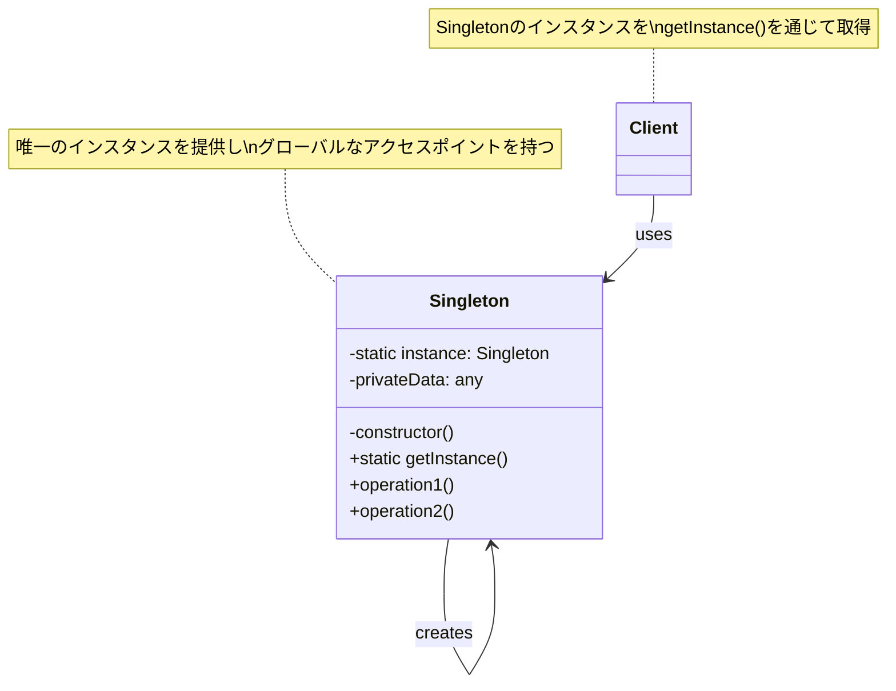
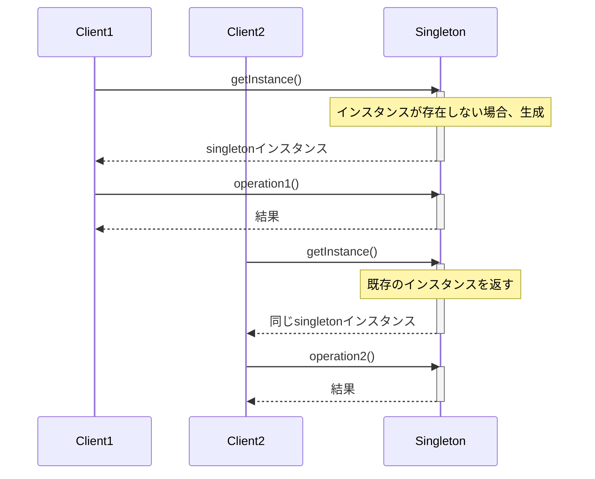
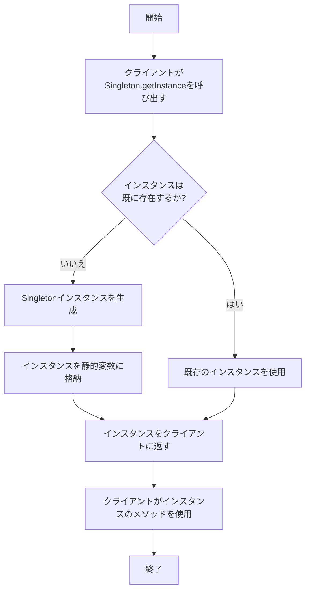

# Singleton パターン

## 概要

Singleton パターン（シングルトン・パターン）は、あるクラスのインスタンスが必ず1つであることを保証し、そのインスタンスへのグローバルなアクセスポイントを提供するデザインパターンです。

## 目的

- クラスのインスタンスが1つだけ存在することを保証する
- そのインスタンスへのグローバルなアクセスポイントを提供する
- 共有リソースへのアクセスを制御する

## 構造


- **Singleton**: 唯一のインスタンスを取得するための静的メソッド（getInstance）を持ち、コンストラクタが外部から呼び出されないようにするクラス

## 2. クラス構造

### 2.1 クラス図



### 2.2 主要コンポーネント

| コンポーネント | 種類 | 責務 | 関連 |
|-------------|------|------|------|
| Singleton | クラス | クラスの唯一のインスタンスを作成・管理し、グローバルなアクセスを提供する | 自身のインスタンスを生成・管理 |
| Client | クラス | Singletonインスタンスを使用する | Singletonを使用 |

### 2.3 相互作用
- Singletonクラスは自身の唯一のインスタンスを静的メンバー変数として保持
- コンストラクタはprivateであり、外部からの直接のインスタンス化を防止
- クライアントはgetInstance()静的メソッドを通じてのみインスタンスを取得可能
- 同一プロセス内の全てのクライアントが同じSingletonインスタンスを共有

## 3. 振る舞い

### 3.1 シーケンス図



### 3.2 プロセスフロー



## 4. 実装例

### TypeScript による実装

```typescript
/**
 * シングルトンパターンの実装例
 * プログラム全体で一つだけのインスタンスを持つ設定管理クラス
 */
export class ConfigManager {
  /**
   * 唯一のインスタンスを保持する静的プロパティ
   * 初期値はnullで、後で初期化される
   */
  private static instance: ConfigManager | null = null;

  /**
   * 設定値を保持するオブジェクト
   */
  private settings: { [key: string]: any } = {};

    /**
   * 最後に設定が更新された日時
   */
  private lastUpdated: Date;

  /**
   * privateコンストラクタで外部からのインスタンス化を防止
   * 
   * このコンストラクタは、getInstance()メソッド内からのみ呼び出される
     */
    private constructor() {
    this.lastUpdated = new Date();
    console.log('ConfigManager インスタンスが作成されました');
    
    // デフォルト設定の読み込み
    this.settings = {
      theme: 'light',
      language: 'ja',
      notifications: true,
      autoSave: true
    };
    }

    /**
   * シングルトンインスタンスを取得するメソッド
   * 
   * インスタンスが存在しない場合は新規作成し、存在する場合は既存のインスタンスを返す
   * @returns ConfigManagerの唯一のインスタンス
     */
  public static getInstance(): ConfigManager {
    // インスタンスが存在しない場合に初期化
    if (ConfigManager.instance === null) {
      ConfigManager.instance = new ConfigManager();
        }
    
    return ConfigManager.instance;
    }

    /**
   * 設定値を取得
   * 
   * @param key 設定キー
   * @param defaultValue キーが存在しない場合のデフォルト値
   * @returns 設定値またはデフォルト値
   */
  public getSetting(key: string, defaultValue: any = null): any {
    return key in this.settings ? this.settings[key] : defaultValue;
  }

  /**
   * 設定値を更新
   * 
   * @param key 設定キー
   * @param value 設定値
     */
  public setSetting(key: string, value: any): void {
    this.settings[key] = value;
    this.lastUpdated = new Date();
    console.log(`設定 "${key}" が "${value}" に更新されました`);
    }

    /**
   * 全ての設定値を取得
   * 
   * @returns 全ての設定値
   */
  public getAllSettings(): { [key: string]: any } {
    return { ...this.settings }; // 元のオブジェクトを変更されないようにコピーを返す
  }

  /**
   * 設定値を初期値にリセット
     */
  public resetSettings(): void {
    this.settings = {
      theme: 'light',
      language: 'ja',
      notifications: true,
      autoSave: true
    };
    this.lastUpdated = new Date();
    console.log('全ての設定が初期値にリセットされました');
  }

  /**
   * 最後に設定が更新された日時を取得
   * 
   * @returns 最終更新日時
   */
  public getLastUpdated(): Date {
    return this.lastUpdated;
  }

  /**
   * スレッドセーフな実装のための追加機能:
   * このメソッドはマルチスレッド環境での使用を想定したもので、
   * TypeScriptがシングルスレッドで動作するJavaScriptで実行される場合は
   * 実際には必要ありませんが、概念的な説明として含めています。
   */
  private static createInstance(): ConfigManager {
    const instance = new ConfigManager();
    return instance;
    }
}
```

### 使用例

```typescript
/**
 * シングルトンパターンの使用例
 */
function main() {
  // 最初のインスタンス取得
  const config1 = ConfigManager.getInstance();
  console.log('現在のテーマ:', config1.getSetting('theme'));  // light
  
  // 設定を変更
  config1.setSetting('theme', 'dark');
  console.log('更新後のテーマ:', config1.getSetting('theme'));  // dark
  
  // 別の場所でインスタンスを取得（同じインスタンスが返される）
  const config2 = ConfigManager.getInstance();
  
  // 同一インスタンスであることを確認
  console.log('config1とconfig2は同じインスタンス:', config1 === config2);  // true
  
  // config2で取得した設定値は、config1で変更した値が反映されている
  console.log('config2でのテーマ設定:', config2.getSetting('theme'));  // dark
  
  // 全ての設定を表示
  console.log('全ての設定:', config2.getAllSettings());
  
  // 最終更新日時を確認
  console.log('最終更新時刻:', config2.getLastUpdated());
  
  // 設定をリセット
  config1.resetSettings();
  console.log('リセット後のテーマ:', config2.getSetting('theme'));  // light（リセット後）
}

// クライアントコードを実行
main();

// 出力例：
// ConfigManager インスタンスが作成されました
// 現在のテーマ: light
// 設定 "theme" が "dark" に更新されました
// 更新後のテーマ: dark
// config1とconfig2は同じインスタンス: true
// config2でのテーマ設定: dark
// 全ての設定: { theme: 'dark', language: 'ja', notifications: true, autoSave: true }
// 最終更新時刻: Thu Apr 04 2025 15:30:45 GMT+0900 (日本標準時)
// 全ての設定が初期値にリセットされました
// リセット後のテーマ: light
```

## Singleton の実装バリエーション

### 1. 遅延初期化（Lazy Initialization）

最もよく使われる実装で、インスタンスが必要とされるまでその生成を遅らせます。上記の例では遅延初期化を使用しています。

```typescript
public static getInstance(): Singleton {
  if (Singleton.instance === null) {
    Singleton.instance = new Singleton();
        }
  return Singleton.instance;
}
```

### 2. 即時初期化（Eager Initialization）

クラスのロード時にインスタンスを作成します。リソースを多く消費するシングルトンでは避けるべき場合もあります。

```typescript
export class EagerSingleton {
    private static instance: EagerSingleton = new EagerSingleton();
    
  private constructor() { /* ... */ }
    
    public static getInstance(): EagerSingleton {
        return EagerSingleton.instance;
    }
}
```

### 3. Double-Checked Locking パターン

マルチスレッド環境で、同期化のオーバーヘッドを最小限に抑えるための実装です。
TypeScriptは主にシングルスレッド環境で実行されるため、通常は必要ありませんが、
概念的に理解するために掲載します。

```typescript
export class ThreadSafeSingleton {
    private static instance: ThreadSafeSingleton | null = null;
  private static lock = {};
    
  private constructor() { /* ... */ }
    
    public static getInstance(): ThreadSafeSingleton {
    if (ThreadSafeSingleton.instance === null) {
      // ここでロックを取得する（概念的なコード）
      synchronized(this.lock) {
        if (ThreadSafeSingleton.instance === null) {
                    ThreadSafeSingleton.instance = new ThreadSafeSingleton();
                }
            }
        }
        return ThreadSafeSingleton.instance;
    }
}
```

## メリット

1. **一貫性の保証**: クラスのインスタンスが1つだけ存在することを保証
2. **グローバルアクセス**: システムのどこからでもアクセス可能
3. **遅延初期化**: 必要になるまでインスタンスを作成しないため、リソースの節約が可能
4. **インスタンスの再利用**: 同じインスタンスを繰り返し使用するため、メモリ使用量の削減

## デメリット

1. **単体テストの困難さ**: グローバル状態を持つため、テストが複雑になる
2. **隠れた依存関係**: コード間の依存関係が隠れてしまう
3. **並行処理の問題**: マルチスレッド環境では特別な対応が必要
4. **責任過多のリスク**: シングルトンに多くの責任を持たせてしまう傾向がある

## 適用場面

1. リソースへの共有アクセスを管理する場合（データベース接続、ファイルシステムなど）
2. アプリケーション全体で共有される設定を管理する場合
3. 厳密に1つのインスタンスのみが必要なオブジェクト（ロガー、キャッシュなど）
4. 状態を持つ必要があるグローバルな操作を提供する場合

## 実装時の注意点

1. コンストラクタは必ず `private` にして、外部からのインスタンス化を防ぐ
2. シングルトンに過度の責任を持たせない（単一責任の原則を守る）
3. マルチスレッド環境ではスレッドセーフな実装を検討する
4. シリアライズ/デシリアライズを行う場合は特別な対応が必要
5. テスト時にモック化できるような設計にする

## 関連パターン

- **Factory Method**: シングルトンインスタンスを作成するためにFactory Methodパターンを使用することがある
- **Facade**: システム全体へのアクセスを単純化するために、FacadeパターンとともにSingletonを使用することがある
- **State**: ステート管理のためにシングルトンが使用されることがある
- **Abstract Factory**: Abstract FactoryのインスタンスをSingletonとして実装することがある

## 参考資料

### 内部リンク
- [ソースコードへのリンク](../../src/creational/singleton)
- [テストコードへのリンク](../../tests/creational/singleton)

### 外部リンク
- [リファクタリング・グル - Singletonパターン](https://refactoring.guru/ja/design-patterns/singleton)
- [Head First デザインパターン](https://www.oreilly.co.jp/books/9784873119762/) 