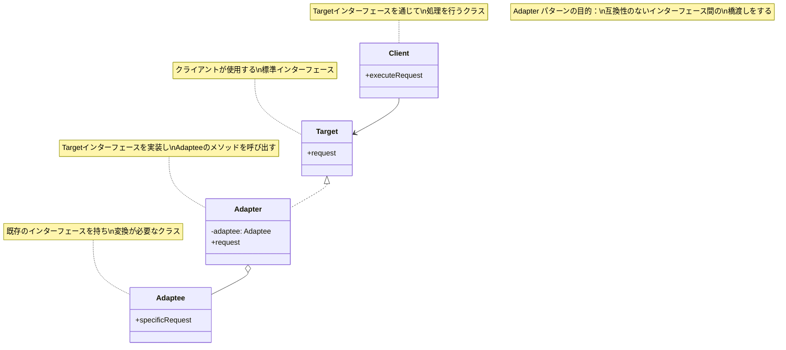
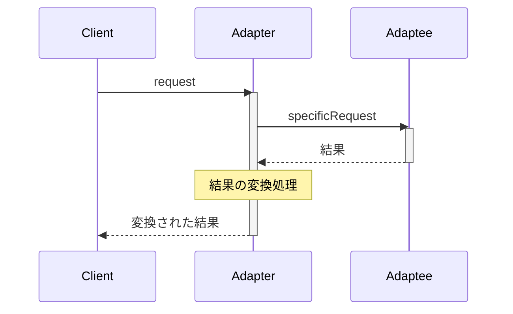
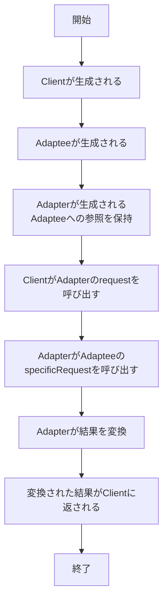

# Adapter パターン

# Adapterパターン - インターフェース変換実装

## 1. 概要

### 1.1 パターンの定義
Adapterパターンは、互換性のないインターフェースを持つクラス同士を連携させるためのデザインパターンです。既存のクラスを修正せずに、クライアントが期待するインターフェースに変換します。

### 1.2 目的・解決する問題
- 互換性のないインターフェース間の橋渡しをする
- 既存のクラスを変更せずに新しいインターフェースで利用できるようにする
- レガシーコードと新しいコードを統合する
- サードパーティライブラリを既存のシステムに組み込む
- 異なるAPIやデータ形式の統合を容易にする

### 1.3 コンテキスト・適用場面
- 既存のクラスを使いたいが、そのインターフェースが現在のシステムのインターフェースと互換性がない場合
- 既存のサブクラスを再利用したいが、親クラスのインターフェースを変更することはできない場合
- レガシーコードと新しいコードを統合したい場合
- 複数の既存のサブクラスに共通の機能を追加したいが、継承による変更が現実的でない場合
- 外部ライブラリやAPIを独自のコード構造に適合させる必要がある場合

## 2. クラス構造

### 2.1 クラス図



### 2.2 主要コンポーネント

| コンポーネント | 種類 | 責務 | 関連 |
|-------------|------|------|------|
| Target | インターフェース | クライアントが使用する標準インターフェースを定義 | Adapterに実装される |
| Client | クラス | Targetインターフェースを通じて処理を行う | Targetを使用 |
| Adaptee | クラス | 既存のインターフェースを持ち、変換が必要 | Adapterに使用される |
| Adapter | クラス | TargetインターフェースとAdapteeの橋渡しを行う | Targetを実装、Adapteeを使用 |

### 2.3 相互作用
- Clientは常にTargetインターフェースを通じて操作を行う
- AdapterはTargetインターフェースを実装し、Clientからのリクエストを受け取る
- AdapterはAdapteeのメソッドを呼び出し、必要な変換を行う
- Clientは変換プロセスや実際の実装クラス（Adaptee）を意識することなく処理を行える
- Adapterは一つまたは複数のAdapteeのインスタンスを使用して機能を提供する

## 3. 振る舞い

### 3.1 シーケンス図



### 3.2 プロセスフロー



### 3.3 重要なシナリオ

#### シナリオ1: メディアプレーヤーの拡張
1. ユーザーがAudioPlayerを作成する
2. ユーザーが様々な形式の音声ファイルを再生しようとする
3. WAV形式はAudioPlayerが直接サポートしているため、そのまま再生される
4. MP3やMP4形式はサポート外だが、MediaAdapterを通じて再生できる
5. MediaAdapterは適切な専用プレーヤー（Mp3PlayerやMp4Player）を内部で使用
6. PDFなどの非メディア形式は再生できないというメッセージが表示される

#### シナリオ2: レガシーシステムの統合
1. 既存のシステムが古いデータベースAPIを使用している
2. 新しいデータベースに移行する必要があるが、コードベース全体の変更は避けたい
3. 新しいデータベースAPIに対するアダプターを作成
4. 既存のコードは変更せず、アダプターを通じて新しいデータベースにアクセスできる
5. システムの他の部分は変更の影響を受けない

## 4. 実装詳細

### 4.1 主要インターフェース・クラス

```typescript
/**
 * Target インターフェース - クライアントが使用する標準インターフェース
 */
interface MediaPlayer {
  /**
   * メディアファイルを再生する
   * @param fileName ファイル名
   * @param fileType ファイルタイプ
   */
  play(fileName: string, fileType: string): void;
}

/**
 * Adaptee - 既存のインターフェースを持つクラス（mp4プレーヤー）
 */
class Mp4Player {
  /**
   * MP4ファイルを再生する
   * @param fileName ファイル名
   */
  playMp4(fileName: string): void {
    console.log(`MP4プレーヤーでMP4ファイル "${fileName}" を再生中...`);
  }
}

/**
 * Adaptee - 既存のインターフェースを持つクラス（mp3プレーヤー）
 */
class Mp3Player {
  /**
   * MP3ファイルを再生する
   * @param fileName ファイル名
   */
  playMp3(fileName: string): void {
    console.log(`MP3プレーヤーでMP3ファイル "${fileName}" を再生中...`);
  }
}

/**
 * Adapter - 標準インターフェースを実装し、既存クラスにアダプトする
 */
class MediaAdapter implements MediaPlayer {
  private mp4Player: Mp4Player;
  private mp3Player: Mp3Player;

  /**
   * コンストラクタ - 必要に応じてアダプター先のクラスを初期化
   * @param audioType オーディオタイプ
   */
  constructor(audioType: string) {
    if (audioType === 'mp4') {
      this.mp4Player = new Mp4Player();
    } else if (audioType === 'mp3') {
      this.mp3Player = new Mp3Player();
    }
  }

  /**
   * Targetインターフェースのメソッドを実装
   * 適切なAdapteeの対応するメソッドに変換して呼び出す
   * @param fileName ファイル名
   * @param fileType ファイルタイプ
   */
  play(fileName: string, fileType: string): void {
    if (fileType === 'mp4') {
      this.mp4Player.playMp4(fileName);
    } else if (fileType === 'mp3') {
      this.mp3Player.playMp3(fileName);
    } else {
      console.log(`未対応のファイル形式です: ${fileType}`);
    }
  }
}

/**
 * Client - MediaPlayerインターフェースを使用するクラス
 */
class AudioPlayer implements MediaPlayer {
  private mediaAdapter: MediaAdapter | null = null;

  /**
   * オーディオファイルを再生する
   * 標準形式（wav）は直接処理し、その他の形式はアダプターを使用
   * @param fileName ファイル名
   * @param fileType ファイルタイプ
   */
  play(fileName: string, fileType: string): void {
    // ネイティブ形式の処理
    if (fileType === 'wav') {
      console.log(`WAVファイル "${fileName}" を再生中...`);
    }
    // MP3形式とMP4形式はアダプターを使用
    else if (fileType === 'mp3' || fileType === 'mp4') {
      this.mediaAdapter = new MediaAdapter(fileType);
      this.mediaAdapter.play(fileName, fileType);
    }
    // その他の形式はサポートしない
    else {
      console.log(`${fileType}形式は再生できません。`);
    }
  }
}
```

### 4.2 使用例

```typescript
/**
 * クライアントコード
 */
function clientCode() {
  // オーディオプレーヤーの作成
  const audioPlayer = new AudioPlayer();
  
  // 異なる形式の音声ファイルを再生
  audioPlayer.play('sample.wav', 'wav');    // WAVはネイティブにサポート
  audioPlayer.play('music.mp3', 'mp3');     // MP3はアダプターを使用
  audioPlayer.play('video.mp4', 'mp4');     // MP4はアダプターを使用
  audioPlayer.play('document.pdf', 'pdf');  // PDFは未対応
}

// クライアントコードを実行
clientCode();

// 出力結果:
// WAVファイル "sample.wav" を再生中...
// MP3プレーヤーでMP3ファイル "music.mp3" を再生中...
// MP4プレーヤーでMP4ファイル "video.mp4" を再生中...
// pdf形式は再生できません。
```

## 5. パターンのバリエーション

### 5.1 クラスアダプター
多重継承をサポートする言語で使用され、TargetクラスとAdapteeクラスの両方を継承して実装します。

```typescript
// 疑似コード（TypeScriptは多重継承をサポートしていないため）
class ClassAdapter extends Target, Adaptee {
  request() {
    // Adapteeのメソッドを使ってTargetのインターフェースを実装
    return this.specificRequest();
  }
}
```

### 5.2 オブジェクトアダプター
コンポジションを使用して実装するパターンで、AdapteeのインスタンスをAdapterクラス内部に保持します。前述の例はオブジェクトアダプターの実装例です。

```typescript
class ObjectAdapter implements Target {
  private adaptee: Adaptee;
  
  constructor(adaptee: Adaptee) {
    this.adaptee = adaptee;
  }
  
  request() {
    // Adapteeのメソッドを呼び出してTargetのインターフェースを実装
    return this.adaptee.specificRequest();
  }
}
```

### 5.3 双方向アダプター
両方のインターフェースを実装し、相互に変換可能なアダプターです。

```typescript
class TwoWayAdapter implements Target, Adaptee {
  private target: Target;
  private adaptee: Adaptee;
  
  constructor(target: Target, adaptee: Adaptee) {
    this.target = target;
    this.adaptee = adaptee;
  }
  
  // Target インターフェースの実装
  request() {
    return this.adaptee.specificRequest();
  }
  
  // Adaptee インターフェースの実装
  specificRequest() {
    return this.target.request();
  }
}
```

## 6. 評価

### 6.1 メリット
- **単一責任の原則**: インターフェース変換のロジックを分離することでコードの責任を明確にする
- **オープン/クローズドの原則**: 既存のコードを変更せずに新しいアダプターを追加できる
- **再利用性の向上**: 既存のクラスを再利用できる
- **クライアントとの分離**: クライアントは標準インターフェースのみを使用するため、実装の詳細から分離される
- **段階的な移行**: レガシーシステムから新システムへの段階的な移行を可能にする

### 6.2 デメリット
- **コードの複雑性**: 追加のクラスとインターフェースが必要となり、コードの複雑さが増す
- **パフォーマンスのオーバーヘッド**: アダプターを経由するため、直接メソッドを呼び出す場合と比べてわずかなオーバーヘッドが発生する
- **すべての機能に対応できない場合**: Adapteeのすべての機能をTargetインターフェースにマッピングできない場合がある
- **デバッグの難しさ**: 変換処理が入ることでデバッグが複雑になる場合がある

### 6.3 適用場面
- 既存のクラスを使いたいが、そのインターフェースが現在のシステムのインターフェースと互換性がない場合
- 既存のサブクラスを再利用したいが、親クラスのインターフェースを変更することはできない場合
- レガシーコードと新しいコードを統合したい場合
- 複数の既存のサブクラスに共通の機能を追加したいが、継承による変更が現実的でない場合
- 外部ライブラリやAPIをアプリケーションに統合する必要がある場合

## 7. 関連パターン
- **Bridge**: Adapterは異なるインターフェース間の互換性を後付けで解決するのに対し、Bridgeは事前設計でインターフェースと実装を分離する
- **Decorator**: Decoratorはオブジェクトの機能を拡張するが、Adapterはインターフェースを変換する
- **Facade**: Facadeは複雑なサブシステムに対してシンプルなインターフェースを提供するが、Adapterは既存のインターフェースを別のインターフェースに変換する
- **Proxy**: ProxyはAdapteeのように異なるインターフェースを提供せず、同じインターフェースを維持しながらアクセスを制御する
- **Mediator**: Mediatorは多対多の関係を管理するのに対し、Adapterは1対1の関係に焦点を当てる

## 8. 参考資料

### 8.1 内部リンク
- [ソースコードへのリンク](../../src/structural/adapter)
- [テストコードへのリンク](../../tests/structural/adapter)

### 8.2 外部リンク
- [リファクタリング・グル - Adapterパターン](https://refactoring.guru/ja/design-patterns/adapter)
- [Head First デザインパターン](https://www.oreilly.co.jp/books/9784873119762/)
- [Gang of Four デザインパターン - Adapter](https://www.amazon.co.jp/dp/0201633612) 