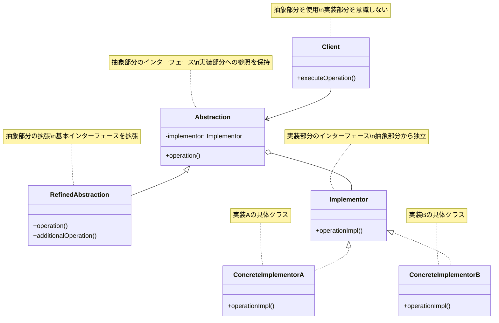
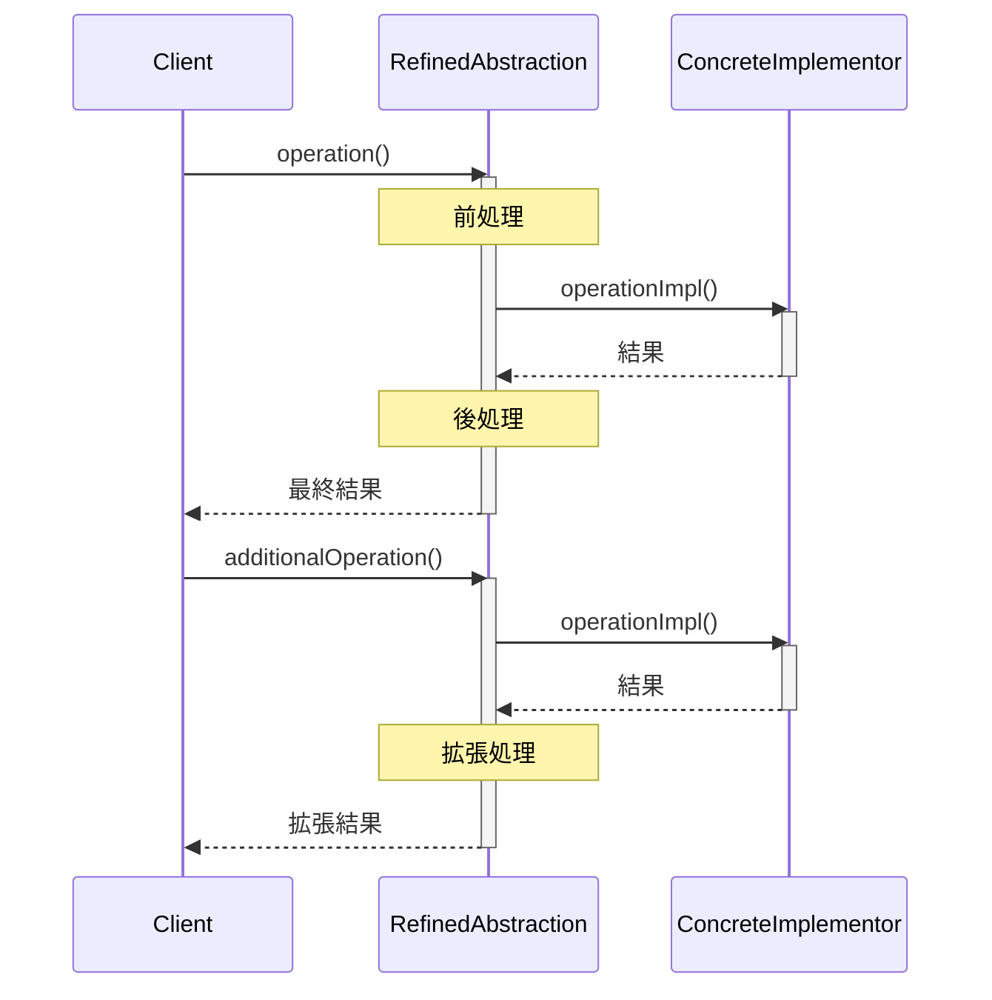
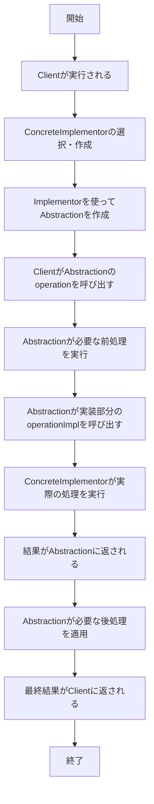

# Bridgeパターン - 抽象と実装の分離

## 1. 概要

### 1.1 パターンの定義
Bridgeパターン（ブリッジ・パターン）は、抽象部分と実装部分を分離し、それぞれを独立に変更できるようにするデザインパターンです。これにより、実装の詳細を抽象から切り離し、両者を独立に進化させることができます。

### 1.2 目的・解決する問題
- 抽象と実装の結合度を下げる
- 抽象と実装をそれぞれ独立に拡張できるようにする
- 実装の詳細を抽象から隠蔽する
- クライアントに実装の詳細を見せずに機能を提供する
- クラス階層の爆発的増加を防ぐ

### 1.3 コンテキスト・適用場面
- 抽象と実装の両方に対して独立した拡張が必要な場合
- 実装の詳細を完全にクライアントから隠蔽したい場合
- 複数のプラットフォームで動作するアプリケーション
- 複数のデータベースをサポートするシステム
- 異なるGUIフレームワークをサポートするアプリケーション
- ドライバやレンダラーを切り替え可能にしたい場合

## 2. クラス構造

### 2.1 クラス図



### 2.2 主要コンポーネント

| コンポーネント | 種類 | 責務 | 関連 |
|-------------|------|------|------|
| Abstraction | クラス | 抽象部分のインターフェースを定義、実装部分への参照を保持 | Implementorを使用、RefinedAbstractionの親 |
| RefinedAbstraction | クラス | Abstractionのインターフェースを拡張 | Abstractionを継承 |
| Implementor | インターフェース | 実装部分のインターフェースを定義 | ConcreteImplementorの親インターフェース |
| ConcreteImplementor | クラス | Implementorインターフェースの具体的な実装 | Implementorを実装 |
| Client | クラス | Abstractionを使用して操作を実行 | Abstractionを使用 |

### 2.3 相互作用
- Abstractionはクライアントからの要求をImplementorの操作に変換する
- Implementorはプラットフォーム固有の操作を提供する
- AbstractionとImplementorは独立して変更・拡張が可能
- RefinedAbstractionはAbstractionのインターフェースを拡張して追加機能を提供
- クライアントはAbstractionのみと対話し、Implementorを直接扱わない

## 3. 振る舞い

### 3.1 シーケンス図



### 3.2 プロセスフロー



### 3.3 重要なシナリオ

#### シナリオ1: 異なるプラットフォームでの描画
1. アプリケーションが起動し、現在のプラットフォーム（Windows、MacOS、Linux）を検出
2. 適切なレンダリングエンジン（ConcreteImplementor）が選択される
3. 様々な形状（Circle、Rectangle）のRefinedAbstractionオブジェクトが作成される
4. 各形状オブジェクトはプラットフォーム固有のレンダリングエンジンを使用
5. ユーザーがアプリケーション上で形状を描画
6. 形状はレンダリングエンジンの適切なメソッドを呼び出して描画を行う
7. 形状の表示はプラットフォームに適した方法で行われる

#### シナリオ2: データベース接続の抽象化
1. システムがデータベース設定をロードし、必要なデータベース（MySQL、PostgreSQL、MongoDB）を特定
2. 対応するデータベースドライバ（ConcreteImplementor）がインスタンス化される
3. 様々なデータアクセスオブジェクト（RefinedAbstraction）が作成される
4. 各DAOは特定のデータベースドライバを使用するが、共通のインターフェースを提供
5. アプリケーションがデータアクセス操作（検索、保存、更新）を要求
6. DAOは操作をデータベース固有の実装に変換
7. 操作結果がアプリケーションに返される
8. 将来的にデータベースが変更された場合も、アプリケーションコードは変更不要

## 4. 実装詳細

### 4.1 主要インターフェース・クラス

```typescript
/**
 * Implementor - 描画エンジンのインターフェース
 * プラットフォーム固有の描画操作を定義
 */
interface DrawingAPI {
  /**
   * 線を描画する
   * @param x1 開始点のX座標
   * @param y1 開始点のY座標
   * @param x2 終了点のX座標
   * @param y2 終了点のY座標
   */
  drawLine(x1: number, y1: number, x2: number, y2: number): void;
  
  /**
   * 円を描画する
   * @param x 中心点のX座標
   * @param y 中心点のY座標
   * @param radius 半径
   */
  drawCircle(x: number, y: number, radius: number): void;
  
  /**
   * テキストを描画する
   * @param x X座標
   * @param y Y座標
   * @param text 描画するテキスト
   */
  drawText(x: number, y: number, text: string): void;
  
  /**
   * 描画APIの名前を取得する
   * @returns 描画APIの名前
   */
  getAPIName(): string;
}

/**
 * ConcreteImplementorA - Windows用描画API実装
 */
class WindowsDrawingAPI implements DrawingAPI {
  /**
   * 線を描画する
   * @param x1 開始点のX座標
   * @param y1 開始点のY座標
   * @param x2 終了点のX座標
   * @param y2 終了点のY座標
   */
  drawLine(x1: number, y1: number, x2: number, y2: number): void {
    console.log(`WindowsAPI: 線描画 (${x1},${y1}) から (${x2},${y2})`);
  }
  
  /**
   * 円を描画する
   * @param x 中心点のX座標
   * @param y 中心点のY座標
   * @param radius 半径
   */
  drawCircle(x: number, y: number, radius: number): void {
    console.log(`WindowsAPI: 円描画 中心(${x},${y}), 半径${radius}`);
  }
  
  /**
   * テキストを描画する
   * @param x X座標
   * @param y Y座標
   * @param text 描画するテキスト
   */
  drawText(x: number, y: number, text: string): void {
    console.log(`WindowsAPI: テキスト描画 (${x},${y}): "${text}"`);
  }
  
  /**
   * 描画APIの名前を取得する
   * @returns 描画APIの名前
   */
  getAPIName(): string {
    return "Windows GDI";
  }
}

/**
 * ConcreteImplementorB - MacOS用描画API実装
 */
class MacDrawingAPI implements DrawingAPI {
  /**
   * 線を描画する
   * @param x1 開始点のX座標
   * @param y1 開始点のY座標
   * @param x2 終了点のX座標
   * @param y2 終了点のY座標
   */
  drawLine(x1: number, y1: number, x2: number, y2: number): void {
    console.log(`MacAPI: 線描画 (${x1},${y1}) から (${x2},${y2})`);
  }
  
  /**
   * 円を描画する
   * @param x 中心点のX座標
   * @param y 中心点のY座標
   * @param radius 半径
   */
  drawCircle(x: number, y: number, radius: number): void {
    console.log(`MacAPI: 円描画 中心(${x},${y}), 半径${radius}`);
  }
  
  /**
   * テキストを描画する
   * @param x X座標
   * @param y Y座標
   * @param text 描画するテキスト
   */
  drawText(x: number, y: number, text: string): void {
    console.log(`MacAPI: テキスト描画 (${x},${y}): "${text}"`);
  }
  
  /**
   * 描画APIの名前を取得する
   * @returns 描画APIの名前
   */
  getAPIName(): string {
    return "Mac Quartz";
  }
}

/**
 * Abstraction - 図形の抽象基底クラス
 */
abstract class Shape {
  protected drawingAPI: DrawingAPI;
  
  /**
   * コンストラクタ
   * @param drawingAPI 描画APIの実装
   */
  constructor(drawingAPI: DrawingAPI) {
    this.drawingAPI = drawingAPI;
  }
  
  /**
   * 図形を描画する（サブクラスで実装）
   */
  abstract draw(): void;
  
  /**
   * 図形の情報を文字列として取得する（サブクラスで実装）
   * @returns 図形の情報
   */
  abstract toString(): string;
  
  /**
   * 使用しているAPIの名前を取得する
   * @returns 使用中のAPIの名前
   */
  getAPIName(): string {
    return this.drawingAPI.getAPIName();
  }
}

/**
 * RefinedAbstraction A - 円の図形クラス
 */
class Circle extends Shape {
  private x: number;
  private y: number;
  private radius: number;
  
  /**
   * コンストラクタ
   * @param x 中心点のX座標
   * @param y 中心点のY座標
   * @param radius 半径
   * @param drawingAPI 描画APIの実装
   */
  constructor(x: number, y: number, radius: number, drawingAPI: DrawingAPI) {
    super(drawingAPI);
    this.x = x;
    this.y = y;
    this.radius = radius;
  }
  
  /**
   * 円を描画する
   */
  draw(): void {
    this.drawingAPI.drawCircle(this.x, this.y, this.radius);
  }
  
  /**
   * 円の情報を取得する
   * @returns 円の情報文字列
   */
  toString(): string {
    return `円 [中心点(${this.x},${this.y}), 半径${this.radius}]`;
  }
  
  /**
   * 円の面積を計算する（拡張された操作）
   * @returns 円の面積
   */
  getArea(): number {
    return Math.PI * this.radius * this.radius;
  }
}

/**
 * RefinedAbstraction B - 四角形の図形クラス
 */
class Rectangle extends Shape {
  private x1: number;
  private y1: number;
  private x2: number;
  private y2: number;
  
  /**
   * コンストラクタ
   * @param x1 左上のX座標
   * @param y1 左上のY座標
   * @param x2 右下のX座標
   * @param y2 右下のY座標
   * @param drawingAPI 描画APIの実装
   */
  constructor(x1: number, y1: number, x2: number, y2: number, drawingAPI: DrawingAPI) {
    super(drawingAPI);
    this.x1 = x1;
    this.y1 = y1;
    this.x2 = x2;
    this.y2 = y2;
  }
  
  /**
   * 四角形を描画する
   */
  draw(): void {
    // 四角形を4本の線で描画
    this.drawingAPI.drawLine(this.x1, this.y1, this.x2, this.y1); // 上辺
    this.drawingAPI.drawLine(this.x2, this.y1, this.x2, this.y2); // 右辺
    this.drawingAPI.drawLine(this.x2, this.y2, this.x1, this.y2); // 下辺
    this.drawingAPI.drawLine(this.x1, this.y2, this.x1, this.y1); // 左辺
  }
  
  /**
   * 四角形の情報を取得する
   * @returns 四角形の情報文字列
   */
  toString(): string {
    return `四角形 [左上(${this.x1},${this.y1}), 右下(${this.x2},${this.y2})]`;
  }
  
  /**
   * 四角形の面積を計算する（拡張された操作）
   * @returns 四角形の面積
   */
  getArea(): number {
    return Math.abs((this.x2 - this.x1) * (this.y2 - this.y1));
  }
  
  /**
   * 四角形にラベルを描画する（拡張された操作）
   * @param text ラベルテキスト
   */
  drawLabel(text: string): void {
    const centerX = (this.x1 + this.x2) / 2;
    const centerY = (this.y1 + this.y2) / 2;
    this.drawingAPI.drawText(centerX, centerY, text);
  }
}
```

### 4.2 使用例

```typescript
/**
 * クライアントコード
 */
function clientCode() {
  // 異なる実装を用意
  const windowsAPI = new WindowsDrawingAPI();
  const macAPI = new MacDrawingAPI();
  
  console.log("Bridgeパターンのデモ - プラットフォーム固有の描画API");
  console.log("----------------------------------------------------");
  
  // 円を作成（Windows実装と連携）
  const circleOnWindows = new Circle(100, 100, 50, windowsAPI);
  console.log(`作成した図形: ${circleOnWindows.toString()}`);
  console.log(`使用しているAPI: ${circleOnWindows.getAPIName()}`);
  console.log("描画実行:");
  circleOnWindows.draw();
  console.log(`円の面積: ${circleOnWindows.getArea().toFixed(2)}`);
  
  console.log("\n");
  
  // 同じ円をMac実装で描画
  const circleOnMac = new Circle(100, 100, 50, macAPI);
  console.log(`作成した図形: ${circleOnMac.toString()}`);
  console.log(`使用しているAPI: ${circleOnMac.getAPIName()}`);
  console.log("描画実行:");
  circleOnMac.draw();
  console.log(`円の面積: ${circleOnMac.getArea().toFixed(2)}`);
  
  console.log("\n");
  
  // 四角形をWindows実装で描画
  const rectangleOnWindows = new Rectangle(10, 10, 110, 60, windowsAPI);
  console.log(`作成した図形: ${rectangleOnWindows.toString()}`);
  console.log(`使用しているAPI: ${rectangleOnWindows.getAPIName()}`);
  console.log("描画実行:");
  rectangleOnWindows.draw();
  console.log(`四角形の面積: ${rectangleOnWindows.getArea()}`);
  console.log("ラベル追加:");
  rectangleOnWindows.drawLabel("Windowsの四角形");
  
  console.log("\n");
  
  // 同じ四角形をMac実装で描画
  const rectangleOnMac = new Rectangle(10, 10, 110, 60, macAPI);
  console.log(`作成した図形: ${rectangleOnMac.toString()}`);
  console.log(`使用しているAPI: ${rectangleOnMac.getAPIName()}`);
  console.log("描画実行:");
  rectangleOnMac.draw();
  console.log(`四角形の面積: ${rectangleOnMac.getArea()}`);
  console.log("ラベル追加:");
  rectangleOnMac.drawLabel("Macの四角形");
}

// クライアントコードを実行
clientCode();

// 出力例:
// Bridgeパターンのデモ - プラットフォーム固有の描画API
// ----------------------------------------------------
// 作成した図形: 円 [中心点(100,100), 半径50]
// 使用しているAPI: Windows GDI
// 描画実行:
// WindowsAPI: 円描画 中心(100,100), 半径50
// 円の面積: 7853.98
// 
// 作成した図形: 円 [中心点(100,100), 半径50]
// 使用しているAPI: Mac Quartz
// 描画実行:
// MacAPI: 円描画 中心(100,100), 半径50
// 円の面積: 7853.98
// 
// 作成した図形: 四角形 [左上(10,10), 右下(110,60)]
// 使用しているAPI: Windows GDI
// 描画実行:
// WindowsAPI: 線描画 (10,10) から (110,10)
// WindowsAPI: 線描画 (110,10) から (110,60)
// WindowsAPI: 線描画 (110,60) から (10,60)
// WindowsAPI: 線描画 (10,60) から (10,10)
// 四角形の面積: 5000
// ラベル追加:
// WindowsAPI: テキスト描画 (60,35): "Windowsの四角形"
// 
// 作成した図形: 四角形 [左上(10,10), 右下(110,60)]
// 使用しているAPI: Mac Quartz
// 描画実行:
// MacAPI: 線描画 (10,10) から (110,10)
// MacAPI: 線描画 (110,10) から (110,60)
// MacAPI: 線描画 (110,60) から (10,60)
// MacAPI: 線描画 (10,60) から (10,10)
// 四角形の面積: 5000
// ラベル追加:
// MacAPI: テキスト描画 (60,35): "Macの四角形"
```

## 5. パターンのバリエーション

### 5.1 実装共有ブリッジ
実装部分の共通機能を基底クラスに抽出し、具体的な実装クラスはそれを拡張するバリエーション。

```typescript
abstract class AbstractDrawingAPI implements DrawingAPI {
  // 共通機能の実装
  getAPIName(): string {
    return "Generic API";
  }
  
  // 抽象メソッドは子クラスで実装
  abstract drawLine(x1: number, y1: number, x2: number, y2: number): void;
  abstract drawCircle(x: number, y: number, radius: number): void;
  abstract drawText(x: number, y: number, text: string): void;
}

class EnhancedWindowsAPI extends AbstractDrawingAPI {
  // Windowsに特化した実装
  getAPIName(): string {
    return "Enhanced Windows GDI";
  }
  
  // その他のメソッド実装
}
```

### 5.2 イベント処理ブリッジ
抽象部分と実装部分の間でイベントベースの通信を行うバリエーション。

```typescript
interface DrawingAPIListener {
  onDrawCompleted(shapeName: string): void;
}

class EventAwareShape extends Shape implements DrawingAPIListener {
  onDrawCompleted(shapeName: string): void {
    console.log(`描画完了イベント: ${shapeName}`);
  }
  
  // 描画後にイベントを発火
  draw(): void {
    // 具体的な描画処理
    this.onDrawCompleted(this.toString());
  }
}
```

### 5.3 階層型ブリッジ
抽象部分と実装部分の両方に階層を持つバリエーション。

```typescript
// 実装階層
interface BaseAPI {
  basicOperation(): void;
}

interface ExtendedAPI extends BaseAPI {
  extendedOperation(): void;
}

// 抽象階層
abstract class BasicShape {
  protected api: BaseAPI;
  
  constructor(api: BaseAPI) {
    this.api = api;
  }
  
  abstract draw(): void;
}

abstract class AdvancedShape extends BasicShape {
  protected extendedApi: ExtendedAPI;
  
  constructor(api: ExtendedAPI) {
    super(api);
    this.extendedApi = api;
  }
  
  abstract drawWithEffects(): void;
}
```

## 6. 評価

### 6.1 メリット
- **インターフェースと実装の分離**: 抽象部分と実装部分が独立して変更可能
- **拡張性の向上**: 両方の階層が独立して拡張できる
- **実装の詳細の隠蔽**: クライアントは抽象インターフェースのみを使用
- **単一責任の原則**: 抽象と実装の責務が明確に分離される
- **プラットフォーム独立性**: 実装を切り替えることで異なるプラットフォームをサポート
- **継承爆発の回避**: 2つの直交する次元を単一の継承階層にすると、クラス数が指数関数的に増加する問題を回避

### 6.2 デメリット
- **複雑さの増加**: 追加の抽象化レイヤーにより、システムが複雑になる可能性がある
- **学習コスト**: パターンの理解に時間がかかる場合がある
- **オーバーヘッド**: 間接参照によるわずかなパフォーマンス低下の可能性
- **設計初期のコスト**: 将来の拡張性のために最初から複雑な設計が必要

### 6.3 適用場面
- 抽象と実装を完全に分離したい場合
- 実装を実行時に切り替えたい場合
- 抽象と実装の両方を独立して拡張したい場合
- 実装の詳細をクライアントから完全に隠蔽したい場合
- 異なるプラットフォームをサポートする必要がある場合
- クラス階層の爆発的増加を避けたい場合

## 7. 関連パターン
- **Adapter**: Adapterは既存の異なるインターフェースを統合するのに対し、Bridgeは最初から抽象と実装を分離する
- **Strategy**: Strategyはアルゴリズムを交換可能にするのに対し、Bridgeは抽象と実装全体を分離する
- **Abstract Factory**: Abstract Factoryは適切な実装クラスを作成するために使用できる
- **State**: Stateパターンはオブジェクトの状態に基づいて振る舞いを変更するが、Bridgeはプラットフォームに基づいて実装を変更する
- **Composite**: CompositeとBridgeを組み合わせることで、複合オブジェクトの実装を抽象から分離できる

## 8. 参考資料

### 8.1 内部リンク
- [ソースコードへのリンク](../../src/structural/bridge)
- [テストコードへのリンク](../../tests/structural/bridge)

### 8.2 外部リンク
- [リファクタリング・グル - Bridgeパターン](https://refactoring.guru/ja/design-patterns/bridge)
- [Design Patterns: Bridge Pattern](https://sourcemaking.com/design_patterns/bridge)
- [Head First デザインパターン](https://www.oreilly.co.jp/books/9784873119762/) 