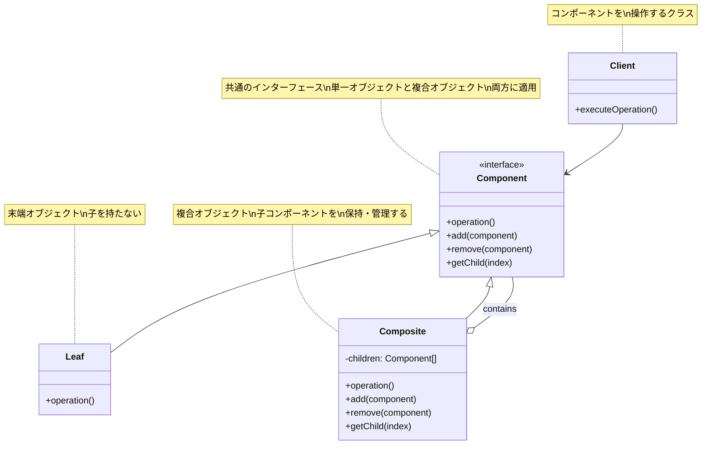
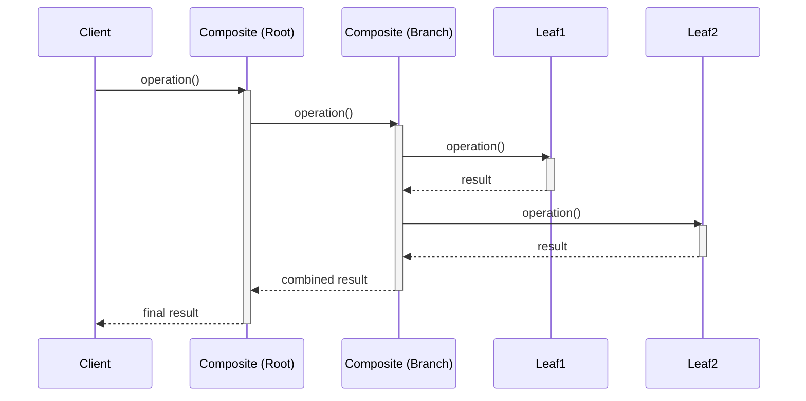
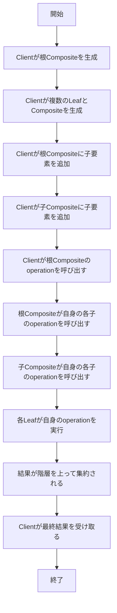

# Compositeパターン - 木構造の統一的操作

## 1. 概要

### 1.1 パターンの定義
Compositeパターン（コンポジット・パターン）は、個々のオブジェクトと複合オブジェクトを同じインターフェースで扱えるようにするデザインパターンです。このパターンを用いると、クライアントは個別オブジェクトとオブジェクトのコレクションを同じ方法で扱うことができます。

### 1.2 目的・解決する問題
- 部分-全体の階層構造（木構造）を表現する
- クライアントが単一オブジェクトと複合オブジェクトを区別せずに扱えるようにする
- 再帰的な構造を簡潔かつ直感的に表現する
- 階層構造全体に対して処理を適用できるようにする
- 操作の一貫性を保ちつつ、複雑な構造を表現する

### 1.3 コンテキスト・適用場面
- ファイルシステム（ファイルとディレクトリ）の表現
- グラフィカルユーザーインターフェース（コンポーネントとコンテナ）
- 組織構造（従業員と部門）の表現
- メニュー構造（メニューとサブメニュー）
- 複合図形の描画（線、円、グループ）
- 複雑な数式や構文木の表現

## 2. クラス構造

### 2.1 クラス図



### 2.2 主要コンポーネント

| コンポーネント | 種類 | 責務 | 関連 |
|-------------|------|------|------|
| Component | インターフェース/抽象クラス | 共通操作のインターフェースを定義し、子オブジェクト管理のためのメソッドを提供 | Leaf、Compositeの親クラス |
| Leaf | クラス | 単一オブジェクトを表し、子オブジェクトを持たない | Componentを実装/継承 |
| Composite | クラス | 子コンポーネントを保持・管理し、操作を子に委譲する | Componentを実装/継承、複数のComponentを含む |
| Client | クラス | Componentインターフェースを使用して構造を操作 | Componentを使用 |

### 2.3 相互作用
- Component: 全てのオブジェクトに共通の操作と子オブジェクト管理のためのインターフェースを定義
- Leaf: 単一オブジェクトで、Componentの操作メソッドを実装し、子の管理メソッドはデフォルト実装または例外を投げる
- Composite: 子コンポーネントを保持し、Componentの操作メソッドを子コンポーネントに委譲し、子の管理メソッドを実装
- Client: Componentインターフェースを通じて操作を行い、LeafとCompositeを区別せずに扱う

## 3. 振る舞い

### 3.1 シーケンス図



### 3.2 プロセスフロー



### 3.3 重要なシナリオ

#### シナリオ1: ファイルシステムのサイズ計算
1. クライアントがルートディレクトリオブジェクト（Composite）を作成
2. クライアントがファイル（Leaf）とサブディレクトリ（Composite）を追加
3. クライアントがルートディレクトリの合計サイズを計算するoperationを呼び出す
4. ルートディレクトリが子である各ファイルとサブディレクトリのoperationを呼び出す
5. サブディレクトリが自身の子のoperationを呼び出す
6. 各ファイルがサイズを返す
7. 各ディレクトリが子のサイズを合計して返す
8. クライアントが最終的な合計サイズを受け取る

#### シナリオ2: GUIコンポーネントの描画
1. クライアントがフォーム（Composite）を作成
2. クライアントがパネル（Composite）とボタン（Leaf）を追加
3. クライアントがパネルにラベルとテキストフィールド（Leaf）を追加
4. クライアントがフォームの描画（operation）を呼び出す
5. フォームが子である各パネルとボタンの描画（operation）を呼び出す
6. パネルが自身の子であるラベルとテキストフィールドの描画を呼び出す
7. 各コンポーネントが描画される
8. 描画が階層的に完了する

## 4. 実装詳細

### 4.1 主要インターフェース・クラス

```typescript
/**
 * Component - ファイルシステム要素の共通インターフェース
 */
interface FileSystemComponent {
  /**
   * ファイル名を取得する
   * @returns ファイル名
   */
  getName(): string;
  
  /**
   * ファイルシステム要素のサイズを計算する
   * @returns サイズ（バイト）
   */
  getSize(): number;
  
  /**
   * ファイルシステム要素の情報を表示する
   * @param indent インデントレベル
   */
  print(indent: string): void;
  
  /**
   * 子要素を追加する（ディレクトリの場合）
   * @param component 追加する要素
   */
  add(component: FileSystemComponent): void;
  
  /**
   * 子要素を削除する（ディレクトリの場合）
   * @param component 削除する要素
   */
  remove(component: FileSystemComponent): void;
  
  /**
   * 指定したインデックスの子要素を取得する（ディレクトリの場合）
   * @param index 取得する子要素のインデックス
   * @returns 子要素
   */
  getChild(index: number): FileSystemComponent;
}

/**
 * Leaf - ファイルを表現するクラス
 */
class File implements FileSystemComponent {
  private name: string;
  private size: number;
  
  /**
   * コンストラクタ
   * @param name ファイル名
   * @param size ファイルサイズ（バイト）
   */
  constructor(name: string, size: number) {
    this.name = name;
    this.size = size;
  }
  
  /**
   * ファイル名を取得する
   * @returns ファイル名
   */
  getName(): string {
    return this.name;
  }
  
  /**
   * ファイルサイズを取得する
   * @returns ファイルサイズ（バイト）
   */
  getSize(): number {
    return this.size;
  }
  
  /**
   * ファイル情報を表示する
   * @param indent インデントレベル
   */
  print(indent: string): void {
    console.log(`${indent}File: ${this.name} (${this.size} bytes)`);
  }
  
  /**
   * ファイルは子要素を持てないため、例外をスローする
   * @param component 追加しようとする要素
   */
  add(component: FileSystemComponent): void {
    throw new Error("Cannot add to a file");
  }
  
  /**
   * ファイルは子要素を持てないため、例外をスローする
   * @param component 削除しようとする要素
   */
  remove(component: FileSystemComponent): void {
    throw new Error("Cannot remove from a file");
  }
  
  /**
   * ファイルは子要素を持てないため、例外をスローする
   * @param index 取得しようとする子要素のインデックス
   */
  getChild(index: number): FileSystemComponent {
    throw new Error("Cannot get child from a file");
  }
}

/**
 * Composite - ディレクトリを表現するクラス
 */
class Directory implements FileSystemComponent {
  private name: string;
  private children: FileSystemComponent[] = [];
  
  /**
   * コンストラクタ
   * @param name ディレクトリ名
   */
  constructor(name: string) {
    this.name = name;
  }
  
  /**
   * ディレクトリ名を取得する
   * @returns ディレクトリ名
   */
  getName(): string {
    return this.name;
  }
  
  /**
   * ディレクトリの合計サイズを計算する（再帰的に子要素のサイズを合計）
   * @returns 合計サイズ（バイト）
   */
  getSize(): number {
    let totalSize = 0;
    for (const child of this.children) {
      totalSize += child.getSize();
    }
    return totalSize;
  }
  
  /**
   * ディレクトリ情報を表示する（再帰的に子要素の情報も表示）
   * @param indent インデントレベル
   */
  print(indent: string): void {
    console.log(`${indent}Directory: ${this.name} (${this.getSize()} bytes)`);
    for (const child of this.children) {
      child.print(indent + "  ");
    }
  }
  
  /**
   * 子要素を追加する
   * @param component 追加する要素
   */
  add(component: FileSystemComponent): void {
    this.children.push(component);
  }
  
  /**
   * 子要素を削除する
   * @param component 削除する要素
   */
  remove(component: FileSystemComponent): void {
    const index = this.children.indexOf(component);
    if (index !== -1) {
      this.children.splice(index, 1);
    }
  }
  
  /**
   * 指定したインデックスの子要素を取得する
   * @param index 取得する子要素のインデックス
   * @returns 子要素
   */
  getChild(index: number): FileSystemComponent {
    return this.children[index];
  }
}
```

### 4.2 使用例

```typescript
/**
 * クライアントコード
 */
function clientCode() {
  // ルートディレクトリを作成
  const root = new Directory("root");
  
  // ファイルをルートに追加
  const readmeFile = new File("README.md", 2048);
  root.add(readmeFile);
  
  // サブディレクトリを作成
  const srcDir = new Directory("src");
  root.add(srcDir);
  
  // サブディレクトリにファイルを追加
  const indexFile = new File("index.ts", 1024);
  const appFile = new File("app.ts", 4096);
  srcDir.add(indexFile);
  srcDir.add(appFile);
  
  // もう一つのサブディレクトリを作成
  const testDir = new Directory("test");
  root.add(testDir);
  
  // テストディレクトリにファイルを追加
  const testFile = new File("app.test.ts", 3072);
  testDir.add(testFile);
  
  // 階層構造を表示
  console.log("ファイルシステム構造:");
  root.print("");
  
  // 合計サイズを計算
  console.log(`\n合計サイズ: ${root.getSize()} bytes`);
  
  // サブディレクトリのサイズも個別に取得可能
  console.log(`srcディレクトリのサイズ: ${srcDir.getSize()} bytes`);
  console.log(`testディレクトリのサイズ: ${testDir.getSize()} bytes`);
  
  // 子要素を削除
  console.log("\nindexファイルを削除した後:");
  srcDir.remove(indexFile);
  root.print("");
}

// クライアントコードを実行
clientCode();

// 出力例:
// ファイルシステム構造:
// Directory: root (10240 bytes)
//   File: README.md (2048 bytes)
//   Directory: src (5120 bytes)
//     File: index.ts (1024 bytes)
//     File: app.ts (4096 bytes)
//   Directory: test (3072 bytes)
//     File: app.test.ts (3072 bytes)
//
// 合計サイズ: 10240 bytes
// srcディレクトリのサイズ: 5120 bytes
// testディレクトリのサイズ: 3072 bytes
//
// indexファイルを削除した後:
// Directory: root (9216 bytes)
//   File: README.md (2048 bytes)
//   Directory: src (4096 bytes)
//     File: app.ts (4096 bytes)
//   Directory: test (3072 bytes)
//     File: app.test.ts (3072 bytes)
```

## 5. パターンのバリエーション

### 5.1 安全Composite（Safe Composite）
子コンポーネント管理のメソッド（add, remove, getChild）をCompositeクラスだけに定義し、Componentインターフェースには含めないバージョン。型の安全性は高まるが、クライアントがLeafとCompositeを区別する必要がある。

```typescript
// 安全Compositeパターンの例
interface Component {
  // 共通操作のみ定義
  operation(): void;
}

class Leaf implements Component {
  operation(): void {
    console.log("Leaf operation");
  }
}

class Composite implements Component {
  private children: Component[] = [];
  
  operation(): void {
    console.log("Composite operation:");
    for (const child of this.children) {
      child.operation();
    }
  }
  
  // Compositeクラスにのみ子管理メソッドを定義
  add(component: Component): void {
    this.children.push(component);
  }
  
  remove(component: Component): void {
    const index = this.children.indexOf(component);
    if (index !== -1) {
      this.children.splice(index, 1);
    }
  }
  
  getChild(index: number): Component {
    return this.children[index];
  }
}
```

### 5.2 透過的Composite（Transparent Composite）
基本的なCompositeパターンで、Componentインターフェースにすべてのメソッドを含め、クライアントがLeafとCompositeを区別せずに扱えるようにする。柔軟性は高いが、型の安全性は低くなる。

```typescript
// 透過的Compositeパターンの例（基本的なCompositeパターン）
interface Component {
  // 共通操作と子管理メソッドを両方定義
  operation(): void;
  add(component: Component): void;
  remove(component: Component): void;
  getChild(index: number): Component;
}

class Leaf implements Component {
  operation(): void {
    console.log("Leaf operation");
  }
  
  // 空実装または例外をスロー
  add(component: Component): void {
    throw new Error("Cannot add to a leaf");
  }
  
  remove(component: Component): void {
    throw new Error("Cannot remove from a leaf");
  }
  
  getChild(index: number): Component {
    throw new Error("Cannot get child from a leaf");
  }
}

// Compositeの実装は変わらない
```

## 6. 評価

### 6.1 メリット
- **統一的なインターフェース**: 単一オブジェクトと複合オブジェクトを同じ方法で扱えるため、クライアントコードがシンプルになる
- **階層構造の表現**: 木構造を自然に表現でき、再帰的な処理が可能
- **開放/閉鎖原則**: 新たな種類のコンポーネントを追加しても既存のコードを変更する必要がない
- **コードの再利用**: 同じコンポーネントを異なる階層構造で再利用できる
- **再帰的処理の簡素化**: 階層構造全体に対する操作を簡潔に実装できる
- **拡張性**: 構造を動的に構築・変更できる

### 6.2 デメリット
- **デザインの制約**: すべてのコンポーネントが共通インターフェースを共有するため、コンポーネント固有の機能を追加しづらい
- **型の安全性**: 透過的アプローチでは、LeafオブジェクトにCompositeの操作を適用しようとするとランタイムエラーが発生する可能性がある
- **過剰な一般化**: 単一/複合オブジェクトの区別が必要ない場合、不必要な複雑さを招く可能性がある
- **パフォーマンス**: 深い階層構造では、再帰的な操作がパフォーマンス問題を引き起こす可能性がある
- **コンポーネント削除の複雑さ**: 親への参照がない場合、特定のコンポーネントを階層から削除するのが難しい

### 6.3 適用場面
- 部分-全体の階層（木構造）を表現する必要がある場合
- クライアントが単一オブジェクトと複合オブジェクトを区別せずに扱いたい場合
- 以下のような具体的なアプリケーション:
  - ファイルシステムの表現
  - GUIコンポーネントの階層
  - 組織構造の表現
  - メニュー構造
  - 複合図形の描画
  - 数式や構文木の表現
  - XMLやHTMLなどの階層的ドキュメント

## 7. 関連パターン
- **Decorator**: 単一のコンポーネントに責任を追加するが、Compositeは複数のオブジェクトをまとめる
- **Iterator**: Compositeパターンで構築された複雑な構造を走査するのに役立つ
- **Visitor**: Compositeパターンで構築された構造に対して、新しい操作を追加するのに役立つ
- **Chain of Responsibility**: コマンドを階層的に処理する際にCompositeと組み合わせることがある
- **Flyweight**: Compositeパターンとともに使用して、複合オブジェクトの記憶効率を向上させることがある

## 8. 参考資料

### 8.1 内部リンク
- [ソースコードへのリンク](../../src/structural/composite)
- [テストコードへのリンク](../../tests/structural/composite)

### 8.2 外部リンク
- [リファクタリング・グル - Compositeパターン](https://refactoring.guru/ja/design-patterns/composite)
- [Design Patterns: Composite Pattern](https://sourcemaking.com/design_patterns/composite)
- [Head First デザインパターン](https://www.oreilly.co.jp/books/9784873119762/) 