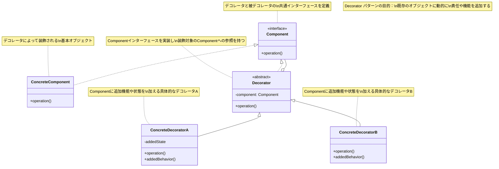
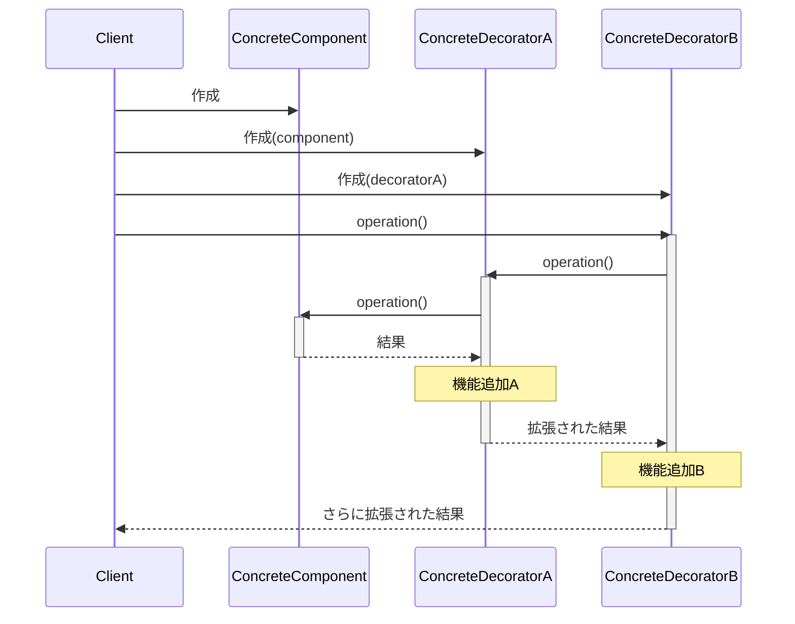
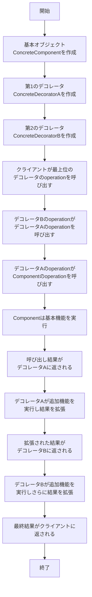

# Decoratorパターン - 動的機能拡張

## 1. 概要

### 1.1 パターンの定義
Decorator パターン（デコレーター・パターン）は、既存のオブジェクトに動的に責任や機能を追加するためのデザインパターンです。継承を使わずに機能拡張を行うことができ、実行時に柔軟にオブジェクトの振る舞いを変更することができます。

### 1.2 目的・解決する問題
- 継承を使わずにクラスの機能を動的に拡張する
- 個々の機能を別々のデコレーターとして分離する
- 機能の組み合わせを柔軟に行う
- オブジェクトの核となる機能と付加機能を分離する
- 単一責任の原則に従ってコードを整理する
- クラス爆発を防止する
- 実行時にオブジェクトの振る舞いを変更できるようにする

### 1.3 コンテキスト・適用場面
- 既存のクラスのコードを変更せずに機能を拡張したい場合
- 継承が適切でない場合または継承できない場合
- 実行時に機能を追加/削除したい場合
- 機能の組み合わせが多数存在し、そのすべてのクラスを作るとクラス爆発が起こる場合
- 付加的な機能を分離し、必要に応じて組み合わせたい場合
- ユーザーの権限や設定に応じて、動的に機能を追加したい場合

## 2. クラス構造

### 2.1 クラス図


### 2.2 主要コンポーネント

| コンポーネント | 種類 | 責務 | 関連 |
|-------------|------|------|------|
| Component | インターフェース | デコレータと被デコレータの共通インターフェースを定義 | ConcreteComponent、Decoratorに実装される |
| ConcreteComponent | クラス | デコレータによって装飾される基本オブジェクト | Componentを実装 |
| Decorator | 抽象クラス | Componentインターフェースを実装し、装飾対象のComponentへの参照を持つ | Componentを実装、Componentを参照 |
| ConcreteDecoratorA | クラス | Componentに追加機能や状態を加える具体的なデコレータA | Decoratorを継承 |
| ConcreteDecoratorB | クラス | Componentに追加機能や状態を加える具体的なデコレータB | Decoratorを継承 |

### 2.3 相互作用
- Decoratorはコンポジション（Componentへの参照）を通じて機能拡張を行う
- クライアントはComponentインターフェースを通じてオブジェクトと相互作用する
- 複数のデコレータを重ねることで機能の積み重ねが可能
- Decoratorクラスはインターフェースの順守と元のオブジェクトへの転送責任を持つ
- ConcreteDecoratorは独自の振る舞いを追加し、親クラスのメソッドを拡張する

## 3. 振る舞い

### 3.1 シーケンス図


### 3.2 プロセスフロー


### 3.3 重要なシナリオ

#### シナリオ1: カスタマイズされたコーヒーの注文
1. カフェの注文システムが基本のコーヒー（SimpleCoffee）を作成する
2. 顧客がミルクを追加すると、システムはMilkDecoratorでコーヒーをデコレートする
3. 顧客が砂糖も追加すると、SugarDecoratorでさらにデコレートする
4. 顧客がホイップクリームも追加すると、WhipDecoratorでさらにデコレートする
5. システムは最終的なコーヒーの説明と価格を計算し、顧客に表示する
6. 各デコレータは基本コーヒーの説明と価格を拡張し、最終的な製品情報を構成する

#### シナリオ2: テキスト処理フィルタの適用
1. アプリケーションが基本的なテキスト（PlainText）を作成する
2. ユーザーがボールド装飾を適用すると、BoldDecoratorでテキストをデコレートする
3. ユーザーがイタリック装飾も適用すると、ItalicDecoratorでさらにデコレートする
4. ユーザーがリンク装飾も適用すると、LinkDecoratorでさらにデコレートする
5. アプリケーションは最終的なテキストの書式を計算し、表示する
6. 各デコレータは基本テキストの書式を拡張し、最終的な表示形式を構成する

## 4. 実装詳細

### 4.1 主要インターフェース・クラス

```typescript
/**
 * Component - コーヒーの共通インターフェース
 * デコレータと被デコレータの共通インターフェースを定義
 */
interface Coffee {
  /**
   * コーヒーの説明を取得
   * @returns 説明文字列
   */
  getDescription(): string;
  
  /**
   * コーヒーの価格を取得
   * @returns 価格
   */
  getCost(): number;
}

/**
 * ConcreteComponent - 基本のコーヒー
 * デコレータによって装飾される基本オブジェクト
 */
class SimpleCoffee implements Coffee {
  /**
   * 基本コーヒーの説明を取得
   * @returns 説明文字列
   */
  getDescription(): string {
    return "シンプルコーヒー";
  }
  
  /**
   * 基本コーヒーの価格を取得
   * @returns 価格
   */
  getCost(): number {
    return 300;
  }
}

/**
 * Decorator - コーヒーデコレータの抽象クラス
 * Componentインターフェースを実装し、装飾対象のコーヒーへの参照を持つ
 */
abstract class CoffeeDecorator implements Coffee {
  // 装飾対象のコーヒー
  protected coffee: Coffee;
  
  /**
   * コンストラクタ
   * @param coffee 装飾対象のコーヒー
   */
  constructor(coffee: Coffee) {
    this.coffee = coffee;
  }
  
  /**
   * コーヒーの説明を取得する（デフォルトでは装飾対象のコーヒーの説明を返す）
   * サブクラスでオーバーライドすることを想定
   * @returns 説明文字列
   */
  getDescription(): string {
    return this.coffee.getDescription();
  }
  
  /**
   * コーヒーの価格を取得する（デフォルトでは装飾対象のコーヒーの価格を返す）
   * サブクラスでオーバーライドすることを想定
   * @returns 価格
   */
  getCost(): number {
    return this.coffee.getCost();
  }
}

/**
 * ConcreteDecorator - ミルクを追加するデコレータ
 */
class MilkDecorator extends CoffeeDecorator {
  /**
   * ミルク追加後の説明を取得
   * @returns 説明文字列
   */
  getDescription(): string {
    return `${this.coffee.getDescription()} + ミルク`;
  }
  
  /**
   * ミルク追加後の価格を取得
   * @returns 価格
   */
  getCost(): number {
    return this.coffee.getCost() + 50;
  }
}

/**
 * ConcreteDecorator - 砂糖を追加するデコレータ
 */
class SugarDecorator extends CoffeeDecorator {
  /**
   * 砂糖追加後の説明を取得
   * @returns 説明文字列
   */
  getDescription(): string {
    return `${this.coffee.getDescription()} + 砂糖`;
  }
  
  /**
   * 砂糖追加後の価格を取得
   * @returns 価格
   */
  getCost(): number {
    return this.coffee.getCost() + 30;
  }
}

/**
 * ConcreteDecorator - ホイップクリームを追加するデコレータ
 */
class WhipDecorator extends CoffeeDecorator {
  /**
   * ホイップクリーム追加後の説明を取得
   * @returns 説明文字列
   */
  getDescription(): string {
    return `${this.coffee.getDescription()} + ホイップクリーム`;
  }
  
  /**
   * ホイップクリーム追加後の価格を取得
   * @returns 価格
   */
  getCost(): number {
    return this.coffee.getCost() + 100;
  }
}
```

### 4.2 使用例

```typescript
/**
 * クライアントコード
 */
function clientCode() {
  // 基本のコーヒーを作成
  let coffee: Coffee = new SimpleCoffee();
  console.log(`注文：${coffee.getDescription()}`);
  console.log(`価格：${coffee.getCost()}円`);
  
  // ミルクを追加
  coffee = new MilkDecorator(coffee);
  console.log(`注文：${coffee.getDescription()}`);
  console.log(`価格：${coffee.getCost()}円`);
  
  // 砂糖を追加
  coffee = new SugarDecorator(coffee);
  console.log(`注文：${coffee.getDescription()}`);
  console.log(`価格：${coffee.getCost()}円`);
  
  // ホイップクリームを追加
  coffee = new WhipDecorator(coffee);
  console.log(`注文：${coffee.getDescription()}`);
  console.log(`価格：${coffee.getCost()}円`);
  
  // 別のコーヒーの注文例（デコレータの組み合わせ順序を変えた例）
  console.log("\n--- 別の注文 ---");
  
  // 基本のコーヒーを作成し、ホイップとミルクを追加
  let specialCoffee: Coffee = new SimpleCoffee();
  specialCoffee = new WhipDecorator(specialCoffee);
  specialCoffee = new MilkDecorator(specialCoffee);
  
  console.log(`注文：${specialCoffee.getDescription()}`);
  console.log(`価格：${specialCoffee.getCost()}円`);
}

// クライアントコードを実行
clientCode();

// 出力例:
// 注文：シンプルコーヒー
// 価格：300円
// 注文：シンプルコーヒー + ミルク
// 価格：350円
// 注文：シンプルコーヒー + ミルク + 砂糖
// 価格：380円
// 注文：シンプルコーヒー + ミルク + 砂糖 + ホイップクリーム
// 価格：480円
//
// --- 別の注文 ---
// 注文：シンプルコーヒー + ホイップクリーム + ミルク
// 価格：450円
```

## 5. パターンのバリエーション

### 5.1 透過的デコレータ (Transparent Decorator)
クライアントが追加された機能に直接アクセスできるようにするバリエーション。追加された機能にアクセスするには、デコレータの型へのキャストが必要になります。

```typescript
interface TextComponent {
  render(): string;
}

class PlainText implements TextComponent {
  private text: string;
  
  constructor(text: string) {
    this.text = text;
  }
  
  render(): string {
    return this.text;
  }
}

abstract class TextDecorator implements TextComponent {
  protected component: TextComponent;
  
  constructor(component: TextComponent) {
    this.component = component;
  }
  
  render(): string {
    return this.component.render();
  }
}

class BoldDecorator extends TextDecorator {
  render(): string {
    return `<b>${this.component.render()}</b>`;
  }
  
  // 追加されたメソッド
  makeBold(text: string): string {
    return `<b>${text}</b>`;
  }
}

// 使用例
const text = new PlainText("Hello");
const boldText = new BoldDecorator(text);

// 基本インターフェースのメソッド
console.log(boldText.render()); // <b>Hello</b>

// 追加されたメソッドにアクセス（キャストが必要）
if (boldText instanceof BoldDecorator) {
  console.log(boldText.makeBold("World")); // <b>World</b>
}
```

### 5.2 自己デコレート (Self-Decorating)
同じデコレータを複数回適用できるようにするバリエーション。これにより、同じ機能を繰り返し追加することができます。

```typescript
class BorderDecorator extends TextDecorator {
  private borderWidth: number;
  
  constructor(component: TextComponent, borderWidth: number = 1) {
    super(component);
    this.borderWidth = borderWidth;
  }
  
  render(): string {
    let border = "";
    for (let i = 0; i < this.borderWidth; i++) {
      border += "*";
    }
    return `${border}${this.component.render()}${border}`;
  }
}

// 使用例
let text = new PlainText("Hello");
text = new BorderDecorator(text, 1);      // *Hello*
text = new BorderDecorator(text, 2);      // **Hello**
console.log(text.render());               // **Hello**
```

### 5.3 キャッシュデコレータ (Caching Decorator)
パフォーマンス向上のために結果をキャッシュするデコレータ。繰り返し同じ操作が行われる場合に有効です。

```typescript
class CachingDecorator extends TextDecorator {
  private cache: Map<string, string> = new Map();
  
  render(): string {
    const key = this.component.render();
    if (this.cache.has(key)) {
      console.log("キャッシュから取得");
      return this.cache.get(key)!;
    }
    
    console.log("新規計算");
    const result = `<cached>${key}</cached>`;
    this.cache.set(key, result);
    return result;
  }
}
```

## 6. 評価

### 6.1 メリット
- **オープン/クローズド原則**: 既存のコードを変更せずに拡張できる
- **単一責任の原則**: 各デコレータは特定の機能のみに責任を持つ
- **柔軟性**: 実行時に動的に機能を追加・組み合わせられる
- **合成による拡張**: 継承の代わりに合成（コンポジション）を使用
- **細かい粒度**: 機能を小さなコンポーネントに分割できる
- **階層的機能追加**: デコレータをスタックさせて機能を積み重ねることができる
- **独立性**: 各デコレータは独立して開発・テストできる

### 6.2 デメリット
- **小さなオブジェクトの増加**: 多数の小さなオブジェクトが作成され、デバッグが難しくなる可能性がある
- **デコレータの順序**: デコレータの適用順序が結果に影響する場合がある
- **特定のデコレータの削除**: スタックからの特定のデコレータの削除が難しい
- **一貫性の欠如**: デコレータを追加した順序によって異なる結果が生じる可能性がある
- **複雑な設計**: シンプルな機能拡張の場合、過度に複雑になる可能性がある
- **型の透過性**: デコレータ固有の機能にアクセスするには型キャストが必要な場合がある

### 6.3 適用場面
- 実行時に動的にオブジェクトの機能を追加/削除したい場合
- 継承を使わずに機能拡張を行いたい場合
- 様々な機能の組み合わせが多数あり、サブクラス爆発を避けたい場合
- オブジェクトの責任を分離し、単一責任の原則に従いたい場合
- 以下のような具体的なアプリケーション:
  - GUIコンポーネントへの機能追加（ボーダー、スクロールバーなど）
  - データストリームへのフィルタの適用（暗号化、圧縮、バッファリングなど）
  - パーミッションに基づくアクセス制御の実装
  - コーヒーショップのカスタムオーダーシステム
  - テキスト処理での書式設定機能の追加

## 7. 関連パターン
- **Composite**: Decoratorはしばしば複合オブジェクトと共に使用される
- **Strategy**: 両方とも合成を使用するが、Strategyはオブジェクトの内部アルゴリズムを変更し、Decoratorはオブジェクトの外観を変更する
- **Adapter**: 両方ともラッピングを使用するが、Adapterはインターフェースを変更し、Decoratorは機能を追加する
- **Chain of Responsibility**: 両方とも複数のオブジェクトを連鎖させるが、目的が異なる
- **Proxy**: 両方ともラッピングを使用するが、Proxyはアクセス制御に焦点を当て、Decoratorは機能追加に焦点を当てる

## 8. 参考資料

### 8.1 内部リンク
- [ソースコードへのリンク](../../src/structural/decorator)
- [テストコードへのリンク](../../tests/structural/decorator)

### 8.2 外部リンク
- [リファクタリング・グル - Decoratorパターン](https://refactoring.guru/ja/design-patterns/decorator)
- [Design Patterns: Decorator Pattern](https://sourcemaking.com/design_patterns/decorator)
- [Head First デザインパターン](https://www.oreilly.co.jp/books/9784873119762/) 