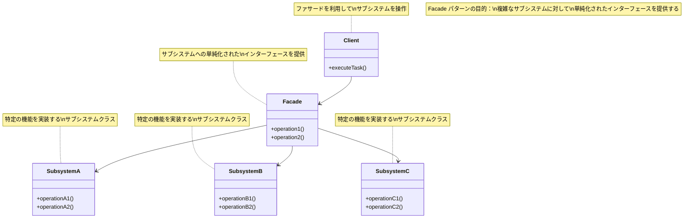

# Facade パターン

# Facadeパターン - 複雑なサブシステム簡素化

## 1. 概要

### 1.1 パターンの定義
Facade パターン（ファサード・パターン）は、複雑なサブシステムに対して単純化されたインターフェースを提供するデザインパターンです。内部の複雑な処理を隠蔽し、クライアントが簡単に利用できるようにするための「窓口」の役割を果たします。

### 1.2 目的・解決する問題
- 複雑なサブシステムに対して単純化されたインターフェースを提供する
- サブシステムの実装詳細を隠蔽する
- クライアントとサブシステム間の結合度を下げる
- サブシステムの利用を簡単にする
- 複雑な処理を単一の操作に集約する
- サブシステムのコンポーネント間の強い依存関係からクライアントを保護する

### 1.3 コンテキスト・適用場面
- 複雑なサブシステムへのシンプルなインターフェースが必要な場合
- サブシステムとクライアント間に多くの依存関係がある場合
- サブシステムをレイヤー構造で整理したい場合
- レガシーシステムをラップして新しいインターフェースを提供したい場合
- 複数のAPIやサービスを統合して単一のインターフェースから利用したい場合
- サブシステムの内部詳細を隠蔽し、外部からの不適切な利用を防ぎたい場合

## 2. クラス構造

### 2.1 クラス図



### 2.2 主要コンポーネント

| コンポーネント | 種類 | 責務 | 関連 |
|-------------|------|------|------|
| Facade | クラス | サブシステムへの単純化されたインターフェースを提供 | SubsystemA, B, Cを使用 |
| SubsystemA | クラス | 特定の機能を実装するサブシステムコンポーネント | Facadeに使用される |
| SubsystemB | クラス | 特定の機能を実装するサブシステムコンポーネント | Facadeに使用される |
| SubsystemC | クラス | 特定の機能を実装するサブシステムコンポーネント | Facadeに使用される |
| Client | クラス | Facadeを使用してサブシステムにアクセス | Facadeを使用 |

### 2.3 相互作用
- Clientは複雑なサブシステムではなく、Facadeのみと通信する
- Facadeはサブシステムのコンポーネントをどのように使用するかを知っている
- Facadeはサブシステムのオブジェクトにリクエストを委譲するが、その内部処理はクライアントから隠蔽する
- サブシステムのコンポーネントはFacadeを認識しない（依存しない）
- クライアントはFacadeを通してサブシステムの機能を利用するが、必要に応じて直接サブシステムにアクセスすることも可能

## 3. 振る舞い

### 3.1 シーケンス図


### 3.2 プロセスフロー


### 3.3 重要なシナリオ

#### シナリオ1: 動画変換プロセス
1. ユーザーが動画変換アプリケーションを起動
2. ユーザーが入力ファイルと変換設定を指定
3. ユーザーが「変換開始」ボタンをクリック
4. VideoConversionFacadeが動画変換プロセスを開始
5. 音声処理サブシステムが正規化とノイズ除去を実行
6. 動画処理サブシステムがフォーマット変換とエンコードを実行
7. 字幕処理サブシステムが字幕を埋め込む（指定されている場合）
8. Facadeが全プロセスの結果を統合し、最終的な変換済みファイルを返す
9. ユーザーに変換完了が通知される

#### シナリオ2: ホームオートメーションシステム
1. ユーザーがスマートホームアプリの「帰宅モード」を選択
2. HomeAutomationFacadeが一連の操作を調整
3. 照明サブシステムが特定のライトをオンにする
4. 空調サブシステムが快適な温度に設定
5. エンターテイメントサブシステムがお気に入りのBGMを再生
6. セキュリティサブシステムがアラームを解除
7. 全てのサブシステムの状態がFacadeによって確認され、統合レポートが生成
8. ユーザーに「帰宅モード」が有効になったことが通知される

## 4. 実装詳細

### 4.1 主要インターフェース・クラス

```typescript
/**
 * サブシステムクラス1 - 動画コーデック変換を担当
 */
class VideoConverter {
  /**
   * 指定された形式に動画を変換
   * @param filename ファイル名
   * @param format 変換後の形式
   * @returns 変換結果のメッセージ
   */
  convert(filename: string, format: string): string {
    console.log(`動画ファイル ${filename} を ${format} 形式に変換中...`);
    // 実際の変換処理（省略）
    return `${filename} を ${format} に変換しました`;
  }
}

/**
 * サブシステムクラス2 - 音声処理を担当
 */
class AudioProcessor {
  /**
   * 音声を正規化（音量レベルを調整）
   * @param filename ファイル名
   * @returns 処理結果のメッセージ
   */
  normalize(filename: string): string {
    console.log(`音声ファイル ${filename} のボリュームを正規化中...`);
    // 実際の正規化処理（省略）
    return `${filename} の音声を正規化しました`;
  }
  
  /**
   * 音声からノイズを除去
   * @param filename ファイル名
   * @returns 処理結果のメッセージ
   */
  removeNoise(filename: string): string {
    console.log(`音声ファイル ${filename} からノイズを除去中...`);
    // 実際のノイズ除去処理（省略）
    return `${filename} からノイズを除去しました`;
  }
}

/**
 * サブシステムクラス3 - ビデオエンコードを担当
 */
class VideoEncoder {
  /**
   * 指定された品質でビデオをエンコード
   * @param filename ファイル名
   * @param quality 品質設定
   * @returns 処理結果のメッセージ
   */
  encode(filename: string, quality: string): string {
    console.log(`ビデオファイル ${filename} を ${quality} 品質でエンコード中...`);
    // 実際のエンコード処理（省略）
    return `${filename} を ${quality} 品質でエンコードしました`;
  }
}

/**
 * サブシステムクラス4 - 字幕処理を担当
 */
class SubtitleProcessor {
  /**
   * 字幕ファイルを動画に埋め込む
   * @param videoFile 動画ファイル名
   * @param subtitleFile 字幕ファイル名
   * @returns 処理結果のメッセージ
   */
  embed(videoFile: string, subtitleFile: string): string {
    console.log(`${videoFile} に ${subtitleFile} の字幕を埋め込み中...`);
    // 実際の字幕埋め込み処理（省略）
    return `${videoFile} に字幕を埋め込みました`;
  }
}

/**
 * Facade - 動画変換ファサードクラス
 * 複雑なサブシステムに対して単純化されたインターフェースを提供
 */
class VideoConversionFacade {
  private videoConverter: VideoConverter;
  private audioProcessor: AudioProcessor;
  private videoEncoder: VideoEncoder;
  private subtitleProcessor: SubtitleProcessor;
  
  /**
   * コンストラクタ
   */
  constructor() {
    this.videoConverter = new VideoConverter();
    this.audioProcessor = new AudioProcessor();
    this.videoEncoder = new VideoEncoder();
    this.subtitleProcessor = new SubtitleProcessor();
  }
  
  /**
   * 動画ファイルを別の形式に変換する簡略化されたメソッド
   * サブシステムの複雑な一連の処理を隠蔽し、シンプルなインターフェースを提供
   * @param filename 元の動画ファイル名
   * @param targetFormat 変換先の形式
   * @param quality エンコード品質
   * @param subtitleFile 字幕ファイル（オプション）
   * @returns 変換結果の情報
   */
  convertVideo(
    filename: string, 
    targetFormat: string, 
    quality: string, 
    subtitleFile?: string
  ): string {
    console.log(`\n動画変換プロセスを開始: ${filename} -> ${targetFormat}`);
    console.log("-------------------------------------");
    
    // 音声処理
    this.audioProcessor.normalize(filename);
    this.audioProcessor.removeNoise(filename);
    
    // 動画処理
    const convertedFile = this.videoConverter.convert(filename, targetFormat);
    this.videoEncoder.encode(convertedFile, quality);
    
    // 字幕処理（オプション）
    if (subtitleFile) {
      this.subtitleProcessor.embed(convertedFile, subtitleFile);
    }
    
    console.log("-------------------------------------");
    console.log(`動画変換完了: ${filename} -> ${targetFormat}\n`);
    
    // ファイル名から拡張子を変更（簡易実装）
    const outputFileName = filename.replace(/\.[^/.]+$/, `.${targetFormat}`);
    
    return `変換完了: ${outputFileName} (${quality} 品質)`;
  }
}
```

### 4.2 使用例

```typescript
/**
 * クライアントコード
 */
function clientCode() {
  // ファサードの作成
  const videoFacade = new VideoConversionFacade();
  
  // ファサードを通じて複雑なサブシステムを操作
  // クライアントは内部の複雑な処理を知る必要がない
  const result = videoFacade.convertVideo(
    'birthday-party.mp4',
    'avi',
    'high',
    'birthday-subtitles.srt'
  );
  
  console.log(result);
}

// クライアントコードを実行
clientCode();

// 出力結果例:
// 動画変換プロセスを開始: birthday-party.mp4 -> avi
// -------------------------------------
// 音声ファイル birthday-party.mp4 のボリュームを正規化中...
// 音声ファイル birthday-party.mp4 からノイズを除去中...
// 動画ファイル birthday-party.mp4 を avi 形式に変換中...
// ビデオファイル birthday-party.mp4 を avi に変換しました を high 品質でエンコード中...
// birthday-party.mp4 を avi に変換しました に birthday-subtitles.srt の字幕を埋め込み中...
// -------------------------------------
// 動画変換完了: birthday-party.mp4 -> avi
//
// 変換完了: birthday-party.avi (high 品質)
```

## 5. パターンのバリエーション

### 5.1 サブシステム・ファサード
大規模なシステムでは、サブシステム自体もさらに小さなサブシステムを持つことがあります。この場合、サブシステムごとに専用のファサードを作成し、それらをメインファサードから利用することで、階層的な抽象化が可能になります。

```typescript
class AudioFacade {
  private audioProcessor: AudioProcessor;
  
  constructor() {
    this.audioProcessor = new AudioProcessor();
  }
  
  processAudio(filename: string): string {
    this.audioProcessor.normalize(filename);
    this.audioProcessor.removeNoise(filename);
    return `${filename} の音声処理完了`;
  }
}

class VideoConversionFacadeHierarchical {
  private audioFacade: AudioFacade;
  // 他のサブシステムファサード...
  
  constructor() {
    this.audioFacade = new AudioFacade();
    // 初期化...
  }
  
  convertVideo(filename: string, format: string): string {
    // オーディオファサードを利用
    this.audioFacade.processAudio(filename);
    // 他の処理...
    return `変換完了: ${filename}`;
  }
}
```

### 5.2 マルチファサード
同じサブシステム群に対して、異なる視点や用途に合わせて複数のファサードを提供する場合もあります。これにより、ユースケースごとに最適化されたインターフェースを提供できます。

```typescript
class SimpleVideoConversionFacade {
  // 基本的な変換のみを提供する簡易ファサード
  // ...
}

class AdvancedVideoConversionFacade {
  // 高度な設定や機能を提供する拡張ファサード
  // ...
}
```

## 6. 評価

### 6.1 メリット
- **複雑さの隠蔽**: サブシステムの複雑さをクライアントから隠蔽し、使いやすいインターフェースを提供する
- **サブシステムとの分離**: クライアントをサブシステムから分離し、結合度を下げる
- **レイヤー化**: アプリケーションを明確なレイヤーに分割できる
- **一貫性のある利用**: サブシステムの適切な利用方法を強制できる
- **再利用性**: 同じサブシステムに対して複数のファサードを提供できる

### 6.2 デメリット
- **一元管理のリスク**: ファサードが「神クラス」になる可能性がある
- **パフォーマンス**: 不要な処理もまとめて実行される可能性がある
- **柔軟性の低下**: 細かな制御が必要な場合に制限となることがある
- **変更の影響**: サブシステムの変更がファサードの修正を必要とすることがある
- **抽象化のコスト**: 小規模なシステムでは過剰な抽象化となる可能性がある

### 6.3 適用場面
- 複雑なサブシステムに対して単純なインターフェースが必要な場合
- サブシステムが多くのクラスで構成され、理解や利用が難しい場合
- サブシステムとクライアント間を疎結合にしたい場合
- サブシステムを階層化したい場合
- レガシーシステムのラッパーとして新しいインターフェースを提供したい場合
- 初心者ユーザー向けのシンプルなAPIを提供したい場合

## 7. 関連パターン
- **Adapter**: Adapterは既存のインターフェースを別のインターフェースに変換するのに対し、Facadeはサブシステム全体に対してシンプルなインターフェースを提供する
- **Mediator**: Mediatorは複数のオブジェクト間の相互作用を調整するのに対し、Facadeはサブシステムと外部との通信を簡素化する
- **Abstract Factory**: Facadeはしばしば Abstract Factory パターンを利用してサブシステムのオブジェクトを作成する
- **Singleton**: Facadeは通常1つのインスタンスだけが必要なため、Singletonとして実装されることが多い
- **Composite**: Facadeは複合オブジェクトの集合に対するインターフェースを提供するため、Compositeと組み合わせて使われることがある

## 8. 参考資料

### 8.1 内部リンク
- [ソースコードへのリンク](../../src/structural/facade)
- [テストコードへのリンク](../../tests/structural/facade)

### 8.2 外部リンク
- [リファクタリング・グル - Facadeパターン](https://refactoring.guru/ja/design-patterns/facade)
- [Head First デザインパターン](https://www.oreilly.co.jp/books/9784873119762/)
- [Gang of Four デザインパターン - Facade](https://www.amazon.co.jp/dp/0201633612) 