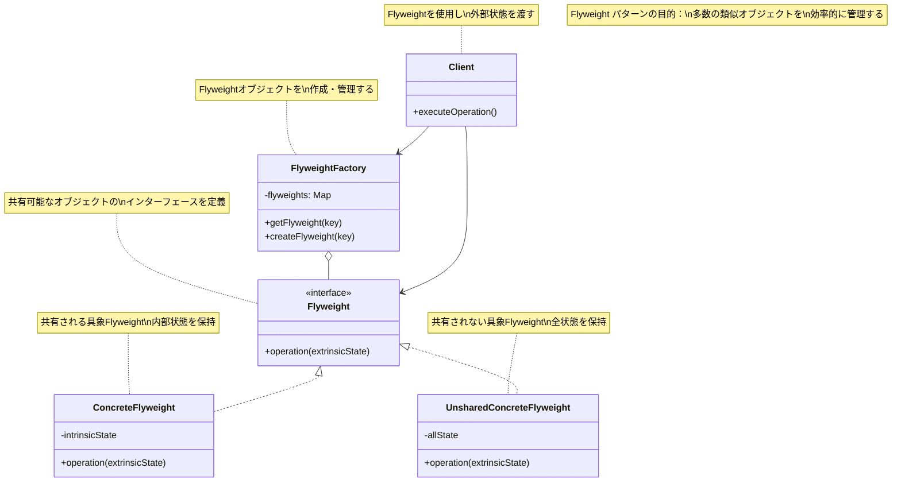
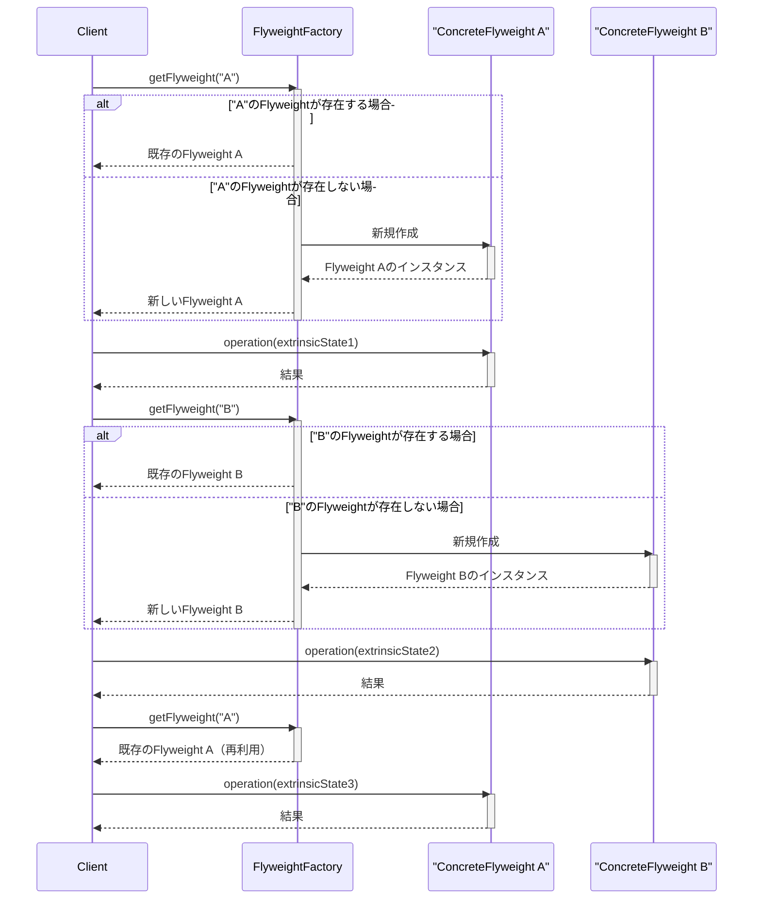
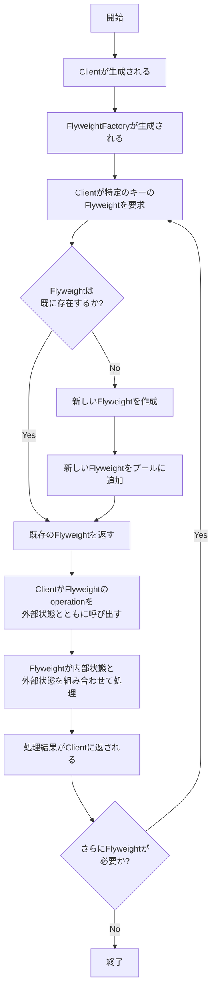

# Flyweightパターン - オブジェクト共有による最適化

## 1. 概要

### 1.1 パターンの定義
Flyweightパターン（フライウェイト・パターン）は、多数の類似オブジェクトを効率的に扱うためのデザインパターンです。共有可能な状態（intrinsic state）を複数のオブジェクト間で共有し、メモリ使用量を削減します。

### 1.2 目的・解決する問題
- 大量の類似オブジェクトを効率的に管理する
- メモリ使用量を最小化する
- オブジェクトの生成コストを削減する
- 共通データの重複を避ける
- システムのパフォーマンスを向上させる
- オブジェクトの状態を内部（共有）と外部（非共有）に分離する

### 1.3 コンテキスト・適用場面
- アプリケーションが大量の類似オブジェクトを使用している場合
- オブジェクトの大部分の状態が共有可能で、少ない部分だけがインスタンス固有の場合
- メモリ効率が重要な場合
- オブジェクトのアイデンティティが重要でない場合
- テキストエディタ、グラフィックスアプリケーション、ゲームなど、多数の同様の視覚要素を扱う場合
- 大規模なデータセットを扱うシステムで、メモリ最適化が必要な場合

## 2. クラス構造

### 2.1 クラス図



### 2.2 主要コンポーネント

| コンポーネント | 種類 | 責務 | 関連 |
|-------------|------|------|------|
| Flyweight | インターフェース | 共有可能なオブジェクトのインターフェースを定義 | ConcreteFlyweightに実装される |
| ConcreteFlyweight | クラス | 共有される具象Flyweight、内部状態を保持 | Flyweightを実装 |
| UnsharedConcreteFlyweight | クラス | 共有されない具象Flyweight、全状態を保持 | Flyweightを実装 |
| FlyweightFactory | クラス | Flyweightオブジェクトを作成・管理する | Flyweightを生成・キャッシュ |
| Client | クラス | Flyweightを使用し外部状態を渡す | FlyweightFactoryを使用 |

### 2.3 相互作用
- Clientは必要なFlyweightをFlyweightFactoryから取得する
- FlyweightFactoryは既存のFlyweightを返すか、新しいFlyweightを作成する
- Clientは外部状態（extrinsicState）をFlyweightの操作に渡す
- Flyweightは内部状態（intrinsicState）と外部状態を組み合わせて操作を実行する
- 同じ内部状態を持つオブジェクトは共有され、メモリを節約する
- Clientは共有されないFlyweightを直接扱うこともある

## 3. 振る舞い

### 3.1 シーケンス図



### 3.2 プロセスフロー



### 3.3 重要なシナリオ

#### シナリオ1: テキストエディタの文字描画
1. テキストエディタがドキュメントの文字を描画する必要がある
2. 各文字に対してCharacterFlyweightFactoryからFlyweightを取得
3. ファクトリーは既存の文字Flyweightを返すか、存在しない場合は新規作成
4. 同じ文字（同じフォント、サイズ、スタイル）は単一のFlyweightとして共有
5. 各文字の位置、色などの外部状態は呼び出し時にFlyweightに渡される
6. Flyweightは内部状態（フォント情報、字形）と外部状態を使用して文字を描画
7. 同じ文字が何千回も出現する長いドキュメントでもメモリ使用量は効率的

#### シナリオ2: ゲームの粒子効果システム
1. ゲームエンジンが多数の粒子効果を描画する必要がある
2. ParticleFlyweightFactoryから各タイプの粒子Flyweightを取得
3. 煙、火、水滴などの基本パターンは共有Flyweightとして実装
4. 各粒子の位置、速度、透明度、寿命などは外部状態として管理
5. 何千もの粒子が同時に存在する場合でも、実際のFlyweightオブジェクトは数種類のみ
6. ゲームの各フレームで、ClientはFlyweightの描画メソッドを各粒子の外部状態と共に呼び出す
7. システムは大量の視覚効果を最小限のメモリで実現

## 4. 実装詳細

### 4.1 主要インターフェース・クラス

```typescript
/**
 * Flyweight インターフェース
 * 共有可能なオブジェクトのインターフェースを定義
 */
interface TreeType {
  /**
   * 木を描画する操作
   * @param canvas 描画対象のキャンバス
   * @param x X座標
   * @param y Y座標
   */
  render(canvas: any, x: number, y: number): void;
}

/**
 * ConcreteFlyweight - 共有されるFlyweight実装
 * 内部状態（共有される状態）を保持
 */
class TreeTypeImpl implements TreeType {
  /**
   * 内部状態 - 木の名前
   */
  private name: string;
  
  /**
   * 内部状態 - 木の色
   */
  private color: string;
  
  /**
   * 内部状態 - テクスチャデータ
   */
  private texture: any;
  
  /**
   * コンストラクタ
   * @param name 木の名前
   * @param color 木の色
   * @param texture テクスチャデータ
   */
  constructor(name: string, color: string, texture: any) {
    this.name = name;
    this.color = color;
    this.texture = texture;
    console.log(`TreeType作成: ${name}, 色: ${color} (メモリ確保)`);
  }
  
  /**
   * 木を描画する - 内部状態と外部状態を組み合わせる
   * @param canvas 描画対象のキャンバス
   * @param x X座標（外部状態）
   * @param y Y座標（外部状態）
   */
  render(canvas: any, x: number, y: number): void {
    console.log(`${this.name}の木を (${x}, ${y}) に描画 - 色: ${this.color}`);
    // テクスチャを使って実際の描画処理
    // canvas.drawImage(this.texture, x, y);
  }
}

/**
 * FlyweightFactory - Flyweightオブジェクトを作成・管理
 */
class TreeFactory {
  /**
   * 共有Flyweightオブジェクトのプール
   */
  private static treeTypes: Map<string, TreeType> = new Map();
  
  /**
   * 指定された特性を持つTreeTypeを取得または作成
   * @param name 木の名前
   * @param color 木の色
   * @param texture テクスチャデータ
   * @returns TreeTypeオブジェクト
   */
  static getTreeType(name: string, color: string, texture: any): TreeType {
    // キャッシュキーの作成
    const key = `${name}_${color}`;
    
    // キャッシュをチェック
    if (!this.treeTypes.has(key)) {
      // 存在しない場合、新しいインスタンスを作成してキャッシュ
      this.treeTypes.set(key, new TreeTypeImpl(name, color, texture));
      console.log(`新しいツリータイプを作成: ${key}`);
    } else {
      console.log(`既存のツリータイプを再利用: ${key}`);
    }
    
    return this.treeTypes.get(key)!;
  }
  
  /**
   * キャッシュされたツリータイプの数を取得
   * @returns キャッシュされたタイプの数
   */
  static getTreeTypesCount(): number {
    return this.treeTypes.size;
  }
}

/**
 * Client - 外部状態を管理し、Flyweightを使用
 */
class Tree {
  /**
   * 外部状態 - X座標
   */
  private x: number;
  
  /**
   * 外部状態 - Y座標
   */
  private y: number;
  
  /**
   * 共有Flyweight参照
   */
  private type: TreeType;
  
  /**
   * コンストラクタ
   * @param x X座標
   * @param y Y座標
   * @param type 木のタイプ（Flyweight）
   */
  constructor(x: number, y: number, type: TreeType) {
    this.x = x;
    this.y = y;
    this.type = type;
  }
  
  /**
   * 木を描画
   * @param canvas 描画対象のキャンバス
   */
  draw(canvas: any): void {
    // Flyweightに描画を委譲し、外部状態を渡す
    this.type.render(canvas, this.x, this.y);
  }
}

/**
 * Forest - Treeオブジェクトの集合を管理するクラス
 */
class Forest {
  /**
   * 森に含まれる木の配列
   */
  private trees: Tree[] = [];
  
  /**
   * 森に木を追加
   * @param x X座標
   * @param y Y座標
   * @param name 木の名前
   * @param color 木の色
   * @param texture テクスチャデータ
   */
  plantTree(x: number, y: number, name: string, color: string, texture: any): void {
    // ファクトリーから適切なTreeTypeを取得
    const type = TreeFactory.getTreeType(name, color, texture);
    
    // 新しい木のインスタンスを作成して追加
    const tree = new Tree(x, y, type);
    this.trees.push(tree);
  }
  
  /**
   * 森の木をすべて描画
   * @param canvas 描画対象のキャンバス
   */
  draw(canvas: any): void {
    for (const tree of this.trees) {
      tree.draw(canvas);
    }
  }
  
  /**
   * 森の木の数を取得
   * @returns 木の数
   */
  getTreeCount(): number {
    return this.trees.length;
  }
}
```

### 4.2 使用例

```typescript
/**
 * クライアントコード
 */
function clientCode() {
  // 1. 森を作成
  const forest = new Forest();
  
  // 2. 仮想キャンバス（実際の描画先）
  const canvas = {}; // 実際のアプリケーションでは描画コンテキスト
  
  // 3. 多数の木を植える（様々な位置に異なる種類の木）
  console.log("1000本の木を森に追加しています...");
  
  // 3.1. かえでの木（赤）を500本植える
  for (let i = 0; i < 500; i++) {
    const x = Math.floor(Math.random() * 1000);
    const y = Math.floor(Math.random() * 1000);
    forest.plantTree(x, y, "かえで", "赤", "maple_texture");
  }
  
  // 3.2. 松の木（緑）を300本植える
  for (let i = 0; i < 300; i++) {
    const x = Math.floor(Math.random() * 1000);
    const y = Math.floor(Math.random() * 1000);
    forest.plantTree(x, y, "松", "緑", "pine_texture");
  }
  
  // 3.3. 桜の木（ピンク）を200本植える
  for (let i = 0; i < 200; i++) {
    const x = Math.floor(Math.random() * 1000);
    const y = Math.floor(Math.random() * 1000);
    forest.plantTree(x, y, "桜", "ピンク", "cherry_blossom_texture");
  }
  
  // 4. 統計情報を表示
  console.log(`森の中の木の総数: ${forest.getTreeCount()}`);
  console.log(`実際に作成されたツリータイプオブジェクト数: ${TreeFactory.getTreeTypesCount()}`);
  console.log(`メモリ効率: ${forest.getTreeCount() / TreeFactory.getTreeTypesCount()}倍`);
  
  // 5. 森を描画
  console.log("\n森を描画しています（最初の10本のみ表示）...");
  forest.draw(canvas);
}

// クライアントコードを実行
clientCode();

// 出力結果例:
// 1000本の木を森に追加しています...
// TreeType作成: かえで, 色: 赤 (メモリ確保)
// 新しいツリータイプを作成: かえで_赤
// 既存のツリータイプを再利用: かえで_赤
// ... (省略) ...
// TreeType作成: 松, 色: 緑 (メモリ確保)
// 新しいツリータイプを作成: 松_緑
// 既存のツリータイプを再利用: 松_緑
// ... (省略) ...
// TreeType作成: 桜, 色: ピンク (メモリ確保)
// 新しいツリータイプを作成: 桜_ピンク
// 既存のツリータイプを再利用: 桜_ピンク
// ... (省略) ...
// 森の中の木の総数: 1000
// 実際に作成されたツリータイプオブジェクト数: 3
// メモリ効率: 333.3倍
//
// 森を描画しています（最初の10本のみ表示）...
// かえでの木を (123, 456) に描画 - 色: 赤
// ... (省略) ...
```

## 5. パターンのバリエーション

### 5.1 複合Flyweight
複合オブジェクト全体をFlyweightとして扱うバリエーション。複合パターンと組み合わせることで、ツリー構造全体を効率的に管理できます。

```typescript
/**
 * 複合Flyweightの例
 */
class CompositeFlyweight implements Flyweight {
  private flyweights: Map<string, Flyweight> = new Map();
  
  add(key: string, flyweight: Flyweight): void {
    this.flyweights.set(key, flyweight);
  }
  
  operation(extrinsicState: any): void {
    for (const [key, flyweight] of this.flyweights.entries()) {
      flyweight.operation(extrinsicState);
    }
  }
}
```

### 5.2 非共有コンクリートFlyweight
メモリ最適化が不要で、操作インターフェースの一貫性だけが必要な場合に使用する特殊なFlyweightです。

```typescript
/**
 * 共有されないFlyweightの例
 */
class UnsharedConcreteFlyweight implements TreeType {
  private uniqueState: any;
  
  constructor(uniqueState: any) {
    this.uniqueState = uniqueState;
  }
  
  render(canvas: any, x: number, y: number): void {
    // 全ての状態が内部に含まれるため、外部状態との結合は最小限
    console.log(`特殊な木を (${x}, ${y}) に描画 - 状態: ${this.uniqueState}`);
  }
}
```

## 6. 評価

### 6.1 メリット
- **メモリ効率**: 共有可能なオブジェクトを再利用することでメモリ使用量を大幅に削減
- **パフォーマンス向上**: オブジェクト生成コストの削減と効率的なメモリ利用によるパフォーマンス向上
- **多数のオブジェクト管理**: 大量の類似オブジェクトを効率的に管理可能
- **状態の明確な分離**: 内部（共有）状態と外部（非共有）状態の分離による設計の明確化
- **拡張性**: 新しいFlyweight型の追加が容易

### 6.2 デメリット
- **複雑性の増加**: 内部状態と外部状態の分離により、コードが複雑になる可能性がある
- **コンテキスト依存**: 外部状態の管理が不適切だと問題が発生する可能性がある
- **同期の問題**: 並行環境でのFlyweightFactory管理に注意が必要
- **デバッグの難しさ**: 共有オブジェクトの状態変更の追跡が難しくなる場合がある
- **過剰最適化のリスク**: 小規模なアプリケーションでは複雑さの増加がメリットを上回る可能性

### 6.3 適用場面
- アプリケーションが多数の類似オブジェクトを使用し、メモリ消費が懸念される場合
- オブジェクトの状態の大部分が共有可能で、外部状態として分離できる場合
- オブジェクトの同一性が重要でない場合
- グラフィックスアプリケーション、ゲームエンジン、テキストエディタなど
- モバイルデバイスや制約のあるシステムでの最適化が必要な場合
- 大規模なデータセットを扱うビジネスアプリケーション

## 7. 関連パターン
- **Composite**: FlyweightパターンはCompositeパターンと組み合わせて使用され、効率的なツリー構造を実現
- **Factory Method/Abstract Factory**: Flyweightオブジェクトの作成にはしばしばこれらのパターンが使用される
- **Singleton**: FlyweightFactoryは通常Singletonとして実装される
- **State/Strategy**: 共有可能な状態や戦略オブジェクトとしてFlyweightを使用できる
- **Proxy**: Flyweightは時にProxyと組み合わせて使用され、共有オブジェクトへのアクセスを制御する

## 8. 参考資料

### 8.1 内部リンク
- [ソースコードへのリンク](../../src/structural/flyweight)
- [テストコードへのリンク](../../tests/structural/flyweight)

### 8.2 外部リンク
- [リファクタリング・グル - Flyweightパターン](https://refactoring.guru/ja/design-patterns/flyweight)
- [Head First デザインパターン](https://www.oreilly.co.jp/books/9784873119762/)
- [Gang of Four デザインパターン - Flyweight](https://www.amazon.co.jp/dp/0201633612) 