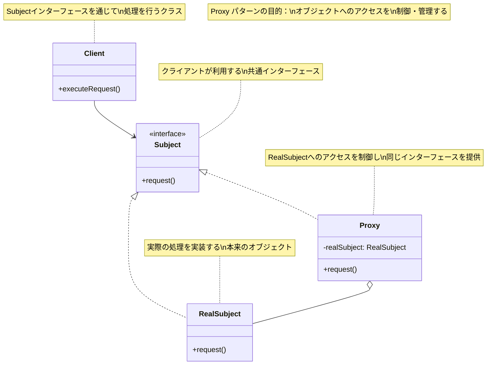
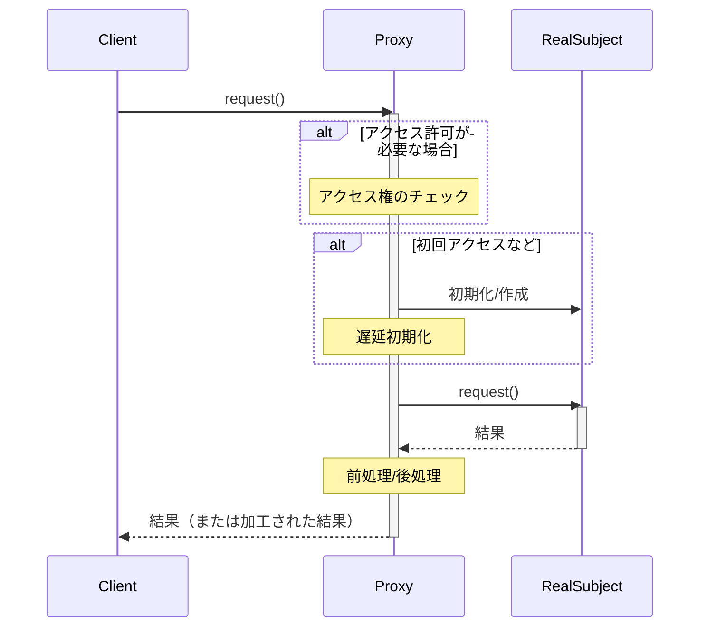
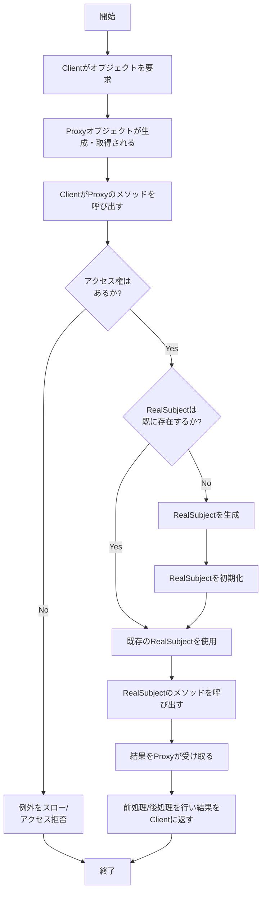

# Proxy パターン

# Proxyパターン - アクセス制御と遅延初期化

## 1. 概要

### 1.1 パターンの定義
Proxy パターン（プロキシ・パターン）は、あるオブジェクトへのアクセスを制御するために、そのオブジェクトの代理（プロキシ）となるオブジェクトを提供するデザインパターンです。プロキシは元のオブジェクト（サブジェクト）と同じインターフェースを持ち、クライアントからは透過的に利用できます。

### 1.2 目的・解決する問題
- リソースへのアクセスを制御する
- 遅延初期化（レイジーローディング）を実現する
- リモートリソースへのアクセスを抽象化する
- オブジェクトへのアクセスをログ記録する
- オブジェクトの参照カウントを管理する
- 実オブジェクトにかかる負荷を軽減する
- セキュリティチェックを実装する
- キャッシュ機構を提供する

### 1.3 コンテキスト・適用場面
- リソースを消費する重いオブジェクトの生成を遅延させたい場合
- 特定条件下でのみリソースへのアクセスを許可したい場合
- リモートサーバー上のオブジェクトにアクセスする必要がある場合
- オブジェクトの生成やアクセスにコストがかかる場合
- オブジェクトへのアクセスを監視・追跡したい場合
- アクセス制御とキャッシュを実装したい場合
- 既存コードを変更せずに機能を追加したい場合

## 2. クラス構造

### 2.1 クラス図



### 2.2 主要コンポーネント

| コンポーネント | 種類 | 責務 | 関連 |
|-------------|------|------|------|
| Subject | インターフェース | クライアントが利用する共通インターフェースを定義 | RealSubject、Proxyに実装される |
| RealSubject | クラス | 実際の処理を実装する本来のオブジェクト | Subjectを実装 |
| Proxy | クラス | RealSubjectへのアクセスを制御し、同じインターフェースを提供 | Subjectを実装、RealSubjectを使用 |
| Client | クラス | Subjectインターフェースを通じて処理を行う | Subjectを使用 |

### 2.3 相互作用
- ProxyはSubjectインターフェースを実装し、RealSubjectと同じインターフェースを提供する
- ProxyはRealSubjectへの参照を保持し、必要に応じてRealSubjectの操作に委譲する
- Proxyは委譲の前後に追加処理（アクセス制御、ログ記録など）を行うことができる
- ClientはSubjectインターフェースを通じて操作を行い、ProxyとRealSubjectの区別を意識しない
- Proxyは必要に応じてRealSubjectを生成・初期化する責任を持つ場合がある
- RealSubjectはProxyの存在を意識せず、単独でも機能する

## 3. 振る舞い

### 3.1 シーケンス図



### 3.2 プロセスフロー



### 3.3 重要なシナリオ

#### シナリオ1: 重いリソースの遅延ロード
1. アプリケーションが起動し、クライアントがImageオブジェクトを要求
2. ImageProxyが返されるが、実際の画像データはまだロードされていない
3. クライアントがImageのサイズや情報にアクセスすると、Proxyが代わりに応答
4. クライアントが画像の表示処理を呼び出したとき、ImageProxyが初めて実際の画像をロード
5. 以降の画像表示リクエストは、ロード済みの実画像オブジェクトを使用
6. システムはメモリを効率的に使用し、必要なときだけ重いリソースをロード

#### シナリオ2: リモートサービスアクセス
1. クライアントがリモートサービスのAPIを呼び出す必要がある
2. クライアントはローカルのServiceProxyオブジェクトを使用
3. クライアントが操作を呼び出すと、Proxyがネットワーク通信の詳細を隠蔽
4. Proxyがリモートサーバーとの通信を処理し、結果を変換してクライアントに返す
5. ネットワークエラーが発生した場合、Proxyがエラーハンドリングを実施
6. クライアントはリモート通信の複雑さを意識せずに、ローカルオブジェクトのように扱える

## 4. 実装詳細

### 4.1 主要インターフェース・クラス

```typescript
/**
 * Subject インターフェース - クライアントが使用する共通インターフェース
 */
interface Image {
  /**
   * 画像を表示する
   */
  display(): void;

  /**
   * 画像の幅を取得する
   * @returns 画像の幅
   */
  getWidth(): number;

  /**
   * 画像の高さを取得する
   * @returns 画像の高さ
   */
  getHeight(): number;

  /**
   * 画像のファイル名を取得する
   * @returns 画像のファイル名
   */
  getFilename(): string;
}

/**
 * RealSubject - 実際の処理を実装する本来のオブジェクト
 */
class RealImage implements Image {
  private filename: string;
  private width: number;
  private height: number;
  
  /**
   * コンストラクタ - 画像をロードする
   * @param filename 画像のファイル名
   */
  constructor(filename: string) {
    this.filename = filename;
    this.loadFromDisk();
    // 実際のアプリケーションでは画像から幅と高さを取得
    this.width = 1024;
    this.height = 768;
    
    console.log(`RealImage: ${filename} の初期化が完了しました`);
  }

  /**
   * 画像をディスクからロードする（重い処理）
   */
  private loadFromDisk(): void {
    console.log(`RealImage: ${this.filename} をディスクからロード中...（時間のかかる処理）`);
    // ディスクからの読み込み処理をシミュレート
    for (let i = 0; i < 3; i++) {
      console.log(`RealImage: ロード中... ${(i + 1) * 33}%`);
    }
  }

  /**
   * 画像を表示する
   */
  display(): void {
    console.log(`RealImage: ${this.filename} を表示します`);
  }

  /**
   * 画像の幅を取得する
   * @returns 画像の幅
   */
  getWidth(): number {
    return this.width;
  }

  /**
   * 画像の高さを取得する
   * @returns 画像の高さ
   */
  getHeight(): number {
    return this.height;
  }

  /**
   * 画像のファイル名を取得する
   * @returns 画像のファイル名
   */
  getFilename(): string {
    return this.filename;
  }
}

/**
 * Proxy - RealSubjectへのアクセスを制御し、同じインターフェースを提供
 */
class ImageProxy implements Image {
  private realImage: RealImage | null = null;
  private filename: string;
  
  // メタデータを事前にProxyで保持（軽量な情報）
  private width: number = 0;
  private height: number = 0;
  
  /**
   * コンストラクタ
   * @param filename 画像のファイル名
   */
  constructor(filename: string) {
    this.filename = filename;
    console.log(`ImageProxy: ${filename} のプロキシを作成しました`);
    
    // メタデータだけを軽量に取得
    // 実際のアプリケーションではファイルのヘッダだけを読むなどの方法がある
    this.width = 1024;  // ヘッダーから取得したと仮定
    this.height = 768;  // ヘッダーから取得したと仮定
  }

  /**
   * 画像を表示する - 必要に応じてRealImageを初期化
   */
  display(): void {
    // 遅延初期化 - 実際に必要になるまでRealImageを作成しない
    if (this.realImage === null) {
      console.log(`ImageProxy: 初回表示のため、実際の画像を初期化します`);
      this.realImage = new RealImage(this.filename);
    }
    
    // 表示処理をRealImageに委譲
    this.realImage.display();
  }

  /**
   * 画像の幅を取得する - RealImageを初期化せずに返せる
   * @returns 画像の幅
   */
  getWidth(): number {
    // 既にプロキシが持っている情報なので、RealImageを作成しない
    console.log(`ImageProxy: 幅の情報をプロキシから直接提供: ${this.width}px`);
    return this.width;
  }

  /**
   * 画像の高さを取得する - RealImageを初期化せずに返せる
   * @returns 画像の高さ
   */
  getHeight(): number {
    // 既にプロキシが持っている情報なので、RealImageを作成しない
    console.log(`ImageProxy: 高さの情報をプロキシから直接提供: ${this.height}px`);
    return this.height;
  }

  /**
   * 画像のファイル名を取得する
   * @returns 画像のファイル名
   */
  getFilename(): string {
    return this.filename;
  }
}

/**
 * 保護プロキシの例 - アクセス制御を実装
 */
class ProtectedImageProxy implements Image {
  private realImage: RealImage | null = null;
  private filename: string;
  private accessLevel: number;
  private requiredAccessLevel: number;
  
  /**
   * コンストラクタ
   * @param filename 画像のファイル名
   * @param accessLevel 現在のアクセスレベル
   * @param requiredAccessLevel 要求されるアクセスレベル
   */
  constructor(filename: string, accessLevel: number, requiredAccessLevel: number) {
    this.filename = filename;
    this.accessLevel = accessLevel;
    this.requiredAccessLevel = requiredAccessLevel;
  }
  
  /**
   * アクセス権をチェック
   * @returns アクセスが許可されるかどうか
   */
  private checkAccess(): boolean {
    if (this.accessLevel >= this.requiredAccessLevel) {
      console.log(`ProtectedImageProxy: アクセスが許可されました`);
      return true;
    } else {
      console.log(`ProtectedImageProxy: アクセスが拒否されました（レベル ${this.accessLevel} < 必要レベル ${this.requiredAccessLevel}）`);
      return false;
    }
  }
  
  /**
   * 画像を表示する - アクセス権チェック後にRealImageを初期化
   */
  display(): void {
    if (!this.checkAccess()) {
      console.log(`ProtectedImageProxy: 画像 ${this.filename} の表示が拒否されました`);
      return;
    }
    
    if (this.realImage === null) {
      this.realImage = new RealImage(this.filename);
    }
    
    this.realImage.display();
  }
  
  /**
   * 画像の幅を取得する
   * @returns 画像の幅
   */
  getWidth(): number {
    if (!this.checkAccess()) {
      return 0;
    }
    
    if (this.realImage === null) {
      this.realImage = new RealImage(this.filename);
    }
    
    return this.realImage.getWidth();
  }
  
  /**
   * 画像の高さを取得する
   * @returns 画像の高さ
   */
  getHeight(): number {
    if (!this.checkAccess()) {
      return 0;
    }
    
    if (this.realImage === null) {
      this.realImage = new RealImage(this.filename);
    }
    
    return this.realImage.getHeight();
  }
  
  /**
   * 画像のファイル名を取得する
   * @returns 画像のファイル名
   */
  getFilename(): string {
    return this.filename;
  }
}
```

### 4.2 使用例

```typescript
/**
 * クライアントコード
 */
function clientCode() {
  console.log("クライアント: 仮想プロキシのデモ（遅延ロード）");
  console.log("------------------------------------------------");
  
  // プロキシを作成（この時点では実際の画像はロードされない）
  console.log("1. ImageProxyを作成");
  const proxyImage: Image = new ImageProxy("sample_large_image.jpg");
  
  // メタデータアクセス（RealImageをロードしない）
  console.log("\n2. 画像の情報を取得（実画像はまだロードされない）");
  console.log(`ファイル名: ${proxyImage.getFilename()}`);
  console.log(`サイズ: ${proxyImage.getWidth()} x ${proxyImage.getHeight()}`);
  
  // 画像を表示（初めてRealImageがロードされる）
  console.log("\n3. 画像表示を要求（この時点で実画像がロードされる）");
  proxyImage.display();
  
  // 2回目の表示（既存のRealImageを使用）
  console.log("\n4. 再度表示を要求（既にロード済みの画像を使用）");
  proxyImage.display();
  
  console.log("\n------------------------------------------------");
  console.log("クライアント: 保護プロキシのデモ（アクセス制御）");
  console.log("------------------------------------------------");
  
  // 許可されるケース
  console.log("\n5. 十分なアクセス権を持つユーザー（レベル5）");
  const allowedProxy: Image = new ProtectedImageProxy("confidential.jpg", 5, 3);
  allowedProxy.display();
  
  // 拒否されるケース
  console.log("\n6. 不十分なアクセス権のユーザー（レベル1）");
  const deniedProxy: Image = new ProtectedImageProxy("confidential.jpg", 1, 3);
  deniedProxy.display();
}

// クライアントコードを実行
clientCode();

// 出力結果例:
// クライアント: 仮想プロキシのデモ（遅延ロード）
// ------------------------------------------------
// 1. ImageProxyを作成
// ImageProxy: sample_large_image.jpg のプロキシを作成しました
//
// 2. 画像の情報を取得（実画像はまだロードされない）
// ImageProxy: 幅の情報をプロキシから直接提供: 1024px
// ImageProxy: 高さの情報をプロキシから直接提供: 768px
//
// 3. 画像表示を要求（この時点で実画像がロードされる）
// ImageProxy: 初回表示のため、実際の画像を初期化します
// RealImage: sample_large_image.jpg をディスクからロード中...（時間のかかる処理）
// RealImage: ロード中... 33%
// RealImage: ロード中... 66%
// RealImage: ロード中... 99%
// RealImage: sample_large_image.jpg の初期化が完了しました
// RealImage: sample_large_image.jpg を表示します
//
// 4. 再度表示を要求（既にロード済みの画像を使用）
// RealImage: sample_large_image.jpg を表示します
//
// ------------------------------------------------
// クライアント: 保護プロキシのデモ（アクセス制御）
// ------------------------------------------------
//
// 5. 十分なアクセス権を持つユーザー（レベル5）
// ProtectedImageProxy: アクセスが許可されました
// RealImage: confidential.jpg をディスクからロード中...（時間のかかる処理）
// RealImage: ロード中... 33%
// RealImage: ロード中... 66%
// RealImage: ロード中... 99%
// RealImage: confidential.jpg の初期化が完了しました
// RealImage: confidential.jpg を表示します
//
// 6. 不十分なアクセス権のユーザー（レベル1）
// ProtectedImageProxy: アクセスが拒否されました（レベル 1 < 必要レベル 3）
// ProtectedImageProxy: 画像 confidential.jpg の表示が拒否されました
```

## 5. パターンのバリエーション

### 5.1 仮想プロキシ（Virtual Proxy）
必要になるまで大きなリソースの初期化を遅延させるプロキシ。前述の`ImageProxy`は仮想プロキシの例です。

```typescript
class VirtualDocumentProxy implements Document {
  private realDocument: Document | null = null;
  private documentId: string;
  
  constructor(documentId: string) {
    this.documentId = documentId;
  }
  
  open(): void {
    if (this.realDocument === null) {
      this.realDocument = new RealDocument(this.documentId);
    }
    this.realDocument.open();
  }
  
  // その他のメソッド...
}
```

### 5.2 保護プロキシ（Protection Proxy）
リソースへのアクセス制御を実装するプロキシ。前述の`ProtectedImageProxy`はこの例です。

### 5.3 リモートプロキシ（Remote Proxy）
リモートオブジェクトへのアクセスを抽象化するプロキシ。

```typescript
class RemoteServiceProxy implements Service {
  private serverUrl: string;
  
  constructor(serverUrl: string) {
    this.serverUrl = serverUrl;
  }
  
  execute(command: string): string {
    console.log(`RemoteServiceProxy: ${this.serverUrl} にリクエスト送信`);
    // HTTPリクエストなどを実行
    return `リモートサーバーからの応答: ${command}を実行しました`;
  }
}
```

### 5.4 キャッシュプロキシ（Caching Proxy）
結果をキャッシュし、同じリクエストに対してパフォーマンスを向上させるプロキシ。

```typescript
class CachingProxy implements DataFetcher {
  private realFetcher: DataFetcher;
  private cache: Map<string, any> = new Map();
  
  constructor(realFetcher: DataFetcher) {
    this.realFetcher = realFetcher;
  }
  
  fetchData(key: string): any {
    if (this.cache.has(key)) {
      console.log(`CachingProxy: キャッシュから ${key} のデータを返します`);
      return this.cache.get(key);
    }
    
    console.log(`CachingProxy: ${key} のデータをソースから取得します`);
    const data = this.realFetcher.fetchData(key);
    this.cache.set(key, data);
    return data;
  }
}
```

### 5.5 スマートリファレンスプロキシ（Smart Reference Proxy）
追加のアクションを実行するプロキシ（リファレンスカウント、ロギングなど）。

```typescript
class LoggingProxy implements Service {
  private service: Service;
  
  constructor(service: Service) {
    this.service = service;
  }
  
  execute(command: string): string {
    console.log(`LoggingProxy: '${command}' の実行を記録`);
    const startTime = Date.now();
    const result = this.service.execute(command);
    const endTime = Date.now();
    console.log(`LoggingProxy: 操作の所要時間: ${endTime - startTime}ms`);
    return result;
  }
}
```

## 6. 評価

### 6.1 メリット
- **分離と制御**: リソースへのアクセスが制御され、RealSubjectの詳細がクライアントから隠蔽される
- **遅延初期化**: リソースを必要なタイミングで初期化することで、効率的なメモリ使用が可能
- **セキュリティ**: アクセス制御ロジックをプロキシに集中させ、権限チェックを一元管理できる
- **キャッシング**: 重い操作の結果をプロキシでキャッシュし、パフォーマンスを向上できる
- **透過性**: クライアントコードを変更せずに、さまざまな機能を追加できる
- **単一責任の原則**: RealSubjectは本来の機能に集中し、Proxyは他の横断的関心事を処理する

### 6.2 デメリット
- **複雑さの増加**: 新たなクラスが追加されるため、システムが複雑になる
- **応答時間**: プロキシ層を通じたアクセスにより、わずかな性能オーバーヘッドが発生する場合がある
- **実装の難しさ**: 特にリモートプロキシでは、エラー処理などが複雑になる場合がある
- **メンテナンスコスト**: RealSubjectとProxyのインターフェースを同期して維持する必要がある
- **デバッグの難しさ**: プロキシが介在することで問題の追跡が複雑になることがある

### 6.3 適用場面
- リソースを消費する重いオブジェクトを遅延初期化したい場合
- リソースへのアクセスを制御したい場合
- 分散システムでリモートリソースにアクセスする必要がある場合
- オブジェクトへのアクセスをログ記録や監視したい場合
- 結果のキャッシュによるパフォーマンス最適化が必要な場合
- セキュリティ上の理由からオブジェクトへのアクセスを制限したい場合

## 7. 関連パターン
- **Adapter**: アダプタはインターフェースを変換するのに対し、プロキシは同じインターフェースを保持する
- **Decorator**: デコレータはオブジェクトに機能を追加するが、プロキシはアクセスを制御する
- **Facade**: ファサードは複雑なサブシステムへのシンプルなインターフェースを提供するが、プロキシは既存のインターフェースを維持する
- **Mediator**: プロキシは特定のオブジェクトへのアクセスを制御するが、メディエータは複数のオブジェクト間の相互作用を調整する
- **Chain of Responsibility**: プロキシがアクセス制御の目的で使われる場合、責任連鎖パターンと組み合わせることがある

## 8. 参考資料

### 8.1 内部リンク
- [ソースコードへのリンク](../../src/structural/proxy)
- [テストコードへのリンク](../../tests/structural/proxy)

### 8.2 外部リンク
- [リファクタリング・グル - Proxyパターン](https://refactoring.guru/ja/design-patterns/proxy)
- [Head First デザインパターン](https://www.oreilly.co.jp/books/9784873119762/)
- [Gang of Four デザインパターン - Proxy](https://www.amazon.co.jp/dp/0201633612) 